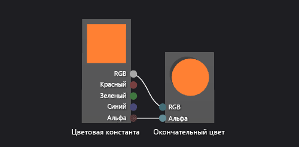

# Практическое руководство. Создание простейшего шейдера цвета

В этой статье показано, как использовать конструктор шейдеров и язык шейдеров ориентированных графов (Directed Graph Shader Language — DGSL) для создания шейдера с простым цветом. Этот шейдер задает постоянное значение цвета RGB в качестве окончательного цвета.

## Создание шейдера с простым цветом

Шейдер с простым цветом можно реализовать, записав значение константы цвета RGB в окончательный выходной цвет.

Перед началом убедитесь, что отображаются окно **Свойства** и **Панель элементов**.

1. Создайте построитель текстуры DGSL, с которым будете работать. Дополнительные сведения о добавлении шейдера DGSL в проект см. в подразделе "Начало работы" раздела [Конструктор шейдеров](../designers/shader-designer.md).

2. Удалите узел **Цвет точки**. Используя средство **Выбрать**, выберите узел **Цвет точки** и в строке меню выберите **Изменить** > **Удалить**.

3. Добавьте в граф узел **Константа цвета**. В окне **Панель элементов** в разделе **Константы** выберите **Константа цвета** и переместите элемент в область конструктора.

4. Укажите значение цвета для узла **Константа цвета**. Используя средство **Выбрать**, выберите узел **Константа цвета**, а затем в окне **Свойства** в свойстве **Вывод** укажите значение цвета. Для оранжевого укажите значение (1.0, 0,5, 0,2, 1.0).

5. Соедините константу цвета с окончательным цветом. Чтобы создать соединения, переместите терминал **RGB** узла **Константа цвета** к терминалу **RGB** узла **Окончательный цвет**, а затем переместите терминал **Альфа** узла **Константа цвета** к терминалу **Альфа** узла **Окончательный цвет**. В результате для окончательного цвета задается константа цвета, определенная в предыдущем шаге.

Ниже показан готовый граф шейдера и предварительный просмотр шейдера, примененного к кубу.

> [!NOTE]
> На рисунке был указан оранжевый цвет для лучшей демонстрации эффекта шейдера.

Некоторые фигуры могут лучше подходить для предварительного просмотра некоторых шейдеров. Дополнительные сведения о том, как предварительно просматривать шейдеры в конструкторе шейдеров, см. в разделе [Конструктор шейдеров](../designers/shader-designer.md).

## См. также раздел

- [Практическое руководство. Применение шейдера к трехмерной модели](../designers/how-to-apply-a-shader-to-a-3-d-model.md)
- [Практическое руководство. Экспорт шейдера](../designers/how-to-export-a-shader.md)
- [Конструктор шейдеров](../designers/shader-designer.md)
- [Узлы конструктора шейдеров](../designers/shader-designer-nodes.md)
