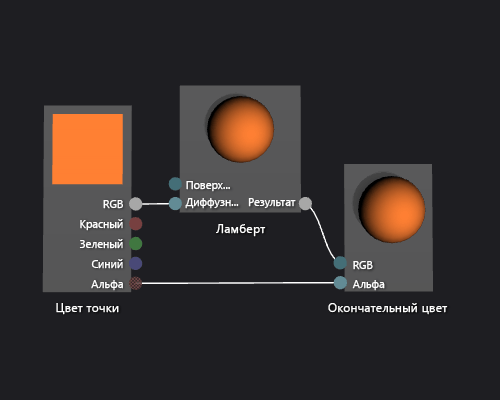

# Практическое руководство. Создание простейшего шейдера с моделью освещения Ламберта

В этой статье показано, как использовать конструктор шейдеров и язык шейдеров ориентированных графов (Directed Graph Shader Language — DGSL) для создания шейдера, реализующего классическую модель освещения Ламберта.

## Модель освещения Ламберта

Модель освещения Ламберта включает окружающее и направленное освещение для затенения объектов в трехмерной сцене. Окружающие компоненты обеспечивают базовый уровень освещения в трехмерной сцене. Направленные компоненты обеспечивают дополнительное освещение из направленных (и удаленных) источников света. Окружающее освещение в равной степени затрагивает все поверхности в сцене, независимо от их ориентации. Для определенной поверхности это совокупность ее окружающего цвета, а также цвета и интенсивности окружающего освещения в сцене. Направленное освещение влияет на каждую из поверхностей в сцене по-разному, в зависимости от их ориентации по отношению к направлению источника света. Оно представляет собой совокупность диффузного цвета и ориентации поверхности, а также цвета, интенсивности и направления источников света. Поверхности, обращенные непосредственно к источнику света, получают максимальный отражающий вклад, а поверхности, обращенные непосредственно от источника света, не получают никакого вклада. В модели освещения Ламберта окружающий компонент и один или несколько направленных компонентов объединяются для определения общего вклада по диффузному цвету для каждой точки на объекте.

Перед началом убедитесь, что отображаются окно **Свойства** и **Панель элементов**.

1. Создайте построитель текстуры DGSL, с которым вы будете работать. Дополнительные сведения о добавлении шейдера DGSL в проект см. в подразделе "Начало работы" раздела [Конструктор шейдеров](../designers/shader-designer.md).

2. Отсоедините узел **Цвет точки** от узла **Окончательный цвет**. Выберите терминал **RGB** узла **Цвет точки**, а затем выберите **Разорвать связи**. Оставьте терминал **Альфа** подсоединенным.

3. Добавьте в граф узел **Ламберт**. В окне **Панель элементов** в разделе **Служебная программа** выберите **Ламберт** и переместите элемент в область конструктора. Узел Ламберта вычисляет общий вклад диффузного цвета для пикселя на основе параметров окружающего и диффузного освещения.

4. Соедините узел **Цвет точки** с узлом **Ламберт**. В режиме **Выбрать** переместите терминал **RGB** узла **Цвет точки** к терминалу **Диффузный цвет** узла **Ламберт**. Это соединение предоставляет узлу Ламберта интерполированный диффузный цвет пикселя.

5. Соедините вычисленное значение цвета с окончательным цветом. Переместите терминал **Вывод** узла **Ламберт** к терминалу **RGB** узла **Окончательный цвет**.

   Ниже показан готовый граф шейдера и предварительный просмотр шейдера, примененного к модели чайника.

> [!NOTE]
> Для лучшей демонстрации эффекта шейдера на этом рисунке оранжевый цвет был задан с использованием параметра **MaterialDiffuse** шейдера. Игра или приложение могут использовать этот параметр, чтобы предоставить уникальное значение цвета для каждого объекта. Дополнительные сведения о параметрах материалов см. в подразделе "Предварительный просмотр шейдеров" раздела [Конструктор шейдеров](../designers/shader-designer.md).

Некоторые фигуры могут лучше подходить для предварительного просмотра некоторых шейдеров. Дополнительные сведения о предварительном просмотре шейдеров в конструкторе шейдеров см. в подразделе "Предварительный просмотр шейдеров" раздела [Конструктор шейдеров](../designers/shader-designer.md).

На приведенном ниже рисунке шейдер, описанный в этом документе, применяется к трехмерной модели.

Дополнительные сведения о способах применения шейдера к трехмерной модели см. в статье [Практическое руководство. Применение шейдера к трехмерной модели](../designers/how-to-apply-a-shader-to-a-3-d-model.md).

## См. также раздел

- [Практическое руководство. Применение шейдера к трехмерной модели](../designers/how-to-apply-a-shader-to-a-3-d-model.md)
- [Практическое руководство. Экспорт шейдера](../designers/how-to-export-a-shader.md)
- [Практическое руководство. Создание простейшего шейдера освещения по методу Фонга](../designers/how-to-create-a-basic-phong-shader.md)
- [Конструктор шейдеров](../designers/shader-designer.md)
- [Узлы конструктора шейдеров](../designers/shader-designer-nodes.md)
