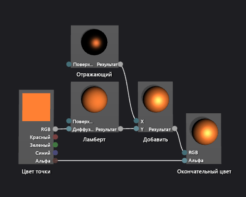

# Практическое руководство. Создание простейшего шейдера освещения по методу Фонга

В этой статье показано, как использовать конструктор шейдеров и язык шейдеров ориентированных графов (Directed Graph Shader Language — DGSL) для создания шейдера, реализующего классическую модель освещения по методу Фонга.

## Модели освещения по методу Фонга

Модели освещения по методу Фонга расширяет модель освещения по методу Ламберта для включения зеркального отражения, которое имитирует отражающие свойства поверхности. Отражающий компонент представляет собой дополнительное освещение из тех же направленных источников света, которые используются в модели освещения Ламберта, однако его вклад в окончательный цвет обрабатывается иначе. Зеркальное отражение влияет на каждую из поверхностей в сцене по-разному, в зависимости от отношения между направлением взгляда, направлением источников света и ориентацией поверхности. Оно представляет собой продукт отражающего цвета, отражающей способности и ориентации поверхности, а также цвета, интенсивности и направления источников света. Поверхности, отражающие источник света непосредственно на зрителя, получают максимальный отражающий вклад, а поверхности, отражающие источник света в сторону от зрителя, не получают никакого вклада. В модели освещения Фонга один или несколько отражающих компонентов объединяются для определения цвета и интенсивности зеркального отражения для каждой точки на объекте, а затем добавляются к результату модели освещения Ламберта для создания окончательного цвета пикселя.

Дополнительные сведения о модели освещения по методу Ламберта см. в разделе [Практическое руководство. Создание простейшего шейдера освещения с использованием модели Ламберта](../designers/how-to-create-a-basic-lambert-shader.md).

Перед началом убедитесь, что отображаются окно **Свойства** и **Панель элементов**.

1. Создайте шейдер Ламберта, как описано в разделе [Практическое руководство. Создание простейшего шейдера освещения с использованием модели Ламберта](../designers/how-to-create-a-basic-lambert-shader.md).

2. Отсоедините узел **Ламберт** от узла **Окончательный цвет**. Выберите терминал **RGB** узла **Ламберт**, а затем выберите **Разорвать связи**. Таким образом освобождается место для узла, который добавляется на следующем шаге.

3. Добавьте в граф узел **Добавить**. В окне **Панель элементов** в разделе **Математика** выберите **Добавить** и переместите элемент в область конструктора.

4. Добавьте в граф узел **Отражающий**. В окне **Панель элементов** в разделе **Служебная программа** выберите **Отражающий** и переместите элемент в область конструктора.

5. Добавьте добавочное отражение. Переместите терминал **Вывод** узла **Отражающий** к терминалу **X** узла **Добавить**, а затем переместите терминал **Вывод** узла **Ламберт** к терминалу **Y** узла **Добавить**. Эти соединения объединяют итоговые диффузные и отражающие вклады для цвета пикселя.

6. Соедините вычисленное значение цвета с окончательным цветом. Переместите терминал **Вывод** узла **Добавить** к терминалу **RGB** узла **Окончательный цвет**.

   Ниже показан готовый граф шейдера и предварительный просмотр шейдера, примененного к модели чайника.

> [!NOTE]
> Для лучшей демонстрации эффекта шейдера на этом рисунке оранжевый цвет был задан с использованием параметра **MaterialDiffuse** шейдера, а поверхность металлического вида была задана с помощью параметров **MaterialSpecular** и **MaterialSpecularPower**. Дополнительные сведения о параметрах материалов см. в подразделе "Предварительный просмотр шейдеров" раздела [Конструктор шейдеров](../designers/shader-designer.md).

Некоторые фигуры могут лучше подходить для предварительного просмотра некоторых шейдеров. Дополнительные сведения о предварительном просмотре шейдеров в конструкторе шейдеров см. в подразделе "Предварительный просмотр шейдеров" раздела [Конструктор шейдеров](../designers/shader-designer.md).

На приведенном ниже рисунке шейдер, описанный в этом документе, применяется к трехмерной модели. Для свойства **MaterialSpecular** задается значение (1.00, 0.50, 0.20, 0.00), а для его свойства **MaterialSpecularPower** — значение 16.

> [!NOTE]
> Свойство **MaterialSpecular** определяет видимую отделку материала поверхности. Для блестящей поверхности, например стекла или пластмассы, характерен отражающий цвет, который является ярким оттенком белого. Для металлической поверхности отражающий цвет обычно близок к диффузному цвету. Для матовой поверхности отражающий цвет обычно является темным оттенком серого.
>
> Свойство **MaterialSpecularPower** определяют интенсивность зеркальных отражений. Высокая отражающая способность имитирует тускловатые, более локализованные блики. Очень низкая отражающая способность имитирует интенсивную, широкую подсветку, которая может перенасытить и скрыть цвет всей поверхности.

Дополнительные сведения о способах применения шейдера к трехмерной модели см. в статье [Практическое руководство. Применение шейдера к трехмерной модели](../designers/how-to-apply-a-shader-to-a-3-d-model.md).

## См. также раздел

- [Практическое руководство. Применение шейдера к трехмерной модели](../designers/how-to-apply-a-shader-to-a-3-d-model.md)
- [Практическое руководство. Экспорт шейдера](../designers/how-to-export-a-shader.md)
- [Практическое руководство. Создание простейшего шейдера с моделью освещения Ламберта](../designers/how-to-create-a-basic-lambert-shader.md)
- [Конструктор шейдеров](../designers/shader-designer.md)
- [Узлы конструктора шейдеров](../designers/shader-designer-nodes.md)
