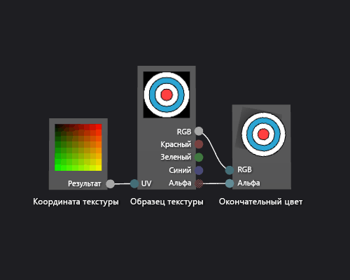

# Практическое руководство. Создание простейшего шейдера текстуры
[!INCLUDE[vs2017banner](../code-quality/includes/vs2017banner.md)]

В этом документе показывается, как использовать конструктор шейдера и Язык шейдера направленного графа \(DGSL\) для создания Шейдера одной текстуры.  Этот шейдер устанавливает конечный цвет на RGB и альфа\-значения, взятые из текстуры.  
  
 Этот документ демонстрирует эти действия:  
  
-   Удаление узлов из графа шейдеров  
  
-   Добавление узлов в граф  
  
-   Настройка параметров шейдера  
  
-   Настройка видимости параметра  
  
-   Соединение узлов  
  
## Создание базового шейдера текстуры  
 Можно реализовать базовый однотекстурный шейдер, записав цвета и значения альфа\-канала текстур непосредственно в окончательный вывод цвета.  
  
 Перед началом убедитесь, что отображаются окно **Свойства** и **Панель элементов**.  
  
#### Создание базового шейдера текстуры  
  
1.  Создайте построитель текстуры DGSL, с которым будете работать.  Дополнительные сведения о добавлении построителя текстуры DGSL в проект см. в подразделе "Начало работы" раздела [Конструктор шейдеров](../designers/shader-designer.md).  
  
2.  Удалите узел **Цвет точки**.  В режиме **Выбрать** выберите узел **Цвет точки**, а в строке меню — **Правка**, **Удалить**.  Таким образом освобождается место для узла, который добавляется на следующем шаге.  
  
3.  Добавление узла **Образец текстуры** к диаграмме.  В разделе **Панель элементов** в области **Текстура** выберите **Образец текстуры** и переместите ее на поверхность разработки.  
  
4.  Добавление узла **Координата текстуры** к диаграмме.  В разделе **Панель элементов** в области **Текстура** выберите **Координата текстуры** и переместите ее на поверхность разработки.  
  
5.  Выберите текстуру для применения.  В режиме **Select** выберите узел **Texture Sample** и в окне **Properties** укажите текстуру, которую следует использовать, с помощью свойства **Filename**.  
  
6.  Сделайте текстуру общедоступной.  Выберите узел **Texture Sample**, а затем в окне **Properties** задайте для свойства **Access** значение **Public**.  Теперь можно установить текстуру из другого средства, такого как **Редактор моделей**.  
  
7.  Присоедините координаты текстуры к образцу текстуры.  В режиме **Выбрать** переместите конечную точку **Вывод** узла **Координата текстуры** в конечную точку **UV** узла **Образец текстуры**.  Это соединение берет пробу текстуры по указанным координатам.  
  
8.  Присоедините образец текстуры к окончательному цвету.  Переместите терминал **RGB** узла **Texture Sample** к терминалу **RGB** узла **Final Color**, а затем переместите терминал **Alpha** узла **Texture Sample** к терминалу **Alpha** узла **Final Color**.  
  
 На следующей иллюстрации показан готовый граф шейдеров и предварительный просмотр шейдера, применяемого к кубу.  
  
> [!NOTE]
>  На этом рисунке в качестве объекта предпросмотра используется плоскость, и указана текстура, чтобы лучше продемонстрировать эффект шейдера.  
  
   
  
 Некоторые фигуры могут предоставить лучший предварительный просмотр для некоторых шейдеров.  Дополнительные сведения о способах предварительного просмотра шейдеров в конструкторе шейдеров см. в разделе [Конструктор шейдеров](../designers/shader-designer.md)  
  
## См. также  
 [Практическое руководство. Применение шейдера к трехмерной модели](../designers/how-to-apply-a-shader-to-a-3-d-model.md)   
 [редактор изображений](../designers/image-editor.md)   
 [Конструктор шейдеров](../designers/shader-designer.md)   
 [Узлы конструктора шейдеров](../designers/shader-designer-nodes.md)