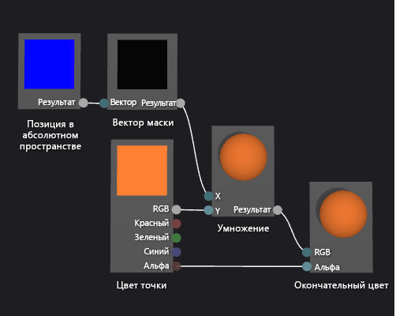

# Практическое руководство. Создание основанного на геометрии шейдера градиента

В этой статье показано, как использовать конструктор шейдеров и язык шейдеров ориентированных графов (Directed Graph Shader Language — DGSL) для создания основанного на геометрии шейдера градиента. Этот шейдер масштабирует постоянное значение цвета RGB по высоте каждой точки объекта в абсолютном пространстве.

## Создание основанного на геометрии шейдера градиента

Геометрический шейдер можно реализовать путем включения положения пикселя в шейдер. В языках шейдеров пиксель содержит больше информации, чем просто его цвет и местоположение на двумерном экране. Пиксель — в некоторых системах называемый *фрагментом* — это совокупность значений, описывающих поверхность, соответствующую пикселю. Шейдер, который рассматривается в этом документе, использует высоту каждого пикселя трехмерного объекта в абсолютном пространстве, чтобы влиять на окончательный цвет вывода фрагмента.

Перед началом убедитесь, что отображаются окно **Свойства** и **Панель элементов**.

1. Создайте построитель текстуры DGSL, с которым вы будете работать. Дополнительные сведения о добавлении шейдера DGSL в проект см. в подразделе "Начало работы" раздела [Конструктор шейдеров](../designers/shader-designer.md).

2. Отсоедините узел **Цвет точки** от узла **Окончательный цвет**. Выберите терминал **RGB** узла **Цвет точки**, а затем выберите **Разорвать связи**. Таким образом освобождается место для узла, который добавляется на следующем шаге.

3. Добавьте в граф узел **Умножение**. В окне **Панель элементов** в разделе **Математика** выберите **Умножение** и переместите элемент в область конструктора.

4. Добавьте в граф узел **Вектор маски**. В окне **Панель элементов** в разделе **Служебная программа** выберите **Вектор маски** и переместите элемент в область конструктора.

5. Укажите значения маски для узла **Вектор маски**. В режиме **Выбрать** выберите узел **Вектор маски**, а затем в окне **Свойства** задайте для свойства **Зеленый / Y** значение **True**, а для свойств **Красный / X**, **Синий / Z** и **Альфа / W** — значение **False**. В этом примере свойства **Красный / X**, **Зеленый / Y** и **Синий / Z** соответствуют компонентам X, Y и Z узла **Положение в мировых координатах**, а **Альфа / W** не используется. Поскольку только свойство **Значение / Y** установлено в значение **True**, после маскировки останется только компонент Y входного вектора.

6. Добавьте в граф узел **Положение в мировых координатах**. В окне **Панель элементов** в разделе **Константы** выберите **Положение в мировых координатах** и переместите элемент в область конструктора.

7. Замаскируйте положение фрагмента в абсолютном пространстве. В режиме **Выбрать** переместите терминал **Вывод** узла **Положение в мировых координатах** к терминалу **Вектор** узла **Вектор маски**. Это соединение маскирует позицию фрагмента, чтобы игнорировать компоненты X и Z.

8. Умножьте константу цвета RGB на замаскированное положение в абсолютном пространстве. Переместите терминал **RGB** узла **Цвет точки** к терминалу **Y** узла **Умножение**, а затем переместите терминал **Вывод** узла **Вектор маски** к терминалу **X** узла **Умножение**. Это соединение масштабирует значение цвета по высоте пикселя в абсолютном пространстве.

9. Соедините масштабированное значение цвета с окончательным цветом. Переместите терминал **Вывод** узла **Умножение** к терминалу **RGB** узла **Окончательный цвет**.

Ниже показан готовый граф шейдера и предварительный просмотр шейдера, примененного к сфере.

> [!NOTE]
> На этом рисунке оранжевый цвет используется для лучшей демонстрации эффекта шейдера, но так как фигура для предварительного просмотра не имеет позиции в абсолютном пространстве, шейдер нельзя просмотреть в конструкторе шейдеров полностью. Для полноценной демонстрации эффекта нужно показывать шейдер в реальной сцене.

Некоторые фигуры могут лучше подходить для предварительного просмотра некоторых шейдеров. Дополнительные сведения о предварительном просмотре шейдеров в конструкторе шейдеров см. в разделе **Предварительный просмотр шейдеров** статьи [Конструктор шейдеров](../designers/shader-designer.md).

На приведенном ниже рисунке шейдер, описанный в этом документе, применяется к трехмерной сцене, описанной в статье [Практическое руководство. Моделирование трехмерного ландшафта](../designers/how-to-model-3-d-terrain.md). Интенсивность цвета увеличивается вместе с высотой точки ландшафта.

Дополнительные сведения о способах применения шейдера к трехмерной модели см. в статье [Практическое руководство. Применение шейдера к трехмерной модели](../designers/how-to-apply-a-shader-to-a-3-d-model.md).

## См. также раздел

- [Практическое руководство. Применение шейдера к трехмерной модели](../designers/how-to-apply-a-shader-to-a-3-d-model.md)
- [Практическое руководство. Экспорт шейдера](../designers/how-to-export-a-shader.md)
- [Практическое руководство. Моделирование трехмерного ландшафта](../designers/how-to-model-3-d-terrain.md)
- [Практическое руководство. Создание шейдера текстуры с использованием оттенков серого](../designers/how-to-create-a-grayscale-texture-shader.md)
- [Конструктор шейдеров](../designers/shader-designer.md)
- [Узлы конструктора шейдеров](../designers/shader-designer-nodes.md)
