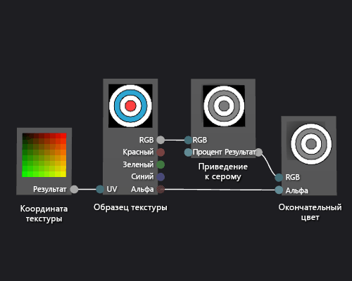

# Практическое руководство. Создание шейдера текстуры с использованием оттенков серого

В этой статье показано, как использовать конструктор шейдеров и язык шейдеров ориентированных графов (Directed Graph Shader Language — DGSL) для создания шейдера текстуры с использованием оттенков серого. Этот шейдер изменяет значение цвета RGB в образце текстуры, а затем использует его вместе с неизмененным значением альфа-фактора, чтобы задать окончательный цвет.

## Создание шейдера текстуры с использованием оттенков серого

Вы можете создать шейдер текстуры с использованием оттенков серого, изменив значение цвета в образце текстуры перед его записью в окончательный цвет вывода.

Перед началом убедитесь, что отображаются окно **Свойства** и **Панель элементов**.

1. Создайте простейший шейдер текстуры, как описано в разделе [Практическое руководство. Создание простейшего шейдера текстуры](../designers/how-to-create-a-basic-texture-shader.md).

2. Отсоедините терминал **RGB** узла **Образец текстуры** от терминала **RGB** узла **Окончательный цвет**. В режиме **Выбрать** выберите терминал **RGB** узла **Образец текстуры**, а затем выберите **Разорвать связи**. Таким образом освобождается место для узла, который добавляется на следующем шаге.

3. Добавьте в граф узел **Приведение к серому**. В окне **Панель элементов** в разделе **Фильтры** выберите **Приведение к серому** и переместите элемент в область конструктора.

4. Вычислите значение серого с помощью узла **Приведение к серому**. В режиме **Выбрать** переместите терминал **RGB** узла **Образец текстуры** к терминалу **RGB** узла **Приведение к серому**.

    > [!NOTE]
    > По умолчанию узел **Приведение к серому** полностью приводит к серому цвет ввода и использует стандартные весовые коэффициенты освещенности для преобразования в оттенки серого. Режим работы **Приведение к серому** можно сменить, изменив значение свойства **Освещенность** либо приведя цвет ввода к серому лишь частично. Чтобы частично привести цвет ввода к серому, укажите скалярное значение в диапазоне [0,1) для терминала **Процент** узла **Приведение к серому**.

5. Соедините значение цвета в оттенках серого с окончательным цветом. Переместите терминал **Вывод** узла **Приведение к серому** к терминалу **RGB** узла **Окончательный цвет**.

Ниже показан готовый граф шейдера и предварительный просмотр шейдера, примененного к кубу.

> [!NOTE]
> На этом рисунке в качестве фигуры для предварительного просмотра используется плоскость, и задана текстура, чтобы лучше продемонстрировать эффект шейдера.

Некоторые фигуры могут лучше подходить для предварительного просмотра некоторых шейдеров. Дополнительные сведения о том, как предварительно просматривать шейдеры в конструкторе шейдеров, см. в разделе [Конструктор шейдеров](../designers/shader-designer.md).

## См. также раздел

- [Практическое руководство. Применение шейдера к трехмерной модели](../designers/how-to-apply-a-shader-to-a-3-d-model.md)
- [Практическое руководство. Экспорт шейдера](../designers/how-to-export-a-shader.md)
- [Image Editor](../designers/image-editor.md)
- [Конструктор шейдеров](../designers/shader-designer.md)
- [Узлы конструктора шейдеров](../designers/shader-designer-nodes.md)
