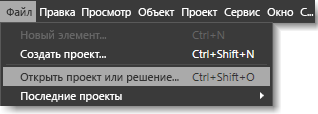
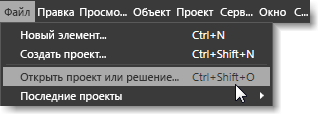

# Сочетания клавиш и клавиши-модификаторы
[!INCLUDE[vs2017banner](../code-quality/includes/vs2017banner.md)]

Сочетания клавиш позволяют ускорить работу, потому что устраняют необходимость несколько раз щелкать кнопками мыши. Вместо этого достаточно нажать пару клавиш.  В [!INCLUDE[blend_first](../debugger/includes/blend_first_md.md)] используются сочетания клавиш двух следующих типов.  
  
-   **Клавиши доступа** — можно воспользоваться этими клавишами для доступа к команде меню или области диалогового окна. Для этого необходимо нажать соответствующую клавишу на клавиатуре.  Клавиши доступа обозначаются подчеркиваниями, отображаемыми в выбранной в настоящее время команде или диалоговом окне.  
  
     Чтобы использовать клавиши доступа, сначала нажмите ALT или F10, чтобы отобразилось подчеркивание, а затем нажмите соответствующую букву нужного элемента меню или диалогового окна.  Кроме того, перемещаться по меню или диалоговому окну можно с использованием клавиши табуляции или клавиш со стрелками.  Например, при нажатии клавиши ALT в [!INCLUDE[blend_subs](../debugger/includes/blend_subs_md.md)] подчеркивание отображается под буквой **F** в меню **Файл** \(File\), чтобы идентифицировать ее как клавишу доступа.  Чтобы открыть проект можно нажать и удерживать клавишу ALT, затем последовательно нажать клавиши F и O.  
  
       
Клавиши доступа, отображаемые с подчеркиванием после нажатия клавиши ALT  
  
-   **Клавиши доступа** — можно создать клавиши доступа для выполнения действия \(например, выбора команды меню или изменения поведения инструмента\), нажав сочетание клавиш на клавиатуре.  
  
     Большинство сочетаний клавиш легко идентифицировать в пользовательском интерфейсе [!INCLUDE[blend_subs](../debugger/includes/blend_subs_md.md)]; они отображаются справа от команд меню.  Например, в меню **Файл** рядом с командой меню **Открыть проект** указано сочетание клавиш CTRL\+SHIFT\+O.  Чтобы просмотреть сочетания клавиш для инструмента на панели **Сервис** необходимо навести указатель на инструмент.  
  
       
Сочетания клавиш, отображаемые рядом с пунктами меню, поддерживающими такие сочетания  
  
 Дополнительные сведения о специальных возможностях и компонентах см. на веб\-сайте [Accessibility at Microsoft \(Специальные возможности в Майкрософт\)](http://go.microsoft.com/fwlink/?LinkId=75069).  
  
## Клавиши\-модификаторы  
 Некоторые сочетания клавиш не имеют связанных с ними пунктов меню, то есть обнаружить их в пользовательском интерфейсе [!INCLUDE[blend_subs](../debugger/includes/blend_subs_md.md)] нельзя.  В следующих разделах перечислены сочетания клавиш, меняющие поведение инструментов или меняющие действие, например изменение размера объекта.  
  
-   [Клавиши\-модификаторы области рисования](../designers/artboard-modifier-keys-in-blend.md)  
  
-   [Клавиши\-модификаторы инструмента "Перо"](../designers/pen-tool-modifier-keys-in-blend.md)  
  
-   [Клавиши\-модификаторы инструмента "Непосредственное выделение"](../designers/direct-selection-tool-modifier-keys-in-blend.md)