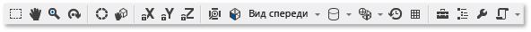

# Редактор моделей

В этом документе описывается, как с помощью **редактора моделей** Visual Studio просматривать, создавать и изменять трехмерные модели.

С помощью **редактора моделей** можно создавать простые трехмерные модели с нуля, а также просматривать и изменять более сложные трехмерные модели, созданные с помощью полнофункциональных средств 3D-моделирования.

## Поддерживаемые форматы

**Редактор моделей** поддерживает несколько форматов трехмерных моделей, которые используются при разработке приложений, поддерживающих DirectX.

|Название формата|Расширение файла|Поддерживаемые операции (просмотр, правка, создание)|
|-----------------| - | - |
|Файл обмена AutoDesk FBX|*.fbx*|Просмотр, правка, создание|
|Файл Collada DAE|*.dae*|Просмотр, правка (изменения, внесенные в файлы Collada DAE, сохраняются в формате FBX).|
|OBJ|*.obj*|Просмотр, правка (изменения, внесенные в файлы OBJ, сохраняются в формате FBX).|

## Начало работы

В этом разделе представлены инструкции по добавлению трехмерной модели в проект Visual Studio на C++, а также основные сведения, необходимые для начала работы.

> [!NOTE]
> Автоматическая интеграция графических объектов (например, трехмерные сцены (FBX-файлы)) в сборку, поддерживается только в проектах на C++.

### Добавление трехмерной модели в проект

1. Убедитесь, что у вас установлен компонент Visual Studio, необходимый для работы с графикой. Компонент называется **Image and 3D model editors** (Редакторы изображений и трехмерных моделей).

   Чтобы установить его, откройте Visual Studio Installer, выбрав в строке меню **Средства** > **Получить средства и компоненты**, а затем выберите вкладку **Individual components** (Отдельные компоненты). В категории **Games and Graphics** (Игры и графика) выберите компонент **Image and 3D model editors** (Редакторы изображений и трехмерных моделей) и нажмите кнопку **Modify** (Изменить).

   

   Начнется установка компонента.

2. В **обозревателе решений** откройте контекстное меню проекта на C++, в который требуется добавить изображение, и выберите пункты **Добавить** > **Создать элемент**.

3. В диалоговом окне **Добавление нового элемента** в категории **Графика** выберите элемент **3D-сцена (.fbx)**.

   

   > [!NOTE]
   > Если в диалоговом окне **Добавление нового элемента** категория **Графика** отсутствует, а **редакторы изображений и трехмерных моделей** установлены, значит графические элементы не поддерживаются для этого типа проекта.

4. Введите **имя** файла модели, а затем нажмите кнопку **Добавить**.

### Ориентация оси

Visual Studio поддерживает каждую ориентацию трехмерной оси и загружает информацию об ориентации оси из форматов файлов модели, которые его поддерживают. Если ориентация оси не задана, Visual Studio по умолчанию использует правостороннюю систему координат. **Индикатор осей** показывает текущую ориентацию осей в нижнем правом углу области конструктора. На **индикаторе осей** красный цвет представляет ось X, зеленый — ось Y, а синий — ось Z.

### Начало создания трехмерной модели

В редакторе моделей каждый новый объект сначала всегда представляет собой одну из базовых трехмерных фигур, или *примитивов*, встроенных в редактор моделей. Для создания новых и уникальных объектов в сцену необходимо добавить примитив, а затем изменить его форму путем изменения вершин. Для создания сложных фигур необходимо добавить дополнительные вершины при помощи экструзии или деления, а затем изменить их. Дополнительные сведения о добавлении объекта-примитива в сцену см. в разделе [Создание и импорт трехмерных объектов](#Adding3DObjects). Дополнительные сведения о добавлении вершин в объект см. в разделе [Изменение объектов](#ModifyingObjects).

## Работа с редактором моделей

В следующих разделах рассматривается порядок использования редактора моделей для работы с трехмерными моделями.

### Панели инструментов редактора моделей

Панели инструментов редактора моделей содержат команды, помогающие работать с трехмерными моделями.

Команды, влияющие на состояние редактора моделей, находятся на панели инструментов **Режим редактора моделей** в главном окне Visual Studio. Инструменты моделирования и скриптовые команды расположены в панели инструментов **Редактор моделей** в области конструктора редактора моделей.

Здесь приведена панель инструментов **Режим редактора моделей**.

Эта таблица описывает элементы на панели инструментов **Режим редактора моделей**, перечисленные в порядке отображения, слева направо.

|Элемент панели инструментов|Описание|
|------------------|-----------------|
|**Select**|Активирует функцию выделения точек, краев, сторон или объектов в сцене в зависимости от активного режима выделения.|
|**Сдвиг**|Активирует функцию перемещения трехмерной сцены по отношению к рамке окна. Чтобы выполнить панорамирование, выберите точку на сцене и переместите ее.   В режиме **Выбрать**, нажав и удерживая клавишу **CTRL**, можно временно активировать режим **Панорама**.|
|**Масштабирование**|Позволяет отображать сцену более или менее детально по отношению к рамке окна. В режиме **Масштаб** выберите точку на экране, а затем переместите ее вправо или вниз, чтобы увеличить масштаб, либо влево или вверх, чтобы уменьшить масштаб.   В режиме **Выбрать** можно увеличить или уменьшить масштаб, прокручивая колесо мыши с нажатой клавишей **CTRL**.|
|**Орбита**|Располагает представление по круговой траектории вокруг выбранного объекта. Если ни один объект не выбран, центр пути находится в начале координат сцены. **Примечание.** Этот режим не действует, если включена проекция **Ортогональный**.|
|**WorldLocal**|Когда этот элемент включен, преобразования в выбранном объекте происходят в абсолютном пространстве. В противном случае преобразование выбранного объекта выполняется в локальном пространстве.|
|**Режим вращения**|Когда этот элемент включен, преобразование влияет на местоположение и ориентацию *точки вращения* выбранного объекта (точка вращения определяет центр операций перевода, масштабирования и поворота). В противном случае преобразование влияет на расположение и ориентацию геометрии объекта относительно точки вращения.|
|**Заблокировать ось X**|Запрещает выполнение операций с объектом относительно оси X. Применяется только при использовании центральной части виджета манипулятора.|
|**Заблокировать ось Y**|Запрещает выполнение операций с объектом относительно оси Y. Применяется только при использовании центральной части виджета манипулятора.|
|**Заблокировать ось Z**|Запрещает выполнение операций с объектом относительно оси Z. Применяется только при использовании центральной части виджета манипулятора.|
|**Объект кадра**|Обрамляет выбранный объект, чтобы он находился в центре представления.|
|**Просмотр**|Задает ориентацию представления. Ниже приводятся доступные ориентации.   **Front**  Располагает представление перед сценой.   **Назад**  Располагает представление за сценой.   **Слева**  Располагает представление слева от сцены.   **Right**  Располагает представление справа от сцены.   **Top**  Располагает представление над сценой.   **Нижнее**  Располагает представление под сценой. **Примечание.** Это единственный способ изменить направление представления, когда включена проекция **Ортогональный**.|
|**Проекция**|Задает тип проекции, которая используется для рисования сцены. Ниже приводятся доступные проекции.   **Перспектива**  В проекции перспективы объекты, которые находятся дальше от точки обзора, отображаются меньшими по размеру и сходятся в точке на расстоянии.   **Ортогональный**  В ортогональной проекции объекты отображаются одинакового размера независимо от расстояния между ними и точкой обзора. Конвергенция не отображается. При включенной проекции **Ортогональный** невозможно использовать режим **Орбита** для размещения представления.|
|**Стиль рисования**|Задает способ отрисовки объектов в сцене. Ниже приводятся доступные стили.   **Каркас**  При включении объекты отрисовываются как каркасы.   **Превышение**  При включении объекты отрисовываются с помощью аддитивного смешения. Этот режим можно использовать для визуализации доли превышения в сцене.   **Плоская тень**  При включении объекты отрисовываются с помощью базовой модели освещения с плоскими тенями. Этот режим можно использовать в качестве простого способа просмотра сторон объекта.   Если ни один из этих параметров не включен, каждый объект отрисовывается с использованием материала, который применяется к нему.|
|**Режим отрисовки в реальном времени**|Если отрисовка в реальном времени включена, Visual Studio перерисовывает поверхность разработки, даже если пользователь не выполняет никаких действий. Этот режим полезен при работе с шейдерами, которые изменяются со временем.|
|**Сетка**|Когда этот элемент включен, сетка отображается. В противном случае сетка не отображается.|
|**Панель элементов**|Отображает или скрывает **Панель элементов**.|
|**Структура документа**|Отображает или скрывает окно **Структура документа**.|
|**Свойства**|Отображает или скрывает окно **Свойства**.|
|**Дополнительно**|Содержит расширенные команды и параметры.   **Графические модули**   **Render with D3D11** (Визуализация с помощью D3D11)  Использует Direct3D 11, чтобы отрисовать поверхность разработки редактора моделей.   **Render with D3D11WARP** (Визуализация с помощью D3D11WARP)  Использует платформу Windows Advanced Rasterization Platform (WARP) Direct3D 11 для отрисовки поверхности разработки редактора моделей.   **Управление сценами**   **Импорт**  Импортирует объекты из другого файла трехмерной модели в текущую сцену.   **Присоединить к родительскому объекту**  Определяет первый из нескольких выбранных объектов как родительский для остальных выделенных объектов.   **Отсоединить от родительского элемента**  Отсоединяет выбранный объект от его родительского элемента. Выбранный объект является *корневым объектом* в сцене. Корневой объект не имеет родительского объекта.   **Создать группу**  Группирует выбранные объекты как объекты с общим родителем.   **Объединить объекты**  Объединяет выбранные объекты в один объект.   **Создать объект из выбранного многоугольника**  Удаляет выбранные стороны из текущего объекта и добавляет в сцену новый объект, содержащий эти стороны.   **Инструменты**   **Перевернуть закручивание многоугольника**  Переворачивает выбранные многоугольники, инвертируя их порядок вращения и нормаль к поверхности.   **Удалить всю анимацию**  Удаляет данные анимации из объектов.   **Выполнить триангуляцию**  Преобразует выбранный объект в треугольники.   **Просмотр**   Отбраковка противоположной поверхности  Включает или отключает отбраковку противоположной поверхности.   **Частота кадров**  Указывает частоту кадров в правом верхнем углу поверхности разработки. Частота кадров — это количество кадров, рисуемых в секунду.   Этот параметр полезен при включении параметра **Режим отрисовки в реальном времени**.   **Показать все**  Отображаются все объекты в сцене. Эта функция сбрасывает свойство **Скрытый** для каждого объекта до значения **False**.   **Показать нормали к поверхностям**  Показывает нормаль к каждой поверхности.   **Показать отсутствующие материалы**  Отображает специальную текстуру на объектах, которым не назначен материал.   **Показать центр вращения**  Включает или отключает отображение трехмерной метки оси в точке поворота активного выделения.   **Показать узлы-заполнители**  Показывает узлы-заполнители. Узел-заполнитель создается при группировке объектов.   **Показать нормали к вершинам**  Показывает нормаль к каждой вершине. **Совет.** Чтобы повторно запустить последний скрипт, нажмите кнопку **Скрипты**.|

Панель инструментов **Редактор моделей**:

Следующая таблица описывает элементы на панели инструментов **Редактор моделей**, перечисленные в порядке их следования сверху вниз.

|Элемент панели инструментов|Описание|
|------------------|-----------------|
|**Translate**|Перемещает выделение.|
|**Масштабирование**|Изменяет размер выделения.|
|**Поворот**|Поворачивает выбранный фрагмент.|
|**Выбор точки**|Задает **Режим выделения** для выбора отдельных точек на объекте.|
|**Выбор границы**|Задает **Режим выделения** для выбора края (линии между двумя вершинами) объекта.|
|**Выбор поверхности**|Задает **Режим выделения** для выбора поверхности объекта.|
|**Выбор объекта**|Задает **Режим выделения** для выбора всего объекта целиком.|
|**Выдавить**|Создает дополнительную поверхность и присоединяет ее к выбранной поверхности.|
|**Разделить**|Делит каждую выбранную поверхность на несколько поверхностей. Для создания новых поверхностей добавляются новые вершины, одна в центре исходной стороны и одна в середине каждого края, которые затем соединяются с исходными вершинами. Количество добавленных поверхностей равно количеству краев в исходной поверхности.|

### Управление представлением

Трехмерная сцена отрисовывается в соответствии с представлением, которое представляет собой своего рода виртуальную камеру, имеющую положение и ориентацию. Чтобы изменить положение и ориентацию, используйте элементы управления представления на панели инструментов **Режим редактора моделей**.

В следующей таблице приведены описания основных элементов управления обзором.

|Элемент управления представлением|Описание|
|------------------|-----------------|
|**Сдвиг**|Активирует функцию перемещения трехмерной сцены по отношению к рамке окна. Чтобы выполнить панорамирование, выберите точку на сцене и переместите ее.   В режиме **Выбрать**, нажав и удерживая клавишу **CTRL**, можно временно активировать режим **Панорама**.|
|**Масштабирование**|Позволяет отображать сцену более или менее детально по отношению к рамке окна. В режиме **Масштаб** выберите точку на экране, а затем переместите ее вправо или вниз, чтобы увеличить масштаб, либо влево или вверх, чтобы уменьшить масштаб.   В режиме **Выбрать** можно увеличить или уменьшить масштаб, прокручивая колесо мыши с нажатой клавишей **CTRL**.|
|**Орбита**|Располагает представление по круговой траектории вокруг выбранного объекта. Если ни один объект не выбран, центр пути находится в начале координат сцены. **Примечание.** Этот режим не действует, если включена проекция **Ортогональный**.|
|**Объект кадра**|Обрамляет выбранный объект, чтобы он находился в центре представления.|

Представление установлено виртуальный камерой, но также определяется проекцией. Проекция определяет принципы преобразования фигур и объектов в представлении в пиксели на поверхности разработки. На панели инструментов **Редактор моделей** можно выбрать проекцию **Перспектива** или **Ортогональный**.

|Проекция|Описание|
|----------------|-----------------|
|**Перспектива**|В проекции перспективы объекты, которые находятся дальше от точки обзора, отображаются меньшими по размеру и сходятся в точке на расстоянии.|
|**Ортогональный**|В ортогональной проекции объекты отображаются одинакового размера независимо от расстояния между ними и точкой обзора. Конвергенция не отображается. При включенной проекции **Ортогональный** невозможно использовать режим **Орбита** для произвольного размещения представления.|

В некоторых случаях трехмерную сцену требуется отобразить из определенного положения и под определенным углом, например для сравнения двух аналогичных сцен. Для этого сценария редактор моделей предоставляет несколько предопределенных представлений. Чтобы применить предопределенное представление, на панели инструментов **Режим редактора моделей** выберите **Вид**, а затем нужное предопределенное представление — спереди, сзади, слева, справа, сверху или снизу. В этих представлениях виртуальная камера направлена на источник сцены. Например, при выборе представления **Вид сверху** виртуальная камера направляется на начало координат сцены из точки непосредственно над ним.

### Просмотр дополнительных геометрических сведений

Чтобы составить более четкое представление о трехмерном объекте или сцене, можно просмотреть дополнительные геометрические сведения о них, например нормали по вершинам, нормали по сторонам, центральные точки активного выделения и т. д. Чтобы включить или отключить отображение данной информации, в панели инструментов **Редактор моделей** выберите **Скрипты** > **Просмотр**, а затем нужные данные.

### Создание и импорт трехмерных объектов

Чтобы добавить предопределенную трехмерную фигуру в сцену, на **панели элементов** выберите нужную фигуру, а затем переместите ее на поверхность разработки. Новые фигуры располагаются в начале сцены. В редакторе моделей предусмотрено семь фигур: **Конус**, **Куб**, **Цилиндр**, **Диск**, **Плоскость**, **Сфера** и **Чайник**.

Чтобы импортировать трехмерный объект из файла, в панели инструментов **Редактор моделей** выберите **Дополнительно** > **Управление сценами** > **Импорт**, а затем укажите файл, который требуется импортировать.

### Transform - объекты

Вы можете *преобразовать* объект, изменяя его свойства **Поворот**, **Масштаб** и **Перенос**. *Поворот* изменяет ориентацию объекта, применяя последовательные повороты вокруг оси X, оси Y и оси Z, заданные центром вращения объекта. Каждая спецификация поворота имеет 3 компонента — x, y и z, в соответствующем порядке — и компоненты определяются в градусах. **Масштаб** изменяет размер объекта путем растягивания его с указанным коэффициентом вдоль одной или нескольких осей с фокусом в центре вращения. *Перенос* размещает объект в трехмерном пространстве относительно его родительского элемента, а не его точки вращения.

Любой объект можно преобразовать с помощью средств моделирования или путем установки свойств.

#### Преобразование объекта с помощью средств моделирования

1. В режиме **Выбрать** выберите объект, который требуется преобразовать. Наложение каркасных представлений указывает, что объект выбран.

2. На панели инструментов **Редактор моделей** выберите инструмент **Перенос**, **Масштаб** или **Поворот**. Для выбранного объекта отобразится манипулятор переноса, масштабирования или вращения.

3. Используйте данный манипулятор для выполнения преобразования. Для переноса и масштабирования манипулятором является индикатор оси. Оси можно изменять по одной или все одновременно при помощи белого куба в центре индикатора. Для вращения манипулятором является сфера, которая состоит из кругов с цветовой кодировкой, соответствующих оси X (красный), оси Y (зеленый) и оси Z (синий). Чтобы достичь нужного результата при вращении каждую ось необходимо изменять по отдельности.

#### Преобразование объекта путем изменения его свойств

1. В режиме **Выбрать** выберите объект, который требуется преобразовать. Наложение каркасных представлений указывает, что объект выбран.

2. В окне **Свойства** задайте новые значения для свойств **Поворот**, **Масштаб** и **Перенос**.

    > [!IMPORTANT]
    > Для свойства **Поворот** укажите степень поворота вокруг каждой из трех осей. Повороты выполняются по порядку, поэтому планировать поворот необходимо сначала вокруг оси X, затем вокруг оси Y, а затем вокруг оси Z.

С помощью средств моделирования можно выполнить преобразование быстро, но не точно. Настраивая свойства объекта, можно выполнить преобразование точно, но медленно. Рекомендуется сначала использовать средства моделирования для достижения результатов преобразования, максимально приближенных к желаемым, а затем задать точные значения свойств.

Если вы не хотите использовать манипуляторы, можно включить режим произвольной формы. В панели инструментов **Редактор моделей** выберите **Скрипты** > **Инструменты** > **Произвольные манипуляции**, чтобы включить или отключить режим произвольной формы. В режиме произвольной формы можно начать манипуляции на поверхности разработки, а не в отдельной точке манипулятора. В режиме произвольной формы можно ограничить область изменения отдельными осями, заблокировав оси, менять которые не требуется. На панели инструментов **Режим редактора моделей** выберите любое сочетание кнопок **Заблокировать X**, **Заблокировать Y** и **Заблокировать Z**.

Иногда при работе с объектами может понадобиться привязка к сетке. На панели инструментов **Режим редактора моделей** выберите **Привязать**, чтобы включить (или отключить) привязку к сетке. Если привязка к сетке включена, перенос, вращение и масштабирование ограничены предварительно заданными приращениями.

### Работа с точкой вращения

Точка вращения объекта определяет для него центр поворота и масштабирования. Можно изменить точку вращения, чтобы изменить результаты вращения и масштабирования объекта. На панели инструментов **Режим редактора моделей** выберите **Режим вращения**, чтобы включить (или отключить) режим вращения. Если включен режим вращения, на точке поворота выбранного объекта появляется маленький индикатор оси. Затем можно использовать средства **Перенос** и **Поворот** для управления точкой вращения.

Демонстрацию применения точки вращения см. в статье [Практическое руководство. Изменение точки вращения трехмерной модели](../designers/how-to-modify-the-pivot-point-of-a-3-d-model.md).

### Абсолютный и локальный режимы

Перенос и поворот можно выполнять либо в локальной системе координат (или *локальной системе отсчета координат*) объекта, либо в абсолютной системе координат (или *абсолютной системе отсчета координат*). Абсолютная система отсчета не зависит от вращения объекта. По умолчанию применяется локальный режим. Чтобы включить или отключить абсолютный режим, на панели инструментов **Режим редактора моделей** нажмите кнопку **WorldLocal**.

### Изменение объектов 

Вы можете изменять форму трехмерного объекта, перемещая и удаляя его вершины, края и грани. По умолчанию редактор моделей работает в *режиме объекта*, в котором можно выбрать и преобразовать объекты полностью. Для выделения точек, краев или граней объекта выберите соответствующий режим выбора. На панели инструментов **Режим редактора моделей** выберите **Режимы выбора**, а затем нужный режим.

Дополнительные вершины можно создать путем экструзии или деления объекта. Экструзия дублирует вершины грани (копланарного набора вершин), которые остаются связаны дублированными вершинами. Разделение предполагает добавление вершин для создания нескольких граней из одной грани. Для создания новых поверхностей добавляются новые вершины, одна в центре исходной стороны и одна в середине каждого края, которые затем соединяются с исходными вершинами. Количество добавленных поверхностей равно количеству краев в исходной поверхности. В обоих случаях можно преобразовывать, поворачивать и масштабировать новые вершины, чтобы изменить геометрию объекта.

#### Экструзия грани из объекта

1. В режиме выбора грани выберите сторону, которую требуется выдавить.

2. В панели инструментов **Редактор моделей** выберите **Скрипты** > **Инструменты** > **Выдавить**.

#### Деление граней

1. В режиме выбора граней выберите грани, которые требуется разделить. Поскольку при делении создаются новые края, одновременное деление всех граней обеспечивает более последовательные результаты, если грани являются смежными.

2. В панели инструментов **Редактор моделей** выберите **Скрипты** > **Инструменты** > **Разделить**.

Можно также выполнить триангуляцию граней, объединить объекты и преобразовать выделенные многоугольные области в новые объекты. Триангуляция создает дополнительные края, преобразуя нетреугольные грани в оптимальное количество треугольников; однако эта функция не предоставляет дополнительные геометрические сведения. При объединении выбранные объекты объединяются в один объект. Из выделенной многоугольной области можно создать новые объекты.

#### Триангуляция поверхности

1. В режиме выбора грани выберите грань, к которой требуется применить триангуляцию.

2. В панели инструментов **Редактор моделей** выберите **Скрипты** > **Инструменты** > **Выполнить триангуляцию**.

#### Объединение объектов

1. В режиме выбора объектов выберите объекты для объединения.

2. В панели инструментов **Редактор моделей** выберите **Скрипты** > **Инструменты** > **Объединить объекты**.

#### Создание объекта из выделенных многоугольников

1. В режиме выбора граней выберите грани, из которых требуется создать новый объект.

2. В панели инструментов **Редактор моделей** выберите **Скрипты** > **Инструменты** > **Создать объект из выбранного многоугольника**.

### Работа с материалами и шейдерами

Внешний вид объекта определяется взаимодействием освещения в сцене и материала объекта. Материалы определяются свойствами, которые описывают, как поверхность реагирует на различные типы света, и программой шейдера, которая вычисляет конечный цвет каждого пикселя на поверхности объекта на основе информации об освещении, сопоставления текстуры, нормальных сопоставлений и других данных.

В редакторе моделей предусмотрены следующие стандартные материалы:

|Материал|Описание|
|--------------|-----------------|
|**Неосвещенный**|Отрисовывает поверхность без какого-либо сымитированного освещения.|
|**Ламберт**|Отрисовывает поверхность область с сымитированным внешним освещением и диффузным освещением.|
|**Освещенный по методу Фонга**|Отрисовывает поверхность область с сымитированным внешним освещением, диффузным освещением и зеркальными отражениями.|

Каждый из этих материалов накладывает одну текстуру на поверхность объекта. Можно задать другую текстуру для каждого объекта, использующего материал.

Чтобы изменить способ реакции определенного объекта на различные источники света на сцене, можно изменять свойства освещения материала независимо от других объектов, использующих материал. В этой таблице приводится описание общих свойств освещения:

|Свойства освещения|Описание|
| - |-----------------|
|**Окружающее**|Описывает влияние внешнего освещения на поверхность.|
|**Диффузное**|Описывает влияние направленных и точечных источников света на поверхность.|
|**Эмиссионное**|Описывает свет, излучаемый поверхностью, независимо от другого освещения.|
|**Отражающее**|Описывает отражение направленных и точечных источников света поверхностью.|
|**Отражающая способность**|Описывает широту и интенсивность зеркального отражения.|

В зависимости от того, что поддерживает материал, можно изменить его свойства освещения, текстуры и другие данные. В режиме **Выбрать** выберите объект, материал которого требуется изменить, а затем в окне **Свойства** измените свойство **MaterialAmbient**, **MaterialDiffuse**, **MaterialEmissive**, **MaterialSpecular**, **MaterialSpecularPower** или другое доступное свойство. Материал может представить до восьми текстур, свойства которых называются последовательно от **Texture1** до **Texture8**.

Чтобы удалить все материалы из объекта, в панели инструментов **Редактор моделей** выберите **Скрипты** > **Материалы** > **Удалить материалы**.

Вы можете использовать **Конструктор шейдеров** для создания пользовательских материалов шейдера, которые можно применить к объектам в трехмерной сцене. Дополнительные сведения о создании настраиваемых материалов шейдера текстуры см. в разделе [Конструктор шейдеров](../designers/shader-designer.md). Сведения о способах применения пользовательского материала шейдера к объекту см. в статье [Практическое руководство. Применение шейдера к трехмерной модели](../designers/how-to-apply-a-shader-to-a-3-d-model.md).

### Управление сценами

Можно управлять сценами как иерархией объектов. Если несколько объектов упорядочиваются в иерархии, любой перенос, масштабирование или поворот родительского узла также влияют на его дочерние элементы. Это полезно, когда нужно создавать сложные объекты или сцены из более базовых объектов.

Окно **Структура документа** используется для просмотра иерархии сцены и выбора узлов сцены. При выборе узла в структуре можно использовать окно **Свойства**, чтобы изменить его свойства.

Можно построить иерархию объектов, сделав один из них родительским для других или сгруппировав их вместе как одноуровневые элементы в узле местозаполнителя, который выступает в качестве родительского.

#### Создание иерархии, которая имеет родительский объект

1. В режиме **Выбрать** выберите два или более объектов. Первый выбранный объект будет родительским объектом.

2. В панели инструментов **Редактор моделей** выберите **Скрипты** > **Управление сценами** > **Присоединить к родительскому элементу**.

#### Создание иерархии одноуровневых объектов

1. В режиме **Выбрать** выберите два или более объектов. Создается объект заполнителя, который становится их родительским объектом.

2. В панели инструментов **Редактор моделей** выберите **Скрипты** > **Управление сценами** > **Создать группу**.

В редакторе моделей используется белый каркас для идентификации первого выбранного объекта, который становится родительским объектом. Другие объекты в выделении имеют синий каркас. По умолчанию узлы заполнителей не отображаются. Для отображения узлов заполнителей в панели инструментов **Редактор моделей** выберите **Скрипты** > **Управление сценами** > **Показать узлы-заполнители**. С узлами заполнителями можно работать таким же образом, как и с объектами, которые не являются заполнителями.

Чтобы удалить связь "родители-потомки" между двумя объектами, выберите дочерний объект, а затем в панели инструментов **Редактор моделей** выберите **Скрипты** > **Управление сценами** > **Отсоединить от родительского элемента**. При отключении родительского элемента от дочернего объекта данный дочерний объект становится корневым объектом в сцене.

## Сочетания клавиш

|Get-Help|Сочетания клавиш|
|-------------| - |
|Переход в режим **Выбрать**|**Ctrl**+**G**, **Ctrl**+**Q**   **S**|
|Переход в режим **Масштаб**|**Ctrl**+**G**, **Ctrl**+**Z**   **Z**|
|Переход в режим **Панорама**|**Ctrl**+**G**, **Ctrl**+**P**   **K**|
|Выбрать все|**CTRL**+**A**|
|Удалить текущее выделение|**Удалить**|
|Отменить текущее выделение|**Escape** (**Esc**)|
|Увеличение масштаба.|**Прокручивание колеса мыши вперед**   **Ctrl**+**Прокручивание колеса мыши вперед**   **Shift**+**Прокручивание колеса мыши вперед**   **Ctrl**+**PageUp**   Знак плюса ( **+** )|
|Уменьшение масштаба.|**Прокручивание колеса мыши назад**   **Ctrl**+**Прокручивание колеса мыши назад**   **Shift**+**Прокручивание колеса мыши назад**   **Ctrl**+**PageDown**   Знак минуса ( **-** )|
|Сдвиг камеры вверх|**PageDown**|
|Сдвиг камеры вниз|**PageUp**|
|Сдвиг камеры влево|**Прокручивание колеса мыши влево**   **CTRL**+**PageDown**|
|Сдвиг камеры вправо|**Прокручивание колеса мыши вправо**   **CTRL**+**PageDown**|
|Просмотр верхней части модели|**Ctrl**+**L**, **Ctrl**+**T**   **T**|
|Просмотр нижней части модели|**Ctrl**+**L**, **Ctrl**+**U**|
|Просмотр левой части модели|**Ctrl**+**L**, **Ctrl**+**L**|
|Просмотр правой части модели|**Ctrl**+**L**, **Ctrl**+**R**|
|Просмотр передней части модели|**Ctrl**+**L**, **Ctrl**+**F**|
|Просмотр задней части модели|**Ctrl**+**L**, **Ctrl**+**B**|
|Объект кадра в окне|**Ж**|
|Переключение режима Wireframe|**Ctrl**+**L**, **Ctrl**+**W**|
|Переключение привязки к сетке|**Ctrl**+**G**, **Ctrl**+**N**|
|Переключение режима вращения|**Ctrl**+**G**, **Ctrl**+**V**|
|Переключение ограничения оси X|**Ctrl**+**L**, **Ctrl**+**X**|
|Переключение ограничения оси Y|**Ctrl**+**L**, **Ctrl**+**Y**|
|Переключение ограничения оси Z|**Ctrl**+**L**, **Ctrl**+**Z**|
|Переход в режим переноса|**Ctrl**+**G**, **Ctrl**+**W**   **W**|
|Переход в режим масштабирования|**Ctrl**+**G**, **Ctrl**+**E**   **E**|
|Переход в режим вращения|**Ctrl**+**G**, **Ctrl**+**R**   **R**|
|Переход в режим выбора точек|**Ctrl**+**L**, **Ctrl**+**1**|
|Переход в режим выбора краев|**Ctrl**+**L**, **Ctrl**+**2**|
|Переход в режим выбора граней|**Ctrl**+**L**, **Ctrl**+**3**|
|Переход в режим выбора объектов|**Ctrl**+**L**, **Ctrl**+**4**|
|Переход в режим орбиты (камеры)|**Ctrl**+**G**, **Ctrl**+**O**|
|Выбрать следующий объект в сцене|**Вкладка**|
|Выбрать предыдущий объект в сцене|**SHIFT**+**TAB**|
|Управление выбранным объектом на основе текущего инструмента.|Клавиши со **стрелками**|
|Отключение текущего манипулятора|**Q**|
|Поворот камеры|**Alt**+**перетаскивание** левой кнопкой мыши|

## См. также

|Заголовок|Описание|
|-----------|-----------------|
|[Работа с трехмерными ресурсами для игр и приложений](../designers/working-with-3-d-assets-for-games-and-apps.md)|Обзор инструментов Visual Studio для работы с графическими ресурсами, такими как текстуры и изображения, трехмерные модели и эффекты шейдеров.|
|[Image Editor](../designers/image-editor.md)|Описывается использование редактора изображений Visual Studio для работы с текстурами и изображениями.|
|[Конструктор шейдеров](../designers/shader-designer.md)|Описывается работа с шейдерами с помощью редактора шейдеров Visual Studio.|
