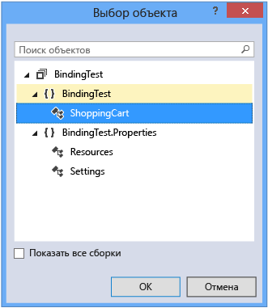

# <a name="walkthrough-binding-to-data-in-xaml-designer"></a>Пошаговое руководство. Привязка к данным в конструкторе XAML
В конструкторе XAML можно задать свойства привязки данных с помощью области рисования и в окне "Свойства". В примере в этом пошаговом руководстве показано, как привязать данные к элементу управления. В частности, это пошаговое руководство показывает, как создать простой класс корзины для покупок, имеющий [DependencyProperty](http://msdn.microsoft.com/library/windows/apps/windows.ui.xaml.dependencyproperty.aspx) с именем `ItemCount`, а затем привязать свойство `ItemCount` к свойству **Text** элемента управления [TextBlock](http://msdn.microsoft.com/library/windows/apps/windows.ui.xaml.controls.textblock.aspx).  
  
### <a name="to-create-a-class-to-use-as-a-data-source"></a>Создание класса для использования в качестве источника данных  
  
1.  В меню **Файл** последовательно выберите пункты **Создать**и **Проект**.  
  
2.  В диалоговом окне **Новый проект** разверните узел **Visual C#** или **Visual Basic**, разверните узел **Классическое приложение Windows** и выберите шаблон **Приложение WPF**.  
  
3.  Укажите **BindingTest** в качестве имени проекта и нажмите кнопку **ОК**.  
  
4.  Откройте файл MainWindow.xaml.cs (или MainWindow.xaml.vb) и добавьте следующий код. В C# добавьте код в пространстве имен `BindingTest` (перед последней закрывающей скобкой в файле). В Visual Basic просто добавьте новый класс.  
  
    ```csharp  
    public class ShoppingCart : DependencyObject  
    {  
        public int ItemCount  
        {  
            get { return (int)GetValue(ItemCountProperty); }  
            set { SetValue(ItemCountProperty, value); }  
        }  
  
        public static readonly DependencyProperty ItemCountProperty =  
             DependencyProperty.Register("ItemCount", typeof(int),  
             typeof(ShoppingCart), new PropertyMetadata(0));  
    }  
  
    ```  
  
    ```vb  
    Public Class ShoppingCart  
        Inherits DependencyObject  
  
        Public Shared ReadOnly ItemCountProperty As DependencyProperty = DependencyProperty.Register(  
            "ItemCount", GetType(Integer), GetType(ShoppingCart), New PropertyMetadata(0))  
        Public Property ItemCount As Integer  
            Get  
                ItemCount = CType(GetValue(ItemCountProperty), Integer)  
            End Get  
            Set(value As Integer)  
                SetValue(ItemCountProperty, value)  
            End Set  
        End Property  
    End Class  
    ```  
  
     Этот код задает значение 0 как число элементов по умолчанию с помощью объекта [PropertyMetadata](http://msdn.microsoft.com/library/windows/apps/windows.ui.xaml.propertymetadata.aspx).  
  
5.  В меню **Файл** выберите **Сборка** и **Построить решение**.  
  
### <a name="to-bind-the-itemcount-property-to-a-textblock-control"></a>Привязка свойства ItemCount к элементу управления TextBlock  
  
1.  В обозревателе решений откройте контекстное меню файла MainWindow.xaml и выберите **Конструктор представлений**.  
  
2.  На панели элементов выберите элемент управления [Grid](http://msdn.microsoft.com/library/windows/apps/windows.ui.xaml.controls.grid.aspx), чтобы добавить его на форму.  
  
3.  Выбрав `Grid`, в окне "Свойства" нажмите кнопку **Создать** рядом со свойством **DataContext**.  
  
4.  В диалоговом окне **Выбор объекта** убедитесь, что флажок **Показать все сборки** снят, выберите **ShoppingCart** в пространстве имен **BindingTest** и нажмите кнопку **ОК**.  
  
     На следующем рисунке показано диалоговое окно **Выбор объекта** с выбранным объектом **ShoppingCart**.  
  
       
  
5.  В **области элементов** выберите элемент управления `TextBlock`, чтобы добавить его на форму.  
  
6.  После выбора элемента управления `TextBlock` в окне "Свойства" выберите метку свойства справа от свойства **Text**, а затем выберите **Создать привязку данных**. (Метка свойства выглядит как небольшой квадрат.)  
  
7.  В диалоговом окне "Создание привязки данных" в поле **Путь** выберите свойство **ItemCount: (int32)** и нажмите кнопку **ОК**.  
  
     На следующем рисунке показано диалоговое окно **Создание привязки данных** с выбранным свойством **ItemCount**.  
  
       
  
8.  Нажмите клавишу F5 для запуска приложения.  
  
     Элемент управления `TextBlock` должен показать значение по умолчанию 0 в виде текста.  
  
## <a name="see-also"></a>См. также  
 [Создание пользовательского интерфейса с помощью Конструктора XAML](../designers/creating-a-ui-by-using-xaml-designer-in-visual-studio.md)   
 [Диалоговое окно "Добавление конвертера значений"](https://msdn.microsoft.com/en-us/c5f3d110-a541-4b55-8bca-928f77778af8)