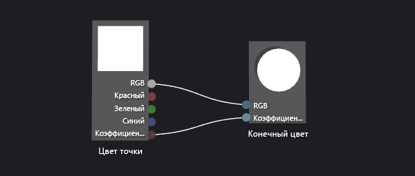
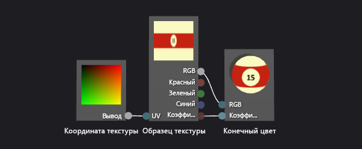
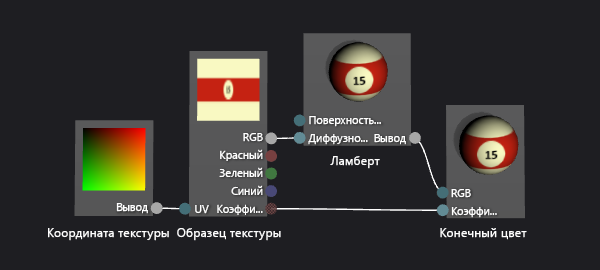
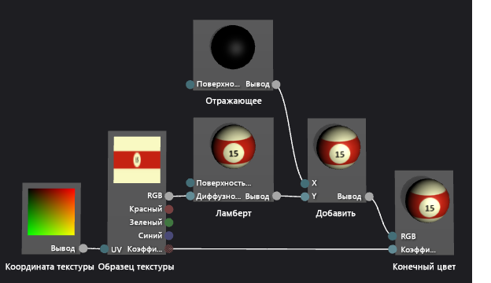
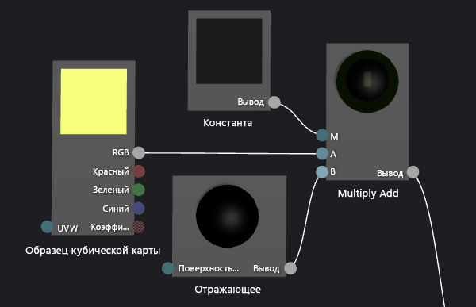
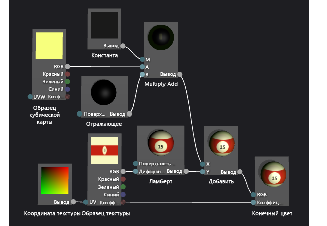

# Пошаговое руководство. Создание реалистичного трехмерного бильярдного шара

В этом пошаговом руководстве демонстрируется создание реалистичного трехмерного бильярдного шара с помощью конструктора шейдеров и редактора изображений в Visual Studio. Объемный внешний вид бильярдного шара достигается за счет сочетания нескольких шейдерных методик с соответствующими текстурными ресурсами.

## Предварительные требования

Для выполнения инструкций данного пошагового руководства необходимы следующие компоненты и навыки.

- Средство сбора текстур в кубические карты, например средство текстуры DirectX, которое включается в DirectX SDK за июнь 2010 г.

- Навыки работы с редактором изображений в Visual Studio.

- Навыки работы с конструктором шейдеров в Visual Studio.

## Создание основного внешнего вида с помощью фигуры и текстуры

В компьютерной графике самыми базовыми элементами внешнего вида являются форма и цвет. В компьютерном моделировании трехмерная модель часто используется для представления формы объекта из реального мира. Затем сведения о цвете применяются к поверхности модели с использованием текстурной карты.

Зачастую может потребоваться попросить художника создать нужную трехмерную модель, но так как шар для бильярда — распространенная форма (сфера), в конструкторе шейдеров уже есть подходящая встроенная модель.

Сфера — фигура предварительного просмотра по умолчанию в конструкторе шейдера; если в настоящий момент используется другая фигура для предварительного просмотра шейдера, вернитесь к сфере.

### Предварительный просмотр шейдера с помощью сферы

- На панели инструментов конструктора шейдера выберите **Просмотр на сфере**.

На следующем этапе создается программа шейдера, применяющая текстуру к модели, но сначала нужно создать текстуру, которую можно использовать. В этом пошаговом руководстве демонстрируется создание текстуры с помощью редактора изображений, который является частью Visual Studio. Однако вы можете использовать любой редактор изображений, который позволяет сохранять текстуры в подходящем формате.

Убедитесь, что отображаются окно **Свойства** и **Панель элементов**.

### Создание текстуры шара для бильярда с помощью редактора изображений

1. Создайте текстуру, с которой вы будете работать. О том, как добавить в проект текстуру, см. в подразделе "Начало работы" раздела [Редактор изображений](../designers/image-editor.md).

2. Измените размер изображения так, чтобы его ширина была в два раза больше высоты; это необходимо из-за того, как текстура проецируется на сферическую поверхность бильярдного шара. Чтобы изменить размер изображения, в окне **Свойства**, задайте новые значения для свойств **Ширина** и **Высота**. Установим ширину равной 512, а высоту — 256.

3. Нарисуйте текстуру для бильярдного шара, помня о том, как текстура накладывается на сферу.

    Текстура должна выглядеть следующим образом.

    

4. При необходимости можно снизить потребности в памяти для этой текстуры. Можно сделать это путем сокращения ширины текстуры, чтобы она совпала с высотой. Это сжимает текстуру по ее ширине, но в связи с тем, как текстура накладывается на сферу, она будет развернута, когда шар отрисовывается. После изменения размера текстура должна выглядеть следующим образом.

    

   Теперь можно создать шейдер, который применяет эту текстуру к модели.

### Создание простейшего шейдера текстуры

1. Создайте построитель текстуры DGSL, с которым вы будете работать. Дополнительные сведения о добавлении шейдера DGSL в проект см. в подразделе "Начало работы" раздела [Конструктор шейдеров](../designers/shader-designer.md).

    По умолчанию граф шейдера выглядит следующим образом.

    

2. Измените шейдер по умолчанию таким образом, чтобы он применял к текущему пикселю значение образца текстуры. Граф шейдера должен выглядеть следующим образом.

    

3. Примените текстуру, созданную в предыдущей процедуре, настроив свойства текстуры. Задайте значение свойства **Текстура** узла **Образец текстуры** равным **Texture1**, а затем укажите файл текстуры с помощью свойства **Имя файла** в группе свойств **Texture1** в том же окне свойств.

   Дополнительные сведения о способах применения текстуры в шейдере см. в разделе [Практическое руководство. Создание простейшего шейдера текстуры](../designers/how-to-create-a-basic-texture-shader.md).

   Теперь бильярдный шар должен выглядеть примерно следующим образом.

   

## Создание глубины с помощью модели освещения Ламберта

Пока что вы создали вполне узнаваемый бильярдный шар. Однако он отображается плоским и неинтересным, больше похожим на мультипликационное изображение бильярдного шара, чем на убедительную точную копию. Плоское представление получается из-за примитивного шейдера, который ведет себя так, как будто каждый пиксель на поверхности бильярдного шара получает одинаковое количество освещения.

В реальной жизни свет самый яркий на поверхностях, напрямую обращенных к источнику света, и менее яркий на поверхностях, расположенных под углом к источнику света. Это происходит потому, что энергия в световых лучах распределяется по наименьшей площади поверхности, когда поверхность обращена непосредственно к источнику света. По мере того как рабочая область отворачивается от источника света, то же самое количество энергии распределяется по все большей области поверхности. Область, обращенная в другую сторону от источника света, не получает световую энергию, поэтому она полностью темная. Эта вариативность в яркости по поверхности объекта — важная визуальная подсказка, которая помогает указать форму объекта; без этого объект кажется плоским.

В компьютерной графике *модели освещения* — это упрощенные, примерные представления сложных световых взаимодействий в реальном мире, используемые для репликации внешнего вида осветительных систем из реального мира. Модель освещения Ламберта варьирует количество диффузно отраженного света по поверхности объекта, как описано в предыдущем абзаце. Можно добавлять модели освещения Ламберта к шейдеру для придания шару более достоверного объемного внешнего вида.

### Добавление освещения по модели Ламберта к шейдеру

- Измените свой шейдер для модуляции значения образца текстуры с помощью значения освещения по модели Ламберта. Граф шейдера должен выглядеть следующим образом.

   

- При необходимости можно отрегулировать поведение освещения, настроив свойство **MaterialDiffuse** графа шейдера. Для доступа к свойствам графа шейдера выберите пустую область в конструкторе, а затем найдите свойство, которое требуется получить, в окне **Свойства**.

Дополнительные сведения о способах освещения Ламберта в шейдере см. в разделе [Практическое руководство. Создание простейшего шейдера освещения с использованием модели Ламберта](../designers/how-to-create-a-basic-lambert-shader.md).

Если применяется освещение по Ламберту, шар должен выглядеть следующим образом.

## Улучшение основного вида с помощью зеркального отражения

Модель освещения по Ламберту обеспечивает ощущение формы и измерения, которые отсутствовали в шейдере, использующем только текстуру. Однако внешний вид бильярдного шара все еще несколько тускловат.

Реальный бильярдный шар имеет блестящую поверхность, которая отражает часть света, падающего на него. Некоторая часть из этого отраженного света приводит к появлению зеркальных отражений, которые имитируют отражающие свойства поверхности. В зависимости от свойств завершения основные особенности могут быть локализованы или использованы широко, а также могут быть интенсивными или малозаметными. Эти отражения моделируются с помощью связей между источником света, ориентацией рабочей области и положением камеры, то есть подсветка сильнее всего, когда ориентация поверхности отражает источник света непосредственно в камеру, и менее интенсивна, если отражение менее напрямую.

Модель освещения Фонга строится на модели освещения по Ламберту и включает зеркальные отражения, как описано в предыдущем абзаце. Можно добавлять модели освещения Фонга к шейдеру для придания шару глянца и более привлекательного вида.

### Добавление зеркального отражения освещения к шейдеру

1. Измените шейдер для включения в него отражения с помощью аддитивного смешения. Граф шейдера должен выглядеть следующим образом.

    

2. При необходимости можно отрегулировать поведение зеркального отражения, настроив свойства отражения (**MaterialSpecular** и **MaterialSpecularPower**) графа шейдеров. Для доступа к свойствам графа шейдера выберите пустую область в конструкторе, а затем в окне **Свойства** найдите требуемое свойство.

   Дополнительные сведения о способах применения зеркального отражения в шейдере см. в разделе [Практическое руководство. Создание простейшего шейдера освещения по методу Фонга](../designers/how-to-create-a-basic-phong-shader.md).

   Если применяется отражающая подсветка, шар должен выглядеть следующим образом.

   

## Создание чувства пространства путем отражения среды

Когда применяется отражающая подсветка, бильярдный шар выглядит довольно убедительно. Он имеет правильную форму, правильную окраску и правильную отделку. Однако существует еще один метод, который заставит бильярдный шар выглядеть более правдоподобно как часть его среды.

При близком изучении настоящего бильярдного шара можно заметить, что его блестящая поверхность не просто отбрасывает блики, но и слабо отражает мир вокруг него. Можно имитировать это отражение, используя изображение среды как текстуру и объединяя его с собственной текстурой модели, чтобы задать конечный цвет каждого пикселя. В зависимости от требуемого типа завершения можно сочетать большую или меньшую часть текстуры отражения с остальной частью шейдера. Например, шейдер, который моделирует поверхность с сильным отражением, такую как зеркало, может использовать только текстуру отражения, но шейдер, который моделирует менее четкое отражение, такой как находящийся на бильярдном шаре, может сочетать лишь небольшую часть значения текстуры отражения вместе с остальными вычислениями шейдера.

Конечно, отраженное изображение нельзя просто применить к модели так же, как вы применяете карту текстур модели. Если это было сделано, отражение мира должно переместиться с бильярдным шаром, как будто оно к нему приклеено. Поскольку отражение может исходить из любого направления, необходим способ указать значение сопоставления отражения для любого угла и способ сохранения ориентации сопоставления отражения в соответствии с миром. Для удовлетворения этих требований можно воспользоваться особым типом карты текстуры, который называется *кубической картой*, который обеспечивает шесть текстур, упорядоченных таким образом, что они сформируют стороны куба. Изнутри этого куба можно указывать любое направление для обнаружения значения текстуры. Если текстуры на каждой стороне куба содержат изображения среды, можно моделировать любое отражение путем взятия образца с необходимой точки на поверхности куба. Сохраняя куб выровненным относительно мировых координат, можно получить точное отражение среды. Для указания того, где следует брать пробу куба, просто рассчитайте отражение вектора камеры от поверхности объекта, а затем используйте его как координаты трехмерной текстуры. Использование кубических карт таким образом — обычный метод, известный как *сопоставление среды*.

Сопоставление среды обеспечивает эффективное приближение реальных отражений, как это описано в предыдущих абзацах. Можно объединить отражения окружения в шейдер для придания шару сымитированной отделки, что позволит лучше вписать его в сцену.

На первом этапе создается текстура кубической карты. Во многих типах приложений содержимое кубической карты не обязательно должно быть идеальным, чтобы быть эффективным, особенно если отражение является опосредованным или не занимает видного места на экране. Например, многие игры используют предварительно рассчитанные кубические карты для сопоставления среды и используют лишь одну, ближайшую к отражающему объекту, хотя это означает, что это отражение неверно. Даже грубого приближения зачастую достаточно для убедительного эффекта.

### Создание текстур для сопоставления среды с помощью редактора изображений

1. Создайте текстуру, с которой вы будете работать. О том, как добавить в проект текстуру, см. в подразделе "Начало работы" раздела [Редактор изображений](../designers/image-editor.md).

2. Задайте размер изображения, чтобы ширина была равна высоте и по размеру была равна степени 2; это необходимо из-за способа индексации кубической карты. Чтобы изменить размер изображения, в окне **Свойства**, задайте новые значения для свойств **Ширина** и **Высота**. Например, задайте для свойств **Ширина** и **Высота** значение 256.

3. Используйте сплошной цвет для заполнения текстуры. Эта текстура будет низом кубической карты, который соответствует поверхности стола для бильярда. Учитывайте цвет, который вы использовали для следующей текстуры.

4. Создайте вторую текстуру того же размера, что и первая. Эта текстура будет повторена на 4 сторонах кубической карты, которые соответствуют поверхности и сторонам стола для бильярда, и области вокруг него. Нарисуйте поверхность бильярдного стола с помощью этой текстуры, используя тот же цвет, что и в нижней текстуре. Текстура должна выглядеть следующим образом.

    

    Помните, что карта отражения не обязательно должна быть фотореалистичной, чтобы быть эффективной: например, кубическая карта, используемая для создания изображений в этой статье содержит только четыре кармана, а не шесть.

5. Создайте третью текстуру того же размера, что и первые две. Эта текстура будет верхом кубической карты, который соответствует потолку над столом для бильярда. Чтобы сделать эту часть отражения более интересной, можно нарисовать верхний свет, чтобы усилить отражающую подсветку, добавленную к шейдеру в предыдущей процедуре. Текстура должна выглядеть следующим образом.

    

   Теперь, когда вы создали отдельные текстуры для сторон кубической карты, с помощью специального средства их можно собрать в кубическую карту, которую можно будет хранить в одной *DDS*-текстуре. Можно использовать любую программу по желанию, чтобы создать сопоставление куба, если она может сохранять сопоставление куба в формате текстуры DDS. В этом пошаговом руководстве демонстрируется создание текстуры с помощью средства текстуры DirectX, входящего в SDK DirectX от июня 2010 г.

### Сборка кубической карты с помощью средства текстуры DirectX

1. В средстве работы с текстурой DirectX в главном меню выберите **Файл** > **Создать текстуру**. Откроется диалоговое окно **Новая текстура**.

2. В группе **Тип текстуры** выберите текстуру **Кубическая карта**.

3. В группе **Размеры** введите нужное значение в полях **Ширина** и **Высота**, а затем нажмите кнопку **ОК**. Отобразится новый документ текстуры. По умолчанию текстура, которая сначала отображается в документе текстуры, соответствует грани куба **Положительная X**.

4. Загрузите текстуру, созданную для верхней части куба текстуры для поверхности куба. В главном меню выберите **Файл** > **Открыть на эту поверхность кубической карты**, выберите текстуру, созданную для стороны куба, а затем **Открыть**.

5. Повторите шаг 4 для сторон куба **Отрицательная X**, **Положительная Z** и **Отрицательная Z**. Для этого необходимо посмотреть сторону, которую нужно загрузить. Чтобы просмотреть другую сторону сопоставления куба, в главном меню выберите **Вид** > **Сторона кубической карты**, а затем сторону, которую необходимо просмотреть.

6. Для грани куба **Положительная Y** загрузите текстуру, созданную для верхней части текстуры куба.

7. Для грани куба **Отрицательная Y** загрузите текстуру, созданную для нижней части текстуры куба.

8. Сохраните текстуру.

   Представить себе структуру из кубической карты можно следующим образом.

   

   Изображение сверху — это сторона куба, соответствующая положительной грани куба Y (+Y); посередине, слева направо — стороны –X, +Z, +X и –Z; внизу — грань куба –Y.

   Теперь можно изменить шейдер для смешивания образца кубической карты с остальной частью шейдера.

### Добавление сопоставления окружающей среды к шейдеру

1. Измените шейдер для включения в него сопоставления окружающей среды с помощью аддитивного смешения. Граф шейдера должен выглядеть следующим образом.

    

    Обратите внимание, что можно использовать узел **Multiply Add** для упрощения графа шейдера.

    Ниже приводится более подробное представление узлов шейдера, которые реализуют сопоставление среды.

    

2. Примените текстуру, созданную в предыдущей процедуре, настроив свойства текстуры кубической карты. Задайте значение свойства **Текстура** узла **Образец кубической карты** равным **Texture2**, а затем укажите файл текстуры с помощью свойства **Имя файла** в группе свойств **Texture2**.

3. При необходимости можно отрегулировать отражательную способность бильярдного шара, настроив свойство **Вывод** узла **Константа**. Для доступа к свойствам узла выберите его, а затем в окне **Свойства** найдите требуемое свойство.

   Если применяется сопоставление окружающей среды, шар должен выглядеть следующим образом.

   

   На этом последнем рисунке обратите внимание, как добавленные эффекты все вместе позволяют создать выглядящий очень реалистично бильярдный шар. Форма, текстура и освещение создают основной внешний вид трехмерного объекта, а отражающие яркие зоны и отражения делают шар более реалистичным и вписывающимся в окружение.

## См. также раздел

- [Практическое руководство. Экспорт шейдера](../designers/how-to-export-a-shader.md)
- [Практическое руководство. Применение шейдера к трехмерной модели](../designers/how-to-apply-a-shader-to-a-3-d-model.md)
- [Конструктор шейдеров](../designers/shader-designer.md)
- [Image Editor](../designers/image-editor.md)
- [Узлы конструктора шейдеров](../designers/shader-designer-nodes.md)
