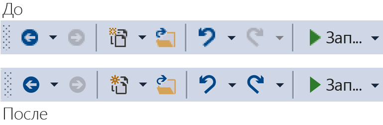

# <a name="image-service-and-catalog"></a>Каталог и служба образов
Это руководство содержит инструкции и рекомендации по внедрению служба изображений Visual Studio и каталог образа, появившихся в Visual Studio 2015.  
  
 Служба образов, появившихся в Visual Studio 2015 позволяет разработчикам быстро рекомендации изображения для устройства и пользователя выбранная тема для отображения изображения, включая правильный темы для контекста, в котором они отображаются. Внедрение службы образов позволит избежать точки большой проблемой, связанные с обслуживание средств, HDPI масштабирование и темы.  
  
|||  
|-|-|  
|**Проблемы уже сегодня**|**Решения**|  
|Наложение цвета фона|Встроенные альфа-смешение|  
|Образы темы (некоторые)|Метаданные темы|  
|Режим высокой контрастности|Альтернативные ресурсы высокой контрастности|  
|Требуется несколько ресурсов для различных способов точек на ДЮЙМ|Доступный для выбора ресурсов с помощью векторной fallback|  
|Повторяющихся изображений|Один идентификатор на концепции образа|  
  
 Преимущества внедрения службы образов?  
  
-   Всегда получите последний образ «идеальной» с Visual Studio  
  
-   Вы можете отправить и использовании своих образов  
  
-   Не нужно проверять свои образы, когда Windows добавляет новый масштабирование  
  
-   Адрес старого архитектуры препятствий в реализации  
  
 Панели инструментов Visual Studio shell до и после использования службы образов:  
  
   
  
## <a name="how-it-works"></a>Принцип работы
 Служба образов можно указать растровый рисунок подходит для любой поддерживаемой платформы пользовательского интерфейса:  
  
-   WPF: BitmapSource  
  
-   WinForms: System.Drawing.Bitmap  
  
-   Win32: HBITMAP  
  
 Схема потока службы изображений  
  
   
  
 **Моникеры образа**  
  
 Моникер изображения (или моникер для краткости) представляет собой пару GUID и идентификатора, уникально определяющая изображение ресурса или ресурса списка изображения из библиотеки образов.  
  
 **Известные моникеры**  
  
 Набор моникеры образа, содержащихся в каталог образа Visual Studio и публично потребляемых любой компонент Visual Studio или расширения.  
  
 **Файлы манифеста изображения**  
  
 Манифест изображения (*.imagemanifest*) файлы — это файлы XML, которые определяют набор графических ресурсов, псевдонимы, представляют собой эти ресурсы и реального изображения или изображения, представляющие каждого ресурса. Манифестов изображений можно определить автономные изображения или списки изображений для поддержки устаревшего кода пользовательского интерфейса. Кроме того существуют атрибуты, которые можно задать на ресурс или на отдельных изображений за каждый актив, чтобы изменить время и способ отображения этих ресурсов.  
  
 **Схема манифеста изображения**  
  
 Завершения создания образа манифеста выглядит следующим образом:  
  
```xml  
<ImageManifest>  
      <!-- zero or one Symbols elements -->  
      <Symbols>  
        <!-- zero or more Import, Guid, ID, or String elements -->  
      </Symbols>  
      <!-- zero or one Images elements -->  
      <Images>  
        <!-- zero or more Image elements -->  
      </Images>  
      <!-- zero or one ImageLists elements -->  
      <ImageLists>  
        <!-- zero or more ImageList elements -->  
      </ImageLists>  
</ImageManifest>  
```  
  
 **Символы**  
  
 Как обеспечить читаемость и обслуживания, манифест изображения можно использовать символы для значений атрибутов. Символы, которые определены следующим образом:  
  
```xml  
<Symbols>  
      <Import Manifest="manifest" />  
      <Guid Name="ShellCommandGuid" Value="8ee4f65d-bab4-4cde-b8e7-ac412abbda8a" />  
      <ID Name="cmdidSaveAll" Value="1000" />  
      <String Name="AssemblyName" Value="Microsoft.VisualStudio.Shell.UI.Internal" />  
</Symbols>  
```  
  
|||  
|-|-|  
|**Дочерний элемент**|**Определение**|  
|Импорт|Импортирует символов из заданного файла манифеста для использования в текущий манифест|  
|Guid|Символ представляет собой идентификатор GUID и должно соответствовать форматирование GUID|  
|ID|Символ представляет идентификатор и должно быть неотрицательное целое число|  
|String|Символ представляет произвольное строковое значение|  
  
 Символы, с учетом регистра и с помощью синтаксиса $(symbol-name) упоминаемого:  
  
```xml  
<Image Guid="$(ShellCommandGuid)" ID="$(cmdidSaveAll)" >  
      <Source Uri="/$(AssemblyName);Component/Resources/image.xaml" />  
</Image>  
```  
  
 Некоторые символы предопределены для всех манифестах. Их можно использовать в атрибуте Uri \<источника > или \<импорта > элемент для пути для ссылок на локальном компьютере.  
  
|||  
|-|-|  
|**Символ**|**Описание**|  
|CommonProgramFiles|Значение переменной среды % CommonProgramFiles %|  
|LocalAppData|Значение переменной среды % LocalAppData %|  
|ManifestFolder|В папку, содержащую файл манифеста|  
|Мои документы|Полный путь к папке «Мои документы» текущего пользователя|  
|ProgramFiles|Значение переменной среды % ProgramFiles %|  
|Система|*Windows\System32* папки|  
|WinDir|Значение переменной среды % WinDir %|  
  
 **Изображение**  
  
 \<Изображение > элемент определяет образ, который позволяет ссылаться на моникер. Идентификатор GUID и идентификатор, в совокупности образуют моникер изображений. Моникер для изображения должно быть уникальным для всего изображения библиотеки. Если более чем один образ данного моникера, первое вхождение при построении библиотеки является тот, который сохраняется.  
  
 Он должен содержать хотя бы один источник. Зависит от размера источников будет выдать наилучшие результаты на широкий диапазон размеров, но они не требуются. Если служба предлагается для изображения, размер, не определенные в \<изображение > элемент и нет зависит от размера источника, служба будет выбрать лучший источник определенного размера и масштабировать его до запрошенного размера.  
  
```xml  
<Image Guid="guid" ID="int" AllowColorInversion="true/false">  
      <Source ... />  
      <!-- optional additional Source elements -->  
</Image>  
```  
  
|||  
|-|-|  
|**Attribute (XElement Dynamic Property)** (Attribute (динамическое свойство XElement))|**Определение**|  
|Guid|[Обязательный параметр] Часть GUID моникер изображений|  
|ID|[Обязательный параметр] Идентификатор часть моникер изображений|  
|AllowColorInversion|[Необязательно, по умолчанию-true] Указывает, может ли изображение иметь цвета программно обращена при использовании на темном фоне.|  
  
 **Источник**  
  
 \<Источника > элемент определяет один исходный ресурс изображения (XAML и PNG).  
  
```xml  
<Source Uri="uri" Background="background">  
      <!-- optional NativeResource element -->  
 </Source>  
```  
  
|||  
|-|-|  
|**Attribute (XElement Dynamic Property)** (Attribute (динамическое свойство XElement))|**Определение**|  
|URI|[Обязательный параметр] URI, который определяет, где можно загрузить изображение из. Он может принимать одно из следующих:<br /><br /> -A [пакет URI](/dotnet/framework/wpf/app-development/pack-uris-in-wpf) в приложении: / / / центра<br />Ссылку на ресурс абсолютный компонента<br />— Путь к файлу, содержащему машинный ресурс|  
|Фон|[Необязательно] Указывает, что на тип фона источник предназначен для использования.<br /><br /> Он может принимать одно из следующих:<br /><br /> *Свет:* источник можно использовать на светлым фоном.<br /><br /> *Темная:* источник можно использовать на темном фоне.<br /><br /> *Высокая контрастность:* источник можно использовать на любой фоне в режиме высокой контрастности.<br /><br /> *HighContrastLight:* источник можно использовать на светло-фоне в режиме высокой контрастности.<br /><br /> *HighContrastDark:* источник можно использовать на темном фоне в режиме высокой контрастности.<br /><br /> Если опустить атрибут фона, источник можно использовать на любой фоне.<br /><br /> Если фон должен *свет*, *темно-*, *HighContrastLight*, или *HighContrastDark*, никогда не инвертирования цветов источника. Если опущен или установлен фоновом режиме *высокой контрастности*, управляет инверсии цветов источника изображения **AllowColorInversion** атрибута.|  

|||  
  
 Объект \<источника > элемент может иметь только один из следующих подэлементов необязательно:  
  
||||  
|-|-|-|  
|**Элемент**|**Атрибуты (все обязательные)**|**Определение**|  
|\<Размер >|Значение|Источник будет использоваться для изображений определенного размера (в единицах устройства). Изображение будет square.|  
|\<SizeRange >|MinSize, MaxSize|Источник будет использован для образов из MinSize MaxSize (в единицах устройства) включительно. Изображение будет square.|  
|\<Измерения >|Ширина, высота|Источник будет использоваться для образов, заданную ширину и высоту (в единицах устройства).|  
|\<DimensionRange >|MinWidth, MinHeight,<br /><br /> MaxWidth, MaxHeight|Источник будет использован для образов из минимальный ширины и высоты в максимальное значение ширины или высоты (в единицах устройства) включительно.|  
  
 Объект \<источника > элемент также может иметь необязательный \<NativeResource > подчиненного элемента, который определяет \<источника >, загруженный из сборки в машинном коде, а не является управляемой сборкой.  
  
```xml  
<NativeResource Type="type" ID="int" />  
```  
  
|||  
|-|-|  
|**Attribute (XElement Dynamic Property)** (Attribute (динамическое свойство XElement))|**Определение**|  
|Тип|[Обязательный параметр] Тип собственного ресурса, XAML или PNG|  
|ID|[Обязательный параметр] Идентификатор целой части машинный ресурс|  
  
 **ImageList**  
  
 \<ImageList > элемент определяет коллекцию изображений, которые могут быть возвращены в одной области. Лента создается по запросу, при необходимости.  
  
```xml  
<ImageList>  
      <ContainedImage Guid="guid" ID="int" External="true/false" />  
      <!-- optional additional ContainedImage elements -->  
 </ImageList>  
```  
  
|||  
|-|-|  
|**Attribute (XElement Dynamic Property)** (Attribute (динамическое свойство XElement))|**Определение**|  
|Guid|[Обязательный параметр] Часть GUID моникер изображений|  
|ID|[Обязательный параметр] Идентификатор часть моникер изображений|  
|Внешняя|[Необязательно, по умолчанию: false] Указывает, ссылается ли моникер изображений на изображение в текущий манифест.|  
  
 Моникер для автономной изображение не поддерживает для ссылки на изображение, определенная в манифесте текущего. Если автономной изображение не удается найти в библиотеке изображений, вместо него будет использоваться изображение-заполнитель пустым.  
  
## <a name="using-the-image-service"></a>С помощью службы образов  
  
### <a name="first-steps-managed"></a>Первые шаги (управляемый код)  
 Чтобы использовать службу образа, необходимо добавить ссылки на некоторые или все следующие сборки в проект:  
  
-   *Microsoft.VisualStudio.ImageCatalog.dll*  
  
    -   Требуется при использовании встроенного изображения каталога **KnownMonikers**.  
  
-   *Microsoft.VisualStudio.Imaging.dll*  
  
    -   Требуется при использовании **CrispImage** и **ImageThemingUtilities** в пользовательский Интерфейс WPF.
  
-   *Microsoft.VisualStudio.Imaging.Interop.14.0.DesignTime.dll*  
  
    -   Требуется при использовании **ImageMoniker** и **ImageAttributes** типов.  
  
    -   **EmbedInteropTypes** должно быть установлено в значение true.  
  
-   *Microsoft.VisualStudio.Shell.Interop.14.0.DesignTime*  
  
    -   Требуется при использовании **IVsImageService2** типа.  
  
    -   **EmbedInteropTypes** должно быть установлено в значение true.  
  
-   *Microsoft.VisualStudio.Utilities.dll*  
  
    -   Требуется при использовании **BrushToColorConverter** для **ImageThemingUtilities.ImageBackgroundColor** в пользовательский Интерфейс WPF.  
  
-   *Microsoft.VisualStudio.Shell. \<VSVersion >.0*  
  
    -   Требуется при использовании **IVsUIObject** типа.  
  
-   *Microsoft.VisualStudio.Shell.Interop.10.0.dll*  
  
    -   Требуется при использовании вспомогательных функций пользовательского интерфейса, связанные с WinForms.  
  
    -   **EmbedInteropTypes** должно быть установлено в значение true  
  
### <a name="first-steps-native"></a>Первые шаги (машинный код)  
 Чтобы использовать службу образа, необходимо включить некоторые или все из следующих заголовков в проект:  
  
-   **KnownImageIds.h**  
  
    -   Требуется при использовании встроенного изображения каталога **KnownMonikers**, но нельзя использовать **ImageMoniker** типа, например когда возвращение значения из **IVsHierarchy GetGuidProperty**или **GetProperty** вызовов.  
  
-   **KnownMonikers.h**  
  
    -   Требуется при использовании встроенного изображения каталога **KnownMonikers**.  
  
-   **ImageParameters140.h**  
  
    -   Требуется при использовании **ImageMoniker** и **ImageAttributes** типов.  
  
-   **VSShell140.h**  
  
    -   Требуется при использовании **IVsImageService2** типа.  
  
-   **ImageThemingUtilities.h**  
  
    -   Требуется, если вы не сможете решения темы для вас службе образа.  
  
    -   Не используйте этот заголовок, если служба образов может обрабатывать ваши тема образа.  
  
-   **VSUIDPIHelper.h**  
  
    -   Требуется, при использовании модулей поддержки DPI для получения текущего значения DPI.  
  
## <a name="how-do-i-write-new-wpf-ui"></a>Как написать новый пользовательский Интерфейс WPF?  
  
1.  Начните с добавления ссылки на сборки, необходимые в указанных выше первые шаги раздела в проект. Не нужно добавить их все, поэтому добавьте только необходимые ссылки. (Примечание: Если вы используете или иметь доступ к **цвета** вместо **кисти**, то можно пропустить ссылку на **служебные программы**, так как преобразователь не требуется.)  
  
2.  Выберите нужный образ и получить его моникер. Используйте **KnownMoniker**, или использовать свои собственные, если у вас есть собственные пользовательские образы и моникеры.  
  
3.  Добавить **CrispImages** для вашей XAML. (См. пример ниже).  
  
4.  Задайте **ImageThemingUtilities.ImageBackgroundColor** свойство в иерархии пользовательского интерфейса. (Это свойство должно быть значение в расположении, где цвет фона известен, не обязательно в **CrispImage**.) (См. пример ниже).  
  
```xaml  
<Window  
  x:Class="WpfApplication.MainWindow"  
  xmlns="http://schemas.microsoft.com/winfx/2006/xaml/presentation"  
  xmlns:x="http://schemas.microsoft.com/winfx/2006/xaml"  
  xmlns:imaging="clr-namespace:Microsoft.VisualStudio.Imaging;assembly=Microsoft.VisualStudio.Imaging"  
  xmlns:theming="clr-namespace:Microsoft.VisualStudio.PlatformUI;assembly=Microsoft.VisualStudio.Imaging"  
  xmlns:utilities="clr-namespace:Microsoft.Internal.VisualStudio.Imaging;assembly=Microsoft.VisualStudio.Imaging"  
  xmlns:catalog="clr-namespace:Microsoft.VisualStudio.Imaging;assembly=Microsoft.VisualStudio.ImageCatalog"  
  Title="MainWindow" Height="350" Width="525" UseLayoutRounding="True">  
  <Window.Resources>  
    <utilities:BrushToColorConverter x:Key="BrushToColorConverter"/>  
  </Window.Resources>  
  <StackPanel Background="White" VerticalAlignment="Center"   
    theming:ImageThemingUtilities.ImageBackgroundColor="{Binding Background, RelativeSource={RelativeSource Self}, Converter={StaticResource BrushToColorConverter}}">  
    <imaging:CrispImage Width="16" Height="16" Moniker="{x:Static catalog:KnownMonikers.MoveUp}" />  
  </StackPanel>  
</Window>  
```  
  
 **Как обновить существующий пользовательский Интерфейс WPF?**  
  
 Обновление существующего пользовательского интерфейса WPF является относительно простой процесс, который состоит из трех основных этапов:  
  
1.  Заменить все \<изображение > элементы пользовательского интерфейса с помощью \<CrispImage > элементы.  
  
2.  Измените все атрибуты источника к атрибутам моникер.  
  
    -   Если изображение никогда не меняется, и вы используете **KnownMonikers**, статически привязать это свойство для **KnownMoniker**. (См. приведенный выше пример).  
  
    -   Если изображение никогда не меняется, и вы используете собственный пользовательский образ, статически связать с собственные моникер.  
  
    -   Если изображение может изменять, привязать атрибут моникер свойству кода, уведомляет об изменениях свойств.  
  
3.  Где-то в иерархии пользовательского интерфейса, задайте **ImageThemingUtilities.ImageBackgroundColor** для убедитесь, что инверсия цветов работает правильно.  
  
    -   Это может потребовать использования **BrushToColorConverter** класса. (См. приведенный выше пример).  
  
## <a name="how-do-i-update-win32-ui"></a>Как обновить пользовательский Интерфейс Win32?  
 Добавьте следующее в код, где это необходимо для замены необработанные загрузку образов. Переключение значений для возвращения HBITMAP и объектами HICON и HIMAGELIST при необходимости.  
  
 **Получить службы образов**  
  
```cpp  
CComPtr<IVsImageService2> spImgSvc;  
CGlobalServiceProvider::HrQueryService(SID_SVsImageService, &spImgSvc);  
```  
  
 **Запрос образа**  
  
```cpp  
ImageAttributes attr = { 0 };  
attr.StructSize      = sizeof(attributes);  
attr.Format          = DF_Win32;  
// IT_Bitmap for HBITMAP, IT_Icon for HICON, IT_ImageList for HIMAGELIST  
attr.ImageType       = IT_Bitmap;  
attr.LogicalWidth    = 16;  
attr.LogicalHeight   = 16;  
attr.Dpi             = VsUI::DpiHelper::GetDeviceDpiX();  
attr.Background      = 0xFFFFFFFF;  
// Desired RGBA color, if you don't use this, don't set IAF_Background below  
attr.Flags           = IAF_RequiredFlags | IAF_Background;  
  
CComPtr<IVsUIObject> spImg;  
// Replace this KnownMoniker with your desired ImageMoniker  
spImgSvc->GetImage(KnownMonikers::Blank, attributes, &spImg);  
  
```  
  
## <a name="how-do-i-update-winforms-ui"></a>Обновление пользовательского интерфейса WinForms  
 Добавьте следующее в код, где это необходимо для замены необработанные загрузку образов. Переключение значений для возвращения точечные рисунки и значки, при необходимости.  
  
 **Информативные, с помощью инструкции**  
  
```csharp  
using GelUtilities = Microsoft.Internal.VisualStudio.PlatformUI.Utilities;  
```  
  
 **Получить службы образов**  
  
```csharp  
// This or your preferred way of querying for Visual Studio services  
IVsImageService2 imageService = (IVsImageService2)Package.GetGlobalService(typeof(SVsImageService));  
  
```  
  
 **Запрос образа**  
  
```csharp  
ImageAttributes attributes = new ImageAttributes  
{  
    StructSize    = Marshal.SizeOf(typeof(ImageAttributes)),  
    // IT_Bitmap for Bitmap, IT_Icon for Icon  
    ImageType     = (uint)_UIImageType.IT_Bitmap,  
    Format        = (uint)_UIDataFormat.DF_WinForms,  
    LogicalWidth  = 16,  
    LogicalHeight = 16,  
    // Desired RGBA color, if you don't use this, don't set IAF_Background below  
    Background    = 0xFFFFFFFF,  
    Flags = (uint)_ImageAttributesFlags.IAF_RequiredFlags | _ImageAttributesFlags.IAF_Background,  
};  
  
// Replace this KnownMoniker with your desired ImageMoniker  
IVsUIObject uIObj = imageService.GetImage(KnownMonikers.Blank, attributes);  
  
Bitmap bitmap = (Bitmap)GelUtilities.GetObjectData(uiObj); // Use this if you need a bitmap  
// Icon icon = (Icon)GelUtilities.GetObjectData(uiObj); // Use this if you need an icon  
  
```  
  
## <a name="how-do-i-use-image-monikers-in-a-new-tool-window"></a>Как использовать моникеры изображения в новом окне средства?  
 Шаблон проекта пакета VSIX был обновлен для Visual Studio 2015. Чтобы создать новое окно инструмента, правой кнопкой мыши проект VSIX и выберите **добавить** > **новый элемент** (**Ctrl**+**Shift** + **Объект**). В узле расширяемости для языка проекта выберите **пользовательского окна инструментов**, предоставить окно инструментов, имя и нажмите клавишу **добавить** кнопки.  
  
 Ниже приведены ключевые разрядов, используемое моникеры в окне инструментов. Следуйте инструкциям для каждого:  
  
1.  Вкладка окна инструментов, когда достаточно небольшой вкладок (также используется в **Ctrl**+**вкладке** окон).  
  
     Добавьте следующую строку в конструктор для класса, производного от **ToolWindowPane** типа:  
  
    ```csharp  
    // Replace this KnownMoniker with your desired ImageMoniker  
    this.BitmapImageMoniker = KnownMonikers.Blank;  
    ```  
  
2.  Команду, чтобы открыть окно инструментов.  
  
     В *.vsct* файл пакета, изменение кнопки окна инструментов:  
  
    ```xml  
    <Button guid="guidPackageCmdSet" id="CommandId" priority="0x0100" type="Button">  
      <Parent guid="guidSHLMainMenu" id="IDG_VS_WNDO_OTRWNDWS1"/>  
      <!-- Replace this KnownMoniker with your desired ImageMoniker -->  
      <Icon guid="ImageCatalogGuid" id="Blank" />  
      <!-- Add this -->  
      <CommandFlag>IconIsMoniker</CommandFlag>  
      <Strings>  
        <ButtonText>MyToolWindow</ButtonText>  
      </Strings>  
    </Button>  
    ```  
  
 **Как использовать образ моникеры в существующее окно средства?**  
  
 Обновление существующее окно инструментов для использования образа моникеры аналогичны шагам, необходимым для создания нового окна инструмента.  
  
 Ниже приведены ключевые разрядов, используемое моникеры в окне инструментов. Следуйте инструкциям для каждого:  
  
1.  Вкладка окна инструментов, когда достаточно небольшой вкладок (также используется в **Ctrl**+**вкладке** окон).  
  
    1.  Удалить эти строки (если они существуют) в конструктор для класса, производного от **ToolWindowPane** типа:  
  
        ```csharp  
        this.BitmapResourceID = <Value>;  
        this.BitmapIndex = <Value>;  
        ```  
  
    2.  См. шаг #1 процедуры «Использование моникеров изображение в новое окно инструмента?» предыдущем разделе.  
  
2.  Команду, чтобы открыть окно инструментов.  
  
    -   Шаг #2 см. в разделе «Использование моникеров изображение в новое окно инструмента?» предыдущем разделе.  
  
## <a name="how-do-i-use-image-monikers-in-a-vsct-file"></a>Как использовать образ моникеры в vsct-файл?  
 Обновление вашей *.vsct* файл обозначенный закомментированных строк ниже:  
  
```xml  
<?xml version="1.0" encoding="utf-8"?>  
<CommandTable xmlns="http://schemas.microsoft.com/VisualStudio/2005-10-18/CommandTable" xmlns:xs="http://www.w3.org/2001/XMLSchema">  
  <!--  Include the definitions for images included in the VS image catalog -->  
  <Include href="KnownImageIds.vsct"/>  
  <Commands package="guidMyPackage">  
    <Buttons>  
      <Button guid="guidMyCommandSet" id="cmdidMyCommand" priority="0x0000" type="Button">  
        <!-- Add an Icon element, changing the attributes to match the image moniker you want to use.  
             In this case, we're using the Guid for the VS image catalog.  
             Change the id attribute to be the ID of the desired image moniker. -->  
        <Icon guid="ImageCatalogGuid" id="OpenFolder" />  
        <CommandFlag>DynamicVisibility</CommandFlag>  
        <CommandFlag>DefaultInvisible</CommandFlag>  
        <CommandFlag>DefaultDisabled</CommandFlag>  
        <CommandFlag>CommandWellOnly</CommandFlag>  
        <CommandFlag>IconAndText</CommandFlag>  
        <!-- Add the IconIsMoniker CommandFlag -->  
        <CommandFlag>IconIsMoniker</CommandFlag>  
        <Strings>  
          <ButtonText>Quick Fixes...</ButtonText>  
          <CommandName>Show Quick Fixes</CommandName>  
          <CanonicalName>ShowQuickFixes</CanonicalName>  
          <LocCanonicalName>ShowQuickFixes</LocCanonicalName>  
        </Strings>  
      </Button>  
    </Buttons>  
  </Commands>  
  <!-- It is recommended that you remove <Bitmap> elements that are no longer used in the vsct file -->  
  <Symbols>  
    <GuidSymbol name="guidMyPackage"    value="{1491e936-6ffe-474e-8371-30e5920d8fdd}" />  
    <GuidSymbol name="guidMyCommandSet" value="{10347de4-69a9-47f4-a950-d3301f6d2bc7}">  
      <IDSymbol name="cmdidMyCommand" value="0x9437" />  
    </GuidSymbol>  
  </Symbols>  
</CommandTable>  
```  
  
 **Что делать, если мой vsct-файл также необходимо прочитать в более ранних версиях Visual Studio?**  
  
 Более ранние версии Visual Studio не распознают **IconIsMoniker** команду флаг. Можно использовать образы из службы образов в версиях Visual Studio, которые поддерживают его, но продолжать использовать старый стиль изображений в предыдущих версиях Visual Studio. Чтобы сделать это, остается *.vsct* файл без изменений (и поэтому совместим с более ранних версиях Visual Studio) и создает файл CSV (значения с разделителями запятыми), которая сопоставляет парах/идентификатор GUID, определенный в *.vsct* файла \<точечные рисунки > элемент к парам/идентификатор GUID моникера образа.  
  
 CSV-файла сопоставления выглядит следующим образом:  
  
```  
Icon guid, Icon id, Moniker guid, Moniker id  
b714fcf7-855e-4e4c-802a-1fd87144ccad,1,fda30684-682d-421c-8be4-650a2967058e,100  
b714fcf7-855e-4e4c-802a-1fd87144ccad,2,fda30684-682d-421c-8be4-650a2967058e,200  
```  
  
 CSV-файл развертывается в составе пакета и его расположение задается **IconMappingFilename** свойство **ProvideMenuResource** атрибут пакета:  
  
```csharp  
[ProvideMenuResource("MyPackage.ctmenu", 1, IconMappingFilename="IconMappings.csv")]  
```  
  
 **IconMappingFilename** относительный путь неявно с корнем в $PackageFolder$ (как в приведенном выше примере), или явно абсолютный путь с корнем в каталог определяется переменной среды, такие как *@ % « UserProfile%\dir1\dir2\MyMappingFile.csv»*.  
  
## <a name="how-do-i-port-a-project-system"></a>Как перенести систему проектов?  
 **Как предоставить ImageMonikers для проекта**  
  
1.  Реализуйте **VSHPROPID_SupportsIconMonikers** в проекте **IVsHierarchy**и возвращает значение true.  
  
2.  Реализуют либо **VSHPROPID_IconMonikerImageList** (если используется исходный проект **VSHPROPID_IconImgList**) или **VSHPROPID_IconMonikerGuid**,  **VSHPROPID_IconMonikerId**, **VSHPROPID_OpenFolderIconMonikerGuid**, **VSHPROPID_OpenFolderIconMonikerId** (если используется исходный проект  **VSHPROPID_IconHandle** и **VSHPROPID_OpenFolderIconHandle**).  
  
3.  Измените реализацию исходного VSHPROPIDs для значков для создания «устаревшего» версий значки в том случае, если точки расширения запрошены. **IVsImageService2** предоставляет функциональные возможности, необходимые для получения этих значков  
  
 **Дополнительные требования для VB / C# разновидности**  
  
 Реализовать только **VSHPROPID_SupportsIconMonikers** при обнаружении, что проект является **внешней flavor**. В противном случае фактический внешний flavor могут не поддерживать моникеры образа на самом деле, и ваш базовый flavor может эффективно «скрыть» настроенные образы.  
  
 **Как использовать образ моникеры в CPS?**  
  
 Задание пользовательских образов в CPS (общая система проектов) можно сделать вручную или с помощью шаблона элемента, входящий в состав пакета SDK расширения системы проекта.  
  
 **Используя пакет SDK для расширения системы проекта**  
  
 Следуйте инструкциям в [предоставить настраиваемые значки для типов проектов и элементов типа](https://github.com/Microsoft/VSProjectSystem/blob/master/doc/scenario/provide_custom_icons_for_the_project_or_item_type.md) настроить образы CPS. Дополнительные сведения о CPS можно найти в [документация по расширяемости система проектов Visual Studio](https://github.com/Microsoft/VSProjectSystem)  
  
 **Вручную использовать ImageMonikers**  
  
1.  Реализуйте и экспортируйте **IProjectTreeModifier** интерфейс в своей системе проектов.  
  
2.  Определить, какие **KnownMoniker** или моникер пользовательский образ, вы хотите использовать.  
  
3.  В **ApplyModifications** метод, выполните следующие где-то в методе перед возвратом нового дерева, аналогичную примере ниже:  
  
    ```csharp  
    // Replace this KnownMoniker with your desired ImageMoniker  
    tree = tree.SetIcon(KnownMonikers.Blank.ToProjectSystemType());  
    ```  
  
4.  Если вы создаете новое дерево, можно задать пользовательские образы, передавая нужные моникеры в NewTree метод, схожий с следующем примере:  
  
    ```csharp  
    // Replace this KnownMoniker with your desired ImageMoniker  
    ProjectImageMoniker icon         = KnownMonikers.FolderClosed.ToProjectSystemType();  
    ProjectImageMoniker expandedIcon = KnownMonikers.FolderOpened.ToProjectSystemType();  
  
    return this.ProjectTreeFactory.Value.NewTree(/*caption*/<value>,  
                                                 /*filePath*/<value>,  
                                                 /*browseObjectProperties*/<value>,  
                                                 icon,  
                                                 expandedIcon);  
    ```  
  
## <a name="how-do-i-convert-from-a-real-image-strip-to-a-moniker-based-image-strip"></a>Преобразование из ленты реального изображения для образов на основе моникера полоса?  
 **Требуется ли поддержка HIMAGELISTs**  
  
 Если группа уже существующих изображений для вашего кода, который требуется обновить для использования службы образов, но вы ограничены API, которые требуют передачи списков изображений, по-прежнему можно получить преимущества службы образов. Чтобы создать полосу изображений на основе моникера, выполните следующие действия, чтобы создать манифест из существующих моникеры.  
  
1.  Запустите **ManifestFromResources** средство, передавая ему набора изображений. Это создаст манифеста для набора.  
  
    -   Рекомендуется: укажите имя не по умолчанию для манифеста, в соответствии с его использования.  
  
2.  Если вы используете только **KnownMonikers**, затем сделайте следующее:  
  
    -   Замените \<образы > раздел манифеста с \<образы / >.  
  
    -   Удалите все идентификаторы subimage (либо действия в \<имя imagestrip > _ ##).  
  
    -   Рекомендуется: переименуйте символ AssetsGuid и символ для полосковой изображения в соответствии с его использования.  
  
    -   Замените каждый **ContainedImage**по GUID с $(ImageCatalogGuid), замените каждый **ContainedImage**его идентификатор с $(\<моникер >) и добавить атрибут внешних = «true» для каждого **ContainedImage**  
  
        -   \<моникер > следует заменить **KnownMoniker** , соответствующий образ, но с «KnownMonikers.» удалить от имени.  
  
    -   Добавьте < импорта Manifest="$(ManifestFolder)\\< dir путь для установки относительно *\>\Microsoft.VisualStudio.ImageCatalog.imagemanifest» /\*> в верхнюю часть \<символы > раздела.  
  
        -   Относительный путь определяется расположение развертывания, определенной во время установки, создания манифеста.  
  
3.  Запустите **ManifestToCode** для создания оболочки так, что существующий код содержит моникер, его можно использовать для запроса службы образов для набора изображений.  
  
    -   Рекомендуется: задайте имена не по умолчанию для оболочки и пространства имен в соответствии с их использования.  
  
4.  Выполните все добавляет, разработки и развертывания и установки и другие изменения кода для работы с систему обслуживания образов и новые файлы.  
  
 Пример манифеста, включая внутренних и внешних изображений, чтобы увидеть, что она должна выглядеть как:  
  
```xml  
<?xml version="1.0"?>  
<ImageManifest  
  xmlns:xsi="http://www.w3.org/2001/XMLSchema-instance"  
  xmlns:xsd="http://www.w3.org/2001/XMLSchema"  
  xmlns="http://schemas.microsoft.com/VisualStudio/ImageManifestSchema/2014">  
  
  <Symbols>  
    <!-- This needs to be the relative path from your manifest to the ImageCatalog's manifest  
         where $(ManifestFolder) is the deployed location of this manifest. -->  
    <Import Manifest="$(ManifestFolder)\<RelPath>\Microsoft.VisualStudio.ImageCatalog.imagemanifest" />  
  
    <String Name="Resources" Value="/My.Assembly.Name;Component/Resources/ImageStrip" />  
    <Guid Name="ImageGuid" Value="{fb41b7ef-6587-480c-aa27-5b559d42cfc9}" />  
    <Guid Name="ImageStripGuid" Value="{9c84a570-d9a7-4052-a340-188fb276f973}" />  
    <ID Name="MyImage_0" Value="100" />  
    <ID Name="MyImage_1" Value="101" />  
    <ID Name="InternalList" Value="1001" />  
    <ID Name="ExternalList" Value="1002" />  
  </Symbols>  
  
  <Images>  
    <Image Guid="$(ImageGuid)" ID="$(MyImage_0)">  
      <Source Uri="$(Resources)/MyImage_0.png">  
        <Size Value="16" />  
      </Source>  
    </Image>  
    <Image Guid="$(ImageGuid)" ID="$(MyImage_1)">  
      <Source Uri="$(Resources)/MyImage_1.png">  
        <Size Value="16" />  
      </Source>  
    </Image>  
  </Images>  
  
  <ImageLists>  
    <ImageList Guid="$(ImageStripGuid)" ID="$(InternalList)">  
      <ContainedImage Guid="$(ImageGuid)" ID="$(MyImage_0)" />  
      <ContainedImage Guid="$(ImageGuid)" ID="$(MyImage_1)" />  
    </ImageList>  
    <ImageList Guid="$(ImageStripGuid)" ID="$(ExternalList)">  
      <ContainedImage Guid="$(ImageCatalogGuid)" ID="$(StatusError)" External="true" />  
      <ContainedImage Guid="$(ImageCatalogGuid)" ID="$(StatusWarning)" External="true" />  
      <ContainedImage Guid="$(ImageCatalogGuid)" ID="$(StatusInformation)" External="true" />  
    </ImageList>  
  </ImageLists>  
  
</ImageManifest>  
```  
  
 **Мне не нужно поддерживать HIMAGELISTs**  
  
1.  Определить набор **KnownMonikers** , соответствует образы для вашей группы изображений, или создать собственные моникеры для изображений в вашей группы изображений.  
  
2.  Обновите любые сопоставление, вы использовали для получения изображения в группы изображений вместо этого использовать специальные имена, требуется индексом.  
  
3.  Обновите код, чтобы использовать службы образов для запроса специальных имен с помощью обновленного сопоставления. (Это может означать обновление для **CrispImages** для управляемого кода, или запрос HBITMAP или объектами HICON из службы образов и передавая их вокруг для машинного кода.)  
  
## <a name="testing-your-images"></a>Тестирование изображения  
 Средство просмотра библиотеки изображений можно использовать для тестирования манифесты изображение, чтобы убедиться в том, что все, что создан правильно. Можно найти средство в [пакет SDK для Visual Studio 2015](visual-studio-sdk.md). Можно найти документацию по этой и других [здесь](http://aka.ms/VSImageThemeTools).  
  
## <a name="additional-resources"></a>Дополнительные ресурсы  
  
### <a name="samples"></a>Примеры  
 Некоторые примеры Visual Studio на сайте GitHub были обновлены для использования служба образов в рамках разных точках расширяемости Visual Studio.  
  
 Проверьте [ http://github.com/Microsoft/VSSDK-Extensibility-Samples ](http://github.com/Microsoft/VSSDK-Extensibility-Samples) для последние примеры.  
  
### <a name="tooling"></a>Инструментарий  
 Набор средств поддержки службы образов в был создан для помощи в создании или обновлении пользовательского интерфейса, который работает со службой образа. Дополнительные сведения о каждом инструменте обратитесь к документации, который поставляется со средствами. Средства являются частью [пакет SDK для Visual Studio 2015.](http://msdn.microsoft.com/library/bb166441.aspx)  
  
 **ManifestFromResources**  
  
 Манифест из ресурсов средство принимает список ресурсов изображений (PNG или XAML) и создает файл манифеста изображения для использовании этих образов с помощью службы образов.  
  
 **ManifestToCode**  
  
 Манифест, чтобы средство кода принимает файл манифеста изображения и создает файл программы-оболочки для ссылки на значения манифеста в коде (C++, C# или VB) или *.vsct* файлов.  
  
 **ImageLibraryViewer**  
  
 Средство просмотра библиотеки изображений можно загрузить манифестов изображений и позволяет пользователю управлять ими таким же образом, что Visual Studio, чтобы убедиться в том, что манифест создан правильно. Пользователь сможет изменить фон, размеры, параметр DPI, высокая контрастность и другие параметры. Также отображает сведения о загрузке для поиска ошибок в манифестах и отображает сведения об источнике для каждого изображения в манифесте.  
  
## <a name="faq"></a>часто задаваемые вопросы  
  
-   Существуют ли зависимые компоненты, которые необходимо включить при загрузке \<Include="Microsoft.VisualStudio.* ссылки. Interop.14.0.DesignTime» / >?  
  
    -   Задать EmbedInteropTypes = «true», на все библиотеки DLL взаимодействия.  
  
-   Как развернуть манифеста изображения с помощью расширения my?  
  
    -   Добавить *.imagemanifest* файл в проект.  
  
    -   Задайте для параметра «Включить в VSIX» значение True.  
  
-   Обновлении системы проекта CPS. Что произошло с **ImageName** и **StockIconService**?  
  
    -   Они были удалены при CPS был обновлен для использования моникеры. Вам больше не нужно вызывать **StockIconService**, просто передайте нужный **KnownMoniker** метод или свойство с помощью **ToProjectSystemType()** метод расширения в Служебные программы CPS. Можно найти сопоставление **ImageName** для **KnownMonikers** ниже:  
  
        |||  
        |-|-|  
        |**ImageName**|**KnownMoniker**|  
        |ImageName.OfflineWebApp|KnownImageIds.Web|  
        |ImageName.WebReferencesFolder|KnownImageIds.Web|  
        |ImageName.OpenReferenceFolder|KnownImageIds.FolderOpened|  
        |ImageName.ReferenceFolder|KnownImageIds.Reference|  
        |ImageName.Reference|KnownImageIds.Reference|  
        |ImageName.SdlWebReference|KnownImageIds.WebReferenceFolder|  
        |ImageName.DiscoWebReference|KnownImageIds.DynamicDiscoveryDocument|  
        |ImageName.Folder|KnownImageIds.FolderClosed|  
        |ImageName.OpenFolder|KnownImageIds.FolderOpened|  
        |ImageName.ExcludedFolder|KnownImageIds.HiddenFolderClosed|  
        |ImageName.OpenExcludedFolder|KnownImageIds.HiddenFolderOpened|  
        |ImageName.ExcludedFile|KnownImageIds.HiddenFile|  
        |ImageName.DependentFile|KnownImageIds.GenerateFile|  
        |ImageName.MissingFile|KnownImageIds.DocumentWarning|  
        |ImageName.WindowsForm|KnownImageIds.WindowsForm|  
        |ImageName.WindowsUserControl|KnownImageIds.UserControl|  
        |ImageName.WindowsComponent|KnownImageIds.ComponentFile|  
        |ImageName.XmlSchema|KnownImageIds.XMLSchema|  
        |ImageName.XmlFile|KnownImageIds.XMLFile|  
        |ImageName.WebForm|KnownImageIds.Web|  
        |ImageName.WebService|KnownImageIds.WebService|  
        |ImageName.WebUserControl|KnownImageIds.WebUserControl|  
        |ImageName.WebCustomUserControl|KnownImageIds.WebCustomControl|  
        |ImageName.AspPage|KnownImageIds.ASPFile|  
        |ImageName.GlobalApplicationClass|KnownImageIds.SettingsFile|  
        |ImageName.WebConfig|KnownImageIds.ConfigurationFile|  
        |ImageName.HtmlPage|KnownImageIds.HTMLFile|  
        |ImageName.StyleSheet|KnownImageIds.StyleSheet|  
        |ImageName.ScriptFile|KnownImageIds.JSScript|  
        |ImageName.TextFile|KnownImageIds.Document|  
        |ImageName.SettingsFile|KnownImageIds.Settings|  
        |ImageName.Resources|KnownImageIds.DocumentGroup|  
        |ImageName.Bitmap|KnownImageIds.Image|  
        |ImageName.Icon|KnownImageIds.IconFile|  
        |ImageName.Image|KnownImageIds.Image|  
        |ImageName.ImageMap|KnownImageIds.ImageMapFile|  
        |ImageName.XWorld|KnownImageIds.XWorldFile|  
        |ImageName.Audio|KnownImageIds.Sound|  
        |ImageName.Video|KnownImageIds.Media|  
        |ImageName.Cab|KnownImageIds.CABProject|  
        |ImageName.Jar|KnownImageIds.JARFile|  
        |ImageName.DataEnvironment|KnownImageIds.DataTable|  
        |ImageName.PreviewFile|KnownImageIds.Report|  
        |ImageName.DanglingReference|KnownImageIds.ReferenceWarning|  
        |ImageName.XsltFile|KnownImageIds.XSLTransform|  
        |ImageName.Cursor|KnownImageIds.CursorFile|  
        |ImageName.AppDesignerFolder|KnownImageIds.Property|  
        |ImageName.Data|KnownImageIds.Database|  
        |ImageName.Application|KnownImageIds.Application|  
        |ImageName.DataSet|KnownImageIds.DatabaseGroup|  
        |ImageName.Pfx|KnownImageIds.Certificate|  
        |ImageName.Snk|KnownImageIds.Rule|  
        |ImageName.VisualBasicProject|KnownImageIds.VBProjectNode|  
        |ImageName.CSharpProject|KnownImageIds.CSProjectNode|  
        |ImageName.Empty|KnownImageIds.Blank|  
        |ImageName.MissingFolder|KnownImageIds.FolderOffline|  
        |ImageName.SharedImportReference|KnownImageIds.SharedProject|  
        |ImageName.SharedProjectCs|KnownImageIds.CSSharedProject|  
        |ImageName.SharedProjectVc|KnownImageIds.CPPSharedProject|  
        |ImageName.SharedProjectJs|KnownImageIds.JSSharedProject|  
        |ImageName.CSharpCodeFile|KnownImageIds.CSFileNode|  
        |ImageName.VisualBasicCodeFile|KnownImageIds.VBFileNode|  
  
    -   Обновлении моего поставщика списка завершения. Что **KnownMonikers** совпадает со старым **StandardGlyphGroup** и **StandardGlyph** значения?  
  
        ||||  
        |-|-|-|  
        |GlyphGroupClass|GlyphItemPublic|ClassPublic|  
        |GlyphGroupClass|GlyphItemInternal|ClassInternal|  
        |GlyphGroupClass|GlyphItemFriend|ClassInternal|  
        |GlyphGroupClass|GlyphItemProtected|ClassProtected|  
        |GlyphGroupClass|GlyphItemPrivate|ClassPrivate|  
        |GlyphGroupClass|GlyphItemShortcut|ClassShortcut|  
        |GlyphGroupConstant|GlyphItemPublic|ClassPublic|  
        |GlyphGroupConstant|GlyphItemInternal|ClassInternal|  
        |GlyphGroupConstant|GlyphItemFriend|ClassInternal|  
        |GlyphGroupConstant|GlyphItemProtected|ClassProtected|  
        |GlyphGroupConstant|GlyphItemPrivate|ClassPrivate|  
        |GlyphGroupConstant|GlyphItemShortcut|ClassShortcut|  
        |GlyphGroupDelegate|GlyphItemPublic|DelegatePublic|  
        |GlyphGroupDelegate|GlyphItemInternal|DelegateInternal|  
        |GlyphGroupDelegate|GlyphItemFriend|DelegateInternal|  
        |GlyphGroupDelegate|GlyphItemProtected|DelegateProtected|  
        |GlyphGroupDelegate|GlyphItemPrivate|DelegatePrivate|  
        |GlyphGroupDelegate|GlyphItemShortcut|DelegateShortcut|  
        |GlyphGroupEnum|GlyphItemPublic|EnumerationPublic|  
        |GlyphGroupEnum|GlyphItemInternal|EnumerationInternal|  
        |GlyphGroupEnum|GlyphItemFriend|EnumerationInternal|  
        |GlyphGroupEnum|GlyphItemProtected|EnumerationProtected|  
        |GlyphGroupEnum|GlyphItemPrivate|EnumerationPrivate|  
        |GlyphGroupEnum|GlyphItemShortcut|EnumerationShortcut|  
        |GlyphGroupEnumMember|GlyphItemPublic|EnumerationMemberPublic|  
        |GlyphGroupEnumMember|GlyphItemInternal|EnumerationMemberInternal|  
        |GlyphGroupEnumMember|GlyphItemFriend|EnumerationMemberInternal|  
        |GlyphGroupEnumMember|GlyphItemProtected|EnumerationMemberProtected|  
        |GlyphGroupEnumMember|GlyphItemPrivate|EnumerationMemberPrivate|  
        |GlyphGroupEnumMember|GlyphItemShortcut|EnumerationMemberShortcut|  
        |GlyphGroupEvent|GlyphItemPublic|EventPublic|  
        |GlyphGroupEvent|GlyphItemInternal|EventInternal|  
        |GlyphGroupEvent|GlyphItemFriend|EventInternal|  
        |GlyphGroupEvent|GlyphItemProtected|EventProtected|  
        |GlyphGroupEvent|GlyphItemPrivate|EventPrivate|  
        |GlyphGroupEvent|GlyphItemShortcut|EventShortcut|  
        |GlyphGroupException|GlyphItemPublic|ExceptionPublic|  
        |GlyphGroupException|GlyphItemInternal|ExceptionInternal|  
        |GlyphGroupException|GlyphItemFriend|ExceptionInternal|  
        |GlyphGroupException|GlyphItemProtected|ExceptionProtected|  
        |GlyphGroupException|GlyphItemPrivate|ExceptionPrivate|  
        |GlyphGroupException|GlyphItemShortcut|ExceptionShortcut|  
        |GlyphGroupField|GlyphItemPublic|FieldPublic|  
        |GlyphGroupField|GlyphItemInternal|FieldInternal|  
        |GlyphGroupField|GlyphItemFriend|FieldInternal|  
        |GlyphGroupField|GlyphItemProtected|FieldProtected|  
        |GlyphGroupField|GlyphItemPrivate|FieldPrivate|  
        |GlyphGroupField|GlyphItemShortcut|FieldShortcut|  
        |GlyphGroupInterface|GlyphItemPublic|InterfacePublic|  
        |GlyphGroupInterface|GlyphItemInternal|InterfaceInternal|  
        |GlyphGroupInterface|GlyphItemFriend|InterfaceInternal|  
        |GlyphGroupInterface|GlyphItemProtected|InterfaceProtected|  
        |GlyphGroupInterface|GlyphItemPrivate|InterfacePrivate|  
        |GlyphGroupInterface|GlyphItemShortcut|InterfaceShortcut|  
        |GlyphGroupMacro|GlyphItemPublic|MacroPublic|  
        |GlyphGroupMacro|GlyphItemInternal|MacroInternal|  
        |GlyphGroupMacro|GlyphItemFriend|MacroInternal|  
        |GlyphGroupMacro|GlyphItemProtected|MacroProtected|  
        |GlyphGroupMacro|GlyphItemPrivate|MacroPrivate|  
        |GlyphGroupMacro|GlyphItemShortcut|MacroShortcut|  
        |GlyphGroupMap|GlyphItemPublic|MapPublic|  
        |GlyphGroupMap|GlyphItemInternal|MapInternal|  
        |GlyphGroupMap|GlyphItemFriend|MapInternal|  
        |GlyphGroupMap|GlyphItemProtected|MapProtected|  
        |GlyphGroupMap|GlyphItemPrivate|MapPrivate|  
        |GlyphGroupMap|GlyphItemShortcut|MapShortcut|  
        |GlyphGroupMapItem|GlyphItemPublic|MapItemPublic|  
        |GlyphGroupMapItem|GlyphItemInternal|MapItemInternal|  
        |GlyphGroupMapItem|GlyphItemFriend|MapItemInternal|  
        |GlyphGroupMapItem|GlyphItemProtected|MapItemProtected|  
        |GlyphGroupMapItem|GlyphItemPrivate|MapItemPrivate|  
        |GlyphGroupMapItem|GlyphItemShortcut|MapItemShortcut|  
        |GlyphGroupMethod|GlyphItemPublic|MethodPublic|  
        |GlyphGroupMethod|GlyphItemInternal|MethodInternal|  
        |GlyphGroupMethod|GlyphItemFriend|MethodInternal|  
        |GlyphGroupMethod|GlyphItemProtected|MethodProtected|  
        |GlyphGroupMethod|GlyphItemPrivate|MethodPrivate|  
        |GlyphGroupMethod|GlyphItemShortcut|MethodShortcut|  
        |GlyphGroupOverload|GlyphItemPublic|MethodPublic|  
        |GlyphGroupOverload|GlyphItemInternal|MethodInternal|  
        |GlyphGroupOverload|GlyphItemFriend|MethodInternal|  
        |GlyphGroupOverload|GlyphItemProtected|MethodProtected|  
        |GlyphGroupOverload|GlyphItemPrivate|MethodPrivate|  
        |GlyphGroupOverload|GlyphItemShortcut|MethodShortcut|  
        |GlyphGroupModule|GlyphItemPublic|ModulePublic|  
        |GlyphGroupModule|GlyphItemInternal|ModuleInternal|  
        |GlyphGroupModule|GlyphItemFriend|ModuleInternal|  
        |GlyphGroupModule|GlyphItemProtected|ModuleProtected|  
        |GlyphGroupModule|GlyphItemPrivate|ModulePrivate|  
        |GlyphGroupModule|GlyphItemShortcut|ModuleShortcut|  
        |GlyphGroupNamespace|GlyphItemPublic|NamespacePublic|  
        |GlyphGroupNamespace|GlyphItemInternal|NamespaceInternal|  
        |GlyphGroupNamespace|GlyphItemFriend|NamespaceInternal|  
        |GlyphGroupNamespace|GlyphItemProtected|NamespaceProtected|  
        |GlyphGroupNamespace|GlyphItemPrivate|NamespacePrivate|  
        |GlyphGroupNamespace|GlyphItemShortcut|NamespaceShortcut|  
        |GlyphGroupOperator|GlyphItemPublic|OperatorPublic|  
        |GlyphGroupOperator|GlyphItemInternal|OperatorInternal|  
        |GlyphGroupOperator|GlyphItemFriend|OperatorInternal|  
        |GlyphGroupOperator|GlyphItemProtected|OperatorProtected|  
        |GlyphGroupOperator|GlyphItemPrivate|OperatorPrivate|  
        |GlyphGroupOperator|GlyphItemShortcut|OperatorShortcut|  
        |GlyphGroupProperty|GlyphItemPublic|PropertyPublic|  
        |GlyphGroupProperty|GlyphItemInternal|PropertyInternal|  
        |GlyphGroupProperty|GlyphItemFriend|PropertyInternal|  
        |GlyphGroupProperty|GlyphItemProtected|PropertyProtected|  
        |GlyphGroupProperty|GlyphItemPrivate|PropertyPrivate|  
        |GlyphGroupProperty|GlyphItemShortcut|PropertyShortcut|  
        |GlyphGroupStruct|GlyphItemPublic|StructurePublic|  
        |GlyphGroupStruct|GlyphItemInternal|StructureInternal|  
        |GlyphGroupStruct|GlyphItemFriend|StructureInternal|  
        |GlyphGroupStruct|GlyphItemProtected|StructureProtected|  
        |GlyphGroupStruct|GlyphItemPrivate|StructurePrivate|  
        |GlyphGroupStruct|GlyphItemShortcut|StructureShortcut|  
        |GlyphGroupTemplate|GlyphItemPublic|TemplatePublic|  
        |GlyphGroupTemplate|GlyphItemInternal|TemplateInternal|  
        |GlyphGroupTemplate|GlyphItemFriend|TemplateInternal|  
        |GlyphGroupTemplate|GlyphItemProtected|TemplateProtected|  
        |GlyphGroupTemplate|GlyphItemPrivate|TemplatePrivate|  
        |GlyphGroupTemplate|GlyphItemShortcut|TemplateShortcut|  
        |GlyphGroupTypedef|GlyphItemPublic|TypeDefinitionPublic|  
        |GlyphGroupTypedef|GlyphItemInternal|TypeDefinitionInternal|  
        |GlyphGroupTypedef|GlyphItemFriend|TypeDefinitionInternal|  
        |GlyphGroupTypedef|GlyphItemProtected|TypeDefinitionProtected|  
        |GlyphGroupTypedef|GlyphItemPrivate|TypeDefinitionPrivate|  
        |GlyphGroupTypedef|GlyphItemShortcut|TypeDefinitionShortcut|  
        |GlyphGroupType|GlyphItemPublic|TypePublic|  
        |GlyphGroupType|GlyphItemInternal|TypeInternal|  
        |GlyphGroupType|GlyphItemFriend|TypeInternal|  
        |GlyphGroupType|GlyphItemProtected|TypeProtected|  
        |GlyphGroupType|GlyphItemPrivate|TypePrivate|  
        |GlyphGroupType|GlyphItemShortcut|TypeShortcut|  
        |GlyphGroupUnion|GlyphItemPublic|UnionPublic|  
        |GlyphGroupUnion|GlyphItemInternal|UnionInternal|  
        |GlyphGroupUnion|GlyphItemFriend|UnionInternal|  
        |GlyphGroupUnion|GlyphItemProtected|UnionProtected|  
        |GlyphGroupUnion|GlyphItemPrivate|UnionPrivate|  
        |GlyphGroupUnion|GlyphItemShortcut|UnionShortcut|  
        |GlyphGroupVariable|GlyphItemPublic|FieldPublic|  
        |GlyphGroupVariable|GlyphItemInternal|FieldInternal|  
        |GlyphGroupVariable|GlyphItemFriend|FieldInternal|  
        |GlyphGroupVariable|GlyphItemProtected|FieldProtected|  
        |GlyphGroupVariable|GlyphItemPrivate|FieldPrivate|  
        |GlyphGroupVariable|GlyphItemShortcut|FieldShortcut|  
        |GlyphGroupValueType|GlyphItemPublic|ValueTypePublic|  
        |GlyphGroupValueType|GlyphItemInternal|ValueTypeInternal|  
        |GlyphGroupValueType|GlyphItemFriend|ValueTypeInternal|  
        |GlyphGroupValueType|GlyphItemProtected|ValueTypeProtected|  
        |GlyphGroupValueType|GlyphItemPrivate|ValueTypePrivate|  
        |GlyphGroupValueType|GlyphItemShortcut|ValueTypeShortcut|  
        |GlyphGroupIntrinsic|GlyphItemPublic|ObjectPublic|  
        |GlyphGroupIntrinsic|GlyphItemInternal|ObjectInternal|  
        |GlyphGroupIntrinsic|GlyphItemFriend|ObjectInternal|  
        |GlyphGroupIntrinsic|GlyphItemProtected|ObjectProtected|  
        |GlyphGroupIntrinsic|GlyphItemPrivate|ObjectPrivate|  
        |GlyphGroupIntrinsic|GlyphItemShortcut|ObjectShortcut|  
        |GlyphGroupJSharpMethod|GlyphItemPublic|MethodPublic|  
        |GlyphGroupJSharpMethod|GlyphItemInternal|MethodInternal|  
        |GlyphGroupJSharpMethod|GlyphItemFriend|MethodInternal|  
        |GlyphGroupJSharpMethod|GlyphItemProtected|MethodProtected|  
        |GlyphGroupJSharpMethod|GlyphItemPrivate|MethodPrivate|  
        |GlyphGroupJSharpMethod|GlyphItemShortcut|MethodShortcut|  
        |GlyphGroupJSharpField|GlyphItemPublic|FieldPublic|  
        |GlyphGroupJSharpField|GlyphItemInternal|FieldInternal|  
        |GlyphGroupJSharpField|GlyphItemFriend|FieldInternal|  
        |GlyphGroupJSharpField|GlyphItemProtected|FieldProtected|  
        |GlyphGroupJSharpField|GlyphItemPrivate|FieldPrivate|  
        |GlyphGroupJSharpField|GlyphItemShortcut|FieldShortcut|  
        |GlyphGroupJSharpClass|GlyphItemPublic|ClassPublic|  
        |GlyphGroupJSharpClass|GlyphItemInternal|ClassInternal|  
        |GlyphGroupJSharpClass|GlyphItemFriend|ClassInternal|  
        |GlyphGroupJSharpClass|GlyphItemProtected|ClassProtected|  
        |GlyphGroupJSharpClass|GlyphItemPrivate|ClassPrivate|  
        |GlyphGroupJSharpClass|GlyphItemShortcut|ClassShortcut|  
        |GlyphGroupJSharpNamespace|GlyphItemPublic|NamespacePublic|  
        |GlyphGroupJSharpNamespace|GlyphItemInternal|NamespaceInternal|  
        |GlyphGroupJSharpNamespace|GlyphItemFriend|NamespaceInternal|  
        |GlyphGroupJSharpNamespace|GlyphItemProtected|NamespaceProtected|  
        |GlyphGroupJSharpNamespace|GlyphItemPrivate|NamespacePrivate|  
        |GlyphGroupJSharpNamespace|GlyphItemShortcut|NamespaceShortcut|  
        |GlyphGroupJSharpInterface|GlyphItemPublic|InterfacePublic|  
        |GlyphGroupJSharpInterface|GlyphItemInternal|InterfaceInternal|  
        |GlyphGroupJSharpInterface|GlyphItemFriend|InterfaceInternal|  
        |GlyphGroupJSharpInterface|GlyphItemProtected|InterfaceProtected|  
        |GlyphGroupJSharpInterface|GlyphItemPrivate|InterfacePrivate|  
        |GlyphGroupJSharpInterface|GlyphItemShortcut|InterfaceShortcut|  
        |GlyphGroupError||StatusError|  
        |GlyphBscFile||ClassFile|  
        |GlyphAssembly||Ссылка|  
        |GlyphLibrary||Библиотека|  
        |GlyphVBProject||VBProjectNode|  
        |GlyphCoolProject||CSProjectNode|  
        |GlyphCppProject||CPPProjectNode|  
        |GlyphDialogId||Диалоговое окно|  
        |GlyphOpenFolder||FolderOpened|  
        |GlyphClosedFolder||FolderClosed|  
        |GlyphArrow||GoToNext|  
        |GlyphCSharpFile||CSFileNode|  
        |GlyphCSharpExpansion||Фрагмент кода|  
        |GlyphKeyword||IntellisenseKeyword|  
        |GlyphInformation||StatusInformation|  
        |GlyphReference||ClassMethodReference|  
        |GlyphRecursion||Рекурсия|  
        |GlyphXmlItem||Тег|  
        |GlyphJSharpProject||Коллекции DocumentCollection|  
        |GlyphJSharpDocument||Document|  
        |GlyphForwardType||GoToNext|  
        |GlyphCallersGraph||Использованием CallTo|  
        |GlyphCallGraph||CallFrom|  
        |GlyphWarning||StatusWarning|  
        |GlyphMaybeReference||QuestionMark|  
        |GlyphMaybeCaller||Использованием CallTo|  
        |GlyphMaybeCall||CallFrom|  
        |GlyphExtensionMethod||ExtensionMethod|  
        |GlyphExtensionMethodInternal||ExtensionMethod|  
        |GlyphExtensionMethodFriend||ExtensionMethod|  
        |GlyphExtensionMethodProtected||ExtensionMethod|  
        |GlyphExtensionMethodPrivate||ExtensionMethod|  
        |GlyphExtensionMethodShortcut||ExtensionMethod|  
        |GlyphXmlAttribute||XmlAttribute|  
        |GlyphXmlChild||XmlElement|  
        |GlyphXmlDescendant||XmlDescendant|  
        |GlyphXmlNamespace||XmlNamespace|  
        |GlyphXmlAttributeQuestion||XmlAttributeLowConfidence|  
        |GlyphXmlAttributeCheck||XmlAttributeHighConfidence|  
        |GlyphXmlChildQuestion||XmlElementLowConfidence|  
        |GlyphXmlChildCheck||XmlElementHighConfidence|  
        |GlyphXmlDescendantQuestion||XmlDescendantLowConfidence|  
        |GlyphXmlDescendantCheck||XmlDescendantHighConfidence|  
        |GlyphCompletionWarning||IntellisenseWarning|