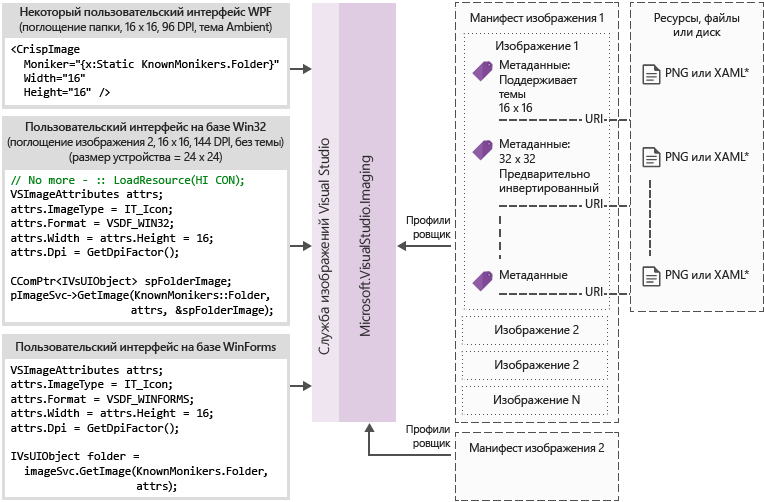

# <a name="image-service-and-catalog"></a>Служба образов и каталог
Этот Cookbook содержит рекомендации и рекомендации по внедрению службы образов Visual Studio и каталога образов, появившихся в Visual Studio 2015.

 Служба образов, появившаяся в Visual Studio 2015, позволяет разработчикам получить лучшие изображения для устройства и выбранную тему пользователя для отображения изображения, включая исправление для контекста, в котором они отображаются. Внедрение службы образов поможет устранить основные моменты, связанные с обслуживанием активов, масштабированием HDPI и ними.

|**Проблемы сегодня**|**Решения**|
|-|-|
|Смешение цветов фона|Встроенное альфа-смешение|
|Их (некоторые) образы|Метаданные темы|
|Режим высокая контрастность|Альтернативные ресурсы высокая контрастность|
|Требуется несколько ресурсов для разных режимов DPI|Выбираемые ресурсы с применением векторной резервной стратегии|
|Дубликаты изображений|Один идентификатор на концепцию образа|

 Зачем применять службу образов?

- Всегда получайте новейшие образы из Visual Studio.

- Вы можете отправлять и использовать собственные образы.

- Нет необходимости тестировать изображения, когда Windows добавляет новое масштабирование DPI

- Устранение старых архитектурных недостатков в реализациях

  Панель инструментов оболочки Visual Studio до и после использования службы изображений:

  

## <a name="how-it-works"></a>Принцип работы
 Служба образов может предоставить точечный рисунок, подходящий для любой поддерживаемой платформы пользовательского интерфейса:

- WPF: пересистема

- WinForms: System. Drawing. Bitmap

- Win32: ХБИТМАП

  Схема потока службы изображений

  

  **Моникеры изображений**

  Моникер образа (или моникер) — это пара GUID/ID, которая однозначно определяет ресурс изображения или ресурс списка изображений в библиотеке изображений.

  **Известные моникеры**

  Набор моникеров образов, содержащихся в каталоге образов Visual Studio и общедоступный для использования любым компонентом или расширением Visual Studio.

  **Файлы манифестов изображений**

  Файлы манифеста образа (*. имажеманифест*) — это XML-файлы, определяющие набор ресурсов изображений, моникеров, представляющих эти ресурсы, а также реальные изображения или изображения, представляющие каждый ресурс. Манифесты изображений могут определять автономные образы или списки изображений для устаревшей поддержки пользовательского интерфейса. Кроме того, существуют атрибуты, которые можно задать для ресурса или отдельных изображений каждого ресурса, чтобы изменить время и способ отображения этих ресурсов.

  **Схема манифеста образа**

  Полный манифест образа выглядит следующим образом:

```xml
<ImageManifest>
      <!-- zero or one Symbols elements -->
      <Symbols>
        <!-- zero or more Import, Guid, ID, or String elements -->
      </Symbols>
      <!-- zero or one Images elements -->
      <Images>
        <!-- zero or more Image elements -->
      </Images>
      <!-- zero or one ImageLists elements -->
      <ImageLists>
        <!-- zero or more ImageList elements -->
      </ImageLists>
</ImageManifest>
```

 **Символы**

 Для удобства чтения и обслуживания манифест образа может использовать символы для значений атрибутов. Символы определяются следующим образом:

```xml
<Symbols>
      <Import Manifest="manifest" />
      <Guid Name="ShellCommandGuid" Value="8ee4f65d-bab4-4cde-b8e7-ac412abbda8a" />
      <ID Name="cmdidSaveAll" Value="1000" />
      <String Name="AssemblyName" Value="Microsoft.VisualStudio.Shell.UI.Internal" />
</Symbols>
```

|**Вложенный элемент**|**Определение**|
|-|-|
|Импорт|Импортирует символы заданного файла манифеста для использования в текущем манифесте|
|Guid|Символ представляет GUID и должен соответствовать форматированию GUID|
|ID|Символ представляет идентификатор и должен быть неотрицательным целым числом|
|Строка|Символ представляет произвольное строковое значение|

 Символы чувствительны к регистру и указываются с помощью синтаксиса $ (symbol-name):

```xml
<Image Guid="$(ShellCommandGuid)" ID="$(cmdidSaveAll)" >
      <Source Uri="/$(AssemblyName);Component/Resources/image.xaml" />
</Image>
```

 Некоторые символы предопределены для всех манифестов. Их можно использовать в атрибуте URI \<Source> \<Import> элемента или для ссылки на пути на локальном компьютере.

|**Символ**|**Описание**|
|-|-|
|CommonProgramFiles|Значение переменной среды% CommonProgramFiles%|
|LocalAppData|Значение переменной среды% LocalAppData%|
|манифестфолдер|Папка, содержащая файл манифеста|
|MyDocuments|Полный путь к папке "Мои документы" текущего пользователя|
|ProgramFiles|Значение переменной окружения% ProgramFiles%|
|система|Папка *Windows\System32*|
|WinDir|Значение переменной среды% WinDir%|

 **Изображение**

 \<Image>Элемент определяет изображение, на которое может ссылаться моникер. Идентификатор GUID и идентификатор, сопринятый вместе, формируют моникер образа. Моникер для образа должен быть уникальным во всей библиотеке изображений. Если в нескольких изображениях имеется заданное специальное имя, то во время сборки библиотеки будет найден первый из них.

 Он должен содержать хотя бы один источник. Источники, не зависящие от размера, дают лучшие результаты в широком диапазоне размеров, но не являются обязательными. Если служба запрашивает изображение размера, не определенного в \<Image> элементе, и нет источника, не зависящего от размера, служба выберет оптимальный источник, относящийся к размеру, и масштабирует его до запрошенного размера.

```xml
<Image Guid="guid" ID="int" AllowColorInversion="true/false">
      <Source ... />
      <!-- optional additional Source elements -->
</Image>
```

|**Attribute**|**Определение**|
|-|-|
|Guid|Необходимости Часть идентификатора GUID моникера образа|
|ID|Необходимости Часть идентификатора моникера образа|
|алловколоринверсион|[Необязательно, по умолчанию true] Указывает, может ли изображение изменяться с помощью программного инвертирования цветов при использовании темного фона.|

 **Источник**

 \<Source>Элемент определяет один исходный ресурс источника изображения (XAML и PNG).

```xml
<Source Uri="uri" Background="background">
      <!-- optional NativeResource element -->
 </Source>
```

|**Attribute**|**Определение**|
|-|-|
|URI|Необходимости URI, который определяет, откуда можно загрузить изображение. Может принимать одно из следующих значений:<br /><br /> — URI типа " [Pack](/dotnet/framework/wpf/app-development/pack-uris-in-wpf) " с помощью центра Application:///.<br />— Абсолютная ссылка на ресурс компонента.<br />— Путь к файлу, содержащему машинный ресурс;|
|Историческая справка|Используемых Указывает, какой тип фона предполагается использовать в качестве источника.<br /><br /> Может принимать одно из следующих значений:<br /><br /> *Источник:* Источник можно использовать на светлом фоне.<br /><br /> *Темный:* Источник можно использовать на темном фоне.<br /><br /> *HighContrast:* Источник можно использовать в любом фоне в режиме высокая контрастность.<br /><br /> *Хигхконтрастлигхт:* Источник можно использовать на светлом фоне в режиме высокая контрастность.<br /><br /> *Хигхконтрастдарк:* Источник можно использовать на темном фоне в режиме высокая контрастность.<br /><br /> Если атрибут Background отсутствует, источник можно использовать в любом фоновом режиме.<br /><br /> Если фон имеет *светлое*, *темное*, *хигхконтрастлигхт* или *хигхконтрастдарк*, цвета источника никогда не переносятся. Если параметр Background опущен или имеет значение *HighContrast*, то Инверсия цветов источника управляется атрибутом **алловколоринверсион** изображения.|

\<Source>Элемент может иметь только один из следующих необязательных вложенных элементов:

|**Элемент**|**Атрибуты (все обязательные)**|**Определение**|
|-|-|-|
|\<Size>|Значение|Источник будет использоваться для изображений заданного размера (в единицах устройства). Изображение будет квадратным.|
|\<SizeRange>|MinSize, MaxSize|Источник будет использоваться для изображений из MinSize в MaxSize (в единицах устройства) включительно. Изображение будет квадратным.|
|\<Dimensions>|Width, Height|Источник будет использоваться для изображений с заданной шириной и высотой (в единицах устройства).|
|\<DimensionRange>|MinWidth, MinHeight,<br /><br /> MaxWidth, MaxHeight|Источник будет использоваться для изображений с минимальной ширины и высоты до максимальной ширины и высоты (в единицах устройства) включительно.|

 \<Source>Элемент также может иметь необязательный вложенный \<NativeResource> элемент, который определяет \<Source> , что загружается из машинной сборки, а не из управляемой сборки.

```xml
<NativeResource Type="type" ID="int" />
```

|**Attribute**|**Определение**|
|-|-|
|Тип|Необходимости Тип машинного ресурса: XAML или PNG|
|ID|Необходимости Часть целочисленного идентификатора машинного ресурса|

 **ImageList**

 \<ImageList>Элемент определяет коллекцию изображений, которые могут возвращаться в одной полосе. При необходимости полоса строится по требованию.

```xml
<ImageList>
      <ContainedImage Guid="guid" ID="int" External="true/false" />
      <!-- optional additional ContainedImage elements -->
 </ImageList>
```

|**Attribute**|**Определение**|
|-|-|
|Guid|Необходимости Часть идентификатора GUID моникера образа|
|ID|Необходимости Часть идентификатора моникера образа|
|External|[Необязательно, по умолчанию false] Указывает, ссылается ли моникер изображения на изображение в текущем манифесте.|

 Моникер для автономного образа не должен ссылаться на образ, определенный в текущем манифесте. Если содержащийся образ не удается найти в библиотеке изображений, вместо него будет использоваться пустое изображение заполнителя.

## <a name="using-the-image-service"></a>Использование службы образов

### <a name="first-steps-managed"></a>Первые шаги (управляемые)
 Чтобы использовать службу образов, необходимо добавить в проект ссылки на некоторые или все следующие сборки:

- *Microsoft.VisualStudio.ImageCatalog.dll*

  - Требуется, если используется встроенный каталог образов **кновнмоникерс**.

- *Microsoft.VisualStudio.Imaging.dll*

  - Требуется, если в пользовательском интерфейсе WPF используются **криспимаже** и **имажесемингутилитиес** .

- *Microsoft.VisualStudio.Imaging.Interop.14.0.DesignTime.dll*

  - Требуется, если используются типы **имажемоникер** и **ImageAttributes** .

  - **Ембединтероптипес** должно иметь значение true.

- *Microsoft. VisualStudio. Shell. Interop. DesignTime*

  - Требуется, если используется тип **IVsImageService2** .

  - **Ембединтероптипес** должно иметь значение true.

- *Microsoft.VisualStudio.Utilities.dll*

  - Требуется, если вы используете **бруштоколорконвертер** для **имажесемингутилитиес. имажебаккграундколор** в пользовательском интерфейсе WPF.

- *Microsoft. VisualStudio. Shell. \<VSVersion> . 0,0*

  - Требуется, если используется тип **IVsUIObject** .

- *Microsoft.VisualStudio.Shell.Interop.10.0.dll*

  - Требуется при использовании вспомогательных функций пользовательского интерфейса, связанных с WinForms.

  - **Ембединтероптипес** должно иметь значение true

### <a name="first-steps-native"></a>Первые шаги (машинный код)
 Чтобы использовать службу образов, необходимо включить в проект некоторые или все следующие заголовки:

- **Кновнимажеидс. h**

  - Требуется, если используется встроенный каталог образов **кновнмоникерс**, но он не может использовать тип **имажемоникер** , например при возврате значений из вызовов **IVsHierarchy жетгуидпроперти** или- **Property** .

- **Кновнмоникерс. h**

  - Требуется, если используется встроенный каталог образов **кновнмоникерс**.

- **ImageParameters140. h**

  - Требуется, если используются типы **имажемоникер** и **ImageAttributes** .

- **VSShell140. h**

  - Требуется, если используется тип **IVsImageService2** .

- **Имажесемингутилитиес. h**

  - Требуется, если не удается разрешить службе образов работать с ними.

  - Не используйте этот заголовок, если служба образов может управлять своими изображениями.

::: moniker range="vs-2017"
- **Всуидпихелпер. h**

  - Требуется при использовании вспомогательных функций DPI для получения текущего DPI.

::: moniker-end

::: moniker range=">=vs-2019"
- **Всдпиаваренесс. h**

  - Требуется, если для получения текущего DPI используются вспомогательные методы определения DPI.

::: moniker-end

## <a name="how-do-i-write-new-wpf-ui"></a>Разделы справки создать новый пользовательский интерфейс WPF?

1. Сначала добавьте ссылки на сборки, необходимые в разделе "первые шаги", в проект. Вам не нужно добавлять все, поэтому нужно добавить только необходимые ссылки. (Примечание. Если вы используете или имеете доступ к **цветам** вместо **кистей**, вы можете пропустить эту ссылку на **Служебные программы**, так как вам не потребуется преобразователь.)

2. Выберите нужное изображение и получите его моникер. Используйте **кновнмоникер** или используйте собственный, если у вас есть собственные пользовательские образы и моникеры.

3. Добавьте **криспимажес** в код XAML. (См. пример ниже.)

4. Задайте свойство **имажесемингутилитиес. имажебаккграундколор** в иерархии пользовательского интерфейса. (Это значение должно быть задано в расположении, где известен цвет фона, но не обязательно на **криспимаже**.) (См. пример ниже.)

```xaml
<Window
  x:Class="WpfApplication.MainWindow"
  xmlns="http://schemas.microsoft.com/winfx/2006/xaml/presentation"
  xmlns:x="http://schemas.microsoft.com/winfx/2006/xaml"
  xmlns:imaging="clr-namespace:Microsoft.VisualStudio.Imaging;assembly=Microsoft.VisualStudio.Imaging"
  xmlns:theming="clr-namespace:Microsoft.VisualStudio.PlatformUI;assembly=Microsoft.VisualStudio.Imaging"
  xmlns:utilities="clr-namespace:Microsoft.Internal.VisualStudio.Imaging;assembly=Microsoft.VisualStudio.Imaging"
  xmlns:catalog="clr-namespace:Microsoft.VisualStudio.Imaging;assembly=Microsoft.VisualStudio.ImageCatalog"
  Title="MainWindow" Height="350" Width="525" UseLayoutRounding="True">
  <Window.Resources>
    <utilities:BrushToColorConverter x:Key="BrushToColorConverter"/>
  </Window.Resources>
  <StackPanel Background="White" VerticalAlignment="Center"
    theming:ImageThemingUtilities.ImageBackgroundColor="{Binding Background, RelativeSource={RelativeSource Self}, Converter={StaticResource BrushToColorConverter}}">
    <imaging:CrispImage Width="16" Height="16" Moniker="{x:Static catalog:KnownMonikers.MoveUp}" />
  </StackPanel>
</Window>
```

 **Разделы справки обновить существующий пользовательский интерфейс WPF?**

 Обновление существующего пользовательского интерфейса WPF является относительно простым процессом, который состоит из трех основных этапов:

1. Замените все \<Image> элементы в пользовательском интерфейсе \<CrispImage> элементами.

2. Измените все атрибуты источника на атрибуты моникера.

    - Если изображение никогда не изменяется и используется **кновнмоникерс**, статически привяжите это свойство к **кновнмоникер**. (См. пример выше.)

    - Если образ никогда не изменится и вы используете собственный пользовательский образ, выполните статическую привязку к своему собственному моникеру.

    - Если изображение может измениться, привяжите атрибут моникер к свойству Code, которое уведомляет об изменениях свойства.

3. Где-то в иерархии пользовательского интерфейса установите **имажесемингутилитиес. имажебаккграундколор** , чтобы убедиться, что Инверсия цветов работает правильно.

    - Это может потребовать использования класса **бруштоколорконвертер** . (См. пример выше.)

## <a name="how-do-i-update-win32-ui"></a>Разделы справки обновить пользовательский интерфейс Win32?
 Добавьте следующее в код в любом месте, где нужно заменить начальную загрузку изображений. При необходимости переключите значения для возврата Хбитмапс и Хиконс по сравнению с ХИМАЖЕЛИСТ.

 **Получение службы образов**

```cpp
CComPtr<IVsImageService2> spImgSvc;
CGlobalServiceProvider::HrQueryService(SID_SVsImageService, &spImgSvc);
```

 **Запрос образа**

::: moniker range="vs-2017"

```cpp
ImageAttributes attr = { 0 };
attr.StructSize      = sizeof(attributes);
attr.Format          = DF_Win32;
// IT_Bitmap for HBITMAP, IT_Icon for HICON, IT_ImageList for HIMAGELIST
attr.ImageType       = IT_Bitmap;
attr.LogicalWidth    = 16;
attr.LogicalHeight   = 16;
attr.Dpi             = VsUI::DpiHelper::GetDeviceDpiX();
// Desired RGBA color, if you don't use this, don't set IAF_Background below
attr.Background      = 0xFFFFFFFF;
attr.Flags           = IAF_RequiredFlags | IAF_Background;

CComPtr<IVsUIObject> spImg;
// Replace this KnownMoniker with your desired ImageMoniker
spImgSvc->GetImage(KnownMonikers::Blank, attributes, &spImg);
```

::: moniker-end

::: moniker range=">=vs-2019"

```cpp
UINT dpiX, dpiY;
HWND hwnd = // get the HWND where the image will be displayed
VsUI::CDpiAwareness::GetDpiForWindow(hwnd, &dpiX, &dpiY);

ImageAttributes attr = { 0 };
attr.StructSize      = sizeof(attributes);
attr.Format          = DF_Win32;
// IT_Bitmap for HBITMAP, IT_Icon for HICON, IT_ImageList for HIMAGELIST
attr.ImageType       = IT_Bitmap;
attr.LogicalWidth    = 16;
attr.LogicalHeight   = 16;
attr.Dpi             = dpiX;
// Desired RGBA color, if you don't use this, don't set IAF_Background below
attr.Background      = 0xFFFFFFFF;
attr.Flags           = IAF_RequiredFlags | IAF_Background;

CComPtr<IVsUIObject> spImg;
// Replace this KnownMoniker with your desired ImageMoniker
spImgSvc->GetImage(KnownMonikers::Blank, attributes, &spImg);
```

::: moniker-end

## <a name="how-do-i-update-winforms-ui"></a>Разделы справки обновить пользовательский интерфейс WinForms?
 Добавьте следующее в код в любом месте, где нужно заменить начальную загрузку изображений. Переключайте значения для возвращения точечных рисунков и значков по мере необходимости.

 **Полезный оператор using**

```csharp
using GelUtilities = Microsoft.Internal.VisualStudio.PlatformUI.Utilities;
```

 **Получение службы образов**

```csharp
// This or your preferred way of querying for Visual Studio services
IVsImageService2 imageService = (IVsImageService2)Package.GetGlobalService(typeof(SVsImageService));

```

 **Запрос образа**

::: moniker range="vs-2017"

```csharp
ImageAttributes attributes = new ImageAttributes
{
    StructSize    = Marshal.SizeOf(typeof(ImageAttributes)),
    // IT_Bitmap for Bitmap, IT_Icon for Icon, IT_ImageList for ImageList
    ImageType     = (uint)_UIImageType.IT_Bitmap,
    Format        = (uint)_UIDataFormat.DF_WinForms,
    LogicalWidth  = 16,
    LogicalHeight = 16,
    Dpi           = (int)DpiHelper.DeviceDpiX;
    // Desired RGBA color, if you don't use this, don't set IAF_Background below
    Background    = 0xFFFFFFFF,
    Flags         = unchecked((uint)_ImageAttributesFlags.IAF_RequiredFlags | _ImageAttributesFlags.IAF_Background),
};

// Replace this KnownMoniker with your desired ImageMoniker
IVsUIObject uIObj = imageService.GetImage(KnownMonikers.Blank, attributes);

Bitmap bitmap = (Bitmap)GelUtilities.GetObjectData(uiObj); // Use this if you need a bitmap
// Icon icon = (Icon)GelUtilities.GetObjectData(uiObj);    // Use this if you need an icon
```

::: moniker-end

::: moniker range=">=vs-2019"

```csharp
Control control = // get the control where the image will be displayed

ImageAttributes attributes = new ImageAttributes
{
    StructSize    = Marshal.SizeOf(typeof(ImageAttributes)),
    // IT_Bitmap for Bitmap, IT_Icon for Icon, IT_ImageList for ImageList
    ImageType     = (uint)_UIImageType.IT_Bitmap,
    Format        = (uint)_UIDataFormat.DF_WinForms,
    LogicalWidth  = 16,
    LogicalHeight = 16,
    Dpi           = (int)DpiAwareness.GetWindowDpi(control.Handle);
    // Desired RGBA color, if you don't use this, don't set IAF_Background below
    Background    = 0xFFFFFFFF,
    Flags         = unchecked((uint)_ImageAttributesFlags.IAF_RequiredFlags | _ImageAttributesFlags.IAF_Background),
};

// Replace this KnownMoniker with your desired ImageMoniker
IVsUIObject uIObj = imageService.GetImage(KnownMonikers.Blank, attributes);

Bitmap bitmap = (Bitmap)GelUtilities.GetObjectData(uiObj); // Use this if you need a bitmap
// Icon icon = (Icon)GelUtilities.GetObjectData(uiObj);    // Use this if you need an icon
```

::: moniker-end

## <a name="how-do-i-use-image-monikers-in-a-new-tool-window"></a>Разделы справки использовать моникеры изображений в новом окне инструментов?
 Шаблон проекта пакета VSIX обновлен для Visual Studio 2015. Чтобы создать новое окно инструментов, щелкните правой кнопкой мыши проект VSIX и выберите команду **Добавить**  >  **новый элемент** (**CTRL** + **SHIFT** + **a**). В узле расширяемость языка проекта выберите **настраиваемое окно инструментов**, укажите имя окна инструментов и нажмите кнопку **Добавить** .

 Это ключевые места для использования моникеров в окне инструментов. Следуйте инструкциям по каждому из них.

1. Вкладка окно инструментов, когда вкладки достаточно малы (также используются в окне переключения **клавиш CTRL** + **Tab** ).

    Добавьте эту строку в конструктор для класса, производного от типа **ToolWindowPane** :

   ```csharp
   // Replace this KnownMoniker with your desired ImageMoniker
   this.BitmapImageMoniker = KnownMonikers.Blank;
   ```

2. Команда для открытия окна инструментов.

    В файле *vsct* для пакета измените командную кнопку окна инструментов:

   ```xml
   <Button guid="guidPackageCmdSet" id="CommandId" priority="0x0100" type="Button">
     <Parent guid="guidSHLMainMenu" id="IDG_VS_WNDO_OTRWNDWS1"/>
     <!-- Replace this KnownMoniker with your desired ImageMoniker -->
     <Icon guid="ImageCatalogGuid" id="Blank" />
     <!-- Add this -->
     <CommandFlag>IconIsMoniker</CommandFlag>
     <Strings>
       <ButtonText>MyToolWindow</ButtonText>
     </Strings>
   </Button>
   ```

   **Разделы справки использовать моникеры изображений в существующем окне инструментов?**

   Обновление существующего окна инструментов для использования моникеров образа аналогично пошаговому созданию нового окна инструментов.

   Это ключевые места для использования моникеров в окне инструментов. Следуйте инструкциям по каждому из них.

3. Вкладка окно инструментов, когда вкладки достаточно малы (также используются в окне переключения **клавиш CTRL** + **Tab** ).

   1. Удалите эти строки (если они существуют) в конструкторе класса, производного от типа **ToolWindowPane** :

       ```csharp
       this.BitmapResourceID = <Value>;
       this.BitmapIndex = <Value>;
       ```

   2. См. шаг #1 из раздела "Разделы справки использовать моникеры изображений в новом окне инструментов". "Как реагировать на критические изменения".

4. Команда для открытия окна инструментов.

   - См. шаг #2 из раздела "Разделы справки использовать моникеры изображений в новом окне инструментов". "Как реагировать на критические изменения".

## <a name="how-do-i-use-image-monikers-in-a-vsct-file"></a>Разделы справки использовать моникеры изображений в vsct-файле?
 Обновите файл *. vsct* , как показано в строках с комментариями ниже:

```xml
<?xml version="1.0" encoding="utf-8"?>
<CommandTable xmlns="http://schemas.microsoft.com/VisualStudio/2005-10-18/CommandTable" xmlns:xs="http://www.w3.org/2001/XMLSchema">
  <!--  Include the definitions for images included in the VS image catalog -->
  <Include href="KnownImageIds.vsct"/>
  <Commands package="guidMyPackage">
    <Buttons>
      <Button guid="guidMyCommandSet" id="cmdidMyCommand" priority="0x0000" type="Button">
        <!-- Add an Icon element, changing the attributes to match the image moniker you want to use.
             In this case, we're using the Guid for the VS image catalog.
             Change the id attribute to be the ID of the desired image moniker. -->
        <Icon guid="ImageCatalogGuid" id="OpenFolder" />
        <CommandFlag>DynamicVisibility</CommandFlag>
        <CommandFlag>DefaultInvisible</CommandFlag>
        <CommandFlag>DefaultDisabled</CommandFlag>
        <CommandFlag>CommandWellOnly</CommandFlag>
        <CommandFlag>IconAndText</CommandFlag>
        <!-- Add the IconIsMoniker CommandFlag -->
        <CommandFlag>IconIsMoniker</CommandFlag>
        <Strings>
          <ButtonText>Quick Fixes...</ButtonText>
          <CommandName>Show Quick Fixes</CommandName>
          <CanonicalName>ShowQuickFixes</CanonicalName>
          <LocCanonicalName>ShowQuickFixes</LocCanonicalName>
        </Strings>
      </Button>
    </Buttons>
  </Commands>
  <!-- It is recommended that you remove <Bitmap> elements that are no longer used in the vsct file -->
  <Symbols>
    <GuidSymbol name="guidMyPackage"    value="{1491e936-6ffe-474e-8371-30e5920d8fdd}" />
    <GuidSymbol name="guidMyCommandSet" value="{10347de4-69a9-47f4-a950-d3301f6d2bc7}">
      <IDSymbol name="cmdidMyCommand" value="0x9437" />
    </GuidSymbol>
  </Symbols>
</CommandTable>
```

 **Что делать, если файл My. vsct также требуется считывать в более старых версиях Visual Studio?**

 Более старые версии Visual Studio не распознают флаг команды **иконисмоникер** . Вы можете использовать образы из службы образов в поддерживаемых версиях Visual Studio, но продолжать использовать образы старого типа в более старых версиях Visual Studio. Для этого необходимо оставить файл *. vsct* без изменений (и, следовательно, совместимый с более старыми версиями Visual Studio) и создать файл CSV (с разделителями-запятыми), сопоставляемый с парами GUID/ID, определенными в элементе *vsct* -файла, \<Bitmaps> в пары идентификаторов GUID и ID моникера изображения.

 Формат CSV-файла сопоставления:

```
Icon guid, Icon id, Moniker guid, Moniker id
b714fcf7-855e-4e4c-802a-1fd87144ccad,1,fda30684-682d-421c-8be4-650a2967058e,100
b714fcf7-855e-4e4c-802a-1fd87144ccad,2,fda30684-682d-421c-8be4-650a2967058e,200
```

 CSV-файл развертывается вместе с пакетом и его расположение задается свойством **иконмаппингфиленаме** атрибута пакета **провидеменуресаурце** :

```csharp
[ProvideMenuResource("MyPackage.ctmenu", 1, IconMappingFilename="IconMappings.csv")]
```

 **Иконмаппингфиленаме** является либо относительным путем, неявно корнем в $PackageFolder $ (как в примере выше), либо абсолютным путем, явно корневым в каталоге, определенном переменной среды, например *@ "% UserProfile% \dir1\dir2\MyMappingFile.csv"*.

## <a name="how-do-i-port-a-project-system"></a>Разделы справки переносить систему проектов?
 **Как предоставить Имажемоникерс для проекта**

1. Реализуйте **VSHPROPID_SupportsIconMonikers** **IVsHierarchy** проекта и возвращайте значение true.

2. Реализуйте либо **VSHPROPID_IconMonikerImageList** (если исходный проект используется **VSHPROPID_IconImgList**), **либо VSHPROPID_IconMonikerGuid**, **VSHPROPID_IconMonikerId**, **VSHPROPID_OpenFolderIconMonikerGuid**, **VSHPROPID_OpenFolderIconMonikerId** (если исходный проект использовал **VSHPROPID_IconHandle** и **VSHPROPID_OpenFolderIconHandle**).

3. Измените реализацию исходного Вшпропидс для значков, чтобы создать "устаревшие" версии значков, если точки расширения запрашивают их. **IVsImageService2** предоставляет функциональные возможности, необходимые для получения этих значков

   **Дополнительные требования для разновидностей проекта VB/C#**

   Реализуйте только **VSHPROPID_SupportsIconMonikers** , если обнаружите, что проект является самой **внешней разновидностью**. В противном случае фактическая внешний флаг может не поддерживать моникеры изображений в реальности, а базовый вариант может эффективно "скрывать" настроенные образы.

   **Разделы справки использовать моникеры образов в CPS?**

   Настройка пользовательских образов в CPS (общая система проектов) может выполняться вручную или с помощью шаблона элемента, поставляемого с пакетом SDK для расширяемости системы проектов.

   **Использование пакета SDK для расширения системы проекта**

   Следуйте инструкциям в разделе [Указание пользовательских значков для типа или типа элемента проекта](https://github.com/Microsoft/VSProjectSystem/blob/master/doc/scenario/provide_custom_icons_for_the_project_or_item_type.md) , чтобы настроить образы CPS. Дополнительные сведения о CPS можно найти в [документации по расширению системы проектов Visual Studio](https://github.com/Microsoft/VSProjectSystem) .

   **Использование Имажемоникерс вручную**

4. Реализация и экспорт интерфейса **ипрожекттримодифиер** в системе проектов.

5. Определите, какой моникер **кновнмоникер** или пользовательский образ следует использовать.

6. В методе **апплимодификатионс** перед возвратом нового дерева выполните следующие действия в методе, как показано в примере ниже.

   ```csharp
   // Replace this KnownMoniker with your desired ImageMoniker
   tree = tree.SetIcon(KnownMonikers.Blank.ToProjectSystemType());
   ```

7. При создании нового дерева можно задать пользовательские образы, передав нужные моникеры в метод Невтри, как показано в примере ниже:

   ```csharp
   // Replace this KnownMoniker with your desired ImageMoniker
   ProjectImageMoniker icon         = KnownMonikers.FolderClosed.ToProjectSystemType();
   ProjectImageMoniker expandedIcon = KnownMonikers.FolderOpened.ToProjectSystemType();

   return this.ProjectTreeFactory.Value.NewTree(/*caption*/<value>,
                                                /*filePath*/<value>,
                                                /*browseObjectProperties*/<value>,
                                                icon,
                                                expandedIcon);
   ```

## <a name="how-do-i-convert-from-a-real-image-strip-to-a-moniker-based-image-strip"></a>Разделы справки преобразовать реальную ленту изображения в ленту изображений на основе моникера?
 **Мне нужно поддерживать Химажелистс**

 Если для кода, который необходимо обновить для использования службы изображений, уже существует полоса образа, но вы ограничены интерфейсами API, требующими передачи списков изображений, вы все равно можете воспользоваться преимуществами службы образов. Чтобы создать полосу изображений на основе моникера, выполните следующие действия, чтобы создать манифест на основе существующих моникеров.

1. Запустите средство **манифестфромресаурцес** , передав ему ленту с изображением. Будет создан манифест для полосы.

   - Рекомендуется. Укажите для манифеста имя, отличное от имени по умолчанию, в соответствии с его использованием.

2. Если вы используете только **кновнмоникерс**, выполните следующие действия.

   - Замените \<Images> раздел манифеста на \<Images/> .

   - Удалите все идентификаторы подобраза (что угодно с \<imagestrip name> _ # #).

   - Рекомендуется: переименуйте символ Ассетсгуид и ленту изображения в соответствии с его использованием.

   - Замените GUID каждого **контаинедимаже** на $ (имажекаталоггуид), замените идентификатор каждого **контаинедимаже** на $ ( \<moniker> ) и добавьте атрибут External = "true" в каждый **контаинедимаже**

       - \<moniker> следует заменить на **кновнмоникер** , который соответствует образу, но с кновнмоникерс. удаляется из имени.

   - Добавьте <импортировать манифест = "$ (Манифестфолдер) \\<относительный путь установки пути к папке * \> \микрософт.висуалстудио.имажекаталог.имажеманифест"/ \*> в начало \<Symbols> раздела.

       - Относительный путь определяется местом развертывания, определенным в процессе создания манифеста.

3. Запустите средство **манифесттокоде** , чтобы создать оболочки, чтобы существующий код использовал моникер, который можно использовать для запроса к службе изображений для полосы изображений.

   - Рекомендуется: указывать имена оболочек и пространств имен по умолчанию в соответствии с их использованием.

4. Выполните все операции добавления, Настройки разработки и развертывания, а также другие изменения кода для работы со службой образов и новыми файлами.

   Пример манифеста, включающий как внутренние, так и внешние изображения, чтобы увидеть, как это должно выглядеть:

```xml
<?xml version="1.0"?>
<ImageManifest
  xmlns:xsi="http://www.w3.org/2001/XMLSchema-instance"
  xmlns:xsd="http://www.w3.org/2001/XMLSchema"
  xmlns="http://schemas.microsoft.com/VisualStudio/ImageManifestSchema/2014">

  <Symbols>
    <!-- This needs to be the relative path from your manifest to the ImageCatalog's manifest
         where $(ManifestFolder) is the deployed location of this manifest. -->
    <Import Manifest="$(ManifestFolder)\<RelPath>\Microsoft.VisualStudio.ImageCatalog.imagemanifest" />

    <String Name="Resources" Value="/My.Assembly.Name;Component/Resources/ImageStrip" />
    <Guid Name="ImageGuid" Value="{fb41b7ef-6587-480c-aa27-5b559d42cfc9}" />
    <Guid Name="ImageStripGuid" Value="{9c84a570-d9a7-4052-a340-188fb276f973}" />
    <ID Name="MyImage_0" Value="100" />
    <ID Name="MyImage_1" Value="101" />
    <ID Name="InternalList" Value="1001" />
    <ID Name="ExternalList" Value="1002" />
  </Symbols>

  <Images>
    <Image Guid="$(ImageGuid)" ID="$(MyImage_0)">
      <Source Uri="$(Resources)/MyImage_0.png">
        <Size Value="16" />
      </Source>
    </Image>
    <Image Guid="$(ImageGuid)" ID="$(MyImage_1)">
      <Source Uri="$(Resources)/MyImage_1.png">
        <Size Value="16" />
      </Source>
    </Image>
  </Images>

  <ImageLists>
    <ImageList Guid="$(ImageStripGuid)" ID="$(InternalList)">
      <ContainedImage Guid="$(ImageGuid)" ID="$(MyImage_0)" />
      <ContainedImage Guid="$(ImageGuid)" ID="$(MyImage_1)" />
    </ImageList>
    <ImageList Guid="$(ImageStripGuid)" ID="$(ExternalList)">
      <ContainedImage Guid="$(ImageCatalogGuid)" ID="$(StatusError)" External="true" />
      <ContainedImage Guid="$(ImageCatalogGuid)" ID="$(StatusWarning)" External="true" />
      <ContainedImage Guid="$(ImageCatalogGuid)" ID="$(StatusInformation)" External="true" />
    </ImageList>
  </ImageLists>

</ImageManifest>
```

 **Мне не нужно поддерживать Химажелистс**

1. Определите набор **кновнмоникерс** , соответствующих изображениям на ленте изображений, или создайте собственные моникеры для изображений на ленте изображений.

2. Обновите любое сопоставление, которое использовалось для получения изображения по требуемому индексу в полосе изображений, чтобы использовать моникеры.

3. Обновите код, чтобы использовать службу изображений для запроса моникеров через обновленное сопоставление. (Это может означать обновление до **криспимажес** для управляемого кода или запрос Хбитмапс или хиконс из службы образов и их передача для машинного кода.)

## <a name="testing-your-images"></a>Тестирование образов
 Средство просмотра библиотеки изображений можно использовать для тестирования манифестов изображений, чтобы убедиться, что все создано правильно. Это средство можно найти в [пакете SDK для Visual Studio 2015](visual-studio-sdk.md). Документацию по этому средству и другим пользователям можно найти [здесь](./internals/vssdk-utilities.md?view=vs-2015&preserve-view=true).

## <a name="additional-resources"></a>Дополнительные ресурсы

### <a name="samples"></a>Образцы
 Некоторые из примеров Visual Studio на сайте GitHub были обновлены, чтобы продемонстрировать, как использовать службу Image Service как часть различных точек расширения Visual Studio.

 Проверьте [http://github.com/Microsoft/VSSDK-Extensibility-Samples](https://github.com/Microsoft/VSSDK-Extensibility-Samples) наличие последних образцов.

### <a name="tooling"></a>Инструментарий
 Для создания и обновления пользовательского интерфейса, работающего со службой образов, была создана поддержка набора средств поддержки для службы образов. Дополнительные сведения о каждом средстве см. в документации, поставляемой вместе с инструментами. Эти средства входят в состав [пакета SDK для Visual Studio 2015](visual-studio-sdk.md).

 **манифестфромресаурцес**

 Средство Manifest from Resources принимает список ресурсов изображений (PNG или XAML) и создает файл манифеста изображения для использования этих образов со службой изображений.

 **манифесттокоде**

 Средство Manifest to Code принимает файл манифеста изображения и создает файл-оболочку для ссылки на значения манифеста в файлах кода (C++, C# или VB) или *vsct* .

 **имажелибраривиевер**

 Средство просмотра библиотеки изображений может загружать манифесты изображений и позволяет пользователю управлять ими точно так же, как и Visual Studio, чтобы убедиться, что манифест создан правильно. Пользователь может изменять фон, размеры, параметры DPI, высокая контрастность и другие параметры. Он также отображает сведения о загрузке для поиска ошибок в манифестах и отображает сведения об источнике для каждого изображения в манифесте.

## <a name="faq"></a>ВОПРОСЫ И ОТВЕТЫ

- Существуют ли зависимости, которые необходимо включить при загрузке \<Reference Include="Microsoft.VisualStudio.*.Interop.14.0.DesignTime" /> ?

  - Задайте Ембединтероптипес = "true" во всех библиотеках DLL взаимодействия.

- Разделы справки развернуть манифест образа с расширением My?

  - Добавьте в проект файл *. имажеманифест* .

  - Задайте для параметра "включить в VSIX" значение true.

- Я обновляя систему проектов CPS. Что случилось с **imageName** и **стоккиконсервице**?

  - Они были удалены при обновлении сервера публикаций Contribute для использования моникеров. Вам больше не нужно вызывать **стоккиконсервице**. просто передайте нужный **кновнмоникер** методу или свойству с помощью метода расширения **топрожектсистемтипе ()** в служебных программах CPS. Сопоставление из **imageName** с **кновнмоникерс** можно найти ниже:

    |**ImageName**|**кновнмоникер**|
    |-|-|
    |ImageName. Оффлиневебапп|Кновнимажеидс. Web|
    |ImageName. Вебреференцесфолдер|Кновнимажеидс. Web|
    |ImageName. Опенреференцефолдер|Кновнимажеидс. Фолдеропенед|
    |ImageName. Референцефолдер|Кновнимажеидс. Reference|
    |ImageName. Reference|Кновнимажеидс. Reference|
    |ImageName. Сдлвебреференце|Кновнимажеидс. Вебреференцефолдер|
    |ImageName. Дисковебреференце|Кновнимажеидс. Динамикдисковеридокумент|
    |ImageName. папка|Кновнимажеидс. Фолдерклосед|
    |ImageName. Опенфолдер|Кновнимажеидс. Фолдеропенед|
    |ImageName. Ексклудедфолдер|Кновнимажеидс. Хидденфолдерклосед|
    |ImageName. Опенексклудедфолдер|Кновнимажеидс. Хидденфолдеропенед|
    |ImageName. Ексклудедфиле|Кновнимажеидс. Хидденфиле|
    |ImageName. Депендентфиле|Кновнимажеидс. Женератефиле|
    |ImageName. Миссингфиле|KnownImageIds.DocУментварнинг|
    |ImageName. Виндовсформ|Кновнимажеидс. Виндовсформ|
    |ImageName. Виндовсусерконтрол|Кновнимажеидс. UserControl|
    |ImageName. Виндовскомпонент|Кновнимажеидс. Компонентфиле|
    |Схема ImageName.Xml|Схема KnownImageIds.XML|
    |Файл ImageName.Xml|Файл KnownImageIds.XML|
    |ImageName. WebForms|Кновнимажеидс. Web|
    |ImageName. WebService|Кновнимажеидс. WebService|
    |ImageName.|Кновнимажеидс.|
    |ImageName. Вебкустомусерконтрол|Кновнимажеидс. Вебкустомконтрол|
    |ImageName. Асппаже|Кновнимажеидс. Аспфиле|
    |ImageName. Глобалаппликатионкласс|Кновнимажеидс. SettingsFile|
    |ImageName. config|KnownImageIds.ConfigУратионфиле|
    |ImageName.HtmЛпаже|KnownImageIds.HTMLFile|
    |ImageName. StyleSheet|Кновнимажеидс. StyleSheet|
    |ImageName. ScriptFile|Скрипт KnownImageIds.JS|
    |ImageName. TextFile|KnownImageIds.Docумент|
    |ImageName. SettingsFile|Кновнимажеидс. Settings|
    |ImageName. Resources|KnownImageIds.DocУментграуп|
    |ImageName. Bitmap|Кновнимажеидс. Image|
    |ImageName. Icon|Кновнимажеидс. Иконфиле|
    |ImageName. Image|Кновнимажеидс. Image|
    |ImageName. Имажемап|Кновнимажеидс. Имажемапфиле|
    |ImageName. Ксворлд|Кновнимажеидс. Ксворлдфиле|
    |ImageName. Audio|Кновнимажеидс. звук|
    |ImageName. видео|Кновнимажеидс. Media|
    |ImageName.Cab|KnownImageIds.CABпроект|
    |ImageName. jar|Кновнимажеидс. JARFile|
    |Среда ImageName.|Кновнимажеидс. DataTable|
    |ImageName. Превиевфиле|Кновнимажеидс. отчет|
    |ImageName. Данглингреференце|Кновнимажеидс. Референцеварнинг|
    |ImageName. Ксслтфиле|Кновнимажеидс. XSLTransform|
    |ImageName. Cursor|Кновнимажеидс. Курсорфиле|
    |ImageName. Аппдесигнерфолдер|Кновнимажеидс. Property|
    |ImageName. Data|Кновнимажеидс. база данных|
    |ImageName. Application|Кновнимажеидс. Application|
    |ImageName. DataSet|Кновнимажеидс. Датабасеграуп|
    |ImageName. pfx|Кновнимажеидс. Certificate|
    |ImageName. snk|Кновнимажеидс. Rule|
    |ImageName. Висуалбасикпрожект|Кновнимажеидс. Вбпрожектноде|
    |ImageName. Кшарппрожект|Кновнимажеидс. Кспрожектноде|
    |ImageName. Empty|Кновнимажеидс. Blank|
    |ImageName. Миссингфолдер|Кновнимажеидс. Фолдероффлине|
    |ImageName. Шаредимпортреференце|Кновнимажеидс. Шаредпрожект|
    |ImageName. Шаредпрожекткс|Кновнимажеидс. Ксшаредпрожект|
    |ImageName. Шаредпрожектвк|Кновнимажеидс. Кппшаредпрожект|
    |ImageName. Шаредпрожектжс|KnownImageIds.JSШаредпрожект|
    |ImageName. Кшарпкодефиле|Кновнимажеидс. Ксфиленоде|
    |ImageName. Висуалбасиккодефиле|Кновнимажеидс. Вбфиленоде|

  - Я обновляя поставщик списка завершения. Какие **кновнмоникерс** соответствуют старым значениям **стандардглифграуп** и **стандардглиф** ?

    |Имя|Имя|Имя|
    |-|-|-|
    |глифграупкласс|глифитемпублик|класспублик|
    |глифграупкласс|глифитеминтернал|классинтернал|
    |глифграупкласс|глифитемфриенд|классинтернал|
    |глифграупкласс|глифитемпротектед|класспротектед|
    |глифграупкласс|глифитемпривате|класспривате|
    |глифграупкласс|глифитемшорткут|классшорткут|
    |глифграупконстант|глифитемпублик|константпублик|
    |глифграупконстант|глифитеминтернал|константинтернал|
    |глифграупконстант|глифитемфриенд|константинтернал|
    |глифграупконстант|глифитемпротектед|константпротектед|
    |глифграупконстант|глифитемпривате|константпривате|
    |глифграупконстант|глифитемшорткут|константшорткут|
    |глифграупделегате|глифитемпублик|делегатепублик|
    |глифграупделегате|глифитеминтернал|делегатеинтернал|
    |глифграупделегате|глифитемфриенд|делегатеинтернал|
    |глифграупделегате|глифитемпротектед|делегатепротектед|
    |глифграупделегате|глифитемпривате|делегатепривате|
    |глифграупделегате|глифитемшорткут|делегатешорткут|
    |глифграупенум|глифитемпублик|енумератионпублик|
    |глифграупенум|глифитеминтернал|енумератионинтернал|
    |глифграупенум|глифитемфриенд|енумератионинтернал|
    |глифграупенум|глифитемпротектед|енумератионпротектед|
    |глифграупенум|глифитемпривате|енумератионпривате|
    |глифграупенум|глифитемшорткут|енумератионшорткут|
    |глифграупенуммембер|глифитемпублик|енумератионитемпублик|
    |глифграупенуммембер|глифитеминтернал|енумератионитеминтернал|
    |глифграупенуммембер|глифитемфриенд|енумератионитеминтернал|
    |глифграупенуммембер|глифитемпротектед|енумератионитемпротектед|
    |глифграупенуммембер|глифитемпривате|енумератионитемпривате|
    |глифграупенуммембер|глифитемшорткут|енумератионитемшорткут|
    |глифграупевент|глифитемпублик|евентпублик|
    |глифграупевент|глифитеминтернал|евентинтернал|
    |глифграупевент|глифитемфриенд|евентинтернал|
    |глифграупевент|глифитемпротектед|евентпротектед|
    |глифграупевент|глифитемпривате|евентпривате|
    |глифграупевент|глифитемшорткут|евентшорткут|
    |глифграупексцептион|глифитемпублик|ексцептионпублик|
    |глифграупексцептион|глифитеминтернал|ексцептионинтернал|
    |глифграупексцептион|глифитемфриенд|ексцептионинтернал|
    |глифграупексцептион|глифитемпротектед|ексцептионпротектед|
    |глифграупексцептион|глифитемпривате|ексцептионпривате|
    |глифграупексцептион|глифитемшорткут|ексцептионшорткут|
    |глифграупфиелд|глифитемпублик|фиелдпублик|
    |глифграупфиелд|глифитеминтернал|фиелдинтернал|
    |глифграупфиелд|глифитемфриенд|фиелдинтернал|
    |глифграупфиелд|глифитемпротектед|фиелдпротектед|
    |глифграупфиелд|глифитемпривате|фиелдпривате|
    |глифграупфиелд|глифитемшорткут|фиелдшорткут|
    |глифграупинтерфаце|глифитемпублик|интерфацепублик|
    |глифграупинтерфаце|глифитеминтернал|интерфацеинтернал|
    |глифграупинтерфаце|глифитемфриенд|интерфацеинтернал|
    |глифграупинтерфаце|глифитемпротектед|интерфацепротектед|
    |глифграупинтерфаце|глифитемпривате|интерфацепривате|
    |глифграупинтерфаце|глифитемшорткут|интерфацешорткут|
    |глифграупмакро|глифитемпублик|макропублик|
    |глифграупмакро|глифитеминтернал|макроинтернал|
    |глифграупмакро|глифитемфриенд|макроинтернал|
    |глифграупмакро|глифитемпротектед|макропротектед|
    |глифграупмакро|глифитемпривате|макропривате|
    |глифграупмакро|глифитемшорткут|макрошорткут|
    |глифграупмап|глифитемпублик|маппублик|
    |глифграупмап|глифитеминтернал|мапинтернал|
    |глифграупмап|глифитемфриенд|мапинтернал|
    |глифграупмап|глифитемпротектед|маппротектед|
    |глифграупмап|глифитемпривате|маппривате|
    |глифграупмап|глифитемшорткут|мапшорткут|
    |глифграупмапитем|глифитемпублик|мапитемпублик|
    |глифграупмапитем|глифитеминтернал|мапитеминтернал|
    |глифграупмапитем|глифитемфриенд|мапитеминтернал|
    |глифграупмапитем|глифитемпротектед|мапитемпротектед|
    |глифграупмапитем|глифитемпривате|мапитемпривате|
    |глифграупмапитем|глифитемшорткут|мапитемшорткут|
    |глифграупмесод|глифитемпублик|месодпублик|
    |глифграупмесод|глифитеминтернал|месодинтернал|
    |глифграупмесод|глифитемфриенд|месодинтернал|
    |глифграупмесод|глифитемпротектед|MethodProtected|
    |глифграупмесод|глифитемпривате|месодпривате|
    |глифграупмесод|глифитемшорткут|месодшорткут|
    |глифграуповерлоад|глифитемпублик|месодпублик|
    |глифграуповерлоад|глифитеминтернал|месодинтернал|
    |глифграуповерлоад|глифитемфриенд|месодинтернал|
    |глифграуповерлоад|глифитемпротектед|MethodProtected|
    |глифграуповерлоад|глифитемпривате|месодпривате|
    |глифграуповерлоад|глифитемшорткут|месодшорткут|
    |глифграупмодуле|глифитемпублик|модулепублик|
    |глифграупмодуле|глифитеминтернал|модулеинтернал|
    |глифграупмодуле|глифитемфриенд|модулеинтернал|
    |глифграупмодуле|глифитемпротектед|модулепротектед|
    |глифграупмодуле|глифитемпривате|модулепривате|
    |глифграупмодуле|глифитемшорткут|модулешорткут|
    |глифграупнамеспаце|глифитемпублик|намеспацепублик|
    |глифграупнамеспаце|глифитеминтернал|намеспацеинтернал|
    |глифграупнамеспаце|глифитемфриенд|намеспацеинтернал|
    |глифграупнамеспаце|глифитемпротектед|намеспацепротектед|
    |глифграупнамеспаце|глифитемпривате|намеспацепривате|
    |глифграупнамеспаце|глифитемшорткут|намеспацешорткут|
    |глифграупоператор|глифитемпублик|операторпублик|
    |глифграупоператор|глифитеминтернал|операторинтернал|
    |глифграупоператор|глифитемфриенд|операторинтернал|
    |глифграупоператор|глифитемпротектед|операторпротектед|
    |глифграупоператор|глифитемпривате|операторпривате|
    |глифграупоператор|глифитемшорткут|операторшорткут|
    |глифграуппроперти|глифитемпублик|пропертипублик|
    |глифграуппроперти|глифитеминтернал|пропертинтернал|
    |глифграуппроперти|глифитемфриенд|пропертинтернал|
    |глифграуппроперти|глифитемпротектед|пропертипротектед|
    |глифграуппроперти|глифитемпривате|пропертипривате|
    |глифграуппроперти|глифитемшорткут|пропертишорткут|
    |глифграупструкт|глифитемпублик|структурепублик|
    |глифграупструкт|глифитеминтернал|структуреинтернал|
    |глифграупструкт|глифитемфриенд|структуреинтернал|
    |глифграупструкт|глифитемпротектед|структурепротектед|
    |глифграупструкт|глифитемпривате|структурепривате|
    |глифграупструкт|глифитемшорткут|структурешорткут|
    |глифграуптемплате|глифитемпублик|темплатепублик|
    |глифграуптемплате|глифитеминтернал|темплатеинтернал|
    |глифграуптемплате|глифитемфриенд|темплатеинтернал|
    |глифграуптемплате|глифитемпротектед|темплатепротектед|
    |глифграуптемплате|глифитемпривате|темплатепривате|
    |глифграуптемплате|глифитемшорткут|темплатешорткут|
    |глифграуптипедеф|глифитемпублик|типедефинитионпублик|
    |глифграуптипедеф|глифитеминтернал|типедефинитионинтернал|
    |глифграуптипедеф|глифитемфриенд|типедефинитионинтернал|
    |глифграуптипедеф|глифитемпротектед|типедефинитионпротектед|
    |глифграуптипедеф|глифитемпривате|типедефинитионпривате|
    |глифграуптипедеф|глифитемшорткут|типедефинитионшорткут|
    |глифграуптипе|глифитемпублик|типепублик|
    |глифграуптипе|глифитеминтернал|типеинтернал|
    |глифграуптипе|глифитемфриенд|типеинтернал|
    |глифграуптипе|глифитемпротектед|типепротектед|
    |глифграуптипе|глифитемпривате|типепривате|
    |глифграуптипе|глифитемшорткут|типешорткут|
    |глифграупунион|глифитемпублик|унионпублик|
    |глифграупунион|глифитеминтернал|унионинтернал|
    |глифграупунион|глифитемфриенд|унионинтернал|
    |глифграупунион|глифитемпротектед|унионпротектед|
    |глифграупунион|глифитемпривате|унионпривате|
    |глифграупунион|глифитемшорткут|унионшорткут|
    |глифграупвариабле|глифитемпублик|фиелдпублик|
    |глифграупвариабле|глифитеминтернал|фиелдинтернал|
    |глифграупвариабле|глифитемфриенд|фиелдинтернал|
    |глифграупвариабле|глифитемпротектед|фиелдпротектед|
    |глифграупвариабле|глифитемпривате|фиелдпривате|
    |глифграупвариабле|глифитемшорткут|фиелдшорткут|
    |глифграупвалуетипе|глифитемпублик|валуетипепублик|
    |глифграупвалуетипе|глифитеминтернал|валуетипеинтернал|
    |глифграупвалуетипе|глифитемфриенд|валуетипеинтернал|
    |глифграупвалуетипе|глифитемпротектед|валуетипепротектед|
    |глифграупвалуетипе|глифитемпривате|валуетипепривате|
    |глифграупвалуетипе|глифитемшорткут|валуетипешорткут|
    |глифграупинтринсик|глифитемпублик|обжектпублик|
    |глифграупинтринсик|глифитеминтернал|обжектинтернал|
    |глифграупинтринсик|глифитемфриенд|обжектинтернал|
    |глифграупинтринсик|глифитемпротектед|обжектпротектед|
    |глифграупинтринсик|глифитемпривате|обжектпривате|
    |глифграупинтринсик|глифитемшорткут|обжектшорткут|
    |глифграупжшарпмесод|глифитемпублик|месодпублик|
    |глифграупжшарпмесод|глифитеминтернал|месодинтернал|
    |глифграупжшарпмесод|глифитемфриенд|месодинтернал|
    |глифграупжшарпмесод|глифитемпротектед|MethodProtected|
    |глифграупжшарпмесод|глифитемпривате|месодпривате|
    |глифграупжшарпмесод|глифитемшорткут|месодшорткут|
    |глифграупжшарпфиелд|глифитемпублик|фиелдпублик|
    |глифграупжшарпфиелд|глифитеминтернал|фиелдинтернал|
    |глифграупжшарпфиелд|глифитемфриенд|фиелдинтернал|
    |глифграупжшарпфиелд|глифитемпротектед|фиелдпротектед|
    |глифграупжшарпфиелд|глифитемпривате|фиелдпривате|
    |глифграупжшарпфиелд|глифитемшорткут|фиелдшорткут|
    |глифграупжшарпкласс|глифитемпублик|класспублик|
    |глифграупжшарпкласс|глифитеминтернал|классинтернал|
    |глифграупжшарпкласс|глифитемфриенд|классинтернал|
    |глифграупжшарпкласс|глифитемпротектед|класспротектед|
    |глифграупжшарпкласс|глифитемпривате|класспривате|
    |глифграупжшарпкласс|глифитемшорткут|классшорткут|
    |глифграупжшарпнамеспаце|глифитемпублик|намеспацепублик|
    |глифграупжшарпнамеспаце|глифитеминтернал|намеспацеинтернал|
    |глифграупжшарпнамеспаце|глифитемфриенд|намеспацеинтернал|
    |глифграупжшарпнамеспаце|глифитемпротектед|намеспацепротектед|
    |глифграупжшарпнамеспаце|глифитемпривате|намеспацепривате|
    |глифграупжшарпнамеспаце|глифитемшорткут|намеспацешорткут|
    |глифграупжшарпинтерфаце|глифитемпублик|интерфацепублик|
    |глифграупжшарпинтерфаце|глифитеминтернал|интерфацеинтернал|
    |глифграупжшарпинтерфаце|глифитемфриенд|интерфацеинтернал|
    |глифграупжшарпинтерфаце|глифитемпротектед|интерфацепротектед|
    |глифграупжшарпинтерфаце|глифитемпривате|интерфацепривате|
    |глифграупжшарпинтерфаце|глифитемшорткут|интерфацешорткут|
    |глифграуперрор||StatusError|
    |глифбскфиле||классфиле|
    |глифассембли||Справочные сведения|
    |глифлибрари||Библиотека|
    |глифвбпрожект||вбпрожектноде|
    |глифкулпрожект||кспрожектноде|
    |глифкпппрожект||кпппрожектноде|
    |глифдиалогид||Диалог|
    |глифопенфолдер||фолдеропенед|
    |глифклоседфолдер||фолдерклосед|
    |глифарров||готонекст|
    |глифкшарпфиле||ксфиленоде|
    |глифкшарпекспансион||Фрагмент кода|
    |глифкэйворд||интеллисенсекэйворд|
    |глифинформатион||статусинформатион|
    |глифреференце||классмесодреференце|
    |глифрекурсион||Рекурсия|
    |глифксмлитем||Тег|
    |глифжшарппрожект||DocumentCollection|
    |глифжшарпдокумент||Документ|
    |глиффорвардтипе||готонекст|
    |глифкаллерсграф||каллто|
    |глифкаллграф||каллфром|
    |глифварнинг||StatusWarning|
    |глифмайбереференце||куестионмарк|
    |глифмайбекаллер||каллто|
    |глифмайбекалл||каллфром|
    |глифекстенсионмесод||екстенсионмесод|
    |глифекстенсионмесодинтернал||екстенсионмесод|
    |глифекстенсионмесодфриенд||екстенсионмесод|
    |глифекстенсионмесодпротектед||екстенсионмесод|
    |глифекстенсионмесодпривате||екстенсионмесод|
    |глифекстенсионмесодшорткут||екстенсионмесод|
    |глифксмлаттрибуте||XmlAttribute|
    |глифксмлчилд||XmlElement|
    |глифксмлдесцендант||ксмлдесцендант|
    |глифксмлнамеспаце||XmlNamespace|
    |глифксмлаттрибутекуестион||ксмлаттрибутеловконфиденце|
    |глифксмлаттрибутечекк||ксмлаттрибутехигхконфиденце|
    |глифксмлчилдкуестион||ксмлелементловконфиденце|
    |глифксмлчилдчекк||ксмлелеменсигхконфиденце|
    |глифксмлдесценданткуестион||ксмлдесцендантловконфиденце|
    |глифксмлдесцендантчекк||ксмлдесцендансигхконфиденце|
    |глифкомплетионварнинг||интеллисенсеварнинг|
