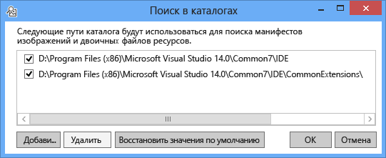
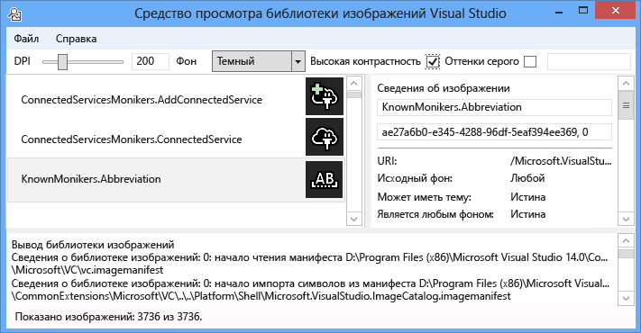
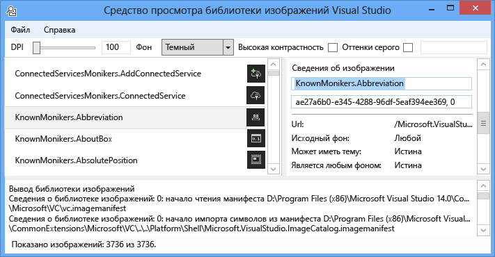
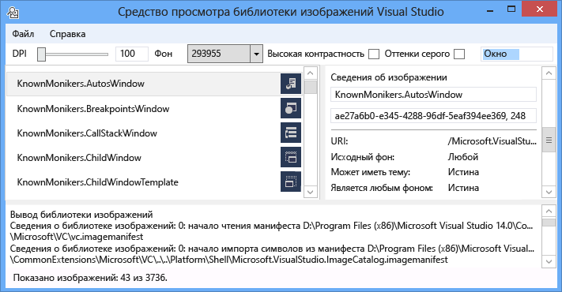
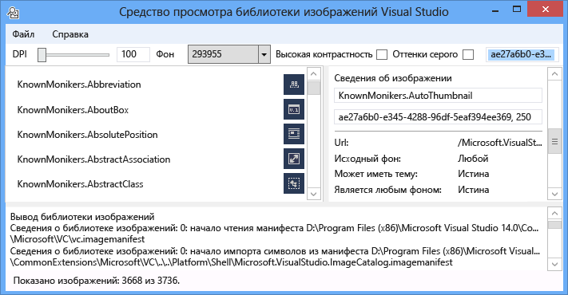
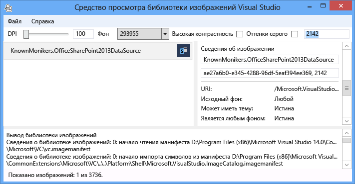

# <a name="image-library-viewer"></a>Средство просмотра библиотеки изображений
Средство просмотра библиотеки изображений Visual Studio можно загрузить и поиска манифестов изображений, чтобы пользователи могли работать с ними таким же образом, что и Visual Studio. Пользователь может изменить фон, размеры, DPI, высокая контрастность и другие параметры. Средство также отображает сведения о загрузке для каждого манифест изображения и сведения об источнике для каждого изображения в манифест изображения. Это средство удобно использовать для:  
  
1.  Диагностика ошибок  
  
2.  Обеспечение атрибуты установлены правильно, в манифестах пользовательского образа  
  
3.  Поиск изображения в каталоге изображений Visual Studio, чтобы расширение Visual Studio можно использовать образы, которые помещаются стиль Visual Studio  
  
   
  
 **Моникер изображения**  
  
 Моникер изображения (или моникера для краткости) представляет собой пару GUID: ID, уникально идентифицирует ресурс изображения или списка ресурса изображения в библиотеке изображений.  
  
 **Файлы манифеста изображения**  
  
 Файлы манифеста (.imagemanifest) изображение, XML-файлы, которые определяют набор ресурсов изображений, моникеров, которые представляют эти ресурсы и реальных изображения или изображения, представляющие каждый актив. Манифестов изображений можно определить автономные изображения или списки изображений для поддержки устаревшего кода пользовательского интерфейса. Кроме того существуют атрибуты, которые могут быть установлены на ресурс или на отдельных изображений за каждый актив Чтобы изменить условия и способ отображения этих ресурсов.  
  
 **Схема манифеста изображения**  
  
 Завершение создания образа манифест выглядит следующим образом:  
  
```xml  
<ImageManifest>  
      <!-- zero or one Symbols elements -->  
      <Symbols>  
        <!-- zero or more Guid, ID, or String elements -->  
      </Symbols>  
      <!-- zero or one Images elements -->  
      <Images>  
        <!-- zero or more Image elements -->  
      </Images>  
      <!-- zero or one ImageLists elements -->  
      <ImageLists>  
        <!-- zero or more ImageList elements -->  
      </ImageLists>  
</ImageManifest>  
```  
  
 **Символы**  
  
 Как помочь читаемость и обслуживание, манифест изображения можно использовать символы для значений атрибутов. Символы, которые определены следующим образом:  
  
```xml  
<Symbols>  
      <Import Manifest="manifest" />  
      <Guid Name="ShellCommandGuid" Value="8ee4f65d-bab4-4cde-b8e7-ac412abbda8a" />  
      <ID Name="cmdidSaveAll" Value="1000" />  
      <String Name="AssemblyName" Value="Microsoft.VisualStudio.Shell.UI.Internal" />  
</Symbols>  
```  
  
|||  
|-|-|  
|**Дочерний элемент**|**Определение**|  
|Импорт|Импортирует символов для заданного файла манифеста для использования в текущий манифест.|  
|Идентификатор GUID|Символ представляет собой идентификатор GUID и должен соответствовать GUID форматирование.|  
|Идентификатор|Символ представляет идентификатор и должно быть неотрицательным целым числом.|  
|Строка|Символ представляет произвольное строковое значение.|  
  
 Символы, с учетом регистра и с использованием синтаксиса $(symbol-name) упоминаемого:  
  
```xml  
<Image Guid="$(ShellCommandGuid)" ID="$(cmdidSaveAll)" >  
      <Source Uri="/$(AssemblyName);Component/Resources/image.xaml" />  
</Image>  
```  
  
 Некоторые символы являются стандартными для всех манифестов. Они используются в атрибуте Uri \<источника > или \<импорта > элемент пути для ссылок на локальном компьютере.  
  
|||  
|-|-|  
|**Символ**|**Описание**|  
|CommonProgramFiles|Значение переменной среды % CommonProgramFiles %|  
|LocalAppData|Значение переменной среды % LocalAppData %|  
|ManifestFolder|Папка, содержащая файл манифеста|  
|Мои документы|Полный путь папки «Мои документы» текущего пользователя|  
|ProgramFiles|Значение переменной среды % ProgramFiles %|  
|Система|В папку Windows\System32|  
|WinDir|Значение переменной среды % WinDir %|  
  
 **Изображение**  
  
 \<Изображение > элемент определяет изображение, которое может ссылаться моникера. GUID и ID в совокупности образуют моникер изображения. Моникер изображения должно быть уникальным для всего изображения библиотеки. Если более одного изображения данного моникера, первое вхождение во время построения библиотеки является тот, который сохраняется.  
  
 Он должен содержать хотя бы один источник. Несмотря на то, что зависит от размера источников позволит получить лучшие результаты для широкого размеров, они не требуются. Если служба получает запрос на изображения размером не определенные в \<изображение > элемент и не указан источник зависит от размера, служба выберите лучшим источником определенного размера и масштабировать его до требуемого размера.  
  
```xml  
<Image Guid="guid" ID="int" AllowColorInversion="true/false">  
      <Source ... />  
      <!-- optional additional Source elements -->  
</Image>  
```  
  
|||  
|-|-|  
|**Attribute (XElement Dynamic Property)** (Attribute (динамическое свойство XElement))|**Определение**|  
|Идентификатор GUID|[Обязательно] GUID для моникер изображения|  
|Идентификатор|[Обязательно] Идентификатор часть моникер изображения|  
|AllowColorInversion|[Необязательно, значение по умолчанию true] Указывает, возможно ли изображение его цвета программно инвертированный использование темного фона.|  
  
 **Источник**  
  
 \<Источника > элемент определяет один исходный ресурс изображения (XAML и PNG).  
  
```xml  
<Source Uri="uri" Background="background">  
      <!-- optional NativeResource element -->  
 </Source>  
```  
  
|||  
|-|-|  
|**Attribute (XElement Dynamic Property)** (Attribute (динамическое свойство XElement))|**Определение**|  
|URI|[Обязательно] URI, который определяет, где можно загрузить изображение из. Он может принимать одно из следующих:<br /><br /> -A [пакет URI](http://msdn.microsoft.com/en-US/library/aa970069\(v=vs.100\).aspx) в приложении: / / / центр<br /><br /> -Ссылки на ресурс абсолютный компонента<br /><br /> — Путь к файлу, содержащему машинный ресурс|  
|Фон|[Необязательно] Указывает, что на вида фона источник предназначен для использования.<br /><br /> Он может принимать одно из следующих:<br /><br /> - *Индикатор*: источник можно использовать на светлым фоном.<br /><br /> - *Темный*: источник можно использовать на темного фона.<br /><br /> - *Высокая контрастность*: источник можно использовать на любой фоне в режиме высокой контрастности.<br /><br /> - *HighContrastLight*: источник можно использовать на светло-фоне в режиме высокой контрастности.<br /><br /> -*HighContrastDark*: источник можно использовать на темного фона в режиме высокой контрастности.<br /><br /> Если **фона** атрибут опущен, источник можно использовать на любой фоне.<br /><br /> Если **фона** — *свет*, *темной*, *HighContrastLight*, или *HighContrastDark*, никогда не инвертирования цветов исходного объекта. Если **фона** опущен или установлен *Высокая контрастность*, управляет инверсия цветов источника изображения **AllowColorInversion** атрибута.|  
  
 Объект \<источника > элемент может иметь только один из следующих субэлементов необязательно:  
  
||||  
|-|-|-|  
|**Элемент**|**Атрибуты (все обязательные)**|**Определение**|  
|\<Размер >|Значение|Источник будет использоваться для образов определенного размера (в единицах устройства). Изображение будет квадрат.|  
|\<SizeRange >|MinSize MaxSize|Источник будет использован для образов из MinSize MaxSize (в единицах устройства) включительно. Изображение будет квадрат.|  
|\<Измерения >|Ширина, высота|Источник будет использоваться для образов заданную ширину и высоту (в единицах устройства).|  
|\<DimensionRange >|MinWidth MinHeight,<br /><br /> MaxWidth MaxHeight|Источник будет использован для образов из минимальную ширину и высоту для максимальной ширины или высоты (в единицах устройства) включительно.|  
  
 Объект \<источника > элемент может иметь дополнительный \<NativeResource > дочерний элемент, который определяет \<источника >, загружается из сборки в машинном коде, а не управляемой сборки.  
  
```xml  
<NativeResource Type="type" ID="int" />  
```  
  
|||  
|-|-|  
|**Attribute (XElement Dynamic Property)** (Attribute (динамическое свойство XElement))|**Определение**|  
|Тип|[Обязательно] Тип собственного ресурса, XAML или PNG|  
|Идентификатор|[Обязательно] Идентификатор целой части машинный ресурс|  
  
 **ImageList**  
  
 \<ImageList > элемент определяет коллекцию изображений, которые могут быть возвращены в одной ленты. Лента строится по требованию, при необходимости.  
  
```xml  
<ImageList>  
      <ContainedImage Guid="guid" ID="int" External="true/false" />  
      <!-- optional additional ContainedImage elements -->  
 </ImageList>  
```  
  
|||  
|-|-|  
|**Attribute (XElement Dynamic Property)** (Attribute (динамическое свойство XElement))|**Определение**|  
|Идентификатор GUID|[Обязательно] GUID для моникер изображения|  
|Идентификатор|[Обязательно] Идентификатор часть моникер изображения|  
|Внешняя|[Необязательно, по умолчанию: false] Указывает, ссылается ли моникер изображения на изображение в текущий манифест.|  
  
 Моникер для автономной изображения нет ссылок на изображения, определенные в текущий манифест. Если автономной изображение не удается найти в библиотеке изображений, вместо него будет использоваться пустой местозаполнителя.  
  
## <a name="how-to-use-the-tool"></a>Как использовать средство  
 **Проверка манифеста пользовательского образа**  
  
 Чтобы создать настраиваемый манифест, рекомендуется использовать средство ManifestFromResources, чтобы автоматически создать манифест. Чтобы проверить настраиваемый манифест, запустите средство просмотра библиотеки изображений и выберите Файл > задать пути..., чтобы открыть диалоговое окно каталогов поиска. Средство будет использовать каталогов поиска для загрузки манифестов изображений, но он также будет использоваться им находить DLL-файлы, содержащие изображений в манифесте, поэтому убедитесь, что включить манифест и DLL каталоги в этом диалоговом окне.  
  
   
  
 Нажмите кнопку **добавить...**  установите новые каталоги поиска для поиска манифестов и их соответствующие библиотеки DLL. Средство запоминает эти каталоги для поиска, и их можно включить или отключить, устанавливая или снимая каталог.  
  
 По умолчанию средство будет пытаться найти каталог установки Visual Studio и добавьте их в список каталогов для поиска. Можно вручную добавить каталоги, в которых не обнаружит средство.  
  
 После загрузки всех манифестов средство может использоваться для переключения **фона** цветов, **DPI**, **высокой контрастности**, или **полутоновые изображения** для изображения, чтобы пользователь можно визуально проверить активы изображений, чтобы проверить отображаются правильно для различных параметров.  
  
   
  
 Можно задать цвет фона Светлая, Темная или пользовательское значение. При выборе «Пользовательский цвет» откройте диалоговое окно выбора цвета и добавить пользовательские цвета в нижнюю часть поле со списком фона для простой повторного вызова позднее.  
  
   
  
 При выборе моникер изображений отображаются сведения для каждого изображения реальных за этот моникер на правой панели сведения об изображении. Области также позволяет пользователям копировать моникера по имени или по значению raw GUID: ID.  
  
   
  
 Сведения, отображаемые для каждого источника изображения включает фон, чтобы отобразить его, какого рода может быть включен в тему или поддерживает высокой контрастности, какие размеры, он допустим для или ли это зависит от размера и ли изображение поступает из сборки в машинном коде.  
  
   
  
 При проверке файла манифеста изображения, рекомендуется развернуть манифест и библиотеки DLL в своих расположений реальных изображения. Проверит, работоспособность все относительные пути и что библиотека изображений для поиска и загрузки манифеста и образа библиотеки DLL.  
  
 **Поиск каталога изображения KnownMonikers**  
  
 Чтобы лучше соответствовать стилей Visual Studio, расширение Visual Studio можно использовать изображений в Visual Studio изображение каталога вместо создания и с помощью своих собственных. Преимущество этого не нужно поддерживать эти образы и гарантирует, что образ будет образ резервное копирование с высоким Разрешением, он должен выглядеть устранения во все параметры точек на ДЮЙМ, поддерживаемые Visual Studio.  
  
 Средство просмотра библиотеки изображений позволяет манифеста для поиска, чтобы пользователь может найти моникер, представляющий изображение и использование этого моникера в коде. Для поиска изображения, введите термин условия поиска в поле поиска и нажмите клавишу ВВОД. В строке состояния в нижней отображается, сколько совпадения найдены за пределы общее изображений во всех манифестов.  
  
   
  
 При поиске изображения моникеров в существующих манифестов, рекомендуется искать и использовать только моникеров Visual Studio изображение каталога, другие намеренно общедоступный моникеров или собственные настраиваемые моникеров. При использовании закрытого моникеров настраиваемого пользовательского интерфейса могут не работать или его изображения или были изменены непредвиденным образом Если при изменении или обновить эти закрытые моникеров и изображения.  
  
 Кроме того поиск по идентификатору GUID возможна. Такой тип поиска для фильтрации по списку один манифест или одного подраздела манифеста, если этот манифест содержит несколько идентификаторов GUID.  
  
   
  
 Наконец поиск по Идентификатору возможна также.  
  
   
  
## <a name="notes"></a>Примечания  
  
-   По умолчанию средство будет получать в несколько манифестов изображений, которые присутствуют в каталоге установки Visual Studio. — Единственный, который имеет общедоступной моникеров **Microsoft.VisualStudio.ImageCatalog** манифеста. Идентификатор GUID: ae27a6b0-e345-4288-96df-5eaf394ee369 (сделать **не** переопределить этот идентификатор GUID в настраиваемый манифест) типа: KnownMonikers  
  
-   При запуске, чтобы загрузить все манифестов изображений, которую он найдет, поэтому может занять несколько секунд для приложения действительности отображаться попыток средство. Он также может медленно или не отвечает при загрузке манифестов.  
  
## <a name="sample-output"></a>Пример результатов выполнения  
 Это средство не создает никаких выходных данных.