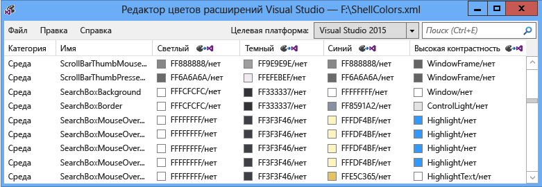
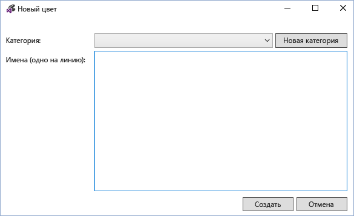
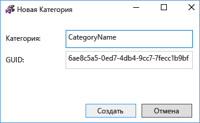
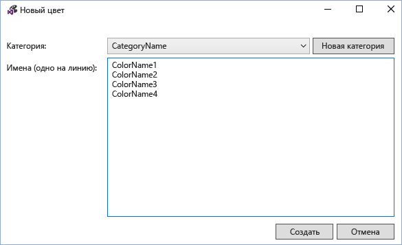
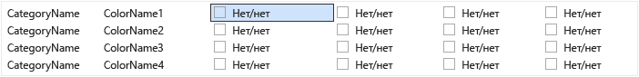
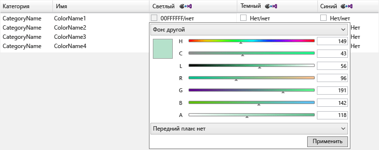
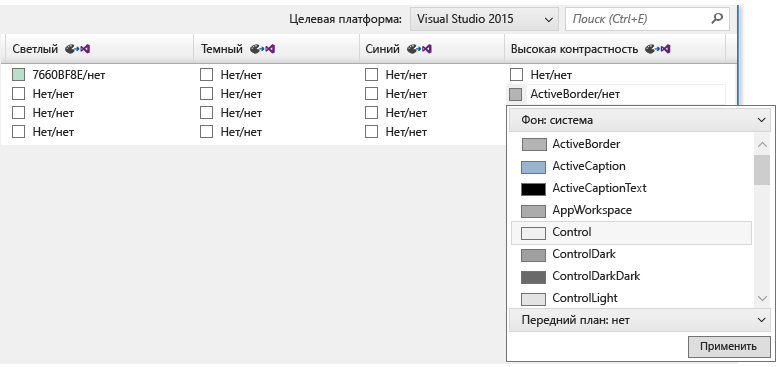
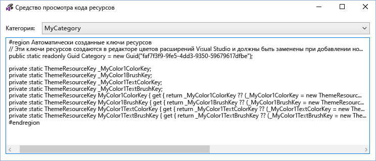
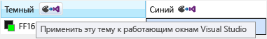

# <a name="vsix-color-editor"></a>Редактор цветов VSIX
Редактор цветов расширений Visual Studio позволяет создавать и редактировать пользовательские цвета для Visual Studio. Средство также может создавать ключи ресурсов тем, чтобы цвета можно было использовать в коде. Это средство удобно использовать для создания цветов для расширения Visual Studio, которое поддерживает их. Это средство может открывать файлы. pkgdef и. XML. Темы Visual Studio (вссеме-файлы) можно использовать в редакторе цветов расширения Visual Studio, изменив расширение файла на XML. Кроме того, файлы. вссеме можно импортировать в текущий XML-файл.

 

 **Файлы определения пакета**

 Файлы определения пакета (. pkgdef) — это файлы, определяющие темы. Сами цвета хранятся в файлах Color. XML темы, которые компилируются в pkgdef-файл. Файлы pkgdef развертываются в расположениях, доступных для поиска Visual Studio, обрабатываются во время выполнения и объединяются для определения тем.

 **Маркеры цвета**

 Маркер цвета состоит из четырех элементов:

- **Имя категории:** Логическая группировка для набора цветов. Используйте существующее имя категории, если уже есть цвета, характерные для нужного элемента пользовательского интерфейса или группы элементов пользовательского интерфейса.

- **Имя токена:** Описательное имя для маркера цвета и наборов токенов. Наборы включают имена маркеров фона и переднего плана (текста), а также все их состояния, и они должны называться так, чтобы можно было легко определять пары и состояния, к которым они применяются.

- **Цветовые значения (или тона):** Требуется для каждой цветовой темы. Всегда создавайте значения цвета фона и текста в парах. Цвета сопоставляются для фона и переднего плана, поэтому цвет текста (переднего плана) всегда читается в цвете фона, на котором он нарисован. Эти цвета связаны друг с другом и будут использоваться в пользовательском интерфейсе. Если фон не предназначен для использования с текстом, не определяйте цвет переднего плана.

- **Имя системного цвета:** Для использования в экранах с высокой контрастностью.

## <a name="how-to-use-the-tool"></a>Использование средства
 Как можно больше, и там, где это уместно, необходимо повторно использовать существующие цвета Visual Studio вместо создания новых. Однако для случаев, когда не определены соответствующие цвета, необходимо создать пользовательские цвета, чтобы обеспечить совместимость расширений.

 **Создание новых маркеров цвета**

 Чтобы создать пользовательские цвета с помощью редактора цветов расширения Visual Studio, выполните следующие действия.

1. Определите имена категорий и маркеров для новых маркеров цвета.

2. Выберите оттенки, которые будет использовать элемент пользовательского интерфейса для каждой темы, и системный цвет для высокая контрастность.

3. Используйте редактор цветов для создания новых маркеров цвета.

4. Используйте цвета в расширении Visual Studio.

5. Проверьте изменения в Visual Studio.

   **Шаг 1. Определение категорий и имен маркеров для новых маркеров цвета.**

   Предпочтительной схемой именования для Всколор является **[Category] [тип ИП] [State]**. Не используйте слово "Color" в именах Всколор, так как оно избыточно.

   Имена категорий обеспечивают логические группирования и должны быть определены как можно более узкими. Например, имя одного окна инструментов может быть именем категории, но имя целого подразделения или группы проекта — нет. Группировка записей по категориям помогает избежать путаницы между цветами с одинаковыми именами.

   Имя токена должно четко указывать тип элемента, а также ситуации или состояния, для которых будет применен цвет. Например, подсказка активных данных **[тип ИП]** может называться "**подсказкой**", **а [State]** может называться "**Active**", что приводит к имени цвета "**дататипактиве**". Поскольку советы по данным содержат текст, необходимо определить как передний, так и фоновый цвет. Используя связывание фона или переднего плана, редактор цвета автоматически создаст цвета "**дататипактиве**" для фона и "**дататипактиветекст**" для переднего плана.

   Если элемент пользовательского интерфейса имеет только одно состояние, часть **[State]** имени можно опустить. Например, если поле поиска имеет границу, а изменение состояния не повлияло на цвет границы, то имя маркера цвета границы можно просто назвать «**сеарчбоксбордер**».

   Некоторые распространенные имена состояний включают:

- Активен

- Неактивно

- MouseOver

- Вниз

- Выбрано

- Focused

  Примеры нескольких имен токенов для частей элемента управления "элемент списка":

- ListItem

- листитембордер

- листитеммаусеовер

- листитеммаусеовербордер

- листитемселектед

- листитемселектедбордер

- листитемдисаблед

- листитемдисабледбордер

  **Шаг 2. Выберите оттенки, которые элемент пользовательского интерфейса будет использовать для каждой темы, и системный цвет для высокая контрастность.**

  При выборе пользовательских цветов для пользовательского интерфейса выберите аналогичный существующий элемент пользовательского интерфейса и используйте его цвета в качестве основы. Цвета для встроенных элементов пользовательского интерфейса прошли проверку и тестирование, поэтому они будут выглядеть надлежащим образом и корректно работать во всех темах.

  **Шаг 3. Создание новых маркеров цвета с помощью редактора цветов.**

  Запустите редактор цвета и откройте или создайте новый файл пользовательской темы Colors. XML. В меню выберите **изменить > новый цвет** . Откроется диалоговое окно для указания категории и одно или несколько имен для цветовых записей в этой категории:

  

  Выберите существующую категорию или щелкните **создать категорию** , чтобы создать новую категорию. Откроется еще одно диалоговое окно, в котором будет создаваться имя новой категории:

  

  Новая категория станет доступной в раскрывающемся меню **Новая цветовая** Категория. После выбора категории введите одно имя в каждой строке для каждого нового маркера цвета и выберите "создать" по завершении:

  

  Значения цвета отображаются в парах фона или переднего плана с «None», что означает, что цвет не был определен. Примечание. Если цвет не имеет пары цвет — цвет текста и фона, необходимо определить только фон.

  

  Чтобы изменить маркер цвета, выберите запись цвета для темы (столбца) этого маркера. Добавьте значение цвета, введя шестнадцатеричное значение цвета в 8-значный формат ARGB, введя имя системного цвета в ячейку или используя раскрывающееся меню для выбора требуемого цвета с помощью набора ползунков цвета или списка системных цветов.

  

  

  Для компонентов, которым не требуется отображать текст, введите только одно значение цвета: цвет фона. В противном случае введите значения для цвета фона и текста, разделенные косой чертой.

  При вводе значений для высокая контрастность введите допустимые имена системных цветов Windows. Не вводите жестко зафиксированные значения ARGB. Список допустимых имен системных цветов можно просмотреть, выбрав "фон: система" или "передний план: система" в раскрывающихся меню "цветовые значения". При создании элементов, имеющих текстовые компоненты, используйте правильную комбинацию цвета фона и текста, иначе текст может оказаться нечитаемым.

  Завершив создание, настройку и изменение маркеров цвета, сохраните их в нужный формат. XML или. pkgdef. Маркеры цвета без фона или набора переднего плана будут сохранены как пустые цвета в формате XML, но удалены в формате. pkgdef. При попытке сохранить пустые цвета в pkgdef-файле появится диалоговое окно с предупреждением о потенциальной потере цвета.

  **Шаг 4. Используйте цвета в расширении Visual Studio.**

  Определив новые маркеры цвета, включите pkgdef в файл проекта с параметром "действие сборки", установленным в значение "содержимое", а "включить в VSIX" установите в значение "true".

  

  В редакторе цветов расширений Visual Studio выберите файл > Просмотр кода ресурса, чтобы просмотреть код, используемый для доступа к пользовательским цветам в пользовательском интерфейсе на основе WPF.

  

  Включите этот код в статический класс в проекте. Для использования типа **ThemeResourceKey** необходимо добавить в проект ссылку на **Microsoft. VisualStudio. Shell. \<VSVersion>.0.dll** .

```csharp
namespace MyCustomColors
{
    public static class MyCategory
    {
        #region Autogenerated resource keys
        // These resource keys are generated by Visual Studio Extension Color Editor, and should be replaced when new colors are added to this category.
        public static readonly Guid Category = new Guid("faf7f3f9-9fe5-4dd3-9350-59679617dfbe");

        private static ThemeResourceKey _MyColor1ColorKey;
        private static ThemeResourceKey _MyColor1BrushKey;
        private static ThemeResourceKey _MyColor1TextColorKey;
        private static ThemeResourceKey _MyColor1TextBrushKey;
        public static ThemeResourceKey MyColor1ColorKey { get { return _MyColor1ColorKey ?? (_MyColor1ColorKey = new ThemeResourceKey(Category, "MyColor1", ThemeResourceKeyType.BackgroundColor)); } }
        public static ThemeResourceKey MyColor1BrushKey { get { return _MyColor1BrushKey ?? (_MyColor1BrushKey = new ThemeResourceKey(Category, "MyColor1", ThemeResourceKeyType.BackgroundBrush)); } }
        public static ThemeResourceKey MyColor1TextColorKey { get { return _MyColor1TextColorKey ?? (_MyColor1TextColorKey = new ThemeResourceKey(Category, "MyColor1", ThemeResourceKeyType.ForegroundColor)); } }
        public static ThemeResourceKey MyColor1TextBrushKey { get { return _MyColor1TextBrushKey ?? (_MyColor1TextBrushKey = new ThemeResourceKey(Category, "MyColor1", ThemeResourceKeyType.ForegroundBrush)); } }
        #endregion
    }
}
```

 Это обеспечивает доступ к цветам в коде XAML и позволяет пользовательскому интерфейсу реагировать на изменения темы.

```xaml
<UserControl x:Class="NewTestProject.TestPackageControl" Name="MyToolWindow"
             xmlns="http://schemas.microsoft.com/winfx/2006/xaml/presentation"
             xmlns:x="http://schemas.microsoft.com/winfx/2006/xaml"
             xmlns:ns="clr-namespace:MyCustomColors">
  <Grid>
    <TextBlock Background="{DynamicResource {x:Static ns:MyCategory.MyColor1BrushKey}}"
               Foreground="{DynamicResource {x:Static ns:MyCategory.MyColor1TextBrushKey}}"
      >Sample Text</TextBlock>

  </Grid>
</UserControl>
```

 **Шаг 5. тестирование изменений в Visual Studio.**

 Редактор цветов может временно применить маркеры цвета к запущенным экземплярам Visual Studio для просмотра динамических изменений цветов без перестроения пакета расширения. Для этого щелкните кнопку "применить эту тему для запуска Visual Studio Windows", расположенную в заголовке каждого столбца темы. Эта временная тема исчезнет при закрытии редактора цвета VSIX.

 

 Чтобы сделать изменения постоянными, перестройте и повторно разверните расширение Visual Studio после добавления новых цветов в файл pkgdef и записи кода, который будет использовать эти цвета. При перестроении расширения Visual Studio значения реестра для новых цветов будут объединены в остальные темы. Затем снова запустите Visual Studio, просмотрите пользовательский интерфейс и убедитесь, что новые цвета отображаются должным образом.

## <a name="notes"></a>Примечания
 Этот инструмент предназначен для использования при создании пользовательских цветов для существующих тем Visual Studio или для редактирования цветов пользовательской темы Visual Studio. Чтобы создать полные пользовательские темы Visual Studio, скачайте [расширение редактора цветовых схем Visual Studio](https://marketplace.visualstudio.com/items?itemName=VisualStudioProductTeam.VisualStudio2015ColorThemeEditor) из коллекции расширений Visual Studio.

## <a name="sample-output"></a>Пример выходных данных
 **Вывод цвета XML**

 XML-файл, созданный средством, будет выглядеть примерно так:

```xml
<Themes>
  <Theme Name="Light" GUID="{de3dbbcd-f642-433c-8353-8f1df4370aba}">
    <Category Name="CategoryName" GUID="{eee9d521-dac2-48d9-9a5e-5c625ba2040c}">
      <Color Name="ColorName1">
        <Background Type="CT_RAW" Source="FFFFFFFF" />
      </Color>
      <Color Name="ColorName2">
        <Background Type="CT_RAW" Source="FFFFFFFF" />
        <Foreground Type="CT_RAW" Source="FF000000" />
      </Color>
      <Color Name="ColorName3">
        <Background Type="CT_RAW" Source="FFFF0000" />
      </Color>
      <Color Name="ColorName4">
        <Background Type="CT_RAW" Source="FF000088" />
        <Foreground Type="CT_RAW" Source="FFFFFFFF" />
      </Color>
    </Category>
  </Theme>
  <Theme Name="Dark" GUID="{1ded0138-47ce-435e-84ef-9ec1f439b749}">...</Theme>
  <Theme Name="Blue" GUID="{a4d6a176-b948-4b29-8c66-53c97a1ed7d0}">...</Theme>
  <Theme Name="HighContrast" GUID="{a5c004b4-2d4b-494e-bf01-45fc492522c7}">...</Theme>
</Themes>

```

 **Вывод цвета в PKGDEF**

 Файл pkgdef, созданный средством, будет выглядеть примерно так:

```
[$RootKey$\Themes\{de3dbbcd-f642-433c-8353-8f1df4370aba}\CategoryName]
"Data"=hex:78,00,00,00,0b,00,00,00,01,00,00,00,21,d5,e9,ee,c2,da,d9,48,9a,5e,5c,62,5b,a2,04,0c,04,00,00,00,0a,00,00,00,43,6f,6c,6f,72,4e,61,6d,65,31,01,ff,ff,ff,ff,00,0a,00,00,00,43,6f,6c,6f,72,4e,61,6d,65,32,01,ff,ff,ff,ff,01,00,00,00,ff,0a,00,00,00,43,6f,6c,6f,72,4e,61,6d,65,33,01,ff,00,00,ff,00,0a,00,00,00,43,6f,6c,6f,72,4e,61,6d,65,34,01,00,00,88,ff,01,ff,ff,ff,ff
[$RootKey$\Themes\{1ded0138-47ce-435e-84ef-9ec1f439b749}\CategoryName]
"Data"=hex:...
[$RootKey$\Themes\{a4d6a176-b948-4b29-8c66-53c97a1ed7d0}\CategoryName]
"Data"=hex:...
[$RootKey$\Themes\{a5c004b4-2d4b-494e-bf01-45fc492522c7}\CategoryName]
"Data"=hex:...

```

 **Оболочка ключей ресурсов C#**

 Цветовые ключи ресурсов, создаваемые средством, будут выглядеть примерно так:

```csharp
namespace MyNamespace
{
    public static class MyColors
    {
        #region Autogenerated resource keys
        // These resource keys are generated by Visual Studio Extension Color Editor, and should be replaced when new colors are added to this category.

        public static string ColorName1ColorKey { get { return "ColorName1ColorKey"; } }
        public static string ColorName1BrushKey { get { return "ColorName1BrushKey"; } }

        public static string ColorName2ColorKey { get { return "ColorName2ColorKey"; } }
        public static string ColorName2BrushKey { get { return "ColorName2BrushKey"; } }
        public static string ColorName2TextColorKey { get { return "ColorName2TextColorKey"; } }
        public static string ColorName2TextBrushKey { get { return "ColorName2TextBrushKey"; } }

        public static string ColorName3ColorKey { get { return "ColorName4ColorKey"; } }
        public static string ColorName3BrushKey { get { return "ColorName4BrushKey"; } }
        public static string ColorName3TextColorKey { get { return "ColorName4TextColorKey"; } }
        public static string ColorName3TextBrushKey { get { return "ColorName4TextBrushKey"; } }
        #endregion
    }
}
```

 **Оболочка словаря ресурсов WPF**

 Ключи Color **ResourceDictionary** , созданные средством, будут выглядеть примерно так:

```xaml
<ResourceDictionary xmlns="http://schemas.microsoft.com/winfx/2006/xaml/presentation"
        xmlns:x="http://schemas.microsoft.com/winfx/2006/xaml"
        xmlns:colors="clr-namespace:MyNamespace">

  <SolidColorBrush x:Key="{x:Static colors:MyColors.ColorName1BrushKey}" Color="#FFFFFFFF" />
  <Color x:Key="{x:Static colors:MyColors.ColorName1ColorKey}" A="255" R="255" G="255" B="255" />

  <SolidColorBrush x:Key="{x:Static colors:MyColors.ColorName2BrushKey}" Color="#FFFFFFFF" />
  <Color x:Key="{x:Static colors:MyColors.ColorName2ColorKey}" A="255" R="255" G="255" B="255" />
  <SolidColorBrush x:Key="{x:Static colors:MyColors.ColorName2TextBrushKey}" Color="#FF000000" />
  <Color x:Key="{x:Static colors:MyColors.ColorName2TextColorKey}" A="255" R="0" G="0" B="0" />

  <SolidColorBrush x:Key="{x:Static colors:MyColors.ColorName3BrushKey}" Color="#FFFF0000" />
  <Color x:Key="{x:Static colors:MyColors.ColorName3ColorKey}" A="255" R="255" G="0" B="0" />

  <SolidColorBrush x:Key="{x:Static colors:MyColors.ColorName4BrushKey}" Color="#FF000088" />
  <Color x:Key="{x:Static colors:MyColors.ColorName4ColorKey}" A="255" R="0" G="0" B="136" />
  <SolidColorBrush x:Key="{x:Static colors:MyColors.ColorName4TextBrushKey}" Color="#FFFFFFFF" />
  <Color x:Key="{x:Static colors:MyColors.ColorName4TextColorKey}" A="255" R="255" G="255" B="255" />
</ResourceDictionary>
```
