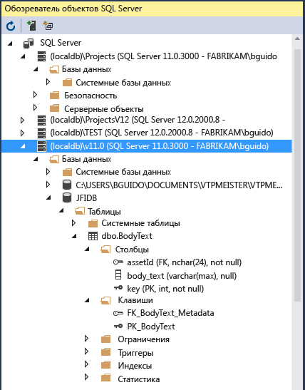

# Возможности Visual Studio

В статье [Общие сведения об интегрированной среде разработки Visual Studio](../get-started/visual-studio-ide.md) представлены основные сведения о Visual Studio. В этой статье описаны функции, которые могут оказаться более подходящими для опытных разработчиков или тех, кто уже знаком с Visual Studio.

## Модульная установка

Модульный установщик Visual Studio позволяет выбрать и установить *рабочие нагрузки*. Рабочие нагрузки — это группы функций, необходимых для языка программирования или платформы, которую вы предпочитаете. Этот подход обеспечивает меньший объем установки Visual Studio, а также более быструю установку и обновление среды.

::: moniker range="vs-2017"

Установите Visual Studio бесплатно со страницы [скачиваемых материалов Visual Studio](https://visualstudio.microsoft.com/vs/older-downloads/?utm_medium=microsoft&utm_source=docs.microsoft.com&utm_campaign=vs+2017+download), если еще не сделали этого.

::: moniker-end

::: moniker range=">=vs-2019"

Установите Visual Studio бесплатно со страницы [скачиваемых материалов Visual Studio](https://visualstudio.microsoft.com/downloads), если еще не сделали этого.

::: moniker-end

Дополнительные сведения о настройке Visual Studio в своей системе см. в статье [Установка версии-кандидата Visual Studio](../install/install-visual-studio.md).

## Создание облачных приложений для Azure

Visual Studio предлагает набор инструментов, позволяющих с легкостью создавать облачные приложения на базе Microsoft Azure. Она упрощает настройку, сборку, отладку, упаковку и развертывание приложений и служб в Microsoft Azure прямо из IDE. Чтобы получить инструменты Azure и шаблоны проектов, при установке Visual Studio выберите рабочую нагрузку **Разработка для Azure**.

::: moniker range="vs-2017"

После установки рабочей нагрузки **Разработка для Azure** следующие шаблоны **Облачных ресурсов** для C# становятся доступны в диалоговом окне **Новый проект**:

::: moniker-end

[Cloud Explorer](/azure/vs-azure-tools-resources-managing-with-cloud-explorer) в Visual Studio позволяет просматривать облачные ресурсы на основе Azure и управлять ими в Visual Studio. Эти ресурсы могут включать виртуальные машины, таблицы, базы данных SQL и многое другое. **Cloud Explorer** отображает ресурсы Azure во всех учетных записях, управляемых в рамках подписки Azure, в которую выполнен вход. Если для выполнения конкретной операции требуется портал Azure, **Cloud Explorer** предоставит ссылки для перехода в нужное место на портале.

Вы можете использовать службы Azure для приложений с помощью **Подключенных служб**, которые перечислены ниже.

- [Подключенная служба Active Directory](/azure/active-directory/develop/vs-active-directory-add-connected-service) позволяет пользователям использовать свои учетные записи из [Azure Active Directory](/azure/active-directory/active-directory-whatis) для подключения к веб-приложениям.
- [Подключенная служба хранилища Azure](/azure/vs-azure-tools-connected-services-storage) — хранилище больших двоичных объектов, очереди и таблицы.
- [Подключенная служба Key Vault](/azure/key-vault/vs-key-vault-add-connected-service) служит для управления секретами для веб-приложений.

Доступные **Подключенные службы** зависят от типа проекта. Добавьте службу, щелкнув проект в **Обозревателе решений** правой кнопкой мыши и выбрав пункты **Добавить** > **Подключенная служба**.

Дополнительные сведения см. в разделе [Миграция в облако с помощью Visual Studio и Azure](https://visualstudio.microsoft.com/vs/azure-tools/).

## Создание приложений для Интернета

Интернет-технологии правят современным миром, и Visual Studio поможет вам создавать веб-приложения. Вы можете создавать веб-приложения с помощью технологий ASP.NET, Node.js, Python, JavaScript и TypeScript. Visual Studio распознает такие платформы для создания веб-приложений, как Angular, jQuery, Express и другие. Платформы ASP.NET Core и .NET Core поддерживаются на компьютерах с Windows и Linux, а также на компьютерах Mac. [ASP.NET Core](https://dotnet.microsoft.com/learn/aspnet/what-is-aspnet-core) представляет собой существенное обновление для MVC, WebAPI и SignalR, которое работает на платформах Windows, Mac и Linux.  Платформа ASP.NET Core была разработана с нуля и предоставляет компактный и изменяемый стек .NET для разработки современных облачных веб-приложений и служб.

Дополнительные сведения см. на странице со сведениями о [современных инструментах для создания веб-приложений](https://visualstudio.microsoft.com/vs/modern-web-tooling/).

## Создание кроссплатформенных приложений и игр

С помощью Visual Studio вы можете создавать приложения и игры для платформ macOS, Linux и Windows, а также для [мобильных устройств](https://visualstudio.microsoft.com/vs/mobile-app-development/) Android, iOS и др.

- Создавайте приложения [.NET Core](/dotnet/core/) для использования на устройствах Windows, macOS и Linux.

- Создавайте мобильные приложения для устройств iOS, Android и Windows на C# и F# с помощью [Xamarin](https://developer.xamarin.com/guides/cross-platform/windows/visual-studio/).

- Используйте стандартные веб-технологии&mdash;HTML, CSS и JavaScript&mdash;, чтобы создавать мобильные приложения для устройств iOS, Android и Windows с помощью [Apache Cordova](/visualstudio/cross-platform/tools-for-cordova/).

- Создавайте игры в форматах 2D и 3D на C# с помощью [средств Visual Studio для Unity](/gamedev/unity/get-started/visual-studio-tools-for-unity.md).

- Создавайте собственные приложения C++ для устройств iOS, Android и Windows. Предоставляйте доступ к общему коду в библиотеках, созданных для iOS, Android и Windows, с помощью [C++ для кроссплатформенной разработки](/cpp/cross-platform/visual-cpp-for-cross-platform-mobile-development).

- Выполняйте развертывание, тестирование и отладку приложений Android с помощью [эмулятора Android](../cross-platform/visual-studio-emulator-for-android.md).

## Подключение к базам данных

**Обозреватель сервера** позволяет просматривать экземпляры и ресурсы SQL Server в локальной или удаленной среде, в Azure, Salesforce.com, Microsoft 365 и на веб-сайтах, а также управлять ими. Чтобы открыть **обозреватель серверов**, выберите в главном меню **Вид** > **Обозреватель серверов**. Дополнительные сведения об использовании обозревателя серверов см. в статье [Добавление новых подключений](../data-tools/add-new-connections.md).

[SQL Server Data Tools (SSDT)](/sql/ssdt/download-sql-server-data-tools-ssdt) — это мощная среда разработки для SQL Server, базы данных SQL Azure и хранилища данных SQL Azure. С помощью SSDT вы можете создавать и обслуживать базы данных, а также выполнять их отладку и рефакторинг. Можно работать с проектом базы данных или напрямую с подключенным экземпляром базы данных (локально или удаленно).

**Обозреватель объектов SQL Server** в Visual Studio позволяет просматривать объекты баз данных так же, как и в среде SQL Server Management Studio. Обозреватель объектов SQL Server позволяет выполнять простые действия по администрированию и проектированию базы данных. Рабочие примеры включают редактирование данных в таблицах, сравнение схем, выполнение запросов с помощью контекстных меню прямо из обозревателя объектов SQL Server и многое другое.

## Отладка, тестирование и совершенствование кода

При написании кода требуется запустить его и проверить на ошибки и производительность. Современная система отладки Visual Studio позволяет выполнять отладку кода в локальном проекте, на удаленном устройстве или в [эмуляторе устройства](../cross-platform/visual-studio-emulator-for-android.md). Можно просматривать код с шагом в один оператор, проверяя значения переменных. Можно задать точки останова, которые срабатывают только при выполнении указанного условия. Параметры отладки можно контролировать в самом редакторе кода, не покидая окно с кодом. Подробнее об отладке в Visual Studio см. в описании [возможностей отладчика](../debugger/debugger-feature-tour.md).

Дополнительные сведения об улучшении производительности приложений см. в описании компонента [профилирования](../profiling/profiling-feature-tour.md) Visual Studio.

Для [тестирования](../test/improve-code-quality.md) в Visual Studio предусмотрены такие возможности, как модульное тестирование, Live Unit Testing, IntelliTest, тестирование производительности, нагрузочное тестирование и прочее. Visual Studio также предоставляет расширенные возможности [анализа кода](../code-quality/code-analysis-for-managed-code-overview.md) для выявления ошибок конструктора, безопасности и прочих дефектов.

## Развертывание готового приложения

Когда приложение будет готово к развертыванию для пользователей или клиентов, Visual Studio предоставляет средства для этого. Варианты развертывания: Microsoft Store, сайт SharePoint или с установщиками InstallShield или Windows. Все эти возможности доступны в среде IDE. Дополнительные сведения см. в статье [Общие сведения о развертывании в Visual Studio](../deployment/deploying-applications-services-and-components.md).

## Управление исходным кодом и совместная работа

Вы можете управлять исходным кодом в репозиториях Git, размещенных любым поставщиком, в том числе и GitHub. С помощью [Azure DevOps Services](/azure/devops/index) можно управлять кодом, а также ошибками и рабочими элементами для всего проекта. Дополнительные сведения об управлении репозиториями Git в Visual Studio с использованием Team Explorer см. в статье [Приступая к работе с Git и Azure Repos](/azure/devops/repos/git/gitquickstart?tabs=visual-studio). В Visual Studio также предусмотрены другие встроенные элементы управления исходным кодом. Дополнительные сведения о них см. в статье блога [Новые возможности Git в Visual Studio](https://devblogs.microsoft.com/devops/new-git-features-in-visual-studio-2017/).

Служба Azure DevOps Services — это облачные службы для планирования, размещения, автоматизации и развертывания программного обеспечения, а также совместной работы в группах. Службы Azure DevOps поддерживают репозитории Git (распределенное управление версиями) и систему управления версиями Team Foundation (централизованное управление версиями). Они поддерживают конвейеры непрерывной сборки и поставки (CI/CD) кода, хранящегося в системах управления версиями. Службы Azure DevOps Services также поддерживают методологии разработки программного обеспечения Agile, Scrum и CMMI.

Team Foundation Server (TFS) — это центр управления жизненным циклом приложений для Visual Studio. Он позволяет всем лицам, участвующим в процессе разработки, использовать единое решение. TFS также полезен для управления разнородными командами и проектами.

При наличии организации Azure DevOps или Team Foundation Server в сети к ним можно подключиться из окна **Team Explorer** в Visual Studio. В этом окне можно извлекать и возвращать код в систему управления версиями, управлять рабочими элементами, запускать сборки и получать доступ к комнатам команд и рабочим областям. Team Explorer **можно открыть** с помощью поля поиска или из главного меню **Вид** > **Team Explorer** или **Команда** > **Управление подключениями**.

На изображении ниже показано окно **Team Explorer** для решения, размещенного в Azure DevOps Services.

Вы также можете автоматизировать процедуру сборки, чтобы обеспечить сборку кода, который разработчики в вашей рабочей группе вернули в систему управления версиями. Например, можно создавать один или более проектов каждую ночь или всякий раз при возврате кода. Дополнительные сведения см. в описании [Azure Pipelines](/azure/devops/pipelines/index?view=vsts&preserve-view=true).

## Расширение Visual Studio

Если в Visual Studio нет необходимой вам функции, ее можно добавить. Вы также можете персонализировать среду IDE в соответствии с рабочим процессом и стилем, добавить поддержку внешних инструментов, которые еще не интегрированы с Visual Studio, и изменить существующие функции, чтобы повысить производительность. Сведения о последней версии средств расширения Visual Studio (VS SDK) см. в разделе [Visual Studio SDK](../extensibility/visual-studio-sdk.md).

Для создания анализаторов и генераторов кода можно воспользоваться .NET Compiler Platform ("Roslyn"). Все необходимое вы найдете на сайте [Roslyn](https://github.com/dotnet/Roslyn).

Вы также можете найти [существующие расширения](https://marketplace.visualstudio.com/vs) для Visual Studio, созданные разработчиками Майкрософт и участниками нашего сообщества разработчиков.

Дополнительные сведения о расширении среды IDE Visual Studio см. [здесь](https://visualstudio.microsoft.com/vs/extend/).

## См. также раздел

- [Обзор интегрированной среды разработки Visual Studio](../get-started/visual-studio-ide.md)
- [Новые возможности Visual Studio 2017](../ide/whats-new-visual-studio-2017.md)
- [Новые возможности Visual Studio 2019](../ide/whats-new-visual-studio-2019.md)
