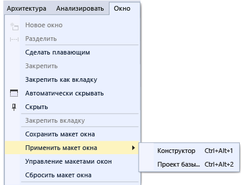

# Настройка макетов окон в Visual Studio

В Visual Studio можно настроить расположение, размер и поведение окон, что позволит создать макеты окон, оптимально подходящие для различных рабочих процессов разработки. После того как макет будет настроен, интегрированная среда разработки запомнит его. Например, если после изменения места прикрепления окна **обозревателя решений** закрыть Visual Studio, во время следующего запуска окно **обозревателя решений** будет закреплено в том же месте, даже если работа будет продолжена на другом компьютере. Настраиваемому макету также можно присвоить имя, сохранить его, а затем переключаться между макетами с помощью одной команды. Например, можно создать один макет для редактирования, а другой —для отладки и переключаться между ними с помощью команды меню **Окно** > **Применить макет окна**.

## Типы окон

### Окна инструментов и документов

В среде IDE существует два основных типа окон: *окна инструментов* и *окна документов*. В число окон инструментов входят **обозреватель решений**, **обозреватель сервера**, **окно вывода**, **список ошибок**, конструкторы, окна отладчика и т. д. Окна документов содержат файлы исходного кода, произвольные текстовые файлы, файлы конфигурации и т. д. Изменять размер и перетаскивать окна инструментов можно с помощью их строки заголовка. Перетаскивание окон документов осуществляется с помощью вкладки. Правой кнопкой мыши щелкните вкладку или строку заголовка, чтобы задать другие параметры для окна.

В меню **Окно** находятся параметры закрепления, перемещения и скрытия окон в интегрированной среде разработки. Щелкните правой кнопкой мыши вкладку или строку заголовка окна, чтобы просмотреть дополнительные параметры для этого конкретного окна. Одновременно можно отображать несколько экземпляров окон инструментов. Например, можно открыть несколько окон веб-браузера. Кроме того, можно создать дополнительные экземпляры некоторых окон инструментов, выбрав команду **Создать окно** в меню **Окно** .

### Вкладка предварительного просмотра (окна документов)

На вкладке **Предварительный просмотр** можно просматривать файлы в редакторе, не открывая их. Просмотреть файлы можно путем их выбора в **обозревателе решений**, во время отладки при заходе в файлы, с помощью команды **Перейти к определению**, а также при просмотре результатов поиска. Файлы для предварительного просмотра отображаются на вкладке в правой части вкладки документа. Файл становится доступным для редактирования при его изменении или выборе команды **Открыть**.

### Группы вкладок

Группы вкладок расширяют возможности управления ограниченной рабочей областью при работе с двумя или более открытыми документами в интегрированной среде разработки. Несколько окон документов и окон инструментов можно упорядочить в вертикальные или горизонтальные группы вкладок и затем без труда переносить документы из одной группы в другую.

### Разделение окон

Если в документе необходимо одновременно просмотреть или изменить два различных места, можно разделить окна. Чтобы разделить документ на две части с независимой прокруткой, выберите **Разделить** в меню **Окно** . Чтобы восстановить единое представление, выберите **Снять разделение** в меню **Окно** .

### Панели инструментов

Панели инструментов можно упорядочить путем перетаскивания или с помощью диалогового окна **Настройка** . Дополнительные сведения о размещении и настройке панелей инструментов см. в статье [Практическое руководство. Настройка меню и панелей инструментов](../ide/how-to-customize-menus-and-toolbars-in-visual-studio.md).

## Размещение и закрепление окон

Окна документов и окна инструментов можно *закреплять*, чтобы задавать для них расположение и размер в рамках интегрированной среды разработки, или же их можно делать плавающими, то есть независимыми от интегрированной среды разработки. Окна инструментов можно закрепить в любом месте интегрированной среды разработки. Некоторые окна инструментов можно закрепить в виде окон с вкладками в окне редактора. Окна документов можно зафиксировать в рамках окна редактора. Их также можно закрепить в текущем расположении в последовательности перехода. Можно закрепить несколько окон для *совместного перемещения* в интегрированной среде разработки или за ее пределами. Окна инструментов можно скрывать или сворачивать.

Существуют следующие способы размещения окон.

-   Закрепление окон документов в левой части вкладки.

-   Прикрепление окон в виде вкладок к области редактирования.

-   Закрепление окон инструментов по краю области интегрированной среды разработки.

-   Перемещение окно документов или окно инструментов по интегрированной среде разработки или за ее пределами.

-   Скрытие окон инструментов вдоль края интегрированной среды разработки.

-   Отображение окон на разных мониторах.

-   Сброс расположения окон до макета по умолчанию или до сохраненного настраиваемого макета.

Окна инструментов и документов могут быть упорядочены путем перетаскивания, с помощью команд меню **Окно** и щелчка строки заголовка окна правой кнопкой мыши.

### Закрепление окон

При щелчке и перетаскивании строки заголовка окна инструмента или вкладки окна документа появляется маркер в виде ромба. Во время операции перетаскивания, когда указатель мыши наведен на одну из стрелок в ромбе, будет отображена затененная область, показывающая место закрепления окна после отпускания кнопки мыши.

Чтобы переместить закрепляемое окно без прикрепления к месту, во время перетаскивания окна нажмите клавишу **CTRL**.

Чтобы вернуть окно инструмента или окно документа в последнее место закрепления, нажмите клавишу **CTRL** во время выполнения двойного щелчка по заголовку или вкладке окна.

На следующем рисунке показан маркер в виде ромба для окон документов, которые могут быть закреплены только в рамках области редактирования.

Окна инструментов можно прикрепить к одной стороне рамки в интегрированной среде разработки или в пределах области редактирования. Маркер в виде ромба появляется при перетаскивании окна инструмента в другое место и упрощает процесс закрепления.

Маркер в виде ромба для окон инструментов

На приведенном ниже рисунке показан **обозреватель решений**, закрепленный в новом месте, выделенном синим цветом.

### Закрытие и автоматическое скрытие окон инструментов

Чтобы закрыть окно инструментов, нажмите кнопку **X** в верхнем правом углу заголовка окна. Для повторного открытия окна используется соответствующее сочетание клавиш или команда меню. Окна инструментов поддерживают возможность *автоматического скрытия*, позволяющую выводить окно из поля зрения при использовании другого окна. Если окно автоматически скрыто, его имя отображается на вкладке на краю интегрированной среды разработки. Для повторного использования окна наведите указатель на вкладку, в результате чего окно возвращается обратно в представление.

> [!NOTE]
> Чтобы указать режим работы автоматического скрытия (для отдельных окон инструментов или закрепленных групп), установите или снимите флажок **Кнопка автоскрытия действует только на активное окно** в диалоговом окне **Параметры**. Дополнительные сведения см. в статье [Страница "Общие", папка "Среда", диалоговое окно "Параметры"](../ide/reference/general-environment-options-dialog-box.md).

> [!NOTE]
> Окна инструментов, для которых включена функция автоматического скрытия, могут временно становиться видимыми, когда они находятся в фокусе. Чтобы снова скрыть окно, выберите элемент за пределами текущего окна. При потере фокуса окно скрывается.

### Указание второго монитора

Если имеется второй монитор, который поддерживается операционной системой, можно выбрать, в каком мониторе будет отображаться окно. Можно даже сгруппировать несколько окон в *блоки* на других мониторах.

> [!TIP]
> Можно создать несколько экземпляров **обозревателе решений** и переместить их на другой монитор. Щелкните окно правой кнопкой мыши и выберите команду **Создать представление обозревателя решений**. Все окна можно вернуть на исходный монитор, щелкнув их дважды, удерживая нажатой клавишу **CTRL**.

### Сброс, задание имен и переключение между макетами окон

Для возвращения исходного макета окон интегрированной среды разработки используется команда **Сбросить макет окон** . При запуске этой команды выполняются следующие действия.

-   Все окна перемещаются в расположения по умолчанию.

-   Окна, которые закрыты в макете по умолчанию, закрываются.

-   Окна, которые открыты в макете по умолчанию, открываются.

### Создание и сохранение пользовательских макетов

Visual Studio позволяет сохранять до 10 пользовательских макетов окон и быстро переключаться между ними. В приведенных ниже инструкциях показано, как создавать, сохранять, вызывать пользовательские макеты, использующие несколько мониторов как с закрепленными окнами средств, так и с перемещаемыми, а также управлять ими.

Сначала создайте тестовое решение с двумя проектами, каждый с отдельным оптимальным макетом.

#### Создание проекта пользовательского интерфейса и настройка макета

1.  В диалоговом окне **Новый проект** создайте **классическое приложение WPF на C#** и присвойте ему любое имя. Представьте, что это и есть проект, в котором предстоит работать над пользовательским интерфейсом, вследствие чего для окна конструктора следует выделить максимальное пространство и закрыть остальные окна средства.

2.  Если у вас несколько мониторов, переместите окна **Обозреватель сервера** и **Свойства** на второй монитор. В системе с одним монитором закройте все окна, кроме окна конструктора.

3.  Нажмите клавиши **CTRL+ALT+X**, чтобы открыть **панель элементов**. Если окно закреплено, перетащите его в нужное место на любом мониторе.

4.  Нажмите клавишу **F5**, чтобы включить в Visual Studio режим отладки. Настройте расположение окон отладки **Автоматические**, **Стек вызовов** и **Выходные данные**. Макет, который вы собираетесь создать, применит к ним режим редактирования и режим отладки.

5.  Когда макеты будут открыты в режиме отладки и редактирования, в главном меню выберите **Окно** > **Сохранить макет окна**. Назовите этот макет "Конструктор".

     Обратите внимание, что новому макету назначается сочетание клавиш из зарезервированного списка **CTRL** + **ALT** + **1...0**.

#### Создание проекта и макета базы данных

1.  Добавьте в решение новый проект **База данных SQL Server** .

2.  Щелкните правой кнопкой мыши новый проект в **обозревателе решений** и выберите пункт **Просмотр в обозревателе объектов**. Отобразится окно **Обозреватель объектов SQL Server** , в котором можно открывать таблицы, представления и другие объекты в базе данных. Это окно можно переместить или оставить закрепленным. Настройте другие окна средства. Для реалистичности можно добавить существующую базу данных, но это необязательно для данного пошагового руководства.

3.  После настройки макета выберите в главном меню пункт **Окно** > **Сохранить макет окна**. Назовите этот макет "Проект базы данных". (Для этого проекта не будет использоваться макет в режиме отладки.)

#### Переключение между макетами

Для переключения между макетами используйте сочетания клавиш или выберите в главном меню пункт **Окно** > **Применить макет окна**.

После применения макета пользовательского интерфейса обратите внимание на то, как выглядит макет в режиме редактирования и в режиме отладки.

Если у вас установлено несколько мониторов на работе и один ноутбук дома, можно создать макеты, оптимизированные для всех компьютеров.

> [!NOTE]
> Если макет для нескольких мониторов применить в системе с одним монитором, плавающие окна на втором мониторе будут находиться за окном Visual Studio. Эти окна можно переместить на передний план, нажав клавиши **ALT+TAB**. Если позже открыть Visual Studio в системе с несколькими мониторами, можно восстановить окна в указанных расположениях, повторно применив макет.

#### Управление макетами и перемещение их

Пользовательский макет можно удалить, переименовать или переупорядочить, выбрав пункт **Окно** > **Управление макетами окна**. Если переместить макет, привязка ключей будет настроена автоматически и отобразит новое положение в списке. Привязки невозможно изменить другим способом, таким образом, одновременно можно хранить не больше 10 макетов.

Чтобы вспомнить, какие сочетания клавиш назначены макетам, выберите **Окно** > **Применить макет окна**.

Эти макеты автоматически передаются между выпусками Visual Studio, между экземплярами Blend на отдельных компьютерах и из любого выпуска Express в любую другую организацию Express. Однако макеты невозможно передавать между Visual Studio, Blend и Express.

## См. также

- [Практическое руководство. Перемещение по интегрированной среде разработки](../ide/how-to-move-around-in-the-visual-studio-ide.md)