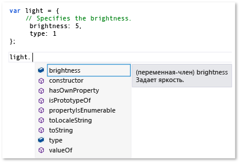
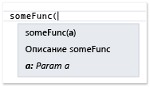
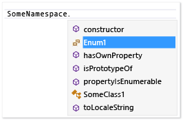

# Расширение IntelliSense для JavaScript
[!INCLUDE[vs2017banner](../code-quality/includes/vs2017banner.md)]

Функция JavaScript расширяемости IntelliSense позволяет настраивать результаты IntelliSense в редакторе библиотек JavaScript для третьей стороны.  Это может улучшить взаимодействие разработчиков, использующих эти библиотеки.  
  
 Языковая служба JavaScript предоставляет функции IntelliSense для библиотек JavaScript третьей стороны, добавленные в проект.  Для большинства библиотек завершение операторов предоставляется автоматически языковой службы.  На следующем рисунке показан пример завершения операторов:  
  
   
  
 Если ваша библиотека содержит описания переменных, функций и объектов в стандартных теги комментария JavaScript \(\/\), это позволяет автоматически, по умолчанию, из функции расширяемости IntelliSense, которые предоставляют описательную информацию во всплывающем окне, отображается справа от элементов в списке завершения или после набора открывающей скобки в вызове функции.  Комментарии в всплывающем окне содержат описание элемента.  В следующем примере показан всплывающее окно для списка завершения.  
  
   
  
 , Чтобы улучшить взаимодействие разработчика, может потребоваться предоставление сведений о типе разработчики в всплывающем окне.  Можно предоставить информацию с помощью JavaScript [Комментарии XML\-документации](../ide/xml-documentation-comments-javascript.md) вместо стандартных тегов комментария.  Необходимо добавить комментарии XML\-документации с использованием тегов комментария тремя косыми чертами и заданного набора XML\-элементов.  
  
 Кроме того, можно предоставить информацию с помощью расширяемости IntelliSense JavaScript.  Эта функция позволяет настраивать результаты IntelliSense путем создания расширений JavaScript и добавления их к контексту скрипта.  В расширении файл JavaScript, которые выполняются на события, предоставляемые объектом `intellisense` языковой службы.  Расширяемость IntelliSense JavaScript предпочтительнее решение для библиотек, если характер поведения в библиотеке предотвращает службу из JavaScript обеспечивают требуемый уровень поддержки IntelliSense, и если альтернативы декларативным комментарии XML\-документации также необходима.  Настраивая результаты IntelliSense, можно создать первоклассное возможности IntelliSense, независимо от каких\-либо поведенческих шаблонов, могут ограничить возможности по умолчанию языковой службы.  Для получения дополнительной информации см. [Завершение операторов с использованием идентификаторов](../ide/statement-completion-for-identifiers.md).  
  
## Добавить расширение к контексту скрипта  
 Для расширения IntelliSense, которая должна выполняться, ему нужно добавлять в текущем контексте скрипта.  Расширение можно автоматически добавлен в контекст скрипта автоматическим механизмом обнаружения, или добавить расширение к контексту скрипта вручную с помощью справочных групп или директивы ссылки.  
  
 Автоматический механизм обнаружения позволяет языковую службу автоматически найти расширения, соответствующие правилам именования *libraryname*.intellisense.js файла и, находится в том же каталоге, что и библиотека, к которой применяется расширение.  Например, допустимое расширение для библиотеки jQuery будет jQuery.intellisense.js.  Для более рестриктивных расширений jQuery можно использовать имена файлов например jQuery\-1.7.1.intellisense.js \(расширение для конкретных версий\) или jQuery.ui.intellisense.js \(расширение для библиотеки jQuery для перевода\).  Наиболее рестриктивная версии расширения используется при наличии нескольких одно расширение обнаружено для заданного библиотеки.  
  
 Если требуется использовать расширения всех файлов проекта JavaScript, необходимо выбрать вместо может добавить расширение в эталонной группе.  Несколько типов справочных групп, и те, которые содержат неявные ссылки и те, которые содержат выделенный рабочий ссылаются.  Чтобы добавить расширение, обычно требуется добавить файл как неявная эталонная команда, любое **Неявно \(Windows\)**, **Неявно \(веб\)**.  Неявные ссылки в области для каждого js\-файла, открытого в редакторе кода.  При использовании этого метода необходимо добавить и расширение и файл с расширением дополняют.  
  
 Используйте страницу **IntelliSense** диалогового окна **Параметры**, чтобы добавить расширение как эталонная команда.  Доступ к странице **IntelliSense**, выбрав **Сервис**, **Параметры** в строке меню, а затем выберите пункт **Текстовый редактор**, **JavaScript**, **IntelliSense**, **Ссылки**.  Дополнительные сведения о справочных группах см. в разделах [IntelliSense для JavaScript](../ide/javascript-intellisense.md) и ["Параметры", "Текстовый редактор", JavaScript, IntelliSense](../ide/reference/options-text-editor-javascript-intellisense.md).  
  
 Если требуется использовать расширение для определенного набора файлов, используйте директиву ссылки.  При использовании этого метода, необходимо сослаться на и расширение и дополняют файл расширения.  Дополнительные сведения об использовании директивы ссылок см. в разделе [IntelliSense для JavaScript](../ide/javascript-intellisense.md).  
  
## Обработка событий IntelliSense  
 Функции расширяемости позволяет настраивать результаты IntelliSense с помощью подписки на события, например, события `statementcompletion` объекта `intellisense` языковой службы.  В следующем примере показано простое расширение, которое используется службой, чтобы скрыть элементы, начинающиеся с символа подчеркивания из завершения операторов.  Этот код содержится в underscorefilter.js и в \\ \\*Путь установки Visual Studio*\\ JavaScript \\ Ссылки.  
  
```javascript  
intellisense.addEventListener('statementcompletion', function (event) {  
    if (event.targetName === "this") return;  
  
    var filterRegex;  
  
    if (event.target === undefined || event.target === window)  
        filterRegex = /^_.*\d{2,}/;  
    else  
        filterRegex = /^_.*/;  
  
    event.items = event.items.filter(function (item) {  
        return !filterRegex.test(item.name);  
    });  
});  
```  
  
 В предыдущем примере, расширение проверяет свойства [Свойство targetName](#TargetName) и [Свойство target](#Target) объекта события `statementcompletion`, чтобы удалить объекты, такие как `this` и `window`, и убедиться, что допустимый список завершения операторов можно указать.  Если список завершения можно определить, расширение обновляет коллекцию [Свойство items](#Items) завершения операторов, чтобы фильтровать элементы, начинающиеся с символа подчеркивания.  
  
 Дополнительные примеры находится в каталоге \\ \\*Путь установки Visual Studio*\\ JavaScript \\ Ссылки.  Файл showPlainComments.js в этой папке содержатся примеры использования других событий, чтобы обеспечить поддержку IntelliSense по умолчанию для стандартных тегов комментария JavaScript \(\/\).  Как underscorefilter.js, showPlainComments.js уже имеющийся работающий как расширение, и можно увидеть результирующие данные IntelliSense при использовании тегов комментария в коде для переменных, функций и объектов.  Дополнительные примеры см. в разделе [Примеры кода](#CodeExamples).  
  
> [!WARNING]
>  Если изменить файлы, включенные в расширения Visual Studio, можно отключить JavaScript или функции IntelliSense, поддерживаемая расширением.  
  
 В коде расширения можно создать обработчики для следующих типов события с помощью `addEventListener`.  
  
-   `statementcompletion`, который добавляет обработчик для события завершения операторов.  Завершение операторов список членов для определенного типа, который отображается после ввода специальные знаки, такие как точка \(.\) или список идентификаторов, отображаемого при вводе или при нажатии клавиши CTRL \+ J.  Обработчик события получает объект типа `CompletionEvent`, который поддерживает следующие элементы: [Свойство items](#Items), [Свойство target](#Target), [Свойство targetName](#TargetName) и [Свойство scope](#Scope).  
  
-   `signaturehelp`, который добавляет обработчик для сведений о параметрах IntelliSense.  Сведения о параметрах содержатся собранные данные о количестве, именах и типах параметров, необходимых функцией.  Обработчик события получает объект типа `SignatureHelpEvent`, который поддерживает следующие элементы: [Свойство target](#Target), [Свойство parentObject](#ParentObject), [Свойство functionComments](#FunctionComments), [Свойство functionHelp](#FunctionHelp).  
  
-   `statementcompletionhint`, который добавляет обработчик для кратких сведений IntelliSense.  Окно кратких сведений контекстное меню отображает полное объявление для идентификаторов в коде.  Обработчик события получает объект типа `CompletionHintEvent`, который поддерживает следующие элементы: [Свойство completionItem](#CompletionItem) и [Свойство symbolHelp](#SymbolHelp).  
  
 Примеры функции IntelliSense, как завершение операторов, сведения о параметрах и краткие сведения см. в разделе [Использование технологии IntelliSense](../ide/using-intellisense.md).  
  
> [!NOTE]
>  В JavaScript, кратких сведений ссылается на всплывающему окно, отображается справа от списка завершения.  Нельзя вручную для вызова кратких сведений.  
  
##  <a name="intellisenseObject"></a> объект intellisense  
 В следующей таблице приведены функции, доступные для объекта `intellisense`.  Объект `intellisense` доступен только во время разработки.  
  
|Функция|Описание|  
|-------------|--------------|  
|`addEventListener(type, handler);`|Добавляет обработчик события для события IntelliSense.<br /><br /> строковое значение `type`.  Допустимые значения включают `statementcompletion`, `signaturehelp` и `statementcompletionhint`.<br /><br /> функция `handler` обработчика событий, который получает объект события одного из следующих типов:<br /><br /> -   `CompletionEvent`, используемый для события `statementcompletion`.<br />-   `SignatureHelpEvent`, используемый для события `signaturehelp`.<br />-   `CompletionHintEvent`, используемый для события `statementcompletionhint`.<br /><br /> Примеры, использующие эту функцию, см. в разделе [Примеры кода](#CodeExamples).|  
|`annotate(obj, doc);`|Определяет документацию для объекта путем копирования документирующие комментарии из одного объекта к другому объекту.<br /><br /> `obj` определяет объект, к которому копирование документации.<br /><br /> задает объект `doc`, из которого необходимо скопировать в документации.<br /><br /> Пример, демонстрирующий использование этой функции, см. в разделе [Добавление заметок IntelliSense](#Annotations).|  
|`getFunctionComments(func);`|Возвращает комментарии для указанной функции.<br /><br /> `func` определяет функцию, для которой возвращаются комментарии.<br /><br /> Можно задать параметр `func` с помощью `completionItem.value`.<br /><br /> Возвращенный объект `functionComments` включает следующие элементы: `above`, `inside` и `paramComment`.  Дополнительные сведения см. в описании свойства [Свойство functionComments](#FunctionComments).<br /><br /> `getFunctionComments` может быть вызван только из одного из обработчиков событий, которые зарегистрированы `addEventListener`.<br /><br /> Пример, демонстрирующий использование этой функции, см. в разделе " \\ \\*Путь установки Visual Studio*\\ \\ \\ showPlainComments.js JavaScript ссылки.|  
|`logMessage(msg);`|Отправляет диагностические сообщения в окне вывода.<br /><br /> `msg` \- это строка, которая содержит сообщение.<br /><br /> Пример, демонстрирующий использование этой функции, см. в разделе [Отправлять сообщения в окне вывода](#Logging).|  
|`nullWithCompletionsOf(value);`|Возвращает специальное значение NULL, для которого определен список завершения объектом, переданного в параметре `value`.<br /><br /> `value` определяет список завершений для возвращаемого значения.  `value` может быть любым типом.<br /><br /> Возвращаемое значение NULL NULL обработано как во время разработки, но список завершений для возвращаемого значения совпадает с список завершений для параметра `value`.<br /><br /> Одно для использования этой функции предоставить IntelliSense для возвращаемого значения, если возвращаемый тип является предсказуемым во время выполнения, но возвращаемое значение `null` во время разработки.|  
|`redirectDefinition(func, definition);`|Указывает IntelliSense для использования предоставленной функции определения вместо исходного функциональной функции, если справка или параметр **Перейти к определению** запрос.<br /><br /> `func` определяет функцию целевого объекта.<br /><br /> определяет функцию `definition`, чтобы использовать вместо функции целевого объекта для данных и параметр **Перейти к определению**.|  
|`setCallContext(func, thisArg);`|Задает контекст вызова, или область, для указанной функции.<br /><br /> `func` определяет функцию, для которой задать область.<br /><br /> литерал `thisArg` объекта, к которому может обращаться к ключевое слово `this`, которое определяет новую область для члена.  Можно включить аргументы, передаваемые в этот параметр, например `intellisense.setCallContext(func, { thisArg: "", args: [23,2] });`<br /><br /> `setCallContext` предоставляет расширение функциональности, аналогичный `Function.prototype.bind`, за исключением того, что он используется только для поддержки IntelliSense во время разработки.  `setCallContext` можно использовать для настройки области функции, если требуется имитировать вызов кода, иначе при использовании, так как при вызове функции, вызов функции содержит правильные область и аргументы.|  
|`undefinedWithCompletionsOf(value);`|Возвращает специальное неопределенное значение, для которого определен список завершения объектом, переданного в параметре `value`.<br /><br /> `value` определяет список завершений для возвращаемого значения.  `value` может быть любым типом.<br /><br /> Неопределенное рассматривается как возвращаемое значение не определено во время разработки, но список завершений для возвращаемого значения совпадает с список завершений для параметра `value`.<br /><br /> Одно для использования этой функции предоставить IntelliSense для возвращаемого значения, если возвращаемый тип является предсказуемым во время выполнения, но возвращаемое значение не определено во время разработки.|  
|`version()`|Возвращает версию Visual Studio.|  
  
## Элементы события  
 В следующих разделах описываются члены, предоставленный в объекте для следующих событий: `statementcompletion`, `signaturehelp` и `statementcompletionhint`.  
  
###  <a name="CompletionItem"></a> Свойство completionItem  
 Возвращает идентификатор, который называется элемент завершения, для которого производится всплывающее окно кратких сведений.  Это свойство предназначено для объекта `statementcompletionhint` и свойств событий для событий `statementcompletion` объекта [Свойство items](#Items).  
  
 Возвращаемое значение: объект `completionItem`  
  
 Ниже перечислены члены объекта `completionItem`:  
  
-   `name`.  Чтение и запись при использовании в коллекции `items`; в противном случае только для чтения.  Возвращает строку, которая идентифицирует элемент завершения.  
  
-   `kind`.  Чтение и запись при использовании в коллекции `items`; в противном случае только для чтения.  Возвращает строку, представляющую тип элемента завершения.  Возможные значения метод, поле, свойство, параметр, переменной и зарезервировано.  
  
-   `glyph`.  Чтение и запись при использовании в коллекции `items`; в противном случае только для чтения.  Возвращает строку, которая представляет Значок, отображаемый в списке завершения.  Возможные значения для `glyph` в следующем формате: vs:*glyphType*, где *glyphType* соответствует языку и независимым членам в перечислении <xref:Microsoft.VisualStudio.Language.Intellisense.StandardGlyphGroup>.  Например, `vs:GlyphGroupMethod` возможное значение для `glyph`.  Если `glyph` не задано, свойство `kind` определяет Значок по умолчанию.  
  
-   `parentObject`.  Только для чтения.  Возвращает родительский объект.  
  
-   `value`.  Только для чтения.  Возвращает объект, представляющий значение элемента завершения.  
  
-   `comments`.  Только для чтения.  Возвращает строку, содержащую комментарии, над полем или переменной.  
  
-   `scope`.  Только для чтения.  Возвращает область элемента завершения.  Возможные значения глобальный, локальная, параметр и член.  
  
###  <a name="Items"></a> Свойство items  
 Возвращает или задает массив элементов завершения операторов.  Каждый элемент массива объект [Свойство completionItem](#CompletionItem).  Свойство `items` доступно для объекта события `statementcompletion`.  
  
 Возвращаемое значение: массив  
  
###  <a name="FunctionComments"></a> Свойство functionComments  
 Возвращает комментарии для функции.  Это свойство предназначено для объекта события `signaturehelp`.  
  
 Возвращаемое значение: объект `comments`  
  
 Ниже перечислены члены объекта `comments`:  
  
-   `above`.  Возвращает комментарии перед функцией.  
  
-   `inside`.  Возвращает комментарии внутри функции, обычно в формате VSDoc.  
  
-   `paramComments`.  Возвращает массив, представляющий комментарии для каждого параметра в функции.  Члены массива:  
  
    -   `name`.  Возвращает строку, представляющую имя параметра.  
  
    -   `comment`.  Возвращает строку, содержащую комментарий параметра.  
  
###  <a name="FunctionHelp"></a> Свойство functionHelp  
 Возвращает справка для функции.  Это свойство предназначено для объекта события `signaturehelp`.  
  
 Возвращаемое значение: объект `functionHelp`  
  
 Ниже перечислены члены объекта `functionHelp`:  
  
-   `functionName`.  Для чтения и записи.  Возвращает строку, содержащую имя функции.  
  
-   `signatures`.  Для чтения и записи.  Возвращает или задает массив сигнатур функции.  Каждый элемент массива объект `signature`.  Некоторые свойства `signature`, например `locid`, соответствуют атрибутам общим [Комментарии XML\-документации](../ide/xml-documentation-comments-javascript.md).  
  
     Члены объекта `signature`:  
  
    -   `description`.  Для чтения и записи.  Возвращает строку, описывающую функции.  
  
    -   `locid`.  Для чтения и записи.  Возвращает идентификатор строки, который содержит данные о локализации функции.  
  
    -   `helpKeyword`.  Для чтения и записи.  Возвращает строку, содержащую ключевое слово справки.  
  
    -   `externalFile`.  Для чтения и записи.  Возвращает строку, которая представляет файл, содержащий идентификатор члена  
  
    -   `externalid`.  Для чтения и записи.  Возвращает строку, которая представляет идентификатор члена функции.  
  
    -   `params`.  Для чтения и записи.  Возвращает или задает массив параметров для функции.  Каждый элемент массива параметров объект `parameter`, который содержит свойства, которые соответствуют следующим атрибутам элемента [\<param\>](../ide/param-javascript.md).  
  
        -   `name`.  Для чтения и записи.  Возвращает строку, представляющую имя параметра.  
  
        -   `type`.  Для чтения и записи.  Возвращает строку, представляющую тип параметра.  
  
        -   `elementType`.  Для чтения и записи.  Если тип `Array`, возвращает строку, представляющую тип элементов в массиве.  
  
        -   `description`.  Для чтения и записи.  Возвращает строку, описывающую параметр.  
  
        -   `locid`.  Для чтения и записи.  Возвращает идентификатор строки, который содержит данные о локализации функции.  
  
        -   `optional`.  Для чтения и записи.  Возвращает строку, которая указывает, является ли параметр является необязательным.  `true` указывает, что параметр является необязательным. `false` указывает, что это не так.  
  
    -   `returnValue`.  Для чтения и записи.  Возвращает или задает объект возвращаемого значения со свойствами, которые соответствуют следующим атрибутам элемента [\<returns\>](../ide/returns-javascript.md).  
  
        -   `type`.  Для чтения и записи.  Возвращает строку, представляющую тип возвращаемого значения.  
  
        -   `elementType`.  Для чтения и записи.  Если тип `Array`, возвращает строку, представляющую тип элементов в массиве.  
  
        -   `description`.  Для чтения и записи.  Возвращает строку, описывающую возвращаемое значение.  
  
        -   `locid`.  Для чтения и записи.  Возвращает идентификатор строки, который содержит данные о локализации функции.  
  
        -   `helpKeyword`.  Для чтения и записи.  Возвращает строку, содержащую ключевое слово справки.  
  
        -   `externalFile`.  Для чтения и записи.  Возвращает строку, которая представляет файл, содержащий идентификатор члена  
  
        -   `externalid`.  Для чтения и записи.  Возвращает строку, которая представляет идентификатор члена функции.  
  
###  <a name="ParentObject"></a> Свойство parentObject  
 Возвращает родительский объект функции\-члена.  Например, для `document.getElementByID`, `parentObject` возвращает объект `document`.  Это свойство предназначено для объекта события `signaturehelp`.  
  
 Возвращаемое значение: объект  
  
###  <a name="Target"></a> Свойство target  
 Возвращает объект, представляющий элемент, расположенный слева от знака триггера, точка \(.\).  Для функций для которых функция `target` возвращает сведения о параметрах запросе.  Это свойство предназначено для объектов событий `statementcompletion` и `signaturehelp`.  
  
 Возвращаемое значение: объект  
  
###  <a name="TargetName"></a> Свойство targetName  
 Возвращает строку, представляющую целевой объект.  Например, для этого ". " выражение `targetName` возвращает "this".  Для "A.B" \(если курсор после "B"\), `targetName` возвращает "B".  Это свойство предназначено для объекта события `statementcompletion`.  
  
 Возвращаемое значение: строка  
  
###  <a name="SymbolHelp"></a> Свойство symbolHelp  
 Возвращает элемент завершения, для которого производится всплывающее окно кратких сведений.  Это свойство предназначено для объекта события `statementcompletionhint`.  
  
 Возвращаемое значение: объект `symbolHelp`.  
  
 Некоторые свойства объекта `symbolHelp`, например `locid`, соответствуют атрибутам общим [Комментарии XML\-документации](../ide/xml-documentation-comments-javascript.md).  
  
 Ниже перечислены члены объекта `symbolHelp`:  
  
-   `name`.  Для чтения и записи.  Возвращает строку, содержащую имя идентификатора.  
  
-   `symbolType`.  Для чтения и записи.  Возвращает строку, представляющую тип символа.  Возможные значения: Неизвестный \- логический, число, строку и объект, функцию массив, дату и Regex.  
  
-   `symbolDisplayType`.  Для чтения и записи.  Возвращает строку, содержащую имя типа для отображения.  Если `symbolDisplayType` не задано, используется `symbolType`.  
  
-   `elementType`.  Для чтения и записи.  Если `symbolType` равен `Array`, возвращает строку, представляющую тип элементов в массиве.  
  
-   `scope`.  Для чтения и записи.  Возвращает строку, которая представляет область символов.  Допустимые значения включают глобальное, локальные параметр и члена.  
  
-   `description`.  Для чтения и записи.  Возвращает строку, содержащую описание символов.  
  
-   `locid`.  Для чтения и записи.  Возвращает идентификатор строки, который содержит данные о локализации символе.  
  
-   `helpKeyword`.  Для чтения и записи.  Возвращает строку, содержащую ключевое слово справки.  
  
-   `externalFile`.  Для чтения и записи.  Возвращает строку, которая представляет файл, содержащий идентификатор члена  
  
-   `externalid`.  Для чтения и записи.  Возвращает строку, которая представляет идентификатор элемента символа.  
  
-   `functionHelp`.  Для чтения и записи.  Возвращает значение [Свойство functionHelp](#FunctionHelp), которое может содержать сведения, если функция `symbolType`.  
  
###  <a name="Scope"></a> Свойство scope  
 Возвращает область завершения события.  Возможные значения для завершения области и глобальный элемент.  Это свойство предназначено для объекта события `statementcompletion`.  
  
 Возвращаемое значение: строка  
  
## IntelliSense расширения отладки  
 Невозможно отлаживать расширения, но можно использовать функцию [объект intellisense](#intellisenseObject) можно использовать, чтобы отправить сведения в окне вывода Visual Studio.  Пример, демонстрирующий использование этой функции, см. в разделе [Отправлять сообщения в окне вывода](#Logging) далее в этом разделе.  Для `logMessage`, который должен работать, по крайней мере один обработчик событий должны быть зарегистрированы в расширении.  
  
##  <a name="CodeExamples"></a> Примеры кода  
 В этом разделе приведены примеры кода, в которых показано, как использовать API расширяемости IntelliSense.  Существуют и другие способы использования этих интерфейсов API.  Дополнительные примеры см. в следующих файлов в каталоге \\ \\*Путь установки Visual Studio*\\ JavaScript \\ Ссылки.  Эти рабочие примеры, используемые службой языковой JavaScript.  
  
-   underscoreFilter.js.  Этот код скрывает закрытые члены из IntelliSense.  Он содержит обработчики событий для события `statementcompletion`.  
  
-   showPlainComments.js.  Этот код обеспечивает поддержку IntelliSense для общих примечаний.  Он содержит обработчики событий для событий `signaturehelp` и `statementcompletionhint`.  
  
###  <a name="Annotations"></a> Добавление заметок IntelliSense  
 В следующей процедуре показано, как обеспечить поддержку документации IntelliSense для библиотеки третьей стороны без изменения библиотеки напрямую.  Для этого можно использовать `intellisense.annotate` в расширении.  
  
 Для работы этого примера требуются следующие файлы JavaScript в проекте.  
  
-   demoLib.js, файл проекта, который представляет библиотеку третьей стороны.  
  
-   demoLib.intellisense.js, IntelliSense расширения.  Этот файл не для включения в проекте, но ей должен находиться в той же папке, что exampleLib.js.  
  
-   appCode.js, файл проекта, представляющего код приложения.  
  
##### Добавлено примечание IntelliSense  
  
1.  Добавьте следующий код в demoLib.js.  
  
    ```javascript  
    function someFunc(a) { };  
    var rectangle;  
  
    ```  
  
2.  Добавьте следующий код в demoLib.intellisense.js.  
  
    ```javascript  
    intellisense.annotate(someFunc, function (a) {  
        /// <signature>  
        /// <summary>Description of someFunc</summary>  
        /// <param name="a">Param a</param>  
        /// </signature>  
    });  
  
    intellisense.annotate(window, {  
        // This is a comment on a global variable named rectangle.  
        rectangle: undefined  
    });  
    ```  
  
3.  Добавьте следующую директиву ссылки как первая линия в appCode.js.  Путь, используемый здесь, что файлы JavaScript в той же папке.  
  
    ```javascript  
    /// <reference path="demoLib.js" />  
  
    ```  
  
4.  В appCode.js введите следующий код.  При этом комментарии XML\-документации в расширении, показанном в качестве сведений о параметрах IntelliSense.  
  
       
  
5.  В appCode.js введите следующий код.  При вводе, вы увидите стандартные комментарии в расширении, показанном в качестве кратких сведений IntelliSense.  
  
       
  
###  <a name="Logging"></a> Отправлять сообщения в окне вывода  
 В следующей процедуре показано, как отправлять сообщения в окне вывода.  Можно отправлять сообщения для облегчения отладки расширения IntelliSense.  
  
 Для работы этого примера требуются следующие файлы JavaScript в проекте.  
  
-   exampleLib.js, файл проекта, который представляет библиотеку третьей стороны.  
  
-   exampleLib.intellisense.js, IntelliSense расширения.  Этот файл не для включения в проекте, но ей должен находиться в той же папке, что exampleLib.js.  
  
-   appCode.js, файл проекта, представляющего код приложения.  
  
##### Для отправки сообщения в окне вывода  
  
1.  Добавьте следующий код в exampleLib.js.  
  
    ```javascript  
    var someVar = {  
        a: 1,  
        b: 'hello'  
    };  
    ```  
  
2.  Добавьте следующий код в exampleLib.intellisense.js.  
  
    ```javascript  
    intellisense.addEventListener('statementcompletion', function (e) {  
        // Prints out statement completion info: Either (1) the member   
        // list, if the trigger character was typed, or (2) the   
        // statement completion identifiers.  
        // e.target represents the object left of the trigger character.  
        intellisense.logMessage(  
            e.target ? 'member list requested, target: ' + e.targetName : 'statement completion for current scope requested');  
  
        // Prints out all statement completion items.  
        e.items.forEach(function (item) {  
            intellisense.logMessage('[completion item] ' + item.name + ', kind:' + item.kind + ', scope:' + item.scope + ', value:' + item.value);  
        });  
    });  
    ```  
  
3.  Добавьте следующую директиву ссылки как первая линия в appCode.js.  Путь, используемый здесь, что файлы JavaScript в той же папке.  
  
    ```javascript  
    /// <reference path="exampleLib.js" />  
  
    ```  
  
4.  В окне вывода, выберите **Служба языка JavaScript** в списке **Показать выходные данные от**.  \(Чтобы просмотреть окно вывода, выберите **Вывод** из меню " вид "\).  
  
5.  В appCode.js введите следующий код.  При вводе в окне вывода отображается сообщения от языковой службы.  Первое сообщение в окне вывода показано, как производится завершение операторов для текущей области.  
  
    ```javascript  
    some  
    ```  
  
     Ниже приводится частично представление вывода необходимо просмотреть.  
  
    ```scr  
    03:16:14.3113: statement completion for current scope requested  
    03:16:14.3113: [completion item] break, kind:reserved, scope:undefined, value:undefined  
    03:16:14.3113: [completion item] case, kind:reserved, scope:undefined, value:undefined  
    03:16:14.3113: [completion item] catch, kind:reserved, scope:undefined, value:undefined  
  
    …  
    ```  
  
6.  Нажмите кнопку **Очистить все** в окне вывода.  
  
7.  Введите следующий код.  Первое сообщение в окне вывода означает, что элемент был запрошен список.  
  
    ```javascript  
    someVar.  
    ```  
  
     Ниже приводится частично представление вывода необходимо просмотреть.  
  
    ```scr  
    03:17:43.4032: member list requested, target: someVar  
    03:17:43.4032: [completion item] a, kind:field, scope:member, value:1  
    03:17:43.4032: [completion item] b, kind:field, scope:member, value:hello  
    03:17:43.4032: [completion item] constructor, kind:method, scope:member, value:  
  
    …  
    ```  
  
###  <a name="Icons"></a> Изменить Значки IntelliSense  
 В следующей процедуре показано, как изменить Значки IntelliSense по умолчанию.  Это может быть полезно при предоставляется данные IntelliSense об основных понятиях библиотека\-, например пространства имен, классы, интерфейсы и перечисления.  
  
 Дополнительные сведения о доступных значений Значка см. в разделе <xref:Microsoft.VisualStudio.Language.Intellisense.StandardGlyphGroup>.  
  
 Для работы этого примера требуются следующие файлы JavaScript в проекте.  
  
-   exampleLib.js, файл проекта, represens библиотеки третьей стороны.  
  
-   exampleLib.intellisense.js, IntelliSense расширения.  Этот файл не для включения в проекте, но ей должен находиться в той же папке, что exampleLib.js.  
  
-   appCode.js, файл проекта, представляющего код приложения.  
  
##### Изменить Значки  
  
1.  Добавьте следующий код в exampleLib.js.  
  
    ```javascript  
    function Namespace(name) {  
        this._isNamespace = true;  
        window[name] = this;  
    };  
  
    function Enum(values) {  
        var e = Object.create(values);  
        e._isEnum = true;  
        return e;  
    };  
  
    var SomeNamespace = new Namespace('SomeNamespace');  
    // A constructor function is considered a class.  
    SomeNamespace.SomeClass1 = function () { }  
    SomeNamespace.Enum1 = new Enum({ VALUE1: 0, VALUE2: 1 });  
    ```  
  
2.  Добавьте следующий код в exampleLib.intellisense.js.  
  
    ```javascript  
    intellisense.addEventListener('statementcompletion', function (e) {  
        e.items.forEach(function (item) {  
            // Detect a namespace by using the _isNamespace flag.  
            if (item.value && item.value._isNamespace) {  
                item.glyph = 'vs:GlyphGroupNamespace';  
                }  
  
            if (item.parentObject && item.parentObject._isNamespace) {  
                // The item is a member of a namespace.   
  
                // All constructor functions that are part of a namespace   
                // are considered classes.   
                // A constructor function starts with  
                // an uppercase letter by convention.    
                if (typeof item.value == 'function' && (item.name[0].toUpperCase()   
                    == item.name[0])) {  
                    item.glyph = 'vs:GlyphGroupClass';  
                }  
  
                // Detect an enumeration by using the _isEnum flag.  
                if (item.value && item.value._isEnum) {  
                    item.glyph = 'vs:GlyphGroupEnum';  
                }  
            }  
        });  
    });  
  
    intellisense.addEventListener('statementcompletionhint', function (e) {  
        if (e.completionItem.value) {  
            if (e.completionItem.value._isNamespace) {  
                e.symbolHelp.symbolDisplayType = 'Namespace';  
            }  
            if (e.completionItem.value._isEnum) {  
                e.symbolHelp.symbolDisplayType = 'Enum';  
            }  
        }  
    });  
    ```  
  
3.  Добавьте следующую директиву ссылки как первая линия в appCode.js.  Путь, используемый здесь, что файлы JavaScript в той же папке.  
  
    ```javascript  
    /// <reference path="exampleLib.js" />  
  
    ```  
  
4.  В appCode.js введите следующий код.  При вводе, вы увидите, что Значок для пространства имен изменился "{}", как используются в C\-\#.  
  
       
  
5.  В appCode.js введите следующий код.  При вводе, появится новый Значок перечисления для члена Enum1 и Значок классов для члена SomeClass1.  
  
       
  
###  <a name="Overriding"></a> Установка времени выполнения эффектов на результатах IntelliSense  
 Код запуска языковой службы JavaScript динамически для предоставления сведений IntelliSense.  В результате выполнения расширение функциональности может понадобиться препятствует желаемыми с результатами.  В следующей процедуре показано, как переопределить результаты IntelliSense при времени выполнения расширения функциональности приведет к ошибке IntelliSense.  
  
 Для работы этого примера требуются следующие файлы JavaScript в проекте.  
  
-   exampleLib.js, файл проекта, который представляет библиотеку третьей стороны.  
  
-   exampleLib.intellisense.js, IntelliSense расширения.  Этот файл не для включения в проекте, но ей должен находиться в той же папке, что exampleLib.js.  
  
-   appCode.js, файл проекта, представляющего код приложения.  
  
##### Избежать времени выполнения эффектов на результатах IntelliSense  
  
1.  Добавьте следующий код в exampleLib.js.  
  
    ```javascript  
    function after(count, func) {  
        return function () {  
            if (--times < 1) {  
                return func.apply(this, arguments);  
            }  
        };  
    };  
    ```  
  
     В предыдущем примере, создаватьая программу\-оболочку функция не учитывает начальные вызовов, на основе значения свойства `count`, и результаты не возвращаются.  
  
2.  Добавьте следующую директиву ссылки как первая линия в appCode.js.  Путь, используемый здесь, что файлы JavaScript в той же папке.  
  
    ```javascript  
    /// <reference path="exampleLib.js" />  
  
    ```  
  
3.  В appCode.js введите следующий код.  Список идентификаторов отображается вместо IntelliSense, поскольку создаватьая программу\-оболочку функция никогда не вызывается, что означает, что функция `throttled` не возвращает никаких результатов.  
  
       
  
4.  Добавьте следующий код в exampleLib.intellisense.js.  Это расширение изменяет функциональности времени разработки, чтобы IntelliSense отображается для создаватьой программу\-оболочку функции, как ожидалось.  
  
    ```javascript  
    window.after = function (count, func) {  
        // Just return func.   
        return func;  
    };  
    ```  
  
5.  В appCode.js, запустите результаты, используя тот же код, введенной ранее.  Это время технология IntelliSense предоставляет требуемые сведения.  
  
       
  
## См. также  
 [IntelliSense для JavaScript](../ide/javascript-intellisense.md)   
 [Завершение операторов с использованием идентификаторов](../ide/statement-completion-for-identifiers.md)