# Поиск изменений кода и других журналов с помощью CodeLens
[!INCLUDE[vs2017banner](../code-quality/includes/vs2017banner.md)]

Получайте дополнительные сведения о коде, не отрываясь от работы и не выходя из редактора. Находите ссылки на код, изменения кода, связанные ошибки, рабочие элементы, проверки кода и модульные тесты.  
  
> [!NOTE]
>  Средство CodeLens доступно только в выпусках Visual Studio Enterprise и Visual Studio Professional. Оно не доступно в выпуске Visual Studio Community.  
  
 Посмотрите, где и как отдельные части вашего кода используются в решении.  
  
   
  
 Сообщите рабочей группе об изменениях в коде, не выходя из редактора.  
  
 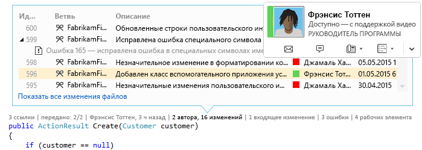  
  
 Чтобы выбрать, какие индикаторы должны отображаться, включить или выключить средство CodeLens, последовательно выберите пункты **Инструменты**, **Параметры**, **Текстовый редактор**, **Все языки**, **CodeLens**.  
  
##   Поиск ссылок на код  
 Требуется:  
  
-   Visual Studio Enterprise или Visual Studio Professional  
  
-   Код Visual C\# .NET или Visual Basic .NET  
  
 Выберите индикатор **ссылок** \(**ALT \+ 2**\). Если в результатах отображается **0 ссылок**, это значит, что ссылки из кода Visual C\# или Visual Basic отсутствуют. Сюда не входят ссылки из других элементов, таких как XAML\- и ASPX\-файлы.  
  
 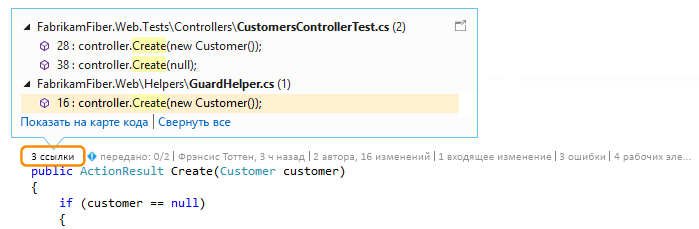  
  
 Чтобы просмотреть код ссылки, наведите указатель мыши на ссылку.  
  
   
  
 Чтобы открыть файл, на который указывает ссылка, дважды щелкните эту ссылку.  
  
 Чтобы просмотреть отношения между этим кодом и его ссылками, [создайте карту кода](../modeling/map-dependencies-across-your-solutions.md) и выберите параметр **Показать все ссылки** в контекстном меню карты кода.  
  
   
  
##   Поиск журнала кода и связанных элементов  
 Просмотрите журнал кода, чтобы узнать, что случилось. Можно также изучить изменения до их внедрения в ваш код, чтобы понять, как изменения в других ветвях могут повлиять на него.  
  
 Требуется:  
  
-   Visual Studio Enterprise или Visual Studio Professional  
  
-   Team Foundation Server 2013 или более поздней версии, Visual Studio Team Services или Git  
  
-   [Lync 2010 или более поздней версии или Skype для бизнеса](http://technet.microsoft.com/en-us/lync) \(для связи с коллегами, не выходя из редактора кода\)  
  
 Для кода на Visual C\# .NET или Visual Basic .NET, который хранится вместе с системой управления версиями Team Foundation \(TFVC\) или Git, сведения CodeLens предоставляются на уровнях класса и метода \(индикаторы *уровня кода элемента*\). Если репозиторий Git находится в TfGit, можно также получить ссылки на рабочие элементы TFS.  
  
   
  
 Для всех других типов файлов, которые можно открыть в редакторе Visual Studio, сведения о CodeLens по всему файлу приводятся в одном месте — в нижней части окна \(индикаторы *уровня файла*\).  
  
   
  
 Чтобы выбрать индикатор с помощью клавиатуры, нажмите и удерживайте клавишу **ALT** для отображения назначенных клавиш с цифрами.  
  
   
  
### Поиск изменений в коде  
 Узнайте, кто изменил ваш код на C\# или Visual Basic, и просмотрите внесенные в код изменения на индикаторах уровня кода элемента. При использовании системы управления версиями Team Foundation \(TFVC\) в Team Foundation Server или Visual Studio Team Services отображается следующее.  
  
   
  
 Период времени по умолчанию — последние 12 месяцев. Если код хранится в Team Foundation Server, это ограничение можно изменить, выполнив [команду TFSConfig](http://msdn.microsoft.com/ru-ru/94424190-3b6b-4f33-a6b6-5807f4225b62) вместе с [командой CodeIndex](../ide/codeindex-command.md) и флагом **\/indexHistoryPeriod**.  
  
 Чтобы просмотреть подробный журнал всех изменений, включая сделанные более года назад, выберите параметр **Показать все изменения файла**.  
  
   
  
 Откроется окно журнала с наборами изменений.  
  
   
  
 Если ваши файлы хранятся в репозитории Git и вы выбираете индикатор изменений на уровне элемента кода, отображается следующее:  
  
   
  
 Просмотрите изменения для всего файла \(кроме файлов C\# и Visual Basic\) на индикаторах уровня файла в нижней части окна.  
  
 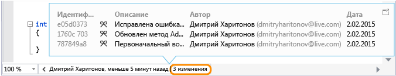  
  
 Чтобы получить дополнительные сведения об изменении, щелкните этот элемент правой кнопкой мыши. В зависимости от того, используется TFVC или Git, вам будут предложены варианты сравнения версий файла, просмотра сведений и отслеживания изменений, получения выбранной версии файла и уведомления автора об изменениях по электронной почте. Некоторые из этих сведений отображаются в Team Explorer.  
  
 Также можно узнать, кто вносил изменения в код в течение определенного времени. Это поможет обнаружить закономерности во вносимых рабочей группой изменениях и оценить их влияние.  
  
   
  
#### Поиск изменений в текущем подразделении  
 Предположим, что ваша группа работает в нескольких подразделениях, основном и дочернем, для снижения риска нарушения стабильности кода:  
  
   
  
 Узнайте, сколько пользователей вносили изменения в код и сколько изменений было сделано в основном подразделении \(**ALT \+ 6**\):  
  
 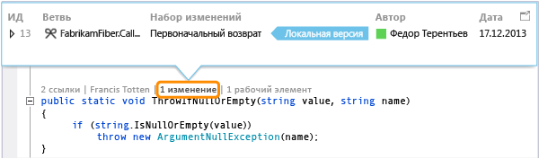  
  
#### Поиск разветвления кода  
 Перейдите к коду в дочернем подразделении, например Dev, как в этом примере. Выберите индикатор изменений \(**ALT \+ 6**\):  
  
 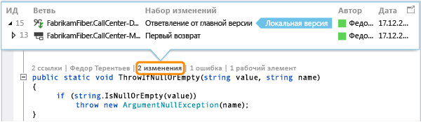  
  
#### Поиск входящих изменений от других подразделений  
   
  
 …как это исправление ошибки в подразделении Dev:  
  
 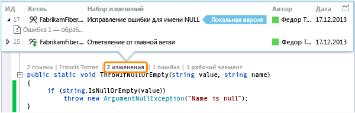  
  
 Вы можете просмотреть это изменение, не покидая текущее подразделение \(Main\):  
  
 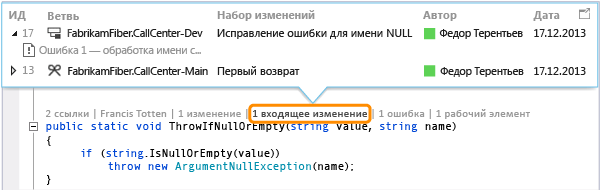  
  
#### Поиск объединения изменений  
 Вы можете увидеть, какие изменения были добавлены в ваше подразделение:  
  
   
  
 Например, код в подразделении Main теперь содержит исправление ошибки из подразделения Dev:  
  
 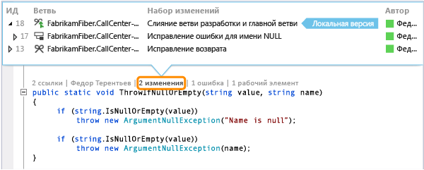  
  
#### Сравните входящее изменение с локальной версией \(SHIFT \+ F10\).  
 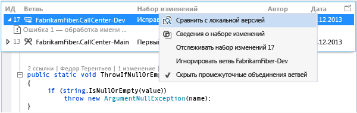  
  
 Можно также дважды щелкнуть набор изменений.  
  
#### Что означают значки?  
  
|**Значок**|**Откуда поступило изменение?**|  
|----------------|-------------------------------------|  
||Текущее подразделение|  
||Родительское подразделение|  
||Дочернее подразделение|  
||Одноранговое подразделение|  
||Подразделение, отличное от родительского, дочернего или однорангового|  
||Слияние с данными от родительского подразделения с дочерним подразделением|  
||Слияние с данными от дочернего подразделения с родительским подразделением|  
||Слияние с данными от несвязанного подразделения \(слияние без базовой версии\)|  
  
### Поиск связанных рабочих элементов  
 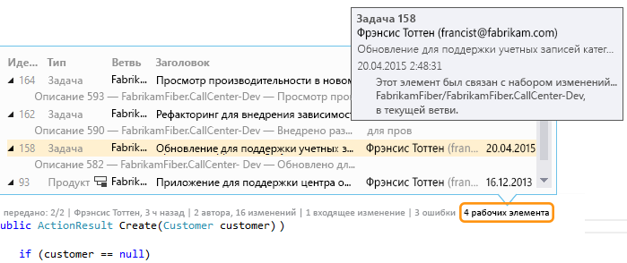  
  
### Поиск связанных проверок кода  
 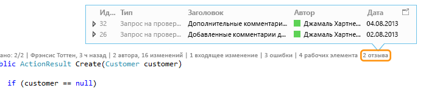  
  
### Поиск связанных ошибок  
 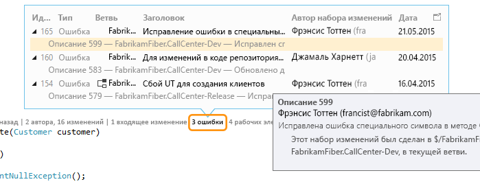  
  
### Обращение к владельцу элемента  
   
  
 Откройте контекстное меню элемента, чтобы увидеть параметры контакта. Если на компьютере установлено приложение Lync или Skype для бизнеса, отобразятся следующие параметры:  
  
   
  
##   Поиск модульных тестов для кода  
 Узнайте больше об имеющихся модульных тестах для кода, не открывая обозреватель тестов. Требуется:  
  
-   Visual Studio Enterprise или Visual Studio Professional  
  
-   Код Visual C\# .NET или Visual Basic .NET  
  
-   [Проект модульного теста](../test/unit-test-your-code.md) с модульными тестами для кода приложения  
  
1.  Перейдите к коду приложения с модульными тестами.  
  
2.  Просмотрите тестовый охват для этого кода \(**ALT \+ 3**\).  
  
     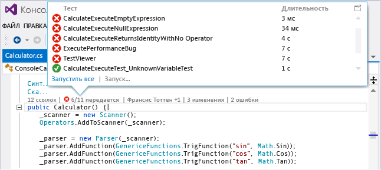  
  
3.  Если отображается значок предупреждения , выполните тесты.  
  
     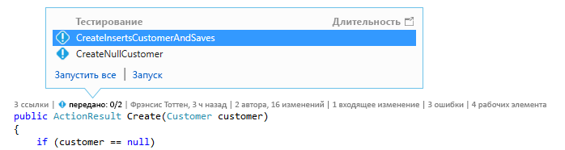  
  
4.  Чтобы просмотреть определение теста, откройте файл кода в редакторе, дважды щелкнув элемент теста в окне индикаторов CodeLens.  
  
     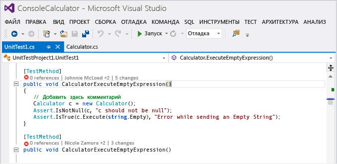  
  
5.  Просмотрите результаты теста. Выберите индикатор состояния теста \( или \) или нажмите клавиши **ALT\+1**.  
  
     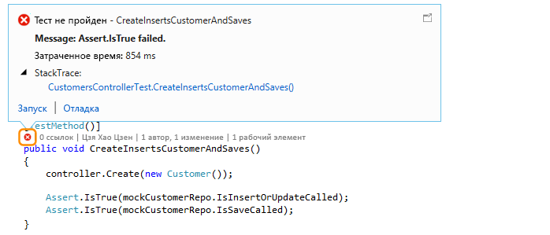  
  
6.  Чтобы увидеть, сколько пользователей изменяло данный тест, кто именно его изменял или сколько изменений было внесено в тест, [Поиск журнала кода и связанных элементов](#FindCodeHistory).  
  
##   Вопросы и ответы  
  
###   Вопрос. Как включить и выключить CodeLens? Как выбрать отображаемые индикаторы?  
 **Ответ.** Включать и выключать можно все индикаторы, кроме индикатора ссылок. Откройте меню **Инструменты** и последовательно выберите пункты **Параметры**, **Текстовый редактор**, **Все языки**, **CodeLens**.  
  
 Если индикаторы включены, параметры CodeLens можно также открыть из индикаторов.  
  
   
  
 Индикаторы CodeLens уровня файла включаются и отключаются с помощью значка шеврона в нижней части окна редактора.  
  
   
  
###   Вопрос. Где находится CodeLens?  
 **Ответ.** CodeLens отображается в коде Visual C\# .NET и Visual Basic .NET на уровне метода, класса, индексатора и свойства. Для всех других типов файлов CodeLens отображается на уровне файла.  
  
-   Включите CodeLens. Откройте меню **Инструменты** и последовательно выберите пункты **Параметры**, **Текстовый редактор**, **Все языки**, **CodeLens**.  
  
-   Если код хранится в TFS, с помощью [команды CodeIndex](../ide/codeindex-command.md) и [команды TFS Config](http://msdn.microsoft.com/ru-ru/94424190-3b6b-4f33-a6b6-5807f4225b62) убедитесь, что индексирование кода включено.  
  
-   Индикаторы, связанные с TFS, отображаются, только когда рабочие элементы связаны с кодом и имеются разрешения на открытие связанных рабочих элементов.[Убедитесь в наличии разрешений члена команды.](http://msdn.microsoft.com/ru-ru/f58805de-ba61-4d09-8f2d-d3ab9662ecfd)  
  
-   Индикаторы модульных тестов не отображаются, если в коде приложения отсутствуют модульные тесты. Индикаторы состояния теста отображаются автоматически в тестовых проектах. Если известно, что код приложения имеет модульные тесты, но индикаторы тестов не отображаются, попробуйте выполнить сборку решения \(**CTRL \+ SHIFT \+ B**\).  
  
### Вопрос: Почему я не вижу сведения рабочего элемента для фиксации?  
 **Ответ.** Это может происходить, когда CodeLens не может найти рабочие элементы в TFS. Проверьте, что вы подключены к командному проекту, который имеет эти рабочие элементы, и что имеются разрешения для просмотра этих рабочих элементов. Это также может произойти, если описание фиксации содержит неверные сведения об идентификаторах рабочих элементов в TFS.  
  
###   Вопрос. Почему не отображаются индикаторы Lync или Skype?  
 **Ответ.** Они не отображаются, если вы не вошли в службу Lync или Skype для бизнеса, не установили ни одну из них или используете неподдерживаемую конфигурацию. Однако вы по\-прежнему можете отправлять почту:  
  
   
  
 **Какие конфигурации Lync и Skype поддерживаются?**  
  
-   Skype для бизнеса \(32\- или 64\-разрядная версия\)  
  
-   Lync 2010 или более поздняя версия отдельно \(32\- или 64\-разрядная\), но не Lync Basic 2013 с Windows 8.1  
  
 CodeLens не поддерживает наличие нескольких установленных версий Lync или Skype. Они могут быть не локализованы для всех локализованных версий Visual Studio.  
  
### Вопрос. Как изменить шрифт и цвет CodeLens?  
 **О.** Последовательно щелкните **Сервис**, **Параметры**, **Среда**, **Шрифты и цвета**.  
  
   
  
 Для использования клавиатуры выполните следующие действия.  
  
1.  Нажмите клавиши **ALT \+ T \+ O**, чтобы открыть окно **Параметры**.  
  
2.  Нажмите клавишу **СТРЕЛКА ВВЕРХ** или **СТРЕЛКА ВНИЗ**, чтобы перейти к узлу **Среда**, а затем нажмите клавишу **СТРЕЛКА ВЛЕВО**, чтобы развернуть узел.  
  
3.  Нажмите клавишу **СТРЕЛКА ВНИЗ**, чтобы перейти к пункту **Шрифты и цвета**.  
  
4.  Нажмите клавишу **TAB**, чтобы перейти к списку **Параметры для**, после чего нажмите клавишу **СТРЕЛКА ВНИЗ**, чтобы выбрать **CodeLens**.  
  
### В. Можно ли переместить HUD\-элемент CodeLens?  
 **Ответ.** Да, щелкните , чтобы закрепить CodeLens как окно.  
  
   
  
   
  
### В. Как обновить индикаторы?  
 **Ответ.** Это зависит от индикатора.  
  
-   **Ссылки**: этот индикатор обновляется автоматически при изменении кода. Если этот индикатор закреплен в отдельном окне, его можно обновить вручную здесь:  
  
       
  
-   **Команда**: эти индикаторы можно обновить вручную здесь:  
  
       
  
-   **Тест**: [Поиск модульных тестов для кода](#FindRunUnitTests), чтобы обновить этот индикатор.  
  
###   Вопрос. Что такое "Локальная версия"?  
 **О.** Стрелка **Локальная версия** указывает на последний набор изменений в локальной версии этого файла. Если на сервере находятся более новые наборы изменений, они отображаются над или под стрелкой **Локальная версия** в зависимости от порядка сортировки наборов изменений.  
  
### Вопрос. Можно ли управлять тем, как CodeLens обрабатывает код для отображения журнала и связанных элементов?  
 **Ответ.** Да, если код находится в TFS, используйте [команду CodeIndex](../ide/codeindex-command.md) с [командой TFS Config](http://msdn.microsoft.com/ru-ru/94424190-3b6b-4f33-a6b6-5807f4225b62).