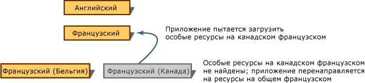

# Иерархическая организация ресурсов для локализации

В Visual Studio локализованные ресурсы (такие данные, как строки и изображения, относящиеся к определенным языкам и региональным параметрам) хранятся в отдельных файлах. Они загружаются в соответствии с языком и региональными параметрами пользовательского интерфейса. Чтобы понять, как загружаются локализованные ресурсы, их можно представить в виде упорядоченной иерархии.

## Типы ресурсов в иерархии

- Исходные ресурсы для языка и региональных параметров по умолчанию, например en (английский), находятся на верхнем уровне иерархии. Только у этих ресурсов нет собственного файла — они хранятся в главной сборке.

- Под исходными ресурсами расположены ресурсы для любых нейтральных языков и региональных параметров. Нейтральные языки и региональные параметры связаны с языком, а не со страной или регионом. Например, fr (французский) относится к нейтральным языкам и региональным параметрам. (Хотя исходные ресурсы предусмотрены также для нейтрального языка и региональных параметров, эти ресурсы отличаются.)

- Под ресурсами для нейтрального языка и региональных параметров расположены ресурсы для конкретных языков и региональных параметров. Специальные языки и региональные параметры связаны с языком и со страной или регионом. Например, fr-CA (французский — Канада) представляет один из специальных языков и региональных параметров.

Если приложение пытается загрузить какие-либо локализованные ресурсы (например, строку), но не может их найти, поиск будет выполняться вверх по иерархии, пока не будет обнаружен файл ресурсов, который и содержит требуемый ресурс.

Для хранения ресурсы рекомендуется максимально обобщить. Это означает, что по возможности локализованные строки, изображения и т. д. следует хранить в файлах ресурсов для нейтральных языков и региональных параметров (но не специальных). Например, у вас могут быть ресурсы для языка и региональных параметров fr-BE (французский — Бельгия), а ресурсы, которые находятся в иерархии выше, представляют исходные ресурсы en (английский). В таком случае при работе с вашим приложением в системе, настроенной для использования fr-CA (французский — Канада), могут возникнуть проблемы. Система ищет вспомогательную сборку для fr-CA и не находит ее. Поэтому загружается главная сборка с исходными ресурсами на английском языке, а не ресурсы для французского языка. На рисунке ниже показан этот нежелательный сценарий.

Если вы последуете рекомендациям и включите максимально возможное число ресурсов в файл нейтральных ресурсов для языка и региональных параметров fr, пользователь из Канады не увидит ресурсы, отмеченные для языка и региональных параметров fr-BE. Вместо этого он увидит строки на французском языке. Этот оптимальный сценарий показан на рисунке ниже.

## См. также

- [Языки нейтральных ресурсов для локализации](../ide/neutral-resources-languages-for-localization.md)
- [Безопасность и локализованные вспомогательные сборки](../ide/security-and-localized-satellite-assemblies.md)
- [Локализация приложений](../ide/localizing-applications.md)
- [Глобализация и локализация приложений](../ide/globalizing-and-localizing-applications.md)