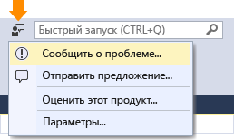
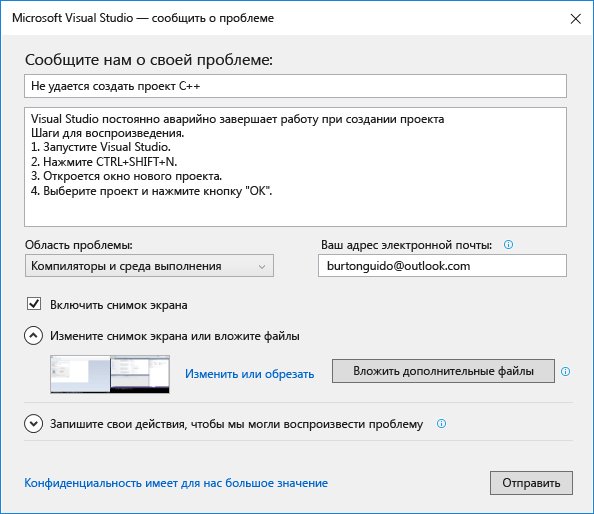
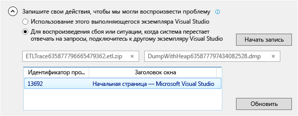

# Как сообщить о проблеме с Visual Studio
[!INCLUDE[vs2017banner](../code-quality/includes/vs2017banner.md)]

Если возникла проблема с Visual Studio, мы хотим о ней узнать, чтобы диагностировать и устранить ее.  С помощью средства **Сообщить о проблеме** можно собрать подробные сведения о проблеме и отправить их в корпорацию Майкрософт, сделав всего несколько щелчков.  
  
 Корпорация Майкрософт уважает вашу конфиденциальность. Сведения о том, как мы обращаемся с поступающей от вас информацией, см. в [Заявлении о конфиденциальности для семейства продуктов Microsoft Visual Studio](https://www.visualstudio.com/en-us/dn948229).  
  
## Откройте средство "Сообщить о проблеме"  
 Щелкните значок "Отзыв пользователя" рядом с элементом **Быстрый запуск** в заголовке окна или щелкните **Справка \> Отправить отзыв \> Сообщить о проблеме**.  
  
   
  
## Опишите проблему  
  
###    
  
1.  Укажите описательное название проблемы, которое поможет нам направить ее соответствующей команде разработчиков Visual Studio.  
  
2.  Укажите дополнительные сведения и, если возможно, действия для воспроизведения проблемы.  
  
3.  В раскрывающемся списке выберите область проблемы. Если вы не уверены, выберите наиболее подходящий, по вашему мнению, вариант.  
  
   
  
## Предоставьте снимок экрана \(необязательно\)  
 Выберите **Включить снимок экрана** для отправки текущего экрана в Майкрософт. Средство позволяет обрезать изображение, чтобы осталась только часть экрана, отражающая проблему. Можно добавить другие снимки экранов или файлы, нажав кнопку **Вложить дополнительные файлы**.  
  
## Укажите дамп трассировки и кучи \(необязательно\)  
  
###    
  
1.  Файлы дампов трассировки и кучи очень помогают в диагностике проблем.   Мы будем признательны, если вы используете средство "Сообщить о проблеме", чтобы записать шаги по воспроизведению проблемы и отправить данные в Майкрософт.  
  
2.  Щелкните значок шеврона рядом с надписью **Записать действия по воспроизведению проблемы**. Если из\-за проблемы Visual Studio перестает отвечать на запросы или аварийно завершает работу, откройте другой экземпляр Visual Studio и выберите его из списка.  
  
3.  Щелкните **Начать запись** и выполните действия, которые воспроизводят проблему. Когда закончите, щелкните **Остановить запись** в плавающем окне.  
  
4.  Подождите несколько минут, чтобы позволить Visual Studio собрать и упаковать записанные сведения. По завершении процесса сбора диалоговое окно будет выглядеть примерно следующим образом:  
  
       
  
## При наличии способа обхода проблемы опишите его.  
 Если вам удалось обойти проблему, опишите способ обхода в специальном редактируемом поле. Это позволит нам не только диагностировать проблему, но и помочь другим пользователям, у которых может возникать такая же проблема.  
  
## Отправьте отчет  
 Нажмите кнопку "Отправить" для отправки отчета вместе с изображениями и файлами трассировки или дампа. Если кнопка **Отправить** недоступна, убедитесь, что вы ввели название и описание.  
  
## См. также  
 [Обращайтесь к нам](../ide/talk-to-us.md)