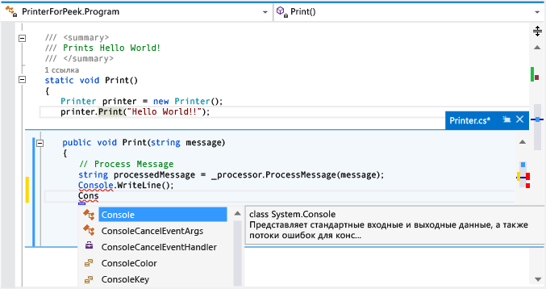

# Практическое руководство. Просмотр и изменение кода с помощью окна "Показать определение" (ALT+F12)

Команду **Показать определение** можно использовать для просмотра и изменения определений кода без переключения с текущего кода, над которым работает пользователь. Команды **Показать определение** и **Перейти к определению** отображают одни и те же сведения, но команда **Перейти к определению** отображает их во всплывающем окне, а команда **Перейти к определению** — в отдельном окне. При вызове команды **Перейти к определению** текущий контекст (т. е. активное окно кода, текущая строка и позиция курсора) переключается на окно кода определения. С помощью функции **Показать определение** можно просмотреть и изменить определение, а также перемещаться по файлу определения, оставаясь при этом на месте в изначально открытом файле исходного кода.

Команду **Показать определение** можно применить при работе с кодом C#, Visual Basic и C++. В Visual Basic в разделе **Показать определение** отображается ссылка на **обозреватель объектов** для символов, которые не имеют метаданных определения (например, встроенных типов .NET Framework).

## Работа с окном "Показать определение"

### Открытие окна "Показать определение"

1. Вы можете показать определение, выбрав команду **Показать определение** в контекстном меню для типа или члена, который хотите просмотреть. Если этот параметр включен в Visual Studio 2017 версии 15.4 или более поздней, вы также можете показать определение с помощью мыши, нажав клавишу **CTRL** (или другой модификатор) и щелкнув имя члена. Кроме того, можно нажать клавиши **ALT**+**F12** на клавиатуре.

     На этой иллюстрации представлено окно **Показать определение** для метода с именем `Print()`:

     

     Окно определения отображается под строкой `printer.Print("Hello World!")` в исходном файле. Данное окно не скрывает никакие фрагменты кода в исходном файле. Строки, следующие за `printer.Print("Hello World!")`, отображаются под окном определения.

1. Можно переместить курсор в другую точку в окне отображения определения. При этом вы сохраняете возможность перемещаться по исходному окну кода.

1. Можно скопировать строку из окна определения и вставить ее в исходный код. Можно также перетащить строку из окна определения в исходный код, не удаляя ее из окна определения.

1. Чтобы закрыть окно определения, нажмите клавишу **ESC** или кнопку **Закрыть** на вкладке окна определения.

### Открытие окна "Показать определение" из окна "Показать определение"

Если окно **Показать определение** уже открыто, можно применить функцию **Показать определение** к коду в данном окне. В этом случае откроется еще одно окно определения. Рядом с вкладкой окна определения отображается набор точек навигации, который можно использовать для перехода из одного окна определения в другое. Всплывающая подсказка для каждой точки отображает имя файла и путь к файлу определения, представляемого данной точкой.

   

### Окно "Показать определение" с несколькими результатами

При использовании окна **Показать определение** в коде, который содержит более одного определения (например, разделяемые классы), список результатов отображается справа от представления определения кода. Можно выбрать любой результат в списке, чтобы открыть его определение.

   

### Правка содержимого окна "Показать определение"

Когда пользователь приступает к редактированию содержимого окна **Показать определение**, изменяемый файл автоматически открывается на отдельной вкладке в редакторе кода, отражая уже внесенные изменения. Если затем содержимое окна **Показать определение** будет изменено путем добавления данных, отмены и сохранения внесенных изменений, эти изменения будут отражены на этой вкладке. Даже если закрыть окно **Показать определение** без сохранения изменений, вы можете отменить, вносить, отменять и сохранять дополнительные изменения на вкладке, начав работу с того места в окне **Показать определение**, где вы закончили в прошлый раз.

   

### Изменение параметров для функции "Показать определение"

1. Последовательно выберите пункты **Средства** > **Параметры** > **Текстовый редактор** > **Общие**.

1. Выберите параметр **Открыть определение в быстром редакторе**.

1. Нажмите кнопку **ОК**, чтобы закрыть диалоговое окно **Параметры**.

     

### Сочетания клавиш при работе с окном "Показать определение"

При работе с окном **Показать определение** можно использовать следующие сочетания клавиш.

|Функция|Сочетание клавиш|
|-------------------|:-----------------------:|
|Открытие окна определения|ALT+F12|
|Закрытие окна определения|ESC|
|Преобразование окна определения в стандартную вкладку документа|SHIFT+ALT+HOME|
|Переход из одного окна определения в другое|CTRL+ALT+- и CTRL+ALT+=|
|Переключение с одного результата на другой|F8 и SHIFT+F8|
|Переключение между окном редактора кода и окном определения|SHIFT+ESC|

> [!NOTE]
> Для редактирования кода в окне **Показать определение** можно также использовать те же сочетания клавиш, что и в любом другом окне Visual Studio.

## См. также

[Перемещение по коду](../ide/navigating-code.md)  
[Функции "Перейти к определению" и "Показать определение"](../ide/go-to-and-peek-definition.md)  
[Советы по повышению производительности](../ide/productivity-tips-for-visual-studio.md)