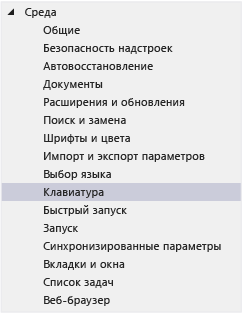
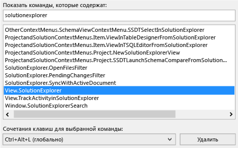
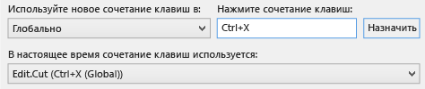
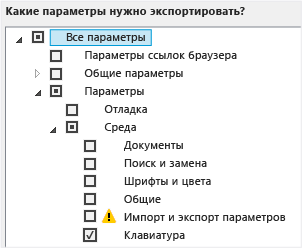
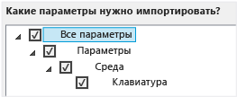

# Определение и настройка сочетаний клавиш в Visual Studio

Вы можете определить сочетания клавиш для команд Visual Studio, настроить эти сочетания клавиш и экспортировать их для других пользователей. Многие сочетания клавиш всегда вызывают одни и те же команды, в то время как поведение других сочетаний клавиш может быть различным в зависимости от следующих условий:

- параметры среды по умолчанию, которые были выбраны при первом открытии Visual Studio (например, "Обычные параметры среды разработки" или "Visual C#"). (Дополнительные сведения об изменении или сбросе параметров см. в [этой статье](environment-settings.md).);

- настраивались ли сочетания клавиш пользователем;

- контекст в момент нажатия сочетания клавиш. Например, клавиша **F2** вызывает команду `Edit.EditCell` при использовании **конструктора параметров** или команду `File.Rename` при использовании **Team Explorer**.

Независимо от настроенных параметров и контекста сочетания клавиш можно всегда найти и изменить в диалоговом окне **Параметры**. Вы можете также просмотреть сочетания клавиш по умолчанию для нескольких десятков команд в статье [популярные сочетания клавиш](../ide/default-keyboard-shortcuts-for-frequently-used-commands-in-visual-studio.md). Полный список сочетаний клавиш по умолчанию (для режима **Обычные параметры среды разработки**) собран в [этой статье](../ide/default-keyboard-shortcuts-in-visual-studio.md).

Если сочетание клавиш назначено команде только в *глобальном* контексте, но не в других контекстах, это сочетание будет всегда вызвать данную команду. Однако сочетание клавиш можно назначить одной команде в глобальном контексте и другой команде в более узком контексте. При использовании такого сочетания клавиш в конкретном контексте вызывается команда для данного контекста, а не для глобального контекста.

> [!NOTE]
> Имена и расположение команд меню и параметров в диалоговых окнах могут зависеть от пользовательских настроек и выпуска Visual Studio. Эта страница основана на профиле параметров **Обычные параметры разработки**.

## Определение сочетания клавиш

1. В строке меню выберите **Сервис** > **Параметры**.

2. Разверните пункт **Среда** и выберите элемент **Клавиатура**.

   

3. В поле **Показать команды, содержащие** введите полное имя команды без пробелов или его часть.

   Например, можно найти команды для `solutionexplorer`.

4. В списке выберите нужную команду.

    Например, можно выбрать `View.SolutionExplorer`.

5. Если команда имеет сочетание клавиш, оно отображается в списке **Сочетание клавиш для выбранной команды**.

   

## Настройка сочетания клавиш

1. В строке меню выберите **Сервис** > **Параметры**.

2. Разверните пункт **Среда** и выберите элемент **Клавиатура**.

3. Необязательно. Отфильтруйте список команд, введя полное имя команды без пробелов или его часть в поле **Показать команды, содержащие**.

4. Выберите из списка команду, которой нужно назначить сочетание клавиш.

   В списке **Область действия** выберите функциональную область, в которой будет использоваться данное сочетание клавиш.

   Чтобы использовать сочетание в любом контексте, выберите **Глобальная**. Вы можете выбрать любое сочетание клавиш, которое не используется в другом редакторе (например, как глобальное). В противном случае будет использование сочетание клавиш редактора.

   > [!NOTE]
   > В **глобальном** контексте невозможно назначать сочетания клавиш, включающие следующие клавиши:
   >
   > - ВВОД, табуляция, CAPS LOCK;
   > - Print Scrn/Sys Rq, Scroll Lock, Pause/Break;
   > - Insert, Home, End, Page Up, Page Down;
   > - клавиша с логотипом Windows, клавиша приложения, любая из клавиш со стрелками;
   > - Num Lock, Delete или Clear на цифровой клавиатуре;
   > - сочетание клавиш Ctrl+Alt+Delete.

6. В поле **Введите сочетание клавиш** введите требуемое сочетание клавиш.

    > [!NOTE]
    > Вы можете создать сочетание клавиш, состоящее из буквы и клавиши **ALT**, **CTRL** или из обеих этих клавиш. Кроме того, можно создать сочетание клавиш, состоящее из клавиши **SHIFT** и буквы с клавишей **ALT**, **CTRL** или обеими этими клавишами.

     Если сочетание клавиш уже назначено другой команде, оно отображается в поле **Сочетание клавиш в настоящий момент используется для**. В этом случае нажмите клавишу **BACKSPACE**, чтобы удалить сочетание клавиш, прежде чем пробовать другое сочетание.

    

7. Нажмите кнопку **Назначить**.

    > [!NOTE]
    > Если вы задали для команды другое сочетание клавиш, нажали **Назначить**, а затем кнопку **Отмена**, диалоговое окно закрывается, но изменение не отменяется.

## Совместное использование пользовательских сочетаний клавиш

Вы можете поделиться своими сочетаниями клавиш, экспортировав их в файл, а затем передав этот файл другим пользователям, чтобы они импортировали данные из него.

### Экспорт сочетаний клавиш

1. В строке меню выберите **Сервис** > **Импорт и экспорт параметров**.

2. Выберите команду **Экспортировать выбранные параметры среды** и щелкните **Далее**.

3. В области **Выберите параметры для экспорта** снимите флажок **Все параметры**, разверните узел **Параметры**, а затем узел **Среда**.

4. Установите флажок **Клавиатура** и щелкните **Далее**.

   

5. В полях **Выберите имя для файла параметров** и **Сохранить файл параметров в этом каталоге** сохраните значения по умолчанию или укажите другие значения, а затем щелкните **Готово**.

::: moniker range="vs-2017"

По умолчанию сочетания клавиш сохраняются в файле в папке *%USERPROFILE%\Documents\Visual Studio 2017\Settings*. Имя файла содержит дату экспорта параметров и имеет расширение *VSSETTINGS*.

::: moniker-end

::: moniker range=">=vs-2019"

По умолчанию сочетания клавиш сохраняются в файле в папке *%USERPROFILE%\Documents\Visual Studio 2019\Settings*. Имя файла содержит дату экспорта параметров и имеет расширение *VSSETTINGS*.

::: moniker-end

### Импорт сочетаний клавиш

1. В строке меню выберите **Сервис** > **Импорт и экспорт параметров**.

2. Выберите вариант **Импортировать выбранные параметры среды** и щелкните **Далее**.

3. Выберите вариант **Нет, импортировать новые значения, перезаписав мои текущие параметры**, а затем щелкните **Далее**.

4. В окне **Мои параметры** выберите файл, содержащий нужные сочетания клавиш, или нажмите кнопку **Обзор**, чтобы найти нужный файл.

5. Щелкните **Далее**.

6. В области **Выберите параметры для импорта** снимите флажок **Все параметры**, разверните узел **Параметры**, а затем узел **Среда**.

7. Установите флажок **Клавиатура** и щелкните **Готово**.

   

## См. также раздел

- [Специальные возможности Visual Studio](../ide/reference/accessibility-features-of-visual-studio.md)
