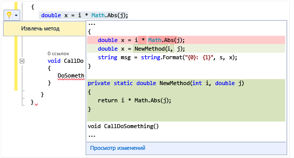

# Выполнение быстрых действий с лампочками
Лампочки представляют собой возможность для повышения производительности в Visual Studio. Они представляют собой значки, которые отображаются в редакторе Visual Studio и которые можно щелкнуть для выполнения быстрых действий, включая рефакторинг и исправление ошибок. Лампочки облегчают исправление ошибок и рефакторинг в одной фокальной точке — часто непосредственно в строке, где выполняется ввод текста.  

   

 В C# и Visual Basic лампочка видна, если проблема подчеркнута красной волнистой линией и Visual Studio предлагает способ ее исправления. Например, если имеется ошибка, подчеркнутая красной волнистой линией, лампочка загорится, когда станут доступны пути исправления этой ошибки. В C++ при добавлении новой функции в файл заголовка отображается лампочка, которая предлагает создать реализацию заглушки этой функции. Сторонние разработчики могут предоставить для любого языка пользовательскую диагностику и предложения, например в рамках SDK, и лампочки Visual Studio будут появляться на основе этих правил.  

## Отображение лампочки  

1.  Во многих случаях лампочки самопроизвольно появляются при наведении указателя мыши в момент ошибки или в левом поле редактора при перемещении курсора в строку, которая содержит ошибку. Если вы видите красную волнистую линию, наведите на нее курсор, чтобы появилась лампочка. Также можно включить отображение лампочки при использовании мыши или клавиатуры для перехода к строке, где возникла проблема.  

2.  Нажмите клавиши **CTRL+.** в любом месте строки, чтобы обойти лампочку и перейти непосредственно к списку возможных исправлений.  

   

## Просмотр возможных исправлений  
 Щелкните стрелку вниз или ссылку "Показать возможные исправления", чтобы увидеть список быстрых действий, которые может предпринять лампочка.  

   

## Рефакторинг  
 Вы все еще можете выполнить рефакторинг, вызвав контекстное меню щелчком правой кнопки мыши или нажав клавиши CTRL + . для отображения параметров рефакторинга. На следующем изображении предлагается выполнить рефакторинг метода извлечения после нажатия клавиш CTRL + . в любом месте строки, содержащей вызов `Math.Abs`:  

 

