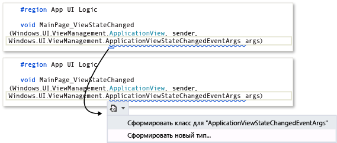
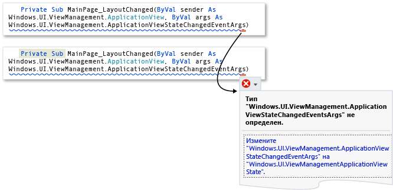
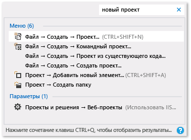

# Советы по повышению продуктивности при работе в Visual Studio
Следующие советы помогут вам быстрее и эффективнее писать и отлаживать код в Visual Studio, а также перемещаться по нему. Дополнительные сведения о стандартных сочетаниях клавиш см. в статье [Советы и рекомендации](../ide/tips-and-tricks-for-visual-studio.md). Более полный список см. в разделах [Определение и настройка сочетаний клавиш](../ide/identifying-and-customizing-keyboard-shortcuts-in-visual-studio.md) и [Сочетания клавиш по умолчанию](../ide/default-keyboard-shortcuts-in-visual-studio.md).  
  
 Этот раздел включает следующие подразделы:  
  
 [Доступ к инструментам Visual Studio](../ide/productivity-tips-for-visual-studio.md#BKMK_Access)  
  
 [Создание кода](../ide/productivity-tips-for-visual-studio.md#BKMK_Writing)  
  
 [Перемещение по коду](../ide/productivity-tips-for-visual-studio.md#BKMK_Navigating)  
  
 [Более быстрый поиск нужных элементов](../ide/productivity-tips-for-visual-studio.md#BKMK_Finding)  
  
 [Отладка кода](../ide/productivity-tips-for-visual-studio.md#BKMK_Debugging)  
  
 [Управление файлами, панелями инструментов и окнами](../ide/productivity-tips-for-visual-studio.md#BKMK_Managing)  
  
##   Доступ к инструментам Visual Studio  
 Вы сможете быстрее переходить к командной строке разработчика или к другим инструментам, если закрепите их на начальном экране или на панели задач.  
  
1.  На начальном экране введите `Visual Studio Tools` и затем нажмите клавишу ВВОД.  
  
2.  В **проводнике** откройте контекстное меню требуемого элемента.  
  
    -   Уведомления сборки  
  
    -   Диспетчер отлаживаемых пакетов  
  
    -   Командная строка разработчика для VS2013  
  
    -   Microsoft Feedback Client 2013  
  
    -   Командная строка VS2013 ARM Cross Tools  
  
    -   Командная строка VS2013 x64 Cross Tools  
  
    -   Командная строка VS2013 x64 Native Tools  
  
    -   Командная строка VS2013 x86 Native Tools  
  
3.  Выберите **Закрепить на начальном экране** или **Закрепить в панели задач**.  
  
##   Создание кода  
 Следующие возможности позволяют быстрее разрабатывать код.  
  
-   **Использование примеров приложений**. Разработку приложений можно ускорить, загрузив и установив примеры приложений из галереи кода MSDN. Кроме того, вы можете изучить ту или иную технологию или концепцию программирования, загрузив и изучив пакет примеров для этой области.  
  
-   **Использование IntelliSense**. При вводе кода в редакторе отображаются данные IntelliSense, например элементы списков, сведения о параметрах, краткие сведения, справка по сигнатурам и завершение слов. Эти возможности поддерживают нечеткое соответствие текста; например, результаты для списков членов включают не только элементы, которые начинаются с введенных символов, но и элементы, содержащие это сочетание символов где-либо внутри своих имен. Дополнительные сведения см. в статье [Using IntelliSense](../ide/using-intellisense.md) (Использование IntelliSense).  
  
-   **Изменение параметров автоматической вставки IntelliSense при вводе кода**. Переключив IntelliSense в режим предложений, вы можете настроить IntelliSense таким образом, чтобы предлагаемые варианты вставлялись только в случае их явного выбора.  
  
     Чтобы включить режим предложений, нажмите сочетание клавиш CTRL+ALT+ПРОБЕЛ или в строке меню выберите **Правка**, **IntelliSense**, **Переключить режим завершения**.  
  
-   **Использование фрагментов кода**. Вы можете использовать встроенные фрагменты кода или создавать собственные фрагменты.  
  
     Чтобы вставить фрагмент, в строке меню выберите **Правка**, **IntelliSense**, **Вставить фрагмент** или откройте контекстное меню в файле и выберите **Вставить фрагмент**. Дополнительные сведения см. в статье [Фрагменты кода](../ide/code-snippets.md).  
  
-   **Использование встроенных функций исправления ошибок в коде**. Смарт-теги отображаются в виде синих или красных прямоугольников под строкой кода. Можно изменить параметры отображения смарт-тега, выбрав один из прямоугольников или поместив курсор в строку кода и нажав сочетание клавиш CTRL+. (точка).  
  
     Синие прямоугольники предлагают варианты исправления ошибок в коде.  
  
     Рисунок 1. Смарт-теги ошибок  
  
       
  
     Красные прямоугольники предлагают варианты рефакторинга кода.  
  
     Рисунок 2. Смарт-теги рефакторинга  
  
       
  
-   **Отображение и изменение определений элементов кода**. Вы можете быстро отобразить и изменить модуль, в котором определен элемент кода, например член, переменная или локальный объект.  
  
     Чтобы открыть определение во всплывающем окне, выделите элемент и нажмите сочетание клавиш ALT+F12 или откройте контекстное меню для этого элемента, а затем выберите пункт **Показать определение**. Чтобы открыть определение в отдельном окне с кодом, откройте контекстное меню элемента кода, а затем выберите команду **Перейти к определению**.  
  
##   Перемещение по коду  
 Существует множество способов быстрого поиска нужных мест в коде и перехода к этим местам.  
  
-   **Создание закладок для строк кода**. Для быстрого перехода к определенным строкам кода в файле можно использовать закладки.  
  
     Чтобы установить закладку, в строке меню выберите **Правка**, **Закладки**, **Переключить закладку**. Все закладки в решении можно просматривать в окне **Закладки**. Дополнительные сведения см. в разделе [Установка закладок в коде](../ide/setting-bookmarks-in-code.md).  
  
-   **Поиск определений символов в файле**. Чтобы найти определения символов и имена файлов, можно выполнить поиск по решению, но результаты поиска не будут содержать пространств имен и локальных переменных.  
  
     Для доступа к этой возможности в строке меню выберите **Правка**, **Перейти к**.  
  
-   **Просмотр общей структуры кода**. В **обозревателе решений** можно выполнять поиск и просматривать имеющиеся в проектах классы, их типы и члены. Можно также выполнять поиск символов, просматривать иерархию вызовов методов, находить ссылки на символы и выполнять другие задачи. Если выбрать элемент кода в **обозревателе решений**, связанный файл будет открыт на вкладке **Предварительный просмотр**, а курсор перемещен к элементу в файле. Дополнительные сведения см. в разделе [Просмотр структуры кода](../ide/viewing-the-structure-of-code.md).  
  
##   Более быстрый поиск нужных элементов  
 В интегрированной среде разработки можно выполнять поиск нужных команд, файлов и параметров, а также фильтровать содержимое окна инструментов для отображения только информации, необходимой для текущей задачи.  
  
-   **Фильтрация содержимого окна инструментов**. Вы можете выполнять поиск по содержимому различных окон инструментов, например **Панель элементов**, окно **Свойства** и **Обозреватель решений**, но отображать только те элементы, имена которых содержат искомые символы.  
  
-   **Отображение только тех ошибок, которые необходимо устранить**. При нажатии кнопки **Фильтр** на панели инструментов **Список ошибок** можно уменьшить количество ошибок, отображаемых в окне **Список ошибок**. Можно отображать только ошибки в файлах, открытых в редакторе, только ошибки в текущем файле или только ошибки в текущем проекте. Кроме того, можно выполнять поиск в окне "Список ошибок", чтобы находить конкретные ошибки.  
  
-   **Поиск диалоговых окон, команд меню и параметров**. В окне [Быстрый запуск, среда, диалоговое окно "Параметры"](../ide/reference/quick-launch-environment-options-dialog-box.md) введите ключевые слова или фразы, относящиеся к элементам, которые требуется найти. Например, при вводе запроса `new project` отображаются следующие результаты:  
  
     Рисунок 3. Список результатов быстрого запуска для запроса `new project`  
  
       
  
     На панели **Быстрый запуск**, помимо прочего, отображаются ссылки на диалоговое окно **Создание проекта** диалоговое окно **Добавление нового элемента** и страницу "Проекты и решения" в диалоговом окне **Параметры**. Результаты на панели быстрого запуска также могут содержать файлы проектов и окна инструментов.  
  
##   Отладка кода  
 Отладка может занимать немало времени, но следующие советы помогут ускорить процесс.  
  
-   **Тестирование одних и тех же страниц, приложений и сайтов в различных браузерах**. В процессе отладки кода можно легко переключаться между установленными веб-браузерами, включая [инспектор страниц (Visual Studio)](http://msdn.microsoft.com/Library/65880969-1ad2-47be-85b9-bb12c81bf209), без необходимости открытия диалогового окна **Просмотр с помощью**. С помощью списка **Целевой объект отладки**, расположенного на панели инструментов **Стандартная** рядом с кнопкой **Начать отладку**, можно быстро узнать, какой именно браузер используется для отладки и просмотра страниц.  
  
       
  
-   **Установка временных точек останова**. Вы можете создать временную точку останова в текущей строке кода и одновременно запустить отладчик. При достижении этой строки кода отладчик входит в режим приостановки выполнения. Дополнительные сведения см. в статье [Навигация по коду с помощью отладчика](../debugger/navigating-through-code-with-the-debugger.md).  
  
     Для использования этой возможности нажмите сочетание клавиш CTRL+F10 или откройте контекстное меню строки кода, на которой требуется прервать выполнение, и выберите команду **Выполнить до текущей позиции**.  
  
-   **Перемещение точки выполнения во время отладки**. Вы можете переместить текущую точку выполнения в другой раздел кода и перезапустить отладку с этой точки. Этим приемом удобно пользоваться, если необходимо выполнить отладку раздела кода без повторного создания всех шагов, необходимых для достижения этого раздела. Дополнительные сведения см. в статье [Навигация по коду с помощью отладчика](../debugger/navigating-through-code-with-the-debugger.md).  
  
     Чтобы переместить точку выполнения, перетащите желтую стрелку в место, где нужно задать следующий оператор в том же файле исходного кода, а затем нажмите F5, чтобы продолжить отладку.  
  
-   **Запись информации о значениях переменных**. К переменной в коде можно добавить подсказу по данным и прикрепить ее, чтобы легко узнать последнее значение этой переменной после завершения отладки. Дополнительные сведения см. в статье [Просмотр значений данных в подсказках по данным](../debugger/view-data-values-in-data-tips-in-the-code-editor.md).  
  
     Для добавления подсказки по данным отладчик должен находиться в режиме приостановки. Поместите курсор на переменную, а затем нажмите кнопку закрепления в появившейся подсказке по данным. При остановке отладки в исходном файле рядом со строкой кода, которая содержит переменную, отображается значок синей булавки. При наведении указателя мыши на синюю булавку появляется значение переменной из последнего сеанса отладки.  
  
-   **Очистка окна интерпретации**. Содержимое [окна интерпретации](../ide/reference/immediate-window.md) можно очистить во время разработки, введя `>cls` или `>Edit.ClearAll`.  
  
     Дополнительные сведения о дополнительных командах см. в статье [Предопределенные псевдонимы команд Visual Studio](../ide/reference/visual-studio-command-aliases.md).  
  
##   Управление файлами, панелями инструментов и окнами  
 В процессе разработки приложения можно одновременно работать в нескольких файлах кода и перемещаться между несколькими окнами инструментов. Чтобы держать все окна и инструменты в порядке, следуйте приведенным ниже советам.  
  
-   **Оставляйте файлы, которые используются часто, видимыми в редакторе**. Можно закрепить файлы в левой части набора вкладок, чтобы они оставались видимыми независимо от того, сколько файлов открыто в редакторе.  
  
     Чтобы закрепить файл, выберите вкладку файла, а затем нажмите кнопку **Закрепить/открепить**.  
  
-   **Переместите документы и окна на другие мониторы**. Если при разработке приложения используется несколько мониторов, можно более эффективно работать над отдельными частями приложения, перемещая открытые в редакторе файлы на другой монитор. Можно также перемещать окна инструментов, например окна отладчика, на другой монитор и закреплять окна документов вместе с окнами инструментов с помощью вкладок для создания блоков. Дополнительные сведения см. в статье [Настройка макетов окон в Visual Studio](../ide/customizing-window-layouts-in-visual-studio.md).  
  
     Для более эффективного управления файлами можно создать новый экземпляр **обозревателя решений** и переместить его на другой монитор. Чтобы создать еще один экземпляр **обозревателя решений**, откройте контекстное меню в **обозревателе решений** и выберите команду **Создать представление обозревателя решений**.  
  
-   **Настройка шрифтов, отображаемых в Visual Studio**. Вы можете изменять начертания, размеры и цвета шрифтов, используемых для текста в интегрированной среде разработки. Например, можно задать цвета определенных элементов кода в редакторе и начертание шрифта в отдельных окнах инструментов или во всей интегрированной среде разработки. Дополнительные сведения см. в статьях [Практическое руководство. Изменение шрифтов и цветов](../ide/how-to-change-fonts-and-colors-in-visual-studio.md) и [Практическое руководство: изменение шрифтов и цветов](../ide/reference/how-to-change-fonts-and-colors-in-the-editor.md).  
  
## См. также  
 [Сочетания клавиш по умолчанию для часто используемых команд](../ide/default-keyboard-shortcuts-for-frequently-used-commands-in-visual-studio.md)   
 [Практическое руководство. Настройка меню и панелей инструментов](../ide/how-to-customize-menus-and-toolbars-in-visual-studio.md)   
 [Пошаговое руководство. Создание простого приложения](../ide/walkthrough-create-a-simple-application-with-visual-csharp-or-visual-basic.md)   
 [Специальные возможности. Советы и рекомендации](../ide/reference/accessibility-tips-and-tricks.md)
