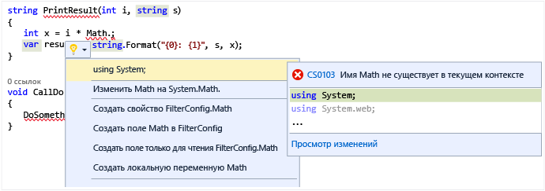

# Быстрые действия

Быстрые действия позволяют легко создавать и изменять код, а также выполнять его рефакторинг одним действием. Быстрые действия доступны для C#, [C++](/cpp/ide/writing-and-refactoring-code-cpp) и файлов кода Visual Basic. Некоторые действия доступны только для определенного языка, тогда как другие доступны для всех языков.

Быстрые действия можно использовать для решения следующих задач:

- исправление кода при нарушениях правил [анализатора кода](../code-quality/roslyn-analyzers-overview.md);

::: moniker range=">=vs-2019"

- [игнорирование](../code-quality/use-roslyn-analyzers.md#suppress-violations) нарушений правил анализа кода или [настройка](../code-quality/use-roslyn-analyzers.md#set-rule-severity-from-the-light-bulb-menu) их уровня серьезности;

::: moniker-end

::: moniker range="vs-2017"

- [игнорирование](../code-quality/use-roslyn-analyzers.md#suppress-violations) нарушений правил анализа кода;

::: moniker-end

- применение рефакторинга (например, [встраивание временной переменной](../ide/reference/inline-temporary-variable.md));

- создание кода (например, [представление локальной переменной](../ide/reference/introduce-local-variable.md)).

> [!NOTE]
> Этот раздел относится к Visual Studio в Windows. Информацию о Visual Studio для Mac см. в статье [Рефакторинг кода (Visual Studio для Mac)](/visualstudio/mac/refactoring).

Быстрые действия можно применять, используя значок лампочки , значок отвертки  или сочетание клавиш **CTRL**+ **.** когда курсор находится на строке кода, для которой доступно действие. Лампочка, сигнализирующая об ошибке,  отображается, если есть красная волнистая линия, указывающая на ошибку, и у Visual Studio есть решение этой ошибки.

Сторонние разработчики могут предоставить для любого языка пользовательскую диагностику и предложения, например в рамках пакета SDK, и лампочки Visual Studio будут отображаться на основе этих правил.

## Значки

Значок, отображающийся при доступном быстром действии, указывает на тип доступного исправления или рефакторинга. Значок *отвертки*  указывает, что доступны действия по изменению кода, но вам не обязательно их использовать. Значок *желтой лампочки*  указывает, что доступны действия, которые *следует* сделать для улучшения кода. Значок *лампочки с ошибкой*  указывает, что доступны действия для исправления ошибки в коде.

## Отображение лампочки и отвертки

Если доступно исправление, отображаются лампочки:

- При наведении курсора мыши на расположение ошибки.

   

- В левом поле редактора при перемещении курсора в соответствующую строку кода.

Вы также можете нажать клавиши **Ctrl**+ **.** в любом месте строки, чтобы увидеть список доступных быстрых действий и рефакторингов.

Чтобы просмотреть возможные исправления, щелкните стрелку вниз рядом с лампочкой или ссылку **Показать возможные исправления**. Отобразится список доступных быстрых действий.

## См. также раздел

- [Создание кода в Visual Studio](../ide/code-generation-in-visual-studio.md)
- [Распространенные быстрые действия](../ide/common-quick-actions.md)
- [Стили кода и быстрые действия](../ide/code-styles-and-code-cleanup.md)
- [Написание и рефакторинг кода (C++)](/cpp/ide/writing-and-refactoring-code-cpp)
- [Рефакторинг (Visual Studio для Mac)](/visualstudio/mac/refactoring)
