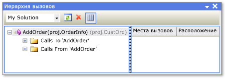

# Просмотр иерархии вызовов

При просмотре иерархии вызовов для кода вы можете переходить между всеми входящими и исходящими вызовам выбранного метода, свойства или конструктора. Это облегчает понимание структуры кода, позволяя оценивать последствия его изменения. Вы можете проверять разные уровни кода, просматривая сложные цепочки вызовов методов и дополнительные точки входа, связанные с кодом. Это позволяет исследовать все возможные пути выполнения.

В Visual Studio вы можете просматривать иерархию вызовов во время разработки. Это означает, что вам не нужно задавать точку останова и запускать отладчик, чтобы просмотреть стек вызовов среды выполнения.

## Использование окна "Иерархия вызовов"

Чтобы отобразить окно **Иерархия вызовов**, щелкните правой кнопкой мыши имя метода, свойства или вызова конструктора, а затем выберите пункт **Просмотр иерархии вызовов**.

Имя члена отображается в окне **Иерархия вызовов** в области представления в виде дерева. Если развернуть узел элемента, то появятся вложенные узлы **Calls To** (Вызовы к) *имя элемента* и **Calls From** (Вызовы из) *имя элемента*. На рисунке ниже показаны эти узлы в окне **Иерархия вызовов**.

- Если развернуть узел **Вызовы**, отобразятся все члены, вызывающие выбранный член.

- Если развернуть узел **Вызовы из**, отобразятся все члены, вызываемые выбранным членом.

Затем можно развернуть каждый из членов этих вложенных узлов в узлах **Вызовы** и **Вызовы из**. Это дает возможность переходить по стеку вызывающих объектов, как показано на приведенном ниже рисунке.

Для членов, определенных как виртуальные или абстрактные, появляется узел **Переопределяет имя_метода**. Для членов интерфейса появляется узел **Реализует имя метода**. Эти разворачиваемые узлы находятся на одном уровне с узлами **Вызовы** и **Вызовы из**.

Поле **Область поиска**, расположенное на панели инструментов, содержит варианты **Мое решение**, **Текущий проект** и **Текущий документ**.

При выборе дочернего члена в области представления в виде дерева в окне **Иерархия вызовов** происходит следующее:

- В области сведений **Иерархия вызовов** отображаются все строки кода, в которых дочерний член вызывается из родительского.

- В открытом окне **Определение кода** отображается код для выбранного элемента (только C++). Дополнительные сведения об этом окне см. в разделе [Просмотр структуры кода](../../ide/viewing-the-structure-of-code.md).

> [!NOTE]
> Функция "Иерархия вызовов" не обнаруживает ссылки на группы методов, в которые входят места, где метод добавлен в качестве обработчика событий или назначен делегату. Чтобы найти все ссылки на метод, можно воспользоваться командой **Найти все ссылки**.

### Пункты контекстного меню

В приведенной ниже таблице дается описание нескольких пунктов контекстного меню, которые становятся доступны при щелчке правой кнопкой мыши в области представления в виде дерева.

|Пункт контекстного меню|Описание:|
|-----------------------|-----------------|
|**Добавить как новый корневой элемент**|Добавляет выбранный узел в область представления в виде дерева как новый корневой узел. Это позволяет сосредоточить внимание на конкретном поддереве.|
|**Удалить корневой элемент**|Удаление выбранного корневого узла из области представления в виде дерева. Этот параметр доступен только в корневом узле.   Для удаления выбранного корневого узла можно также использовать кнопку панели инструментов **Удалить корневой элемент**.|
|**Перейти к определению**|Выполняет команду "Перейти к определению" для выбранного узла. Эта команда выполняет переход к исходному определению для вызова члена или определения переменной.   Чтобы выполнить команду "Перейти к определению", можно также дважды щелкнуть выбранный узел или нажать клавишу F12 в выбранном узле.|
|**Найти все ссылки**|Выполняет команду "Найти все ссылки" для выбранного узла. Будут найдены все строки кода в проекте, которые ссылаются на класс или член.   Чтобы выполнить команду "Найти все ссылки" для выбранного узла, можно также нажать клавиши SHIFT+F12.|
|**Копировать**|Копирует содержимое выбранного узла (но не его вложенных узлов).|
|**Обновление**|Сворачивает выбранный узел, чтобы при повторном его развертывании отобразились текущие сведения.|