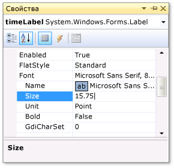
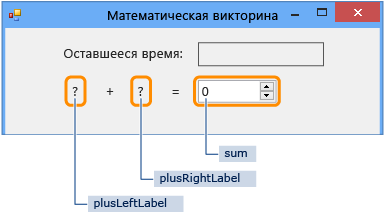
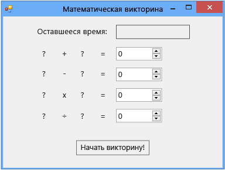

# Шаг 1. Создание проекта и добавление в форму элементов управления Label

Первые шаги разработки этой головоломки предполагают создание проекта, добавление меток, кнопки и других элементов управления в форму. Также вам предстоит задать свойства для каждого добавляемого элемента управления. Проект будет содержать форму, элементы управления и добавленный в следующих уроках учебника код. Кнопка запускает головоломку, метки служат для отображения задач, входящих в головоломку, а остальные элементы управления служат для отображения ответов и времени, оставшегося на решение головоломки.

> [!NOTE]
> Этот раздел входит в серию учебников, посвященных основам написания кода. Общие сведения об учебнике см. в разделе [Руководство 2. Создание ограниченной по времени математической головоломки](../ide/tutorial-2-create-a-timed-math-quiz.md).

## Создание проекта для формы

::: moniker range="vs-2017"

1. В строке меню щелкните **Файл** > **Создать** > **Проект**.

1. Выберите **Visual C#** или **Visual Basic** в левой области диалогового окна **Новый проект**, а затем — **Классическое приложение Windows**.

1. В списке шаблонов выберите шаблон **Приложение Windows Forms (.NET Framework)**, назовите его *MathQuiz*, а затем нажмите кнопку **ОК**.

    Появится форма с именем *Form1.cs* или *Form1.vb*, в зависимости от выбранного языка программирования.

   > [!NOTE]
   > Если вы не видите шаблон **Приложение Windows Forms (.NET Framework)**, используйте Visual Studio Installer, чтобы установить рабочую нагрузку **Разработка классических приложений .NET**.     Дополнительные сведения см. в разделе [Установка Visual Studio](../install/install-visual-studio.md).

::: moniker-end

::: moniker range="vs-2019"

1. На начальном экране выберите **Создать проект**.

   

1. В поле поиска окна **Создание проекта** введите *Windows Forms*. Затем в списке **Тип проекта** выберите **Рабочий стол**.

   Применив фильтр **Тип проекта**, выберите шаблон **Приложение Windows Forms (.NET Framework)** для C# или Visual Basic и нажмите кнопку **Далее**.

   

   > [!NOTE]
   > Если шаблон **Приложение Windows Forms (.NET Framework)** отсутствует, его можно установить из окна **Создание проекта**. В сообщении **Не нашли то, что искали?** выберите ссылку **Установка других средств и компонентов**.
   >
   > 
   >
   > После этого в Visual Studio Installer выберите рабочую нагрузку **Разработка классических приложений .NET**.
   >
   > 
   >
   > Затем нажмите кнопку **Изменить** в Visual Studio Installer. Вам может быть предложено сохранить результаты работы; в таком случае сделайте это. Выберите **Продолжить**, чтобы установить рабочую нагрузку.

1. В поле **Имя проекта** окна **Настроить новый проект** введите *MathQuiz*. Затем нажмите **Создать**.

::: moniker-end

## Задание свойств формы

1. В Visual Studio выберите форму (*Form1.cs* или *Form1.vb*, в зависимости от используемого языка программирования), а затем измените ее свойство **Text** на **Математическая головоломка**.

     Окно **Свойства** содержит свойства формы.

1. Измените размер формы на 500 пикселей в ширину и 400 пикселей в высоту.

     Изменить размер формы можно, перетаскивая ее границы до тех пор, пока в левом нижнем углу интегрированной среды разработки не появится нужный размер. Другой вариант — изменить значения свойства **Size**.

1. Измените значение свойства **FormBorderStyle** на **Fixed3D**, а свойству **MaximizeBox** установите значение **False**.

     Эти значения не позволят игрокам изменять размеры формы.

## Создание поля "Оставшееся время"

1. Добавьте элемент управления <xref:System.Windows.Forms.Label> из **панели элементов**, затем установите для его свойства **(Name)** значение **timeLabel**.

     Эта метка станет полем в правом верхнем углу формы, в котором будет отображаться количество секунд, оставшихся на решение головоломки.

2. Измените значение свойства **AutoSize** на **False**, чтобы можно было изменить размер поля.

3. Измените значение свойства **BorderStyle** на **FixedSingle** для отрисовки линии вокруг поля.

4. Установите значение свойства **Size** равным **200, 30**.

5. Переместите метку в правый верхний угол формы, где при этом появятся синие линии-разделители.

     Эти линии помогают выравнивать элементы управления в форме.

6. В окне **Свойства** выберите свойство **Text** и нажмите клавишу **BACKSPACE**, чтобы удалить его значение.

7. Нажмите знак плюса ( **+** ) рядом со свойством **Font** и измените значение свойства **Size** на **15,75**.

     Можно изменить несколько свойств шрифта, как показано на снимке экрана ниже.

     

8. Добавьте еще один элемент управления Label из **панели элементов** и установите для его размера шрифта значение **15,75**.

9. Задайте свойству **Text** значение **Оставшееся время**.

10. Переместите метку так, чтобы она находилась чуть левее метки **timeLabel**.

### Добавление элементов управления для задачи на сложение

1. Добавьте элемент управления Label из **панели элементов** и установите для его свойства **Text** значение **?** (вопросительный знак).

2. Задайте свойству **AutoSize** значение **False**.

3. Установите значение свойства **Size** равным **60, 50**.

4. Установите размер шрифта равным **18**.

5. Установите для свойства **TextAlign** значение **MiddleCenter**.

6. Установите для свойства **Location** значение **50, 75**, чтобы поместить элемент управления в нужное место в форме.

7. Установите для свойства **(Name)** значение **plusLeftLabel**.

8. Выберите метку **plusLeftLabel**, а затем либо нажмите клавиши **CTRL**+**C**, либо выберите пункт **Копировать** в меню **Правка**.

9. Вставьте метку три раза, нажимая клавиши **CTRL**+**V** или выбирая **Вставить** в меню **Правка**.

10. Разместите три новые метки так, чтобы они располагались в ряд справа от метки **plusLeftLabel**.

     Для выравнивания меток и регулировки промежутков между ними можно пользоваться линиями-разделителями.

11. Установите для свойства **Text** второй метки значение **+** (знак плюса).

12. Установите для свойства **(Name)** третьей метки значение **plusRightLabel**.

13. Установите для свойства **Text** четвертой метки значение **=** (знак равенства).

14. Добавьте элемент управления <xref:System.Windows.Forms.NumericUpDown> из **панели элементов**, установите его размер шрифта равным **18**, а его ширину — равной **100**.

     Подробнее этот вид элементов управления мы рассмотрим позже.

15. Выровняйте элемент управления NumericUpDown по элементам управления Label для задачи на сложение.

16. Измените значение свойства **(Name)** элемента управления NumericUpDown на **sum**.

     Первая строка создана, как показано на иллюстрации ниже.

     

## Добавление элементов управления для задач на вычитание, умножение и деление

1. Скопируйте все пять элементов управления для задачи на сложение (четыре элемента управления Label и элемент управления NumericUpDown) и вставьте их.

     Теперь форма содержит пять новых элементов управления, которые все еще выбраны.

2. Переместите все элементы управления так, чтобы выровнять их под элементами управления для сложения.

     Для обеспечения достаточного расстояния между строками можно пользоваться линиями-разделителями.

3. Измените значение свойства **Text** второй метки на **-** (знак "минус").

4. Назовите первую метку с вопросительным знаком **minusLeftLabel**.

5. Назовите вторую метку с вопросительным знаком **minusRightLabel**.

6. Присвойте элементу управления NumericUpDown имя **difference**.

7. Вставьте эти пять элементов управления еще два раза.

8. В третьей строке назовите первую метку **timesLeftLabel**, у второй метки измените значение свойства **Text** на **×** (знак умножения), третью метку назовите **timesRightLabel**, а элемент управления NumericUpDown назовите **product**.

9. В четвертой строке назовите первую метку **dividedLeftLabel**, у второй метки измените значение свойства **Text** на **÷** (знак деления), третью метку назовите **dividedRightLabel**, а элемент управления NumericUpDown назовите **quotient**.

    > [!NOTE]
    > Знак умножения × и знак деления ÷ можно скопировать из этого руководства и вставить их в форму.

## Добавление кнопки запуска и задание порядка перехода по клавише TAB

1. Добавьте элемент управления <xref:System.Windows.Forms.Button> из **панели элементов** и установите для его свойства **(Name)** значение **startButton**.

2. Задайте свойству **Text** значение **Запуск головоломки**.

3. Установите размер шрифта равным **14**.

4. Установите для свойства **AutoSize** значение **True**, которое вызывает автоматическое изменение размера кнопки в зависимости от размера текста.

5. Разместите кнопку по центру в нижней части формы.

6. Установите значение свойства **TabIndex** элемента управления **startButton** равным **1**.

    > [!NOTE]
    > Свойство **TabIndex** задает порядок перехода по элементам управления при нажатии клавиши **TAB**. Чтобы увидеть, как это работает, откройте любое диалоговое окно (например, в строке меню выберите **Файл** > **Открыть**), а затем несколько раз нажмите клавишу **TAB**. Вы увидите, что при каждом нажатии клавиши **TAB** курсор перемещается от одного элемента управления к другому. Порядок этих переходов был задан программистом при создании формы.

7. Установите значение свойства **TabIndex** для элемента управления NumericUpDown с именем sum равным **2**, для элемента управления difference равным **3**, для элемента управления product равным **4**, а для элемента управления quotient равным **5**.

     Теперь форма должна выглядеть как на снимке экрана ниже.

     

8. Чтобы проверить, работает ли свойство **TabIndex** ожидаемым образом, сохраните программу и запустите ее, нажав клавишу **F5** или выбрав пункты **Отладка** > **Начать отладку** в строке меню, а затем несколько раз нажмите клавишу **TAB**.

## Продолжить или повторить пройденный материал

- Следующий раздел руководства: **[Шаг 2. Создание задачи на сложение случайных чисел](../ide/step-2-create-a-random-addition-problem.md)** .

- См. раздел [Руководство 2. Создание ограниченной по времени математической головоломки](../ide/tutorial-2-create-a-timed-math-quiz.md).
