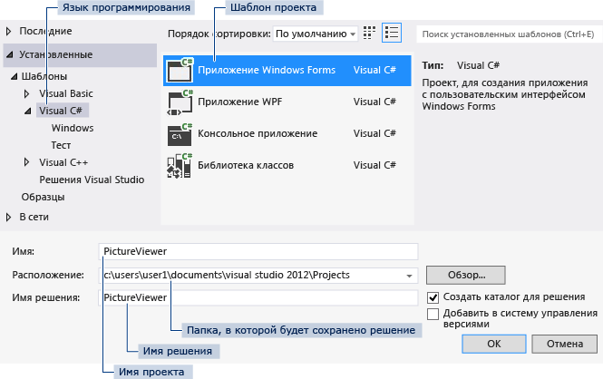

# Шаг 1. Создание проекта приложения Windows Forms

Первый шаг в создании программы для просмотра изображений — это создание проекта приложения Windows Forms.

::: moniker range="vs-2017"

## Откройте Visual Studio 2017.

1. В строке меню выберите **Файл** > **Создать** > **Проект**. Диалоговое окно должно выглядеть так же, как на следующем снимке экрана.

      ***Диалоговое окно** _ _"Новый проект"*

2. В левой части диалогового окна **Новый проект** выберите **Visual C#** или **Visual Basic**, а затем — **Классическое приложение Windows**.

3. В списке шаблонов проектов выберите **Приложение Windows Forms (.NET Framework)**. Назовите новую форму *PictureViewer* и нажмите кнопку **ОК**.

    >[!NOTE]
    >Если вы не видите шаблон **Приложение Windows Forms (.NET Framework)**, используйте Visual Studio Installer, чтобы установить рабочую нагрузку **Разработка классических приложений .NET**.     Дополнительные сведения см. в разделе [Установка Visual Studio](../install/install-visual-studio.md).

::: moniker-end

::: moniker range="vs-2019"

## Запустите Visual Studio 2019.

1. На начальном экране выберите **Создать проект**.

   

1. В поле поиска окна **Создание проекта** введите *Windows Forms*. Затем в списке **Тип проекта** выберите **Рабочий стол**.

   Применив фильтр **Тип проекта**, выберите шаблон **Приложение Windows Forms (.NET Framework)** для C# или Visual Basic и нажмите кнопку **Далее**.

   

   > [!NOTE]
   > Если шаблон **Приложение Windows Forms (.NET Framework)** отсутствует, его можно установить из окна **Создание проекта**. В сообщении **Не нашли то, что искали?** выберите ссылку **Установка других средств и компонентов**.
   >
   > 
   >
   > После этого в Visual Studio Installer выберите рабочую нагрузку **Разработка классических приложений .NET**.
   >
   > 
   >
   > Затем нажмите кнопку **Изменить** в Visual Studio Installer. Вам может быть предложено сохранить результаты работы; в таком случае сделайте это. Выберите **Продолжить**, чтобы установить рабочую нагрузку.

1. В поле **Имя проекта** окна *Настроить новый проект* введите **PictureViewer**. Затем нажмите **Создать**.

::: moniker-end

Visual Studio создает решение для приложения. Решение играет роль контейнера для всех проектов и файлов, необходимых приложению. Более подробно эти термины поясняются далее в этом учебнике.

## Сведения о проекте приложения Windows Forms

1. Среда разработки содержит три окна: главное окно, **Обозреватель решений** и окно **Свойства**.

     Если какое-либо из этих окон отсутствует, можно восстановить макет окон по умолчанию. В строке меню выберите **Окно** > **Сброс макета окна**.

     Можно также отобразить окна с помощью команд меню. В строке меню выберите **Вид** > **Окно "Свойства"** или **Обозреватель решений**.

     Если открыты какие-либо другие окна, закройте их с помощью кнопки **Закрыть** (x) в верхнем правом углу.

    ::: moniker range="vs-2017"

    * **Главное окно**. В этом окне выполняется основная часть работы, например работа с формами и редактирование кода. В окне показана форма в **редакторе форм**. В верхней части окна находятся две вкладки — вкладка **Начальная страница** и вкладка **Form1.cs [Design]**. (В Visual Basic имя вкладки заканчивается на *.vb*, а не на *.cs*.)

    ::: moniker-end

    ::: moniker range=">=vs-2019"

    * **Главное окно**. В этом окне выполняется основная часть работы, например работа с формами и редактирование кода. В окне показана форма в **редакторе форм**.

    ::: moniker-end

    * **Окно "Обозреватель решений"**. В этом окне можно просматривать все элементы, входящие в решение, и переходить к ним.

    Если выбрать файл, содержимое в окне **Свойства** изменится. Если открыть файл кода (с расширением *.cs* в C# и *.vb* в Visual Basic), откроется сам файл кода или конструктор для него. Конструктор — это визуальная поверхность, на которую можно добавлять элементы управления, такие как кнопки и списки. При работе с формами Visual Studio такая поверхность называется **конструктор Windows Forms**.

    * **Окно "Свойства"**. В этом окне производится изменение свойств элементов, выбранных в других окнах. Например, выбрав форму Form1, можно изменить ее название путем задания свойства **Text**, а также изменить цвет фона путем задания свойства **Backcolor**.

      > [!NOTE]
      > В верхней строке в **обозревателе решений** отображается текст **Решение "PictureViewer" (1 проект)**. Это означает, что Visual Studio автоматически создала для вас решение. Решение может содержать несколько проектов, но пока что вы будете работать с решениями, которые содержат только один проект.

1. В строке меню выберите **Файл** > **Сохранить все**.

     Другой вариант — нажать кнопку **Сохранить все** на панели инструментов, как показано на рисунке ниже.

      
     ***Кнопка "Сохранить все"** _ _на панели инструментов*

     Visual Studio автоматически заполняет имя папки и имя проекта, а затем сохраняет проект в папке проектов.

## Дальнейшие действия

* Следующий раздел руководства: **[Шаг 2. Запуск приложения](../ide/step-2-run-your-program.md)** .

* Предыдущая статья с общими сведениями: [Руководство 1. Создание приложения для просмотра рисунков](../ide/tutorial-1-create-a-picture-viewer.md).

## См. также

* [Учебник 2. Создание ограниченной по времени математической головоломки](tutorial-2-create-a-timed-math-quiz.md)
* [Учебник 3. Создание игры "Подбери пару!"](tutorial-3-create-a-matching-game.md)
