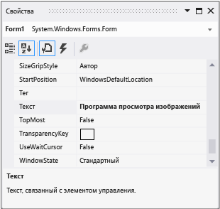

# Шаг 3. Настройка свойств формы

Далее окно **Свойства** используется для изменения внешнего вида формы.

## Настройка свойств формы

1. Убедитесь, что отображается **конструктор Windows Forms**. В интегрированной среде разработки Visual Studio откройте вкладку **Form1.cs [Design]** (или вкладку **Form1.vb [Design]** в Visual Basic).

1. Чтобы выделить форму **Form1**, щелкните в любом ее месте. Посмотрите на окно **Свойства**. Теперь оно должно отображать свойства формы. У формы есть различные свойства. Например, можно установить цвет переднего плана и фона, текст заголовка, который отображается в верхней части формы, размер формы и другие свойства.

   > [!NOTE]
   > Если окно **Свойства** не открывается, остановите приложение, нажав квадратную кнопку **Остановить отладку** на панели инструментов, или просто закройте окно. Если приложение остановлено, но окно **Свойства** все равно не отображается, в строке меню выберите **Вид** > **Окно свойств**.

1. Когда форма будет выбрана, найдите свойство **Text** в окне **Свойства**. В зависимости от того, как отсортирован список, может потребоваться прокрутить вниз. Выберите **Text**, введите **Программа просмотра изображений**, а затем нажмите клавишу **ВВОД**.  Теперь форма должна содержать текст **Программа просмотра изображений** в заголовке окна. Окно **Свойства** должно выглядеть так, как показано на снимке экрана ниже.

     
   ***Окно** _ _"Свойства"*

   > [!NOTE]
   > Свойства можно упорядочить **по категориям** или **в алфавитном порядке**. Вы можете переключаться между двумя этими представлениями с помощью кнопок в окне **Свойства**. В этом руководстве свойства легче находить в представлении, в котором свойства представлены **в алфавитном порядке**.

1. Вернитесь к **конструктору Windows Forms**. Нажмите нижний правый маркер перетаскивания формы, который представляет собой небольшой белый квадрат в нижнем правом углу формы и показан на рисунке ниже.

     
   *Маркер перетаскивания*

    Перетащите маркер, чтобы изменить размер формы — она должна стать шире и немного выше.

1. Посмотрите в окно **Свойства** и обратите внимание, что изменилось значение свойства **Size**. Свойство **Size** меняется при каждом изменении формы. Перетащите маркер, чтобы форма имела размер около **550, 350** (не обязательно точно такие значения). Такой размер вполне подходит для этого проекта. В качестве альтернативы можно вводить значения непосредственно в свойстве **Size** и затем нажимать клавишу **ВВОД**.

1. Запустите приложение еще раз. Помните, что для запуска приложения можно использовать любой из описанных ниже методов.

   - Нажмите клавишу **F5**.

   - В строке меню выберите **Отладка** > **Начать отладку**.

   - На панели инструментов нажмите кнопку **Начать отладку**, которая показана на рисунке ниже.

       
     ***Кнопка "Начать отладку"** _ _на панели инструментов*

     Как и ранее, интегрированная среда разработки выполняет сборку приложения и запускает его, после чего открывается окно.

1. Перед переходом к следующему шагу остановите приложение, так как интегрированная среда разработки не позволяет изменять выполняющееся приложение. Помните, что для остановки приложения можно использовать любой из описанных ниже методов.

   - На панели инструментов нажмите кнопку **Остановить отладку**.

   - В строке меню выберите **Отладка** > **Остановить отладку**.

   - На клавиатуре нажмите клавиши **SHIFT**+**F5**.

   - Нажмите кнопку **X** в верхнем углу окна **Программа просмотра изображений**.

## Дальнейшие действия

* Следующий раздел руководства: **[Шаг 4. Создание макета формы с помощью элемента управления TableLayoutPanel](../ide/step-4-lay-out-your-form-with-a-tablelayoutpanel-control.md)** .

* Предыдущий раздел руководства: [Шаг 2. Запуск приложения для просмотра изображений](../ide/step-2-run-your-program.md).

## См. также

* [Учебник 2. Создание ограниченной по времени математической головоломки](tutorial-2-create-a-timed-math-quiz.md)
* [Учебник 3. Создание игры "Подбери пару!"](tutorial-3-create-a-matching-game.md)
