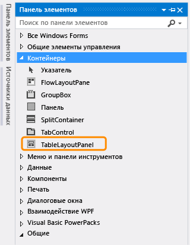
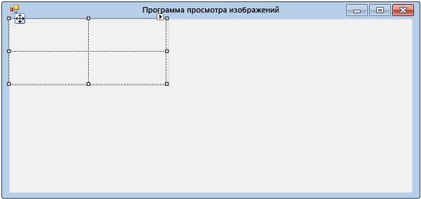
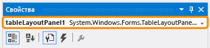
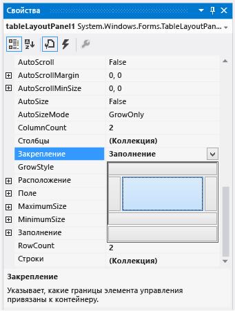
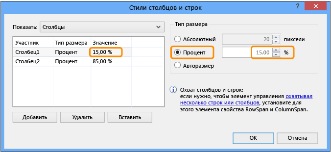
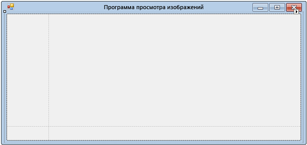

# Шаг 4. Создание макета формы с помощью элемента управления TableLayoutPanel

На этом шаге в форму добавляется элемент управления <xref:System.Windows.Forms.TableLayoutPanel>. TableLayoutPanel помогает должным образом выровнять элементы управления в форме, которая будет добавлена позднее.

## Создание макета формы с помощью элемента управления TableLayoutPanel

1. С левой стороны интегрированной среды разработки Visual Studio выберите вкладку **Панель элементов**. (Можно также выбрать в строке меню пункт **Вид** > **Панель элементов** или нажать клавиши **CTRL**+**ALT**+**X**.)

1. Выберите маленький треугольник рядом с группой **Контейнеры**, чтобы открыть ее, как показано на снимке экрана ниже.

      
*Группа*_ _ **Контейнеры**

1. В форму можно добавить такие элементы управления, как кнопки, флажки и метки. Дважды щелкните элемент управления TableLayoutPanel на **панели элементов**. (Можно также перетащить элемент управления с панели элементов в форму.) В результате этого действия интегрированная среда разработки добавляет в форму элемент управления TableLayoutPanel, как показано на снимке экрана ниже.

      
*Элемент управления*_ _ **TableLayoutPanel**

    > [!NOTE]
    > После добавления элемента управления TableLayoutPanel, если внутри формы появляется окно с заголовком **Задачи TableLayoutPanel**, чтобы закрыть его, щелкните в любом месте внутри формы. Далее в этом руководстве приводятся сведения об этом окне.

     Обратите внимание, что **панель элементов** разворачивается, чтобы закрыть форму при выборе ее вкладки, и закрывается после щелчка за ее пределами. Это функция автоматического скрытия интегрированной среды разработки. Ее можно включить или отключить для любого из окон путем нажатия значка канцелярской кнопки в правом верхнем углу окна, чтобы включить автоматическое скрытие и закрепление на месте. Появляется значок канцелярской кнопки, как показано на рисунке ниже.

      
*Значок*_ _ **канцелярской кнопки**

1. Убедитесь, что элемент управления TableLayoutPanel выделен, щелкнув его. Чтобы убедиться в том, что элемент управления выделен, необходимо посмотреть на раскрывающийся список в верхней части окна **Свойства**, как показано на снимке экрана ниже.

      
*_Окно_ **Свойства** _ с* *элементом управления **TableLayoutPanel**_*

1. Нажмите кнопку **В алфавитном порядке** на панели инструментов в окне **Свойства**. Список свойств в окне **Свойства** отсортируется в алфавитном порядке, что упрощает поиск свойств в этом учебнике.

1. Селектор элементов управления представляет собой раскрывающийся список в верхней части окна **Свойства**. В этом примере он показывает, что выбран элемент управления с именем `tableLayoutPanel1`. Элементы управления можно выбирать, либо выделяя область в **конструкторе Windows Forms**, либо выбирая их в селекторе элементов управления.

   Теперь, когда выделен элемент управления TableLayoutPanel, найдите свойство **Dock** и выберите **Dock**, значение которого должно быть равным **None**. Обратите внимание, что рядом со значением появляется стрелка раскрывающегося списка. Щелкните стрелку, а затем нажмите кнопку **Заполнение** (большая кнопка в середине), как показано на снимке экрана ниже.

      
*_Окно_ **Свойства**, в котором нажата кнопка* ***Заполнение**_*

     Под *закреплением* в Visual Studio понимается прикрепление окна к другому окну или области в интегрированной среде разработки. Например, окно **Свойства** можно оставить неприкрепленным&mdash;в пределах окна Visual Studio&mdash;или же закрепить в области **Обозреватель решений**.

1. Обратите внимание на то, что после присвоения свойству **Dock** элемента управления TableLayoutPanel значения **Fill** панель заполнит всю форму. Если снова изменить размер формы, элемент управления TableLayoutPanel останется закрепленным и сам изменит свой размер для заполнения формы.

    > [!NOTE]
    > Элемент управления TableLayoutPanel работает как таблица в Microsoft Office Word — он содержит строки и столбцы и отдельная ячейка может занимать несколько строк и столбцов. Каждая ячейка может содержать один элемент управления (например, кнопку, флажок или метку). Этот элемент управления TableLayoutPanel должен содержать элемент управления <xref:System.Windows.Forms.PictureBox>, который займет всю верхнюю строку, элемент управления <xref:System.Windows.Forms.CheckBox> в левой нижней ячейке и четыре элемента управления <xref:System.Windows.Forms.Button> в правой нижней ячейке.

1. В данный момент элемент управления TableLayoutPanel содержит две одинаковые по размеру строки и два одинаковых по размеру столбца. Давайте изменим их размер, чтобы верхняя строка и правый столбец были намного больше. В **конструкторе Windows Forms** выберите элемент управления TableLayoutPanel. В правом верхнем углу расположена маленькая кнопка с черным треугольником, как показано на рисунке ниже.

      
*Кнопка_ _ **с треугольником***

     Это кнопка указывает, что элемент управления содержит задачи, которые помогут автоматически задать его свойства.

1. Чтобы отобразить список задач элемента управления, как показано на снимке экрана ниже, нажмите треугольник.

      
*Задачи элемента управления_ _ **TableLayoutPanel***

1. Выберите задачу **Изменить строки и столбцы**, чтобы открыть окно **Стили столбцов и строк**. Выберите **Столбец1**, нажмите кнопку **Проценты** и задайте его размер равным 15 %, введя значение **15** в поле **Проценты**. (Это элемент управления <xref:System.Windows.Forms.NumericUpDown>, который будет использоваться в одном из руководств далее.) Выберите **Столбец2** и задайте значение 85 процентов. Пока не нажимайте кнопку **ОК**, так как окно будет закрыто. (Но если это было сделано, его можно открыть повторно с помощью списка задач.)

      
*Стили столбцов и строк_ _ **TableLayoutPanel***

1. В раскрывающемся списке **Показать** в верхней части окна **Стили столбцов и строк** выберите пункт **Строки**. Задайте для **Row1** значение 90 процентов, а для **Row2** 10 процентов.

1. Нажмите кнопку **ОК** . Элемент управления TableLayoutPanel теперь должен содержать большую верхнюю строку, маленькую нижнюю строку, маленький левый столбец и большой правый столбец. (Размеры строк и столбцов в элементе управления TableLayoutPanel можно изменить, выбрав элемент **tableLayoutPanel1** в форме, а затем перетащив границы его строк и столбцов.)

      
*Элемент **Form1** _ _(средство просмотра изображений) с измененным размером* ***TableLayoutPanel***

## Дальнейшие действия

* Следующий раздел руководства: **[Шаг 5. Добавление элементов управления в форму](../ide/step-5-add-controls-to-your-form.md)** .

* Предыдущий раздел: [Шаг 3. Задание свойств формы](../ide/step-3-set-your-form-properties.md).

## См. также

* [Учебник 2. Создание ограниченной по времени математической головоломки](tutorial-2-create-a-timed-math-quiz.md)
* [Учебник 3. Создание игры "Подбери пару!"](tutorial-3-create-a-matching-game.md)
