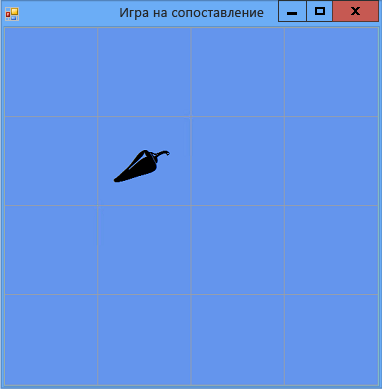

# Шаг 5. Добавление ссылок на элементы управления Label
Программе нужно отслеживать, какие элементы управления Label выбирает игрок. В настоящий момент программа отображает все метки, выбранные игроком. Однако мы изменим это. После выбора первой метки программа должна показывать ее значок. После выбора второй метки программа должна показать оба значка на короткое время, а затем снова скрыть их. Теперь программа будет отслеживать, какой элемент управления Label выбран первым, а какой — вторым, с помощью *ссылочных переменных*.

## Добавление ссылок на метки

1. Добавьте ссылки на метки в свою форму, используя следующий код.

     [!code-vb[VbExpressTutorial4Step5#5](../ide/codesnippet/VisualBasic/step-5-add-label-references_1.vb)]
     [!code-csharp[VbExpressTutorial4Step5#5](../ide/codesnippet/CSharp/step-5-add-label-references_1.cs)]

     > [!IMPORTANT]
     > Используйте элемент управления языка программирования в правом верхнем углу этой страницы, чтобы просмотреть фрагмент кода на C# или Visual Basic.  

     Ссылочные переменные похожи на операторы, которые вы использовали для добавления объектов (таких как объекты <xref:System.Windows.Forms.Timer>, <xref:System.Collections.Generic.List%601> и <xref:System.Random>) в форму. Но эти операторы не приводят к появлению в форме двух дополнительных элементов управления Label, так как в них не используется ключевое слово `new`. Без ключевого слова `new` объект не создается. Именно поэтому `firstClicked` и `secondClicked` называются ссылочными переменными — они просто отслеживают (или ссылаются на) объекты Label.

     Когда переменная не отслеживает объект, ей задается специальное зарезервированное значение — `null` в C# и `Nothing` в Visual Basic. Поэтому при запуске программы переменным `firstClicked`и `secondClicked` задается значение `null` или `Nothing`. Это означает, что переменные ничего не отслеживают.

2. Измените свой обработчик событий <xref:System.Windows.Forms.Control.Click> для использования новой ссылочной переменной `firstClicked`. Удалите последний оператор (`label_Click()`) в методе обработчика событий `clickedLabel.ForeColor = Color.Black;` и замените его последующим оператором `if`. (Не забудьте включить комментарий и весь оператор `if`).

     [!code-vb[VbExpressTutorial4Step5#6](../ide/codesnippet/VisualBasic/step-5-add-label-references_2.vb)]
     [!code-csharp[VbExpressTutorial4Step5#6](../ide/codesnippet/CSharp/step-5-add-label-references_2.cs)]

3. Сохраните и выполните программу. Выберите одну из меток и появится ее значок.

4. Выберите следующую метку и обратите внимание, что ничего не происходит. Программа уже отслеживает первую метку, которую выбрал игрок, поэтому `firstClicked` не равно `null` в C# или `Nothing` в Visual Basic. Когда оператор `if` проверяет, имеет ли переменная `firstClicked` значение `null` или `Nothing`, он обнаруживает, что это не так, и не выполняет операторы в блоке `if`. Поэтому только первый выбранный значок становится черным, а другие значки остаются невидимыми, как показано на следующем рисунке.

      
***Игра "Подбери пару!"** ,_ _отображающая один значок*

     Это поведение будет исправлено в следующем шаге руководства путем добавления элемента управления **Таймер**.

## Продолжить или повторить пройденный материал

- Следующий раздел руководства: **[Шаг 6. Добавление таймера](../ide/step-6-add-a-timer.md)** .

- Предыдущий раздел: [Шаг 4. Добавление к каждой метке обработчика событий Click](../ide/step-4-add-a-click-event-handler-to-each-label.md).
