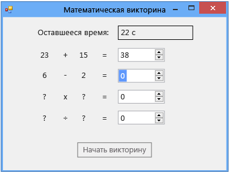

# Шаг 6. Добавление задачи на вычитание
В шестой части этого учебника вам предстоит добавить задачу на вычитание и научиться выполнять следующие задачи:

- Хранение значений, которые участвуют в операции вычитания.

- Создание случайных чисел для задачи (а также гарантия, что ответ лежит в диапазоне от 0 до 100).

- Обновление метода, который проверяет ответы, таким образом, чтобы он также проверял новую задачу на вычитание.

- Обновление обработчика событий таймера <xref:System.Windows.Forms.Timer.Tick> так, чтобы этот обработчик событий заполнял корректный ответ после истечения времени.

> [!NOTE]
> Этот раздел входит в серию учебников, посвященных основам написания кода. Общие сведения об учебнике см. в разделе [Руководство 2. Создание ограниченной по времени математической головоломки](../ide/tutorial-2-create-a-timed-math-quiz.md).

## Добавление задачи на вычитание

1. Добавьте в форму две целочисленные переменные для задачи на вычитание — между целочисленными переменными для задачи на сложение и для таймера. Код должен выглядеть следующим образом.

     [!code-vb[VbExpressTutorial3Step5_6#12](../ide/codesnippet/VisualBasic/step-6-add-a-subtraction-problem_1.vb)]
     [!code-csharp[VbExpressTutorial3Step5_6#12](../ide/codesnippet/CSharp/step-6-add-a-subtraction-problem_1.cs)]

     [!INCLUDE [devlang-control-csharp-vb](./includes/devlang-control-csharp-vb.md)]

     Имена новых целочисленных переменных — **minuend** и **subtrahend** — не являются терминами программирования. Это принятые в арифметике обозначения для числа, которое вычитается из другого числа (subtrahend — вычитаемое), и числа, из которого производится вычитание (minuend — уменьшаемое). Остаток — это уменьшаемое за минусом вычитаемого. Можно использовать другие имена, так как программа не требует определенных имен для переменных, элементов управления, компонентов или методов. Необходимо соблюдать правила — например, не начинать имена с цифр — но вообще можно использовать такие имена, как x1, x2, x3 и x4. Однако универсальные имена ухудшают читабельность кода, и при возникновении проблем отследить их источник становится практически невозможно. Чтобы имена переменных были уникальными и информативными, для умножения и деления далее в этом учебнике мы также будем использовать традиционные имена: multiplicand (множимое) × multiplier (множитель) = product (произведение); dividend (делимое) ÷ divisor (делитель) = quotient (частное).

     Затем необходимо изменить метод `StartTheQuiz()`, чтобы получить случайные значения для задачи на вычитание.

2. Добавьте после комментария "Fill in the subtraction problem" (Заполнение задачи на вычитание) следующий код.

     [!code-vb[VbExpressTutorial3Step5_6#13](../ide/codesnippet/VisualBasic/step-6-add-a-subtraction-problem_2.vb)]
     [!code-csharp[VbExpressTutorial3Step5_6#13](../ide/codesnippet/CSharp/step-6-add-a-subtraction-problem_2.cs)]

     Чтобы в задаче на вычитание не было отрицательных ответов, метод <xref:System.Random.Next> класса <xref:System.Random> в этом коде используется несколько иначе, чем в задаче на сложение. Когда методу `Next()` передается два значения, он выбирает случайное число, которое больше первого значения или равно ему и меньше второго значения. Следующий код выбирает случайное число в диапазоне от 1 до 100 и сохраняет его в переменной minuend.

     [!code-vb[VbExpressTutorial3Step5_6#21](../ide/codesnippet/VisualBasic/step-6-add-a-subtraction-problem_3.vb)]
     [!code-csharp[VbExpressTutorial3Step5_6#21](../ide/codesnippet/CSharp/step-6-add-a-subtraction-problem_3.cs)]

     Вызвать метод `Next()` класса Random, который мы ранее в этом руководстве назвали randomizer, можно разными способами. Методы, которые можно вызывать несколькими способами, называются перегруженными. Для их изучения можно использовать IntelliSense. Посмотрите еще раз на всплывающую подсказку окна IntelliSense для метода `Next()`.

      
***Подсказка окна** _ _IntelliSense*

     В подсказке сказано **(+2 перегрузки)**, что означает, что вызвать метод `Next()` можно еще двумя способами. Перегрузки методов содержат разное количество или типы аргументов, поэтому работают слегка по-разному. Например, метод может принимать один целочисленный аргумент, а одна из его перегрузок может принимать целое число и строку. Выбирайте подходящую перегрузку в зависимости от того, что требуется сделать. При добавлении кода в метод `StartTheQuiz()` в окне IntelliSense появляется дополнительная информация, как только вы введете `randomizer.Next(`. Для перебора перегрузок нажимайте **стрелку вверх** и **стрелку вниз**, как показано на следующем рисунке.

      
*Перегрузка метода*  ***Next()** _ в* ***IntelliSense***

     В данном случае необходимо выбрать последнюю перегрузку, чтобы можно было задать минимальное и максимальное значения.

3. Для проверки правильного ответа для задачи на вычитание, измените метод `CheckTheAnswer()`.

     [!code-vb[VbExpressTutorial3Step5_6#14](../ide/codesnippet/VisualBasic/step-6-add-a-subtraction-problem_4.vb)]
     [!code-csharp[VbExpressTutorial3Step5_6#14](../ide/codesnippet/CSharp/step-6-add-a-subtraction-problem_4.cs)]

     В C# `&&` — это оператор `logical and`. Эквивалентный оператор в языке Visual Basic — `AndAlso`. Эти операторы означают, что "Если addend1 плюс addend2 равно значению NumericUpDown с именем sum и если minuend минус subtrahend равно значению NumericUpDown с именем difference". Метод `CheckTheAnswer()` возвращает значение `true`, только если игрок дал правильные ответы и на задачу на сложение, и на задачу на вычитание.

4. Замените последнюю часть обработчика событий таймера Tick следующим кодом, чтобы по истечении времени этот обработчик событий проставлял правильный ответ.

     [!code-vb[VbExpressTutorial3Step5_6#22](../ide/codesnippet/VisualBasic/step-6-add-a-subtraction-problem_5.vb)]
     [!code-csharp[VbExpressTutorial3Step5_6#22](../ide/codesnippet/CSharp/step-6-add-a-subtraction-problem_5.cs)]

5. Сохраните и выполните код.

     Теперь программа включает в себя задачу на вычитание, как показано на следующем рисунке.

      
***Математическая головоломка** _ _с задачей на вычитание*

## Продолжить или повторить пройденный материал

- Следующий раздел руководства: **[Шаг 7. Добавление задач на умножение и деление](../ide/step-7-add-multiplication-and-division-problems.md)** .

- Предыдущий раздел: [Шаг 5. Добавление обработчиков событий входа для элементов управления NumericUpDown](../ide/step-5-add-enter-event-handlers-for-the-numericupdown-controls.md).
