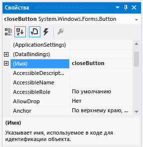

# <a name="step-6-name-your-button-controls"></a>Шаг 6. Присвоение имен элементам управления "Кнопка"

В форме существует только один элемент управления <xref:System.Windows.Forms.PictureBox>. Когда он был добавлен, интегрированная среда разработки автоматически присвоила ему имя **pictureBox1**. Существует только один элемент управления <xref:System.Windows.Forms.CheckBox> с именем **checkBox1**. Скоро вы напишите код, которым будете обращаться к элементам управления CheckBox и PictureBox. Так как существует только по одному их экземпляру, то становится ясно, что означает упоминание имен **pictureBox1** или **checkBox1** в коде.

> [!TIP]
> В Visual Basic по умолчанию первая буква любого имени элемента управления является заглавной, поэтому у элементов управления имена **PictureBox1**, **CheckBox1** и так далее.

В форме есть четыре кнопки. Интегрированная среда разработки назвала их как **button1**, **button2**, **button3** и **button4**. Только по их текущему имени нельзя узнать, какая кнопка является кнопкой **Закрыть** , а какая кнопкой **Показать рисунок** . Вот почему присвоение элементам управления в виде кнопок более осмысленных названий полезно.

## <a name="to-name-your-button-controls"></a>Присвоение имен элементам управления "Кнопка"

1. В форме нажмите кнопку **Закрыть** . (Если все кнопки все еще выделены, для отмены выделения нажмите клавишу **ESC**.) Прокрутите содержимое окна **Свойства**, пока не появится свойство **(Name)** . (Свойство **(Name)** расположено в верхней части, когда свойства расположены в алфавитном порядке.) Измените имя на **closeButton**, как показано на снимке экрана ниже.

    <br>*_Окно **Свойства** _ с именем* ***closeButton**_ _*

    > [!NOTE]
    > Попробуйте изменить имя кнопки на **close Button** (с пробелом между словами close и Button). В интегрированной среде разработки появится сообщение об ошибке: "Недопустимое значение свойства". Пробелы (а также несколько других символов) запрещено использовать в именах элементов управления.

1. Переименуйте другие три кнопки как **backgroundButton**, **clearButton**, **showButton**.
Имена можно проверить в раскрывающемся списке селектора элементов управления в окне **Свойства** . Отобразятся новые имена кнопок.

1. Двойным щелчком нажмите кнопку **Показать рисунок** в форме. В качестве альтернативы можно нажать кнопку **Показать рисунок** в форме, а затем нажать клавишу **ВВОД**. При этом в главном окне интегрированной среды разработки открывается дополнительная вкладка, которая называется **Form1.cs**. (Если вы используете Visual Basic, она называется **Form1.vb**.)

   На этой вкладке отображается файл кода для формы, как показано на снимке экрана ниже.

    <br>
***Вкладка Form1.cs** _ с_кодом C#*

    > [!NOTE]
    > На вкладке Form1.cs или Form1.vb кнопка **showButton** может отображаться как **ShowButton**.

1. Обратите внимание на эту часть кода.

    ```csharp
        private void ShowButton_Click(object sender, EventArgs e)
    {
    }
    ```

    ```vb
        Private Sub showButton_Click() Handles showButton.Click

    End Sub
    ```

   [!INCLUDE [devlang-control-csharp-vb](./includes/devlang-control-csharp-vb.md)]

   Вы видите код `showButton_Click()` (или `ShowButton_Click()`). Интегрированная среда разработки добавила его в код формы при открытии файла кода для кнопки **showButton** . Во время разработки при открытии файла кода для элемента управления в форме для элемента управления создается код, если он еще не существует. Этот код, известный как *метод*, выполняется при запуске приложения и выборе элемента управления (в данном случае кнопки **Показать рисунок**).

1. Снова выберите вкладку **конструктора Windows Forms** (**Form1.cs [Design]**), а затем откройте файл кода для кнопки **Очистить рисунок**, чтобы создать метод для нее в коде формы. Повторите это действие для двух оставшихся кнопок. Каждый раз при этом действии среда интегрированной разработки добавляет в файл кода формы новый метод.

1. Чтобы добавить еще один метод, откройте файл кода для элемента управления **CheckBox** в **конструкторе Windows Forms**, чтобы интегрированная среда разработки создала метод `checkBox1_CheckedChanged()`. Этот метод вызывается каждый раз, когда пользователь устанавливает или снимает флажок.

   > [!TIP]
   > При работе с приложением необходимо часто переключаться между редактором кода и **конструктором Windows Forms**. Среда интегрированной разработки упрощает передвижение по проекту. Используйте **Обозреватель решений**, чтобы открыть **конструктор Windows Forms**, дважды щелкнув *Form1.cs* в C# или *Form1.vb* в Visual Basic, либо выберите **Вид** > **Конструктор** в строке меню.

    Ниже показан новый код, который представлен в редакторе кода.

    [!code-csharp[VbExpressTutorial1Step6_#2](../ide/codesnippet/CSharp/step-6-name-your-button-controls_2.cs)]

    [!code-vb[VbExpressTutorial1Step6_#2](../ide/codesnippet/VisualBasic/step-6-name-your-button-controls_2.vb)]

    > [!NOTE]
    > В вашем коде обработчики событий могут не отображаться в "верблюжьем" стиле.

    Пять методов, которые были добавлены, называются *обработчики событий*, так как приложение вызывает их каждый раз, когда происходит событие (например, пользователь нажимает кнопку или устанавливает флажок).

    При просмотре кода для элемента управления в интегрированной среде разработки во время разработки Visual Studio добавляет метод обработчика событий для элемента управления, если он не существует. Например, при двойном щелчке по кнопке интегрированная среда разработки добавляет обработчик события <xref:System.Windows.Forms.Control.Click>, который вызывается каждый раз, когда пользователь нажимает кнопку. Если дважды щелкнуть флажок, интегрированная среда разработки добавляет обработчик события <xref:System.Windows.Forms.CheckBox.CheckedChanged>, который вызывается каждый раз, когда пользователь устанавливает или снимает флажок.

    После добавления обработчика событий для элемента управления к нему можно вернуться в любой момент из **конструктора Windows Forms** с помощью двойного щелчка по элементу управления или выбрав **Вид** > **Код** в строке меню.

    Имена являются важными при выполнении построения программы, и методы (включая обработчики событий) могут иметь любые имена, которые нужны. При добавлении обработчика событий с помощью интегрированной среды разработки она создает имя на основе имени элемента управления и обрабатываемого события.

    Например, событие Click для кнопки с именем **showButton** вызывает метод обработчика событий `showButton_Click()` (или `ShowButton_Click()`). Также обычно после имени метода добавляются открывающая и закрывающая круглые скобки `()` для определения рассматриваемых методов.

    Если вы решите изменить имя переменной кода, щелкните правой кнопкой мыши переменную в коде, а затем выберите команду **Рефакторинг** > **Переименовать**. Все экземпляры этой переменной в коде будут переименованы. Дополнительные сведения см. в разделе [Оптимизация кода с помощью переименования](../ide/reference/rename.md).

## <a name="next-steps"></a>Дальнейшие действия

* Следующий раздел руководства: **[Шаг 7. Добавление компонентов диалогового окна в форму](../ide/step-7-add-dialog-components-to-your-form.md)** .

* Предыдущий раздел: [Шаг 5. Добавление элементов управления в форму](../ide/step-5-add-controls-to-your-form.md).

## <a name="see-also"></a>См. также

* [Учебник 2. Создание ограниченной по времени математической головоломки](tutorial-2-create-a-timed-math-quiz.md)
* [Учебник 3. Создание игры "Подбери пару!"](tutorial-3-create-a-matching-game.md)
