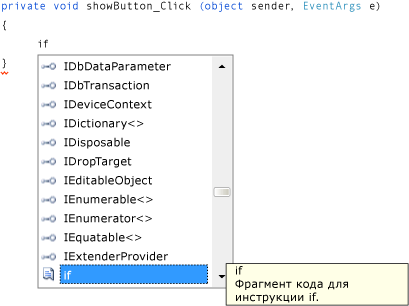

# Шаг 8. Написание кода для обработчика событий кнопки "Показать рисунок"

В этом шаге вы настраиваете следующее поведение кнопки **Показать рисунок**.

- Когда пользователь нажимает эту кнопку, приложение открывает окно <xref:System.Windows.Forms.OpenFileDialog>.

- Если пользователь открывает файл изображения, приложение показывает это изображение в <xref:System.Windows.Forms.PictureBox>.

Среда IDE содержит мощное средство IntelliSense, которое помогает в написании кода. По мере ввода кода среда IDE открывает поле, в котором содержатся предлагаемые завершения для частей вводимых слов.

Технология IntelliSense пытается определить, что вы хотите сделать далее, и автоматически переходит к последнему выбранному элементу в списке. Для перемещения по списку можно использовать клавиши со стрелками ВВЕРХ или ВНИЗ или можно продолжать вводить буквы, чтобы сузить выбор. Когда появится необходимый элемент, для его выбора нажмите клавишу **TAB**. Либо можно проигнорировать предложение, если оно не требуется.

## Написание кода для обработчика событий кнопки "Показать рисунок"

1. Перейдите к **конструктору Windows Forms** и дважды щелкните кнопку **Показать рисунок**. Среда интегрированной разработки немедленно переключается на конструктор кода и перемещает курсор внутрь метода `showButton_Click()` (или `ShowButton_Click()`), который был добавлен ранее.

1. Введите `i` в пустой строке между двумя фигурными скобками `{ }` (в Visual Basic введите пустую строку между `Private Sub...` и `End Sub`). Откроется окно **IntelliSense**, как показано на рисунке ниже.

    

    > [!NOTE]
    > В вашем коде обработчики событий могут не отображаться в "верблюжьем" стиле.

1. Окно **IntelliSense** должно выделить слово `if` (в противном случае введите в нижнем регистре `f`). Обратите внимание, что рядом с окном **IntelliSense** появляется окно *подсказки* с описанием **Фрагмент кода для оператора if**. (в Visual Basic подсказка также указывает такой фрагмент, но немного с другим содержимым). Необходимо использовать этот фрагмент, поэтому нажмите клавишу **TAB**, чтобы вставить `if` в свой код. Затем снова нажмите клавишу **TAB**, чтобы использовать фрагмент `if`. (Если вы выберете что-то другое и окно **IntelliSense** исчезнет, нажмите клавишу BACKSPACE, чтобы удалить `i`, и повторно введите эту букву, чтобы снова открыть окно **IntelliSense**.)

    

### Использование IntelliSense для ввода кода

Далее IntelliSense используется для ввода дополнительного кода для открытия диалогового окна **Открыть файл**. Если пользователь нажимает кнопку **ОК**, PictureBox загружает выбранный пользователем файл. Ниже описывается, как ввести код. Хотя представлено множество действий, это просто несколько нажатий клавиш.

 1. Начните с выделенным текстом **true** во фрагменте. Введите `op`, чтобы перезаписать его. (в Visual Basic необходимо начинать с первой заглавной буквы, поэтому введите `Op`).

 1. Откроется окно **IntelliSense** и отобразит компонент **openFileDialog1**. Нажмите клавишу **TAB**, чтобы выбрать его. (в Visual Basic он начинается с заглавной буквы, поэтому будет представлен **OpenFileDialog1**; убедитесь, что выделен **OpenFileDialog1**).

     Дополнительные сведения о `OpenFileDialog` см. в разделе [OpenFileDialog](<xref:System.Windows.Forms.OpenFileDialog>).

 1. Введите точку (`.`). Так как точка введена сразу после элемента **openFileDialog1**, окно **IntelliSense** открывается с методами и свойствами компонента **OpenFileDialog**. Это те же самые свойства, которые отображаются в окне **Свойства** при выборе этого окна в **конструкторе Windows Forms**. Также можно выбрать методы, которые дают указания компонентам на выполнение определенных действий (например, открыть диалоговое окно).

    > [!NOTE]
    > Окно **IntelliSense** может показывать свойства и методы. Чтобы определить, какие элементы отображаются, проверьте значок слева от каждого элемента в окне **IntelliSense**. Рядом с каждым методом представлен значок кубика, а рядом с каждым свойством — значок гаечного ключа. Также рядом с каждым событием представлен значок с изображением молнии.   Вот отображаемые значки.    

 1. Начните набирать `ShowDialog` (для IntelliSense регистр значения не имеет). Метод `ShowDialog()` будет открывать диалоговое окно **Открыть файл**. После выделения **ShowDialog** в окне нажмите клавишу **TAB**. Также можно выделить ShowDialog и нажать клавишу **F1** для получения соответствующей справки.

    Дополнительные сведения о методе `ShowDialog()` см. в разделе [Метод ShowDialog](<xref:System.Windows.Forms.Form.ShowDialog%2A>).

 1. При использовании метода в элементе управления или компоненте (такое использование называется *вызов метода*) необходимо добавить круглые скобки. Введите открывающую и закрывающую скобки сразу после "g" в разделе `ShowDialog`: `()`; теперь строка должна принять вид "openFileDialog1.ShowDialog()".

    > [!NOTE]
    > Методы являются важнейшей частью любого приложения. В этом руководстве было показано несколько способов их использования. Можно вызвать метод компонента, чтобы указать ему выполнение некоторых действий, аналогично тому, как вы вызывали метод `ShowDialog()` компонента **OpenFileDialog**. Можно создать собственные методы, чтобы приложение выполняло определенные действия, например создаваемый вами сейчас метод `showButton_Click()`, который открывает диалоговое окно и рисунок при нажатии пользователем кнопки.

 1. В C# добавьте пробел, затем два знака равенства (`==`). В Visual Basic добавьте пробел, затем один знак равенства (`=`). В C# и в Visual Basic используются разные операторы равенства.

 1. Добавьте еще один пробел. Как только это будет сделано, откроется другое окно **IntelliSense**. Начните вводить `DialogResult` и нажмите клавишу **TAB**, чтобы добавить его.

    > [!NOTE]
    > При написании кода для вызова метода, в некоторых случаях он возвращает значение. В этом случае метод <xref:System.Windows.Forms.CommonDialog.ShowDialog> компонента **OpenFileDialog** возвращает значение <xref:System.Windows.Forms.DialogResult>. DialogResult — это специальное значение, которое указывает на событие, которое происходит в диалогом окне. В компоненте **OpenFileDialog** пользователь может нажать кнопку **ОК** или **Отмена**, чтобы метод `ShowDialog()` возвращал значение `DialogResult.OK` или значение `DialogResult.Cancel`.

 1. Чтобы открыть значение DialogResult в окне **IntelliSense**, введите точку. Введите букву `O` и нажмите клавишу **TAB**, чтобы вставить **ОК**.

    Дополнительные сведения о DialogResult см. в разделе [DialogResult](<xref:System.Windows.Forms.DialogResult>).

    > [!NOTE]
    > Первая строка кода должна быть завершена. В C# это выглядит следующим образом.
    >
    >  `if (openFileDialog1.ShowDialog() == DialogResult.OK)`
    >
    >  В Visual Basic это выглядит следующим образом.
    >
    >  `If OpenFileDialog1.ShowDialog() = DialogResult.OK Then`

 1. Теперь добавьте несколько строк кода. Их можно ввести вручную (или копировать и вставить), однако попробуйте использовать для добавления строк IntelliSense. Чем больше вы знакомы с IntelliSense, тем быстрее можете писать собственный код. Окончательный вариант метода `showButton_Click()` будет выглядеть аналогично приведенному ниже коду.

    [!INCLUDE [devlang-control-csharp-vb](./includes/devlang-control-csharp-vb.md)]

    [!code-csharp[VbExpressTutorial1Step8#1](../ide/codesnippet/CSharp/step-8-write-code-for-the-show-a-picture-button-event-handler_1.cs)]

    [!code-vb[VbExpressTutorial1Step8#1](../ide/codesnippet/VisualBasic/step-8-write-code-for-the-show-a-picture-button-event-handler_1.vb)]

## Дальнейшие действия

* Следующий раздел руководства: **[Шаг 9. Проверка, комментирование и тестирование кода](../ide/step-9-review-comment-and-test-your-code.md)** .

* Предыдущий раздел: [Шаг 7. Добавление компонентов диалогового окна в форму](../ide/step-7-add-dialog-components-to-your-form.md).

## См. также

* [Учебник 2. Создание ограниченной по времени математической головоломки](tutorial-2-create-a-timed-math-quiz.md)
* [Учебник 3. Создание игры "Подбери пару!"](tutorial-3-create-a-matching-game.md)
