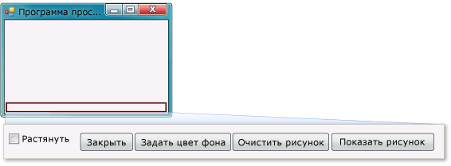

# <a name="step-9-review-comment-and-test-your-code"></a>Шаг 9. Проверка, комментирование и тестирование кода
Затем в код добавляется комментарий. Комментарий это заметка, которая не влияет на выполнение программы. Он облегчает понимание назначения кода тем, кто читает этот код. Добавление комментариев в код — хорошая привычка. В Visual C# строка обозначается как комментарий с помощью двух косых черт (//). В Visual Basic строка обозначается как комментарий с помощью одинарной кавычки('). После добавления комментария программа проверяется. Рекомендуется регулярно выполнять и тестировать код при работе над проектами, чтобы можно было на ранних стадиях выявлять и устранять проблемы, прежде чем код станет слишком сложным. Это называется *итеративным тестированием*.

 Только что выполнено построение программы, которая работает. Хотя программа еще не завершена, но она уже может загружать рисунок. Перед добавлением комментариев в код и его проверкой, уделите время на ознакомление с понятиями кода, так как эти понятия будут часто использоваться.

- При двойном щелчке кнопки **Показать рисунок** в **конструкторе Windows Forms** интегрированная среда разработки автоматически добавляла *метод* в код программы.

- Методами называют порядок организации кода: это то, каким образом группируется код.

- Большую часть времени метод выполняет небольшое количество действий в определенном порядке, например, метод `showButton_Click()` показывает диалоговое окно и затем загружает рисунок.

- Метод состоит из *операторов* кода или строк кода. Считайте, что метод — это способ объединения инструкций кода.

- Когда метод выполняется или *вызывается*, операторы в нем выполняются по порядку, один за другим, начиная с первого.

   Ниже приведен пример оператора.

  ```csharp
  pictureBox1.Load(openFileDialog1.FileName);
  ```

  ```vb
  pictureBox1.Load(openFileDialog1.FileName)
  ```

   Операторы это то, что указывает программам выполнять действия. В Visual C# оператор всегда заканчивается точкой с запятой. В Visual Basic конец строки это конец оператора. (в Visual Basic точка с запятой не нужна). Предыдущий оператор указывает элементу управления <xref:System.Windows.Forms.PictureBox> загрузить файл, который пользователь выбрал в компоненте **OpenFileDialog**.

  Видеоверсию этого раздела см. на страницах [Tutorial 1: Create a picture viewer in Visual Basic - Video 5](http://go.microsoft.com/fwlink/?LinkId=205216) (Руководство 1. Создание приложения для просмотра рисунков на Visual Basic — видео 5) или [Tutorial 1: Create a picture viewer in C# - Video 5](http://go.microsoft.com/fwlink/?LinkId=205206) (Руководство 1. Создание приложения для просмотра рисунков на C# — видео 5). Эти видеоролики сняты с использованием более ранней версии Visual Studio, поэтому существуют небольшие различия в некоторых командах меню и других элементах пользовательского интерфейса. Однако концепции и процедуры аналогичны текущей версии Visual Studio.

## <a name="to-add-comments"></a>Добавление комментариев

1.  Добавьте следующий комментарий в код.

     [!code-vb[VbExpressTutorial1Step9_10#1](../ide/codesnippet/VisualBasic/step-9-review-comment-and-test-your-code_1.vb)]
     [!code-csharp[VbExpressTutorial1Step9_10#1](../ide/codesnippet/CSharp/step-9-review-comment-and-test-your-code_1.cs)]

    > [!NOTE]
    >  Обработчик события <xref:System.Windows.Forms.Control.Click> кнопки **showButton** завершен и работает. Написание кода было начато с оператора `if`. Оператор `if` как-будто говорит программе: "Проверь это условие. Если оно выполняется, выполни эти действия". В этом случае программе дается указание открыть диалоговое окно **Открытие файла** и, если пользователь выбирает файл и нажимает кнопку **ОК**, загрузить этот файл в элемент управления **PictureBox**.

    > [!TIP]
    >  Интегрированная среда разработки построена так, чтобы облегчить написание кода, и *фрагменты кода* являются одним из средств для этого. Фрагмент представляет собой ярлык, который разворачивается в небольшой блок кода.
    >
    >  Можно просмотреть все доступные фрагменты. В строке меню выберите **Сервис** > **Диспетчер фрагментов кода**. В случае Visual C# фрагмент `if` находится в разделе **Visual C #**. В случае Visual Basic фрагменты `if` находятся в разделе **Условные выражения и циклы** > **Шаблоны кода**. Этот диспетчер можно использовать для просмотра существующих фрагментов и для добавления собственных фрагментов.
    >
    >  Чтобы активировать фрагмент при наборе кода, введите его и нажмите клавишу **TAB**. В окне **IntelliSense** появится множество фрагментов, поэтому нажмите клавишу **TAB** дважды — первый раз, чтобы выделить фрагмент в окне **IntelliSense**, и второй раз, чтобы указать интегрированной среде разработки использовать этот фрагмент. (IntelliSense поддерживает фрагмент `if`, но не фрагмент `ifelse`).

2.  Перед выполнением программы сохраните программу, нажав на панели инструментов показанную ниже кнопку **Сохранить все**.

     
Кнопка **Сохранить все**

     Кроме того, чтобы сохранить программу, в строке меню выберите **Файл** > **Сохранить все**. Рекомендуется выполнять сохранение от начала разработки и как можно чаще.

     При выполнении программа должна выглядеть, как показано на рисунке ниже.

     
**Программа просмотра изображений**

## <a name="to-test-your-program"></a>Проверка программы

1.  Нажмите клавишу **F5** или кнопку **Начать отладку** на панели инструментов.

2.  Чтобы выполнить только что написанный вами код, нажмите кнопку **Показать рисунок**. Сначала программа открывает диалоговое окно **Открыть файл**. Убедитесь, что в нижней части диалогового окна в раскрывающемся списке **Типы файлов** появились фильтры. Затем перейдите к рисунку и откройте его. Обычно образцы рисунков, которые поставляются вместе с операционной системой Windows, можно найти в папке *Мои документы* во вложенной папке *Мои рисунки\Образцы рисунков*.

    > [!NOTE]
    >  Если вы не видите изображений в диалоговом окне **Выбор файла изображения**, убедитесь, что в раскрывающемся списке в нижней правой части диалогового окна выбран фильтр **Все файлы (*.\*)**.

3.  Загрузите рисунок и он появится в элемент управления PictureBox. Затем снова попробуйте изменить размер формы, перетащив ее границы. Так как элемент управления PictureBox закреплен внутри элемента управления TableLayoutPanel, который сам закреплен внутри формы, область картинки будет сама изменять размер, таким образом, что по ширине она будет как форма и заполнит 90 процентов формы. Поэтому используются контейнеры <xref:System.Windows.Forms.TableLayoutPanel> и <xref:System.Windows.Forms.FlowLayoutPanel>: они сохраняют правильные размеры формы, когда пользователь меняет ее размер.

     Сейчас большие изображения выходят за границы средства просмотра изображений. В следующем шаге вам предстоит добавить код, чтобы изображения помещались в окне.

## <a name="to-continue-or-review"></a>Продолжить или повторить пройденный материал

-   Следующий раздел руководства: [Шаг 10. Написание кода для дополнительных кнопок и флажка](../ide/step-10-write-code-for-additional-buttons-and-a-check-box.md).

-   Предыдущий раздел руководства: [Шаг 8. Написание кода для обработчика событий кнопки "Показать рисунок"](../ide/step-8-write-code-for-the-show-a-picture-button-event-handler.md).
