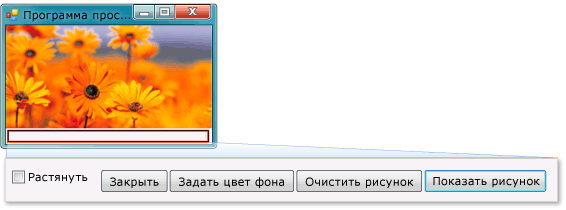

# Руководство 1. Создание приложения для просмотра рисунков

В этом руководстве создается приложение, которое загружает изображение из файла и отображает его в окне. Вы узнаете, как с помощью **конструктора Windows Forms** добавлять в форму элементы управления, такие как кнопки и поля для изображений, настраивать их свойства и использовать контейнеры для удобного изменения размеров формы. Также начинается создание кода.

> [!NOTE]
> В этом учебнике приведены примеры как на C#, так и на Visual Basic, поэтому обращайте внимание на информацию, которая относится к используемому вами языку программирования.

В этом учебнике выполняются перечисленные ниже задачи.

* Создайте новый проект.

* Тестировать (выполнить отладку) приложения.

* Добавлять в форму основные элементы управления, например, флажки и кнопки.

* Размещение элементов управления в форме с помощью макетов.

* Добавлять в форму диалоговые окна **Открыть файл** и **Цвет**.

* Написание кода с помощью IntelliSense и фрагментов кода.

* Создавать методы обработчика событий.

По завершении приложение должно выглядеть следующим образом.

## Ссылки на руководства

|Заголовок|Описание|
|-----------|-----------------|
|[Шаг 1. Создание проекта приложения Windows Forms](../ide/step-1-create-a-windows-forms-application-project.md)|Начните с создания проекта приложения Windows Forms.|
|[Шаг 2. Запуск приложения для просмотра изображений](../ide/step-2-run-your-program.md)|Запустите проект приложения Windows Forms, созданный в предыдущем шаге.|
|[Шаг 3. Настройка свойств формы](../ide/step-3-set-your-form-properties.md)|Изменение внешнего вида формы с помощью окна **Свойства**.|
|[Шаг 4. Создание макета формы с помощью элемента управления TableLayoutPanel](../ide/step-4-lay-out-your-form-with-a-tablelayoutpanel-control.md)|Добавьте элемент управления `TableLayoutPanel` в форму.|
|[Шаг 5. Добавление элементов управления в форму](../ide/step-5-add-controls-to-your-form.md)|Добавление в форму элемента управления `PictureBox` и элемента управления `CheckBox`. Добавление в форму кнопок.|
|[Шаг 6. Присвоение имен элементам управления "Кнопка"](../ide/step-6-name-your-button-controls.md)|Назначение кнопкам понятных имен.|
|[Шаг 7. Добавление компонентов диалогового окна в форму](../ide/step-7-add-dialog-components-to-your-form.md)|Добавьте в форму компоненты `OpenFileDialog` и `ColorDialog`.|
|[Шаг 8. Написание кода для обработчика событий кнопки "Показать рисунок"](../ide/step-8-write-code-for-the-show-a-picture-button-event-handler.md)|Напишите код с помощью средства IntelliSense.|
|[Шаг 9. Проверка, комментирование и тестирование кода](../ide/step-9-review-comment-and-test-your-code.md)|Просмотр и тестирование кода. Добавление необходимых комментариев.|
|[Шаг 10. Написание кода для дополнительных кнопок и флажка](../ide/step-10-write-code-for-additional-buttons-and-a-check-box.md)|Создание кода с помощью IntelliSense для описания поведения кнопок и флажков.|
|[Шаг 11. Запуск приложения и изучение других функций](../ide/step-11-run-your-program-and-try-other-features.md)|Запустите приложение и настройте цвет фона. Изучение других возможности, например, изменение цветов, шрифтов и границ.|

Кроме того, вы можете найти отличные бесплатные учебные видеоматериалы. Дополнительные сведения о программировании на языке C# см. в разделе [Основы C#. Разработка для начинающих](https://channel9.msdn.com/Series/C-Sharp-Fundamentals-Development-for-Absolute-Beginners). Дополнительные сведения о программировании на Visual Basic см. в руководстве по [разработке на Visual Basic для начинающих](https://channel9.msdn.com/Series/Visual-Basic-Development-for-Absolute-Beginners).

## Дальнейшие действия

Начните работу с руководством с **[шага 1: создание проекта приложения Windows Forms](../ide/step-1-create-a-windows-forms-application-project.md)** .

## См. также

* [Другие руководства по C#](../get-started/csharp/index.yml)
* [Руководства по Visual Basic](../get-started/visual-basic/index.yml)
* [Руководства по C++](/cpp/get-started/tutorial-console-cpp)