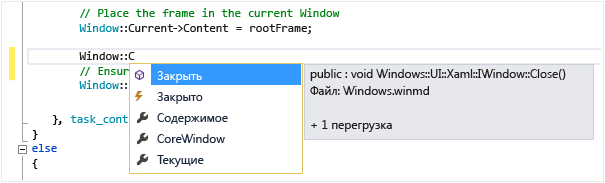

# <a name="intellisense-in-visual-studio"></a>IntelliSense в Visual Studio

IntelliSense — это вспомогательное средство для написания кода, включающее несколько возможностей: "Список членов", "Сведения о параметрах", "Краткие сведения" и "Завершить слово". Эти возможности помогают получать дополнительные сведения об используемом коде, отслеживать параметры при вводе и добавлять вызовы свойств и методов путем нескольких нажатий клавиш.

Многие аспекты IntelliSense зависят от конкретного языка. Дополнительные сведения об IntelliSense для различных языков приведены в разделах, перечисленных в подразделе [См. также](#see-also).

## <a name="list-members"></a>Список членов

После ввода символа триггера (например, точки (`.`) в управляемом коде или `::` в C++) появляется список допустимых членов типа (или пространства имен). Если продолжить вводить символы, список фильтруется таким образом, чтобы включать только члены, начинающиеся этими символами, или члены, у которых *любое* слово в имени начинается этими символами. IntelliSense также выполняет сопоставление "верблюжьего" стиля, поэтому вы можете просто ввести первую букву каждого слова с "верблюжьим" стилем в имени члена, чтобы просмотреть список совпадений.

После выбора элемента, его можно вставить в код, нажав клавишу **TAB** или введя пробел. При выделении элемента и вводе точки элемент отображается с конечной точкой, которая вызывает еще один список членов. При выделении элемента (но до того, как он будет вставлен) отображаются краткие сведения по элементу.

В списке членов значок слева указывает на тип члена, такой как пространство имен, класс, функция или переменная. Список значков см. в разделе [Значки представления классов и обозревателя объектов](../ide/class-view-and-object-browser-icons.md). Список может быть достаточно длинным; перемещаться вверх и вниз по списку можно с помощью клавиш **PAGE UP** и **PAGE DOWN**.



Функцию **Список членов** можно вызывать вручную, нажав клавиши **CTRL**+**J**, выбрав пункт **Edit** > **IntelliSense** > **Список членов** или нажав кнопку **Список членов** на панели инструментов редактора. При вызове в пустой строке или за пределами распознаваемой области в списке отображаются символы глобального пространства имен.

Чтобы отключить список членов по умолчанию (чтобы он не отображался без специального вызова), перейдите в раздел меню **Сервис** > **Параметры** > **Все языки** и снимите флажок **Автоматически отображать список членов**. Если требуется отключить список членов только для конкретного языка, перейдите к параметрам **Общие** для этого языка.

Можно также включить режим подсказки, в котором в код будет вставляться только печатаемый текст. Например, если ввести идентификатор, отсутствующий в списке, и нажать клавишу **TAB**, в режиме завершения введенный идентификатор был бы заменен записью из списка. Для переключения между режимом завершения и режимом подсказки нажмите **CTRL**+**ALT**+**ПРОБЕЛ** или выберите **Изменить** > **IntelliSense** > **Переключить режим завершения**.

## <a name="parameter-info"></a>Сведения о параметрах

Функция "Сведения о параметрах" предоставляет сведения о числе параметров, необходимых методу, параметру атрибута универсального типа (в C#) или шаблону (в C++), а также об именах и типах таких параметров.

Выделение параметра полужирным шрифтом указывает на следующий параметр, необходимый при вводе функции. Для перегруженных функций можно использовать клавиши **СТРЕЛКА ВВЕРХ** и **СТРЕЛКА ВНИЗ** для просмотра сведений об альтернативных параметрах для перегрузок функций.


При аннотировании функций и параметров при помощи комментариев XML-документации комментарии будут отображаться в качестве сведений о параметрах. Дополнительные сведения см. в разделе [Создание XML-примечаний к коду](reference/generate-xml-documentation-comments.md).

Сведения о параметрах можно вызвать вручную, выбрав **Изменить** > **IntelliSense** > **Сведения о параметрах**, нажав клавиши **CTRL**+**SHIFT**+**ПРОБЕЛ** или кнопку **Сведения о параметрах** на панели инструментов редактора.

## <a name="quick-info"></a>Краткие сведения

Функция "Краткие сведения" отображает полное объявление любого идентификатора в коде.


При выборе члена в поле **Список членов** для него также отображаются краткие сведения.


Краткие сведения можно вызвать вручную, выбрав пункт меню **Изменить** > **IntelliSense** > **Краткие сведения** либо нажав клавиши **CTRL**+**I** или кнопку **Краткие сведения** на панели инструментов редактора.

Если функция перегружена, IntelliSense может не отображать информацию для всех форм перегрузки.

Чтобы отключить краткие сведения для кода C++, можно перейти в меню **Сервис** > **Параметры** > **Текстовый редактор** > **С/С++**  > **Дополнительно** и задать для параметра **Автоматические краткие сведения** значение `false`.

## <a name="complete-word"></a>Завершение слов

Функция "Завершить слово" завершает оставшуюся часть имени переменной, команды или функции после ввода достаточного количества символов для однозначного определения термина. Чтобы вызвать функцию "Завершить слово", можно выбрать пункт меню **Изменить** > **IntelliSense** > **Завершить слово** либо нажать клавиши **CTRL**+**ПРОБЕЛ** или кнопку **Завершить слово** на панели инструментов редактора.

## <a name="intellisense-options"></a>Параметры IntelliSense

Параметры IntelliSense включены по умолчанию. Чтобы отключить их, выберите **Сервис** > **Параметры** > **Текстовый редактор** и снимите флажок **Сведения о параметрах** или **Автоматически отображать список членов**, если вам не нужна функция списка членов.

## <a name="intellisense-icons"></a>Значки IntelliSense
Значки в IntelliSense могут передавать дополнительные значения с помощью модификаторов значков. Это звезды, сердечки и замки, расположенные поверх значка объекта, которые означают защищенное, внутреннее или закрытое использование соответственно.

|    Значок    |    Возможности доступа    |    Description    |
|------------|--------------------------------|------------------------------------------------------------------------------------------------------------------------------------------------------|
|        |    Открытый класс    |    Неограниченный доступ.   |
|        |    Защищенный класс    |    Доступ ограничен содержащим классом или типами, которые являются производными от содержащего класса.    |
|        |    Защищенный внутренний класс    |    Доступ ограничен текущей сборкой или типами, которые являются производными от содержащего класса.    |
|        |    Внутренний класс    |    Доступ ограничен текущей сборкой.    |
|        |    Закрытый класс    |    Доступ ограничен содержащим классом или типами, которые являются производными от содержащего класса в текущей сборке. (Доступно с версии C# 7.2.)    |

## <a name="troubleshoot-intellisense"></a>Устранение неполадок IntelliSense

В некоторых случаях параметры IntelliSense могут не работать должным образом.

**Курсор находится под ошибкой кода**. Если в коде над курсором имеется неполная функция или другая ошибка, функция IntelliSense может перестать работать, поскольку ей не удается проанализировать элементы кода. Для устранения этой проблемы можно отметить соответствующий код комментарием.

**Курсор находится в комментарии к коду**. Если курсор находится в комментарии в файле исходного кода, вы не сможете использовать IntelliSense.

**Курсор находится в строковом литерале**. Вы не сможете использовать IntelliSense, если курсор находится внутри кавычек, в которые заключен строковый литерал, как показано в следующем примере:

```cpp
MessageBox( hWnd, "String literal|")
```

**Автоматические параметры отключены**. По умолчанию функция IntelliSense работает автоматически, но ее можно отключить. Вы можете вызывать функцию IntelliSense, даже если автоматическое завершение операторов отключено.

## <a name="see-also"></a>См. также раздел

- [Visual Basic IntelliSense](../ide/visual-basic-specific-intellisense.md)
- [C# IntelliSense](../ide/visual-csharp-intellisense.md)
- [IntelliSense для Python](../python/editing-python-code-in-visual-studio.md#intellisense)
- [IntelliSense для JavaScript](../ide/javascript-intellisense.md)
- [Написание и рефакторинг кода (C++)](/cpp/ide/writing-and-refactoring-code-cpp)
- [Создание XML-примечаний к коду](reference/generate-xml-documentation-comments.md)
