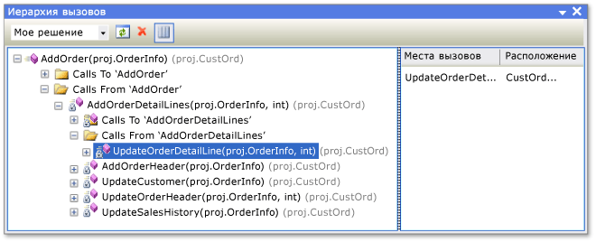

# Просмотр структуры кода с помощью разных окон инструментов

Классы и их элементы в Visual Studio можно просматривать с помощью различных окон, в том числе **Представление классов**, **Иерархия вызовов**, **Обозреватель объектов** и **окно определения кода** (C++ только). Эти окна инструментов позволяют проверять код в проектах Visual Studio, компонентах .NET, компонентах COM, библиотеках динамической компоновки (DLL) и библиотеках типов (TLB).

Вы также можете просматривать типы и элементы в проекте, искать символы, просматривать иерархию вызовов метода, искать ссылки на символы и выполнять другие действия, не переключаясь между несколькими окнами инструментов, с помощью **обозревателя решений**.

Работая в редакторе Visual Studio Enterprise, вы с помощью *карт кода* можете визуализировать структуру кода и его зависимости по всему решению. Дополнительные сведения см. в статье [Сопоставление зависимостей с картами кода](../modeling/map-dependencies-across-your-solutions.md).

## Представление классов (Visual Basic, C#, C++)

Окно **Представление классов** отображается в интерфейсе **обозревателя решений**, а также как отдельное окно. В окне **Представление классов** отображаются элементы приложения. В верхней области отображаются пространства имен, типы, интерфейсы, перечисления и классы, а в нижней области — элементы, которые относятся к типу, выбранному в верхней области. Используя это окно, можно переместиться к определениям элементов в исходном коде (или в **обозревателе объектов**, если элемент определен вне решения).

Чтобы просмотреть элементы проекта в окне **Представление классов**, его необязательно компилировать. Окно обновляется при изменении кода в проекте.

Добавить код в проект можно, выбрав узел проекта и нажав кнопку **Добавить**. При этом откроется диалоговое окно **Добавление нового элемента**. Код добавляется в отдельном файле.

Если проект возвращен в систему управления версиями, рядом с каждым элементом в окне **Представление классов** отображается значок, указывающий состояние файла исходного кода. Общие команды управления исходным кодом, такие как **Извлечь**, **Вернуть** и **Получить последнюю версию**, также доступны в контекстном меню элемента.

### Панель инструментов представления классов

Ниже приведены команды панели инструментов окна **Представление классов**.

|name|Описание|
|-|-|
|**Создать папку**|Создание виртуальной или вложенной папки, в которой можно разместить часто используемые элементы. Они сохраняются в файле активного решения (*SUO*). После переименования или удаления элемента в коде он может появиться в виртуальной папке как узел ошибки. Чтобы устранить эту проблему, удалите узел ошибки. При переименовании элемента его можно снова переместить из иерархии проекта в папку.|
|**Назад**|Переход к ранее выбранному элементу.|
|**Вперед**|Переход к следующему выбранному элементу.|
|**Перейти к схеме классов** (только проекты с управляемым кодом)|Становится доступной, если выбрать пространство имен или тип в окне **Представление классов**. Если выбрано пространство имен, в схеме классов отображаются все типы, имеющиеся в ней. Если выбран тип, в схеме классов отображается только этот тип.|

### Параметры представления классов

Ниже приведены параметры, которые позволяют выбрать кнопку панели инструментов **Окно классов: параметры**.

|name|Описание|
|-|-|
|**Показать базовые типы**|Отображаются базовые типы.|
|**Показать ссылки проектов**|Отображаются ссылки проектов.|
|**Показать скрытые типы и члены**|Скрытые типы и члены (не предназначенные для использования клиентами) выделяются светло-серым цветом.|
|**Показать открытые члены**|Отображаются открытые члены.|
|**Показать защищенные члены**|Отображаются защищенные члены.|
|**Показать закрытые члены**|Отображаются закрытые члены.|
|**Показать прочие члены**|Отображаются другие виды членов, включая внутренние (или Friend в Visual Basic).|
|**Показать унаследованные члены**|Отображаются унаследованные члены.|

### Контекстное меню представления классов

Контекстное меню в окне **Представление классов** может содержать приведенные ниже команды в зависимости от выбранного типа проекта.

|name|Описание|
|-|-|
|**Перейти к определению**|Поиск определения элемента в исходном коде или в **обозревателе объектов**, если элемент не определен в открытом проекте.|
|**Найти определение**|Отображение выбранного элемента в **обозревателе объектов**.|
|**Найти все ссылки**|Поиск элемента выбранного объекта и отображение результатов в окне **Результаты поиска**|
|**Фильтровать по типу** (только управляемый код)|Отображение только выбранного типа или пространства имен. Фильтр можно удалить, нажав кнопку **Очистить поиск** (**X**) рядом с полем **Найти**.|
|**Копировать**|Копирование полного имени элемента.|
|**Сортировать по алфавиту**|Сортировка имен типов и членов в алфавитном порядке.|
|**Сортировать по типу члена**|Сортировка списков типов и членов по типу (таким образом, классы предшествуют интерфейсам, интерфейсы предшествуют делегатам, а методы предшествуют свойствам).|
|**Сортировать по доступу к члену**|Сортировка типов и членов по типу доступа (открытый или закрытый).|
|**Группировать по типу члена**|Объединение типов и членов в группы с сортировкой по типу объекта.|
|**Перейти к объявлению** (только для кода C++)|Отображение объявления типа или члена в исходном коде, если оно есть.|
|**Перейти к определению**|Отображение определения типа или члена в исходном коде, если оно есть.|
|**Перейти по ссылке**|Отображение ссылки на тип или член в исходном коде, если она есть.|
|**Просмотр иерархии вызовов**|Отображение выбранного метода в окне **Иерархия вызовов**|

## Окно "Иерархия вызовов" (Visual Basic, C#, C++)

В окне **Иерархия вызовов** можно просмотреть, где вызывался определенный метод или свойство. В нем также приведен список методов, вызванных из других методов. Ви можете просмотреть несколько уровней графа вызовов, в котором показаны отношения между вызывающими и вызываемыми методами в заданной области.

Чтобы открыть окно **Иерархия вызовов**, выберите метод (свойство или конструктор) в редакторе, а затем в контекстном меню выберите **Просмотреть иерархию вызовов**. Это окно должно выглядеть примерно следующим образом:

С помощью раскрывающегося списка на панели инструментов можно указать область иерархии: решение, текущий проект или текущий документ.

В основной области отображаются вызовы самого метода и вызовы из него, а на панели **Вызвать сайты** отображается расположение выбранного вызова. Для членов, которые являются виртуальными или абстрактными, появляется узел **Переопределяет имя метода**. Для членов интерфейса появляется узел **Реализует имя метода**.

Окно **Иерархия вызовов** не обнаруживает ссылки на группы методов, включая места, где метод добавлен в качестве обработчика событий или назначен делегату. Чтобы найти эти ссылки, используйте команду **Найти все ссылки**.

Контекстное меню в окне **Иерархия вызовов** содержит приведенные ниже команды.

|name|Описание|
|-|-|
|**Добавить как новый корневой элемент**|Добавление выбранного узла в качестве нового корневого узла.|
|**Удалить корневой элемент**|Удаление выбранного корневого узла из области представления в виде дерева.|
|**Перейти к определению**|Переход к исходному определению метода.|
|**Найти все ссылки**|Поиск всех ссылок на выбранный метод в проекте.|
|**Копировать**|Копирование выбранного узла (кроме дочерних узлов).|
|**Обновление**|Обновление данные.|

##  Обозреватель объектов

В окне **Обозреватель объектов** отображаются описания кода в проектах.

Вы можете отфильтровать компоненты, которые нужно просмотреть, с помощью раскрывающегося списка в верхней части окна. К пользовательским компонентам относятся исполняемые файлы управляемого кода, сборки библиотек, библиотеки типов и *OCX*-файлы. Пользовательские компоненты C++ добавить нельзя.

::: moniker range="vs-2017"

Пользовательские параметры сохраняются в каталоге приложения пользователя Visual Studio — *%APPDATA%\Microsoft\VisualStudio\15.0\ObjBrowEX.dat*.

::: moniker-end

::: moniker range=">=vs-2019"

Пользовательские параметры сохраняются в каталоге приложения пользователя Visual Studio — *%APPDATA%\Microsoft\VisualStudio\16.0\ObjBrowEX.dat*.

::: moniker-end

Слева в окне **Обозреватель объектов** отображаются сборки. Вы можете развернуть сборки, чтобы просмотреть содержащиеся в них пространства имен, которые также можно развернуть для просмотра содержащихся в них типов. При выборе типа его члены (например, свойства и методы) отображаются на правой панели. На нижней правой панели отображаются подробные сведения о выбранном элементе.

Найти конкретный элемент можно с помощью поля **Поиск**, расположенного в верхней части окна. Регистр букв при поиске не учитывается. Результаты поиска отображаются на левой панели. Чтобы очистить условия поиска, нажмите кнопку **Очистить поиск** (**Х**), расположенную рядом с полем **Поиск**.

Окно **Обозреватель объектов** отслеживает выбранные параметры. Вы можете переходить от одного варианта к другому с помощью кнопок **Вперед** и **Назад** на панели инструментов.

Вы можете использовать **обозреватель объектов** для добавления ссылки на сборку в открытое решение. Для этого выберите элемент (сборку, пространство имен, тип или член) и нажмите кнопку **Добавить ссылку** на панели инструментов.

### Параметры обозревателя объектов

С помощью кнопки **Параметры обозревателя объектов** на панели инструментов можно выбрать одно из приведенных ниже представлений.

|name|Описание|
|-|-|
|**Просмотр пространств имен**|Отображение пространств имен вместо физических контейнеров на левой панели. Пространства имен, хранящиеся в различных физических контейнерах, объединяются.|
|**Просмотр контейнеров**|Отображение физических контейнеров вместо пространств имен на левой панели. Представления **Просмотр пространств имен** и **Просмотр контейнеров** являются взаимоисключающими.|
|**Показать базовые типы**|Отображение базовых типов|
|**Показать скрытые типы и члены**|Выделение скрытых типов и членов (не предназначенных для использования клиентами) светло-серым цветом.|
|**Показать открытые члены**|Отображение открытых членов.|
|**Показать защищенные члены**|Отображение защищенных членов.|
|**Показать закрытые члены**|Отображение закрытых членов.|
|**Показать прочие члены**|Отображение других типов членов, включая внутренние (или Friend в Visual Basic).|
|**Показать унаследованные члены**|Отображение унаследованных членов.|
|**Показать методы расширения**|Отображение методов расширения.|

### Команды контекстного меню обозревателя объектов

Контекстное меню в **обозревателе объектов** может содержать приведенные ниже команды в зависимости от выбранного типа элемента.

|name|Описание|
|-|-|
|**Найти определение**|Отображение основного узла выбранного элемента.|
|**Найти все ссылки**|Поиск элемента выбранного объекта и отображение результатов в окне **Результаты поиска**|
|**Фильтровать по типу**|Отображение только выбранного типа или пространства имен. Фильтр можно удалить, нажав кнопку **Очистить поиск**.|
|**Копировать**|Копирование полного имени элемента.|
|**Remove**|Если область представляет собой набор пользовательских компонентов, выбранный компонент удаляется из области.|
|**Сортировать по алфавиту**|Сортировка имен типов и членов в алфавитном порядке.|
|**Сортировать по типу объекта**|Сортировка списков типов и членов по типу (таким образом, классы предшествуют интерфейсам, интерфейсы предшествуют делегатам, а методы предшествуют свойствам).|
|**Сортировать по доступу к объекту**|Сортировка типов и членов по типу доступа (открытый или закрытый).|
|**Группировать по типу объекта**|Объединение типов и членов в группы с сортировкой по типу объекта.|
|**Перейти к объявлению** (только проекты C++)|Отображение объявления типа или члена в исходном коде, если оно есть.|
|**Перейти к определению**|Отображение определения типа или члена в исходном коде, если оно есть.|
|**Перейти по ссылке**|Отображение ссылки на тип или член в исходном коде, если она есть.|
|**Просмотр иерархии вызовов**|Отображение выбранного метода в окне **Иерархия вызовов**|

## Окно определения кода (C++)

В окне **Определение кода** отображается определение выбранного типа C++ или элемента в активном проекте. Тип или член можно выбрать в редакторе кода или в окне просмотра кода.

Это окно доступно только для чтения, но в нем можно установить точки останова и закладки. Чтобы изменить отображаемое определение, выберите в контекстном меню команду **Изменить определение**. Исходный файл открывается в редакторе кода, а курсор устанавливается на строку, где начинается определение.

> [!NOTE]
> Начиная с Visual Studio 2015 окно **определения кода** может использоваться только с кодом C++.

### Контекстное меню окна определения кода

Контекстное меню в окне **Определение кода** может содержать приведенные ниже команды.

|name|Описание|
|-|-|
|**Быстрые действия и рефакторинг**||
|**Переименование**||
|**Создать диаграмму включаемых файлов**||
|**Показать определение**||
|**Перейти к определению**|Поиск определения (или определений в случае разделяемых классов) и отображение их в окне **Результаты поиска**|
|**Перейти к объявлению**||
|**Найти все ссылки**|Поиск ссылок на тип или член в решении.|
|**Просмотр иерархии вызовов**|Отображение метода в окне **Иерархия вызовов**|
|**Переключение между файлами заголовков и кода**||
|**Выполнить тесты**|Если в проекте есть модульные тесты, выполняются тесты для выбранного кода.|
|**Запустить отладку тестов**||
|**Точка останова**|Вставка точки останова (или точки трассировки).|
|**Выполнить до текущей позиции**|Выполнение программы в режиме отладки до позиции курсора.|
|**Фрагмент кода**||
|**Вырезать**, **Копировать**, **Вставить**||
|**Комментарий**||
|**Структура**|Стандартные команды структурирования.|
|**Повторить сканирование**||
|**Изменить определение**|Перемещение курсора к определению в окне кода.|
|**Выбрать кодировку**|Открытие окна **Кодировка** для выбора кодировки файла|

## Окно Структура документа

Вы можете использовать окно **Структура документа** совместно с представлениями конструктора, такими как конструктор для XAML-страницы или конструктор Windows Form, либо совместно с HTML-страницами. В этом окне элементы отображаются в виде дерева, благодаря чему можно просматривать логическую структуру формы или страницы и отыскивать элементы управления, скрытые или расположенные глубоко в иерархии.

## См. также

- [Значки представления классов и обозревателя объектов](../ide/class-view-and-object-browser-icons.md)
