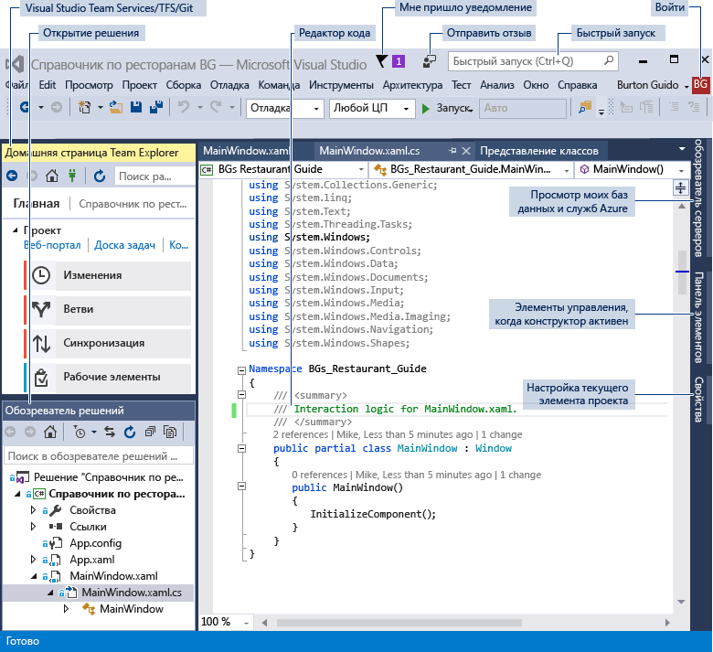
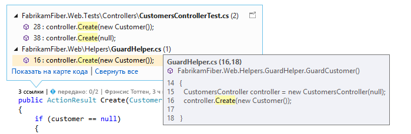
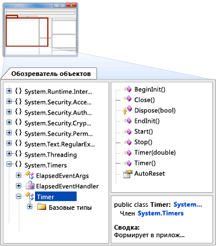

# Обзор интегрированной среды разработки Visual Studio

Интерактивная интегрированная среда разработки Visual Studio — это оригинальная среда запуска, которая позволяет просматривать и изменять практически любой код, а также отлаживать, выполнять сборку и публиковать приложения для устройств с Android, iOS, Windows, а также в Интернете и облаке. Доступны версии как для компьютеров Mac, так и для компьютеров с Windows. В этой статье вы ознакомитесь с возможностями интегрированной среды разработки Visual Studio. Мы рассмотрим некоторые возможности Visual Studio, установку и использование этой среды, создание простых проектов, отладку и развертывание кода, а также различные окна инструментов.

## Возможности интегрированной среды разработки Visual Studio

Вы хотите создать приложение для телефона Android? Теперь у вас есть такая возможность. А как насчет создания популярных игр на C++? Это и многое другое теперь также доступно для вас. Visual Studio предоставляет шаблоны, позволяющие создать веб-сайты, игры, классические приложения, мобильные приложения, приложения для Office и многое другое.

К тому же вы можете просто открыть код, где бы вы ни находились, и начать работать. Вы увидели на GitHub проект, который вам понравился? Вам достаточно просто клонировать репозиторий, открыть его в Visual Studio и приступить к написанию кода.

### Создание мобильных приложений

Вы можете создать собственные мобильные приложения для различных платформ с помощью C#, Xamarin, Visual C++ или гибридные приложения на JavaScript с Apache Cordova. Вы можете написать игры для мобильных устройств с использованием платформ Unity, Unreal, DirectX, Cocos и других. Visual Studio содержит эмулятор Android для запуска и отладки приложений Android.

Вы можете создать службы приложений Azure, чтобы использовать возможности облака для мобильных приложений. С помощью служб приложений Azure можно хранить данные в облаке, осуществлять безопасную проверку подлинности пользователей и автоматически масштабировать их ресурсы, чтобы удовлетворить потребности приложения и бизнес-требования. См. дополнительные сведения о [разработке мобильных приложений](https://www.visualstudio.com/vs/mobile-app-development/).

### Создание облачных приложений для Azure

Visual Studio предлагает набор инструментов, позволяющих с легкостью создавать облачные приложения на базе Microsoft Azure. Она упрощает настройку, сборку, отладку, упаковку и развертывание приложений и служб в Microsoft Azure прямо из IDE. Чтобы получить инструменты Azure для .NET, при установке Visual Studio выберите рабочую нагрузку **разработки для Azure**. Дополнительные сведения см. на странице сведений об [инструментах Visual Studio для Azure](https://www.visualstudio.com/vs/azure-tools/).

Вы можете использовать службы Azure для приложений с помощью подключенных служб, таких как:

- [Мобильные службы Azure](http://azure.microsoft.com/documentation/services/mobile-services/)

- [Хранилище Azure](http://azure.microsoft.com/documentation/services/storage/)

[HockeyApp](https://www.visualstudio.com/hockey-app/) поможет вам распространять бета-версии, собирать динамические отчеты о сбоях и получать отзывы от реальных пользователей. Кроме того, вы можете интегрировать интерфейсы API REST Office 365 в собственное приложение для подключения к данным, хранящимся в облаке. Дополнительные сведения см. в [этих примерах GitHub](https://github.com/OfficeDev/?utf8=%E2%9C%93&query=o365).

[Application Insights](https://marketplace.visualstudio.com/items?itemName=VisualStudioOnlineApplicationInsights.application-insights) позволяет выявлять и диагностировать проблемы с качеством в приложениях и веб-службах. Служба Application Insights также позволяет понять, что именно пользователи делают с вашим приложением, чтобы вы могли оптимизировать работу с ним.

### Создание приложений для Интернета

Интернет-технологии правят современным миром, и Visual Studio поможет вам создавать веб-приложения. Вы можете создавать веб-приложения с помощью технологий ASP.NET, Node.js, Python, JavaScript и TypeScript. Visual Studio распознает такие платформы для создания веб-приложений, как Angular, jQuery, Express и другие. Платформы ASP.NET Core и .NET Core поддерживаются на компьютерах с Windows и Linux, а также на компьютерах Mac. [ASP.NET Core](http://www.asp.net/core/overview) представляет собой существенное обновление для MVC, WebAPI и SignalR, которое работает на платформах Windows, Mac и Linux.  Платформа ASP.NET Core была разработана с нуля и предоставляет компактный и изменяемый стек .NET для разработки современных облачных веб-приложений и служб.

Дополнительные сведения см. на странице со сведениями о [современных инструментах для создания веб-приложений](https://www.visualstudio.com/vs/modern-web-tooling/).

### Создание кроссплатформенных приложений и игр

С помощью Visual Studio вы можете создавать приложения и игры для устройств под управлением Android, iOS, Linux, Windows и других ОС. Дополнительные сведения см. в разделе [Разработка кроссплатформенных мобильных приложений](../cross-platform/cross-platform-mobile-development-in-visual-studio.md). Универсальные приложения Windows позволяют использовать один код на нескольких платформах. Дополнительные сведения см. в документации [по универсальной платформе Windows](https://dev.windows.com/windows-apps).

Выберите нужные инструменты с учетом требований ваших приложений и языка, который вы хотите использовать.

- [Xamarin для Visual Studio](../cross-platform/build-apps-with-native-ui-using-xamarin-in-visual-studio.md): общая база кода C# для всех устройств.

- [Инструменты Visual Studio для Apache Cordova](../cross-platform/visual-studio-tools-for-apache-cordova.md): общая база кода для HTML, CSS и JavaScript или Typescript.

- [Средства Visual Studio Tools для Unity](../cross-platform/visual-studio-tools-for-unity.md): разработка двухмерных и трехмерных игр в C#.

- [C++ для кросс-платформенной разработки](../cross-platform/visual-cpp-for-cross-platform-mobile-development.md): общие библиотеки кода и приложения в C++.

- [Visual Studio Emulator for Android](../cross-platform/visual-studio-emulator-for-android.md): эмулятор Visual Studio для Android — отладка и тестирование приложений Android независимо от интегрированной среды разработки.

[Создание игр в Visual Studio](https://www.visualstudio.com/vs/game-development/) с помощью таких инструментов как DirectX, Unity, Unreal, Cocos и многие другие.

С Visual Studio для вас действительно открываются многие возможности. Полный список возможностей см. [здесь](https://www.visualstudio.com/vs/).

## Установка интегрированной среды разработки Visual Studio

Чтобы приступить к работе, скачайте и установите Visual Studio. [Здесь](https://aka.ms/vsdownload?utm_source=mscom&utm_campaign=msdocs) вы можете скачать версию Visual Studio 2017.

Сегодня Visual Studio значительно компактнее и проще в использовании. Этот модульный установщик позволяет выбрать и установить *рабочие нагрузки*, которые являются группами функций, необходимыми для предпочитаемого языка программирования или платформы. Этот подход обеспечивает меньший объем установки Visual Studio, а значит установка и обновления происходят быстрее.

Выполните действия по созданию программы ниже и выберите установку рабочей нагрузки **Разработка приложений для универсальной платформы Windows**.

Помимо более быстрой установки, Visual Studio 2017 также позволяет сократить время запуска среды и загрузки решений.

Дополнительные сведения о настройке Visual Studio в своей системе см. в статье [Установка версии-кандидата Visual Studio 2017](../install/install-visual-studio.md).

## Войти

При первом запуске Visual Studio вы можете выполнить вход с использованием либо учетной записи Майкрософт, либо рабочей или учебной учетной записи. Оставаясь в системе, вы можете выполнить синхронизацию параметров Visual Studio, таких как макеты окон, на нескольких устройствах. Visual Studio также позволяет автоматически подключиться к нужным службам, например подпискам Azure и Visual Studio Team Services.

## Создание программы

Лучший способ освоить новые возможности — применить их на практике! Давайте создадим новую простую программу.

1. Запустите Visual Studio. В строке меню выберите **Файл** > **Создать** > **Проект**.

  

  В качестве альтернативы вы можете создать новый проект на начальной странице. Дополнительные сведения см. в статье блога [Новые возможности переработанной начальной страницы](https://blogs.msdn.microsoft.com/visualstudio/2016/11/29/harness-the-power-of-the-redesigned-start-page/).

1. В диалоговом окне **Создать проект** отображаются несколько шаблонов проекта. В разделе **Visual C#** выберите категорию **Универсальные приложения Windows**, а затем выберите шаблон **Пустое приложение (универсальное приложение Windows)** и нажмите кнопку **ОК**.

  > [!NOTE]
  > Если вы не видите категорию **Универсальные приложения для Windows**, необходимо установить рабочую нагрузку **Разработка универсальной платформы Windows**. Для этого щелкните ссылку **Открыть Visual Studio Installer** внизу слева в диалоговом окне **Новый проект**. Когда **Visual Studio Installer** откроется, выберите рабочую нагрузку **Разработка универсальной платформы Windows** и щелкните **Изменить**.

  

  В результате будет создан новый проект пустого универсального приложения Windows с помощью языков программирования C# и XAML. Настройка проекта может занять некоторое время. При выводе запросов на ввод каких-либо данных просто согласитесь пока со значениями по умолчанию.

1. В диалоговом окне **Новый проект универсальной платформы Windows** примите значения по умолчанию, нажав кнопку **ОК**.

1. Вы должны увидеть примерно следующее: В окне обозревателя решений, которое находится в правой области, перечислены файлы вашего проекта.

  

1. В обозревателе решений щелкните маленький черный треугольник возле файла MainPage.xaml, чтобы развернуть его. После этого под ним появится файл MainPage.xaml.cs. Выберите его (он содержит код C#), чтобы открыть.

  Код C# в файле MainPage.xaml.cs отображается в редакторе кода в левой области экрана. Обратите внимание, что к синтаксису кода автоматически применяется раскраска, чтобы обозначить различные типы кода, например операторы или комментарии. Кроме того, небольшие вертикальные штриховые линии кода указывают, какие фигурные скобки соответствуют друг другу, а номера строк помогут вам найти нужный код позже. Чтобы свернуть или развернуть код, используйте небольшие рамки со знаком минус. Эта функция структурирования кода позволяет скрыть ненужный код на экране.

  

  Есть и другие доступные меню и окна инструментов, но об этом позже.

1. Чтобы дать пользователям возможность взаимодействовать с вашим приложением, необходимо добавить кнопку в форму XAML. Для этого откройте файл MainPage.xaml. Вы увидите разделенное представление: вверху — конструктор для визуального размещения элементов управления, а внизу — представление кода для отображения кода XAML, который лежит в основе представленного в конструкторе. Потом, когда вы запустите программу, содержимое конструктора будет представлено в виде окна (формы), которое увидят пользователи, а код XAML будет определять, что в нем находится.

1. В левой области экрана выберите вкладку **Панель элементов**, чтобы открыть ее. Она содержит ряд визуальных элементов управления, которые вы можете добавить на форму. Пока просто добавим элемент управления "Кнопка".

1. Разверните раздел **Типовые элементы управления XAML** и перетащите из него элемент управления "Кнопка" примерно на середину формы. Разместите, как получится.

  

  После этого вы должны увидеть примерно следующее:

  

  Кнопка находится в конструкторе, а ее базовый код (выделенный) автоматически добавляется в код XAML этого конструктора.

1. Давайте немного изменим код XAML. Переименуем текст в коде элемента управления. Замените `Button` на `Hello!`.

  

1. Теперь запустите приложение. Вы можете сделать это с помощью кнопки **Запуск** () на панели инструментов или клавиши **F5** на клавиатуре. Также вы можете выбрать **Отладка** > **Начать отладку**.

  

  Начнется процесс создания, и в окне вывода появятся сообщения о состоянии. Вскоре вы увидите форму с кнопкой. Теперь у вас есть выполняемое приложение.

  

  Конечно, его функциональность пока ограничена, но вы можете это изменить, если захотите.

1. После выполнения программы нажмите кнопку "Остановить"на панели инструментов.

Давайте подведем итог. Вы создали новый проект универсального приложения Windows на C# в Visual Studio, просмотрели его код, добавили элемент управления в конструктор, изменили часть кода XAML, а затем запустили проект. Несмотря на то что в примере выше использовался упрощенный процесс, вы ознакомились с некоторыми общими компонентами интегрированной среды разработки Visual Studio, которые вы сможете использовать при разработке собственных приложений. Дополнительные сведения о приведенном примере см. в статье [Создание приложения "Hello, world" (XAML)](/windows/uwp/get-started/create-a-hello-world-app-xaml-universal).

## Отладка, тестирование и совершенствование кода

Всегда есть к чему стремиться. При написании кода требуется запустить его и проверить на ошибки и производительность. Современная система отладки Visual Studio позволяет выполнять отладку кода в локальном проекте, на удаленном устройстве или в эмуляторе, например для устройств Android или Windows Phone. Можно просматривать код с шагом в один оператор, проверяя значения переменных; пошагово выполнять многопоточные приложения, а также задать точки останова, которые срабатывают только при выполнении указанного условия. Вы можете отслеживать значения переменных во время выполнения кода, а также многое другое. Все это можно контролировать в самом редакторе кода, не покидая окно с кодом.

Для выполнения проверки Visual Studio предлагает такие возможности, как модульное тестирование, IntelliTest, тестирование производительности, нагрузочное тестирование и прочее. Дополнительные сведения о процессе выполнения отладки в Visual Studio см. на странице с [обзором возможностей отладчика](../debugger/debugger-feature-tour.md). Ознакомьтесь с [инструментами и сценариями тестирования](../test/developer-testing-scenarios.md), чтобы узнать больше о тестировании. Дополнительные сведения об улучшении производительности приложений см. в статье [Обзор возможностей профилирования](../profiling/profiling-feature-tour.md).

## Развертывание готового приложения

Когда приложение будет готово к развертыванию для пользователей или клиентов, вы также сможете выполнить его с помощью инструментов Visual Studio, будь это развертывание в Microsoft Store, на сайте SharePoint или с помощью технологии InstallShield или установщика Windows. Все эти возможности доступны в среде IDE. Дополнительные сведения см. в статье [Развертывание приложений, служб и компонентов](../deployment/deploying-applications-services-and-components.md).

## Краткий обзор интегрированной среды разработки

Обобщенный визуальный обзор Visual Studio приведен на снимке экрана ниже. На нем показана среда Visual Studio с открытым проектом и несколькими окнами основных инструментов, которые вам, вероятнее всего, придется использовать.

- [Обозреватель решений](../ide/solutions-and-projects-in-visual-studio.md) позволяет просматривать файлы кода, а также перемещаться по ним и управлять ими. Обозреватель решений позволяет упорядочить код путем объединения файлов в решения и проекты.

- В окне [Редактор](../ide/writing-code-in-the-code-and-text-editor.md), в котором вы, вероятнее всего, будете проводить большую часть времени, приводится исходный код. В нем можно редактировать этот код и разрабатывать пользовательский интерфейс.

- В окно [Вывод](../ide/reference/output-window.md) Visual Studio отправляет уведомления, такие как сообщения об отладке и ошибках, предупреждения компилятора, сообщения о состоянии публикаций и многие другие. Каждый источник сообщений имеет собственную вкладку.

- [Team Explorer (VSTS)](/vsts/user-guide/work-team-explorer) позволяет отслеживать рабочие элементы и использовать код совместно с другими пользователями с помощью технологий управления версиями, таких как [Git](https://git-scm.com/) и [система управления версиями Team Foundation (TFVC)](/vsts/tfvc/overview).

- [Cloud Explorer](/azure/vs-azure-tools-resources-managing-with-cloud-explorer) позволяет просматривать ресурсы Azure, например виртуальные машины, таблицы, базы данных SQL и т. д., и управлять ими. Если для выполнения конкретной операции требуется портал Azure, Cloud Explorer предоставит ссылки для перехода в нужное место на портале Azure.

Ниже приведены некоторые другие общие возможности повышения производительности в Visual Studio.

- Поле поиска [быстрого запуска](../ide/reference/quick-launch-environment-options-dialog-box.md) позволяет быстро найти нужное содержимое в Visual Studio. Просто начните вводить в поле то, что вы ищете, как показано на снимке экрана ниже, а Visual Studio представит результаты, один из которых точно вам подойдет. Элемент быстрого запуска также позволит вам запустить установщик Visual Studio для любой рабочей нагрузки или отдельного компонента.

  

- [Рефакторинг](../ide/refactoring-in-visual-studio.md) включает такие операции, как интеллектуальное переименование переменных, перемещение выделенных строк кода в отдельную функцию, перемещение кода в другие расположения, изменение порядка параметров функции и т. д.

 

- **IntelliSense** — это общий термин для набора очень популярных функций, отображающих сведения о типах в коде непосредственно в редакторе и в некоторых случаях автоматически создающих небольшие отрывки кода. По сути, IntelliSense представляет собой базовую документацию, встроенную в редактор, что избавляет от необходимости поиска информации о типах в отдельном окне справки. Функции IntelliSense зависят от языка. Дополнительные сведения см. в руководствах по использованию [IntelliSense в Visual C#](../ide/visual-csharp-intellisense.md), [IntelliSense в Visual C++](../ide/visual-cpp-intellisense.md), [IntelliSense в JavaScript](../ide/javascript-intellisense.md) и [IntelliSense в Visual Basic](../ide/visual-basic-specific-intellisense.md). На следующем рисунке показаны некоторые функции IntelliSense в действии.

  

- **Знаки тильды** — это волнистые красные подчеркивания, которые обозначают ошибки или потенциальные проблемы кода и появляются прямо в процессе работы с кодом. Таким образом, вы можете сразу исправить их еще до начала компиляции или выполнения кода. Если навести указатель мыши на волнистую линию, на экран будут выведены дополнительные сведения об ошибке. Кроме того, в поле слева может появляться значок лампочки с предложениями по устранению ошибки. Дополнительные сведения см. в разделе [Распространенные быстрые действия](../ide/quick-actions.md).

 

- В контекстном меню текстового редактора можно открыть окно [Иерархия вызовов](../ide/reference/call-hierarchy.md) для отображения методов, которые вызываются методом или вызывают метод, в котором установлен курсор (точка вставки).

 

- [CodeLens](../ide/find-code-changes-and-other-history-with-codelens.md) позволяет находить ссылки на код, изменения кода, связанные ошибки, рабочие элементы, проверки кода и модульные тесты — все это не выходя из редактора.

 

- Окно [Показать определения](../ide/how-to-view-and-edit-code-by-using-peek-definition-alt-plus-f12.md) позволяет просмотреть определение метода или типа в окне редактора, не покидая текущий контекст.

 

- Пункт контекстного меню **Перейти к определению** позволяет перейти непосредственно к тому месту, где определена функция или объект. Другие команды навигации также доступны по щелчку правой кнопкой мыши в редакторе.

 

- Связанный инструмент [Обозреватель объектов](http://msdn.microsoft.com/f89acfc5-1152-413d-9f56-3dc16e3f0470) позволяет исследовать сборки .NET или среды выполнения Windows в системе, чтобы просматривать содержащиеся в них типы и компоненты этих типов (свойства, методы, события и т. д.).

  

## Управление исходным кодом и совместная работа

Вы можете управлять исходным кодом в репозиториях Git, размещенных любым поставщиком, в том числе и GitHub. С помощью [Visual Studio Team Services (VSTS)](/vsts/index) можно управлять кодом, а также ошибками и рабочими элементами для всего проекта. Дополнительные сведения об управлении репозиториями Git в Visual Studio с использованием Team Explorer см. в статье [Приступая к работе с Git и Team Services (VSTS)](/vsts/git/gitquickstart?tabs=visual-studio). В Visual Studio также предусмотрены другие встроенные элементы управления исходным кодом. Дополнительные сведения о них см. в статье блога [Новые возможности Git в Visual Studio 2017](https://blogs.msdn.microsoft.com/visualstudioalm/2017/03/06/new-git-features-in-visual-studio-2017/).

Visual Studio Team Services — это облачная служба для размещения проектов программного обеспечения и предоставления возможности для совместной работы в команде. VSTS поддерживает системы управления версиями Git и Team Foundation, а также методологии гибкой разработки (Agile), Scrum и CMMI. Система управления версиями Team Foundation (TFVC) использует единый централизованный серверный репозиторий для отслеживания файлов и управления версиями. Локальные изменения всегда будут возвращаться на центральный сервер, где другие разработчики смогут получить доступ к последним изменениям.

Team Foundation Server (TFS) — это центр управления жизненным циклом приложений для Visual Studio. Он позволяет всем лицам, участвующим в процессе разработки, использовать единое решение. TFS также полезен для управления разнородными командами и проектами.

При наличии учетной записи Visual Studio Team Services или Team Foundation Server в сети к ним можно подключиться из окна Team Explorer в Visual Studio. В этом окне можно извлекать и возвращать код в систему управления версиями, управлять рабочими элементами, запускать сборки и получать доступ к комнатам команд и рабочим областям. Team Explorer можно открыть с помощью **панели быстрого запуска** или главного меню: **"Вид", Team Explorer** или **"Команда", "Управление подключениями"**.

На изображении ниже показано окно Team Explorer для решения, размещенного в VSTS.

Вы также можете автоматизировать процедуру сборки, чтобы обеспечить сборку кода, который разработчики в вашей рабочей группе вернули в систему управления версиями. Например, можно создавать один или более проектов каждую ночь или всякий раз при возврате кода. См. дополнительные сведения о [сборке и выпуске (VSTS и TFS)](/vsts/build-release/index).

## Подключения к службам, базам данных и облачным ресурсам

Трудно переоценить значение облака в современном интерактивном мире, а Visual Studio предоставляет вам средства для его использования. Например, подключенные службы позволяют вам подключать приложения к службам. Приложения могут использовать их, помимо прочего, для хранения данных в хранилище Azure.

При выборе службы на странице **Подключенные службы** открывается мастер подключенных служб, который настраивает ваш проект и скачивает необходимые пакеты NuGet, чтобы вы могли приступить к написанию кода для своей службы.

Вы можете просматривать облачные ресурсы на основе Azure и управлять ими в Visual Studio с помощью [Cloud Explorer](/azure/vs-azure-tools-resources-managing-with-cloud-explorer). Cloud Explorer отображает ресурсы Azure во всех учетных записях, управляемых в рамках подписки Azure, в которую выполнен вход. Чтобы получить Cloud Explorer, вам необходимо выбрать рабочую нагрузку **разработки для Azure** в установщике Visual Studio.

**Обозреватель сервера** позволяет просматривать экземпляры и ресурсы SQL Server в локальной или удаленной среде, в Azure, Salesforce.com, Office 365 и на веб-сайтах, а также управлять ими. Чтобы открыть обозреватель серверов, выберите в главном меню **Вид** > **Обозреватель серверов**. Дополнительные сведения об использовании обозревателя серверов см. в статье [Add new connections](../data-tools/add-new-connections.md) (Добавление новых подключений).

[SQL Server Data Tools (SSDT)](/sql/ssdt/download-sql-server-data-tools-ssdt) — это мощная среда разработки для SQL Server, базы данных SQL Azure и хранилища данных SQL Azure. С помощью SSDT вы можете создавать и обслуживать базы данных, а также выполнять их отладку и рефакторинг. Можно работать с проектом базы данных или напрямую с подключенным экземпляром базы данных (локально или удаленно).

**Обозреватель объектов SQL Server** в Visual Studio позволяет просматривать объекты баз данных так же, как и в среде SQL Server Management Studio. Он позволяет выполнять простые действия по администрированию базы данных и ее проектированию, включая редактирование данных в таблицах, сравнение схем и выполнение запросов с помощью контекстных меню прямо в окне обозревателя, а также многое другое.

## Расширение Visual Studio

Если в Visual Studio нет необходимой вам функции, ее можно добавить. Вы также можете персонализировать среду IDE в соответствии с рабочим процессом и стилем, добавить поддержку внешних инструментов, которые еще не интегрированы с Visual Studio, и изменить существующие функции, чтобы повысить производительность. Сведения о последней версии средств расширения Visual Studio (VS SDK) см. в разделе [Visual Studio SDK](../extensibility/visual-studio-sdk.md).

Для создания анализаторов и генераторов кода можно воспользоваться .NET Compiler Platform ("Roslyn"). Все необходимое вы найдете на сайте [Roslyn](https://github.com/dotnet/Roslyn).

Вы также можете найти [существующие расширения](https://marketplace.visualstudio.com/vs) для Visual Studio, созданные разработчиками Майкрософт и участниками нашего сообщества разработчиков.

Дополнительные сведения о расширении среды IDE Visual Studio см. [здесь](https://www.visualstudio.com/vs/extend/).

## Дополнительные сведения и новые возможности

Если вы еще не использовали Visual Studio, ознакомьтесь со статьей [Начало разработки в Visual Studio](../ide/get-started-developing-with-visual-studio.md) или воспользуйтесь бесплатными курсами по Visual Studio, доступными на веб-сайте [Microsoft Virtual Academy](https://mva.microsoft.com/product-training/visual-studio-courses#!index=2&lang=1033). Сведения о новых возможностях Visual Studio 2017 см. в статье [Новые возможности Visual Studio 2017](../ide/whats-new-in-visual-studio.md).

На этом обзор среды интегрированной среды разработки Visual Studio завершен. Надеемся, вы узнали много полезного о ее основных функциях.

## См. также

* [Интегрированная среда разработки Visual Studio](https://www.visualstudio.com/vs/)
* [Загружаемые файлы Visual Studio](https://www.visualstudio.com/downloads/)
* [Блог Visual Studio](https://blogs.msdn.microsoft.com/visualstudio/)
* [Форумы Visual Studio](https://social.msdn.microsoft.com/Forums/vstudio/home?category=visualstudio%2Cvsarch%2Cvsdbg%2Cvstest%2Cvstfs%2Cvsdata%2Cvsappdev%2Cvisualbasic%2Cvisualcsharp%2Cvisualc)
* [Microsoft Virtual Academy](https://mva.microsoft.com/)
* [Channel 9](https://channel9.msdn.com/)