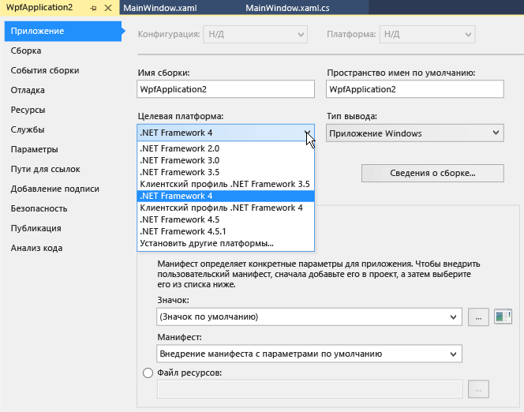

# Общие сведения о настройке целевой платформы

В Visual Studio можно указать версию платформы .NET, на которую будет ориентироваться проект. Нацеливание на платформу помогает гарантировать, что приложение использует только те функциональные возможности, которые доступны в указанной версии платформы. Для запуска приложений .NET Framework на другом компьютере версия платформы для такого приложения должна быть совместима с версией платформы, установленной на компьютере.

Решение Visual Studio может содержать проекты, предназначенные для различных версий .NET.  Обратите внимание, что вы можете выполнить сборку только для одной версии .NET с помощью условий ссылок для одной сборки или рекурсивно создавать разные двоичные файлы для каждой версии.  Дополнительные сведения о требуемых версиях .NET Framework см. в разделе [Целевые платформы](/dotnet/standard/frameworks).

> [!TIP]
> Вы также можете нацеливать приложения на различные платформы. Дополнительные сведения см. в разделе [Настройка для различных версий](../msbuild/msbuild-multitargeting-overview.md).

## Функции нацеливания на платформу

Среди прочего, доступны следующие возможности нацеливания на платформу:

- При открытии проекта, который ориентирован на более раннюю версию платформы, Visual Studio может автоматически обновить его или оставить имеющуюся настройку.

- При создании проекта .NET Framework можно указать версию платформы .NET Framework, на которую требуется ориентироваться.

- Вы можете [ориентироваться на несколько платформ](/dotnet/standard/frameworks#how-to-specify-target-frameworks) в одном проекте.

- В каждом из нескольких проектов в одном решении можно ориентироваться на разные версии .NET.

- Можно изменить версию .NET, на которую ориентирован существующий проект.

   При изменении версии платформы .NET, на которую сориентирован проект, Visual Studio вносит все необходимые изменения в ссылки и файлы конфигурации.

При работе над проектом, ориентированным на более раннюю версию платформы, Visual Studio динамически изменяет среду разработки, как показано ниже:

- Фильтрует элементы в диалоговых окнах **Добавить новый элемент**, **Добавить новую ссылку** и **Добавление ссылки на службу**, чтобы пропустить варианты, которые недоступны в целевой версии.

- Фильтрует пользовательские элементы управления на **панели элементов**, чтобы удалить те из них, которые недоступны в целевой версии, и отобразить только наиболее актуальные элементы, если доступно несколько элементов управления.

- Фильтрует **IntelliSense**, чтобы пропустить языковые функции, которые недоступны в целевой версии.

- Фильтрует свойства в окне **Свойства**, чтобы пропустить те, которые недоступны в целевой версии.

- Фильтрует пункты меню, чтобы пропустить те, которые недоступны в целевой версии.

- Для сборок система использует версию и параметры компилятора, которые подходят для целевой версии.

> [!NOTE]
> - Нацеливание на платформу не гарантирует правильную работу приложения. Нужно протестировать приложение, чтобы убедиться в том, что оно работает с целевой версией.
> - Ориентироваться на версии платформы, предшествующие .NET Framework 2.0, запрещено.

## Выбор целевой версии платформы

При создании проекта .NET Framework выберите целевую версию .NET Framework после выбора шаблона проекта. Список доступных платформ включает их установленные версии, соответствующие типу выбранного шаблона. Для шаблонов проектов, отличных от .NET Framework, например шаблонов .NET Core, раскрывающийся список **Платформа** не отображается.

::: moniker range="vs-2017"

::: moniker-end

::: moniker range=">=vs-2019"

::: moniker-end

## Изменение требуемой версии .NET Framework

Для существующего проекта Visual Basic, C# или F# вы можете изменить целевую версию .NET в диалоговом окне свойств проекта. Сведения об изменении целевой версии для проектов C++ см. в статье [How to: Modify the Target Framework and Platform Toolset](/cpp/build/how-to-modify-the-target-framework-and-platform-toolset) (Практическое руководство. Изменение требуемой версии .NET Framework и набора средств платформы).

1. В **обозревателе решений** откройте контекстное меню проекта, для которого требуется изменить целевую платформу, и выберите пункт **Свойства**.

1. В левом столбце окна **Свойства** перейдите на вкладку **Приложение**.

   

   > [!NOTE]
   > После создания приложения UWP невозможно изменить целевую версию Windows или .NET.

1. В списке **Целевая рабочая среда** выберите требуемую версию.

1. В открывшемся диалоговом окне проверки нажмите кнопку **Да**.

   Проект будет выгружен. При его перезагрузке он будет ориентирован на выбранную версию .NET.

> [!NOTE]
> Если код содержит ссылки на другую версию .NET, отличную от целевой, при компиляции и запуске кода могут появиться сообщения об ошибках. Чтобы устранить эти ошибки, измените ссылки. См. раздел [Устранение неполадок, связанных с настройкой для определенных версий платформы .NET](../msbuild/troubleshooting-dotnet-framework-targeting-errors.md).

> [!TIP]
> В зависимости от целевой платформы ее можно представить в файле проекта следующим образом:
>
> - Для приложения .NET Core: `<TargetFramework>netcoreapp2.1</TargetFramework>`
> - Для приложения .NET Standard: `<TargetFramework>netstandard2.0</TargetFramework>`
> - Для приложения .NET Framework: `<TargetFrameworkVersion>v4.7.2</TargetFrameworkVersion>`

## Разрешение системных ссылок и пользовательских ссылок на сборки

Чтобы нацелиться на определенную версию .NET, нужно сначала установить подходящие ссылки на сборки. Вы можете скачать пакеты разработчика для разных версий .NET на странице [скачиваемых материалов .NET](https://www.microsoft.com/net/download/windows).

Для проектов .NET Framework диалоговое окно **Добавить ссылку** позволяет отключить системные сборки, не относящиеся к целевой версии платформы .NET Framework, чтобы их невозможно было добавить в проект случайно. (Системные сборки — это файлы *DLL*, включенные в версию платформы .NET Framework.) Ссылки, относящиеся к версии платформы, которая старше целевой версии, не будут разрешены, а зависящие от них элементы управления невозможно будет добавить. Если вы хотите активировать такую ссылку, измените целевую версию платформы .NET Framework для проекта на ту, которая содержит эту ссылку.

Дополнительные сведения о ссылках на сборки см. в разделе [Разрешение сборок во время разработки](../msbuild/resolving-assemblies-at-design-time.md).

## Включение LINQ

При нацеливании на .NET Framework 3.5 или более поздней версии ссылка на **System.Core** и импорт уровня проекта для <xref:System.Linq> (только в Visual Basic) добавляются автоматически. Если вы хотите использовать функции LINQ, нужно также включить параметр `Option Infer` (только в Visual Basic). Ссылка и импорт удаляются автоматически при изменении целевой версии на более раннюю версию .NET Framework. Дополнительные сведения см. в разделе [Работа с LINQ](/dotnet/csharp/tutorials/working-with-linq).

## См. также

- [Целевые платформы](/dotnet/standard/frameworks)
- [Настройка для различных версий (MSBuild)](../msbuild/msbuild-multitargeting-overview.md)
- [Практическое руководство. Изменение требуемой версии .NET Framework и набора средств платформы (C++)](/cpp/build/how-to-modify-the-target-framework-and-platform-toolset)
