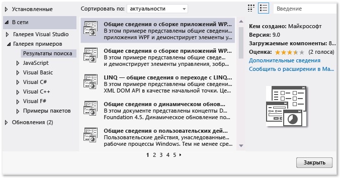
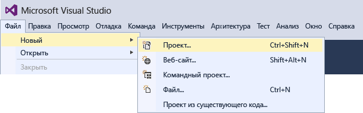
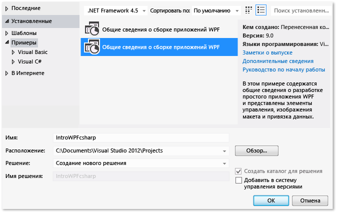
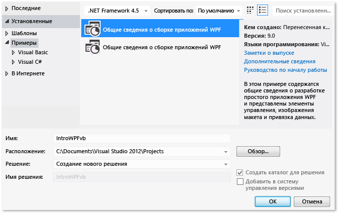

# Пошаговое руководство. Построение приложения
[!INCLUDE[vs2017banner](../code-quality/includes/vs2017banner.md)]

Путем выполнения этого пошагового руководства читатель ознакомите с несколькими параметрами, которые можно настроить при построении приложений с помощью Visual Studio.  Создается пользовательская конфигурация построения, скрываете некоторых предупреждений и повысить данные выходных данных построения, из других задач, пример приложения.  
  
 В этом разделе содержатся следующие подразделы.  
  
 [Установите образец приложения](../ide/walkthrough-building-an-application.md#BKMK_installapp)  
  
 [Создайте пользовательскую конфигурацию построения](../ide/walkthrough-building-an-application.md#BKMK_CreateBuildConfig)  
  
 [Построение приложения](../ide/walkthrough-building-an-application.md#BKMK_building)  
  
 [Предупреждения компилятора скрывать](../ide/walkthrough-building-an-application.md#BKMK_hidewarning)  
  
 [Отображает дополнительные сведения о построении в окне вывода](../ide/walkthrough-building-an-application.md#BKMK_outputdetails)  
  
 [Создание построения выпуска](../ide/walkthrough-building-an-application.md#BKMK_releasebuild)  
  
##   Установите образец приложения  
 Используется диалоговое окно **Расширения и обновления** для поиска и установка образца [Введение в построении приложений WPF](http://code.msdn.microsoft.com/Introduction-to-Building-b8d16419?SRC=VSIDE) из коллекции Примерыы веб\-сайта Майкрософт.  Коллекция Примерыы предоставляет различные примеры проекта и кода, можно загрузить и анализ по мере необходимости и разработке приложений.  
  
#### Установка образца приложения  
  
1.  В строке меню выберите **Сервис**, **Расширения и обновления**.  
  
2.  Выберите категорию **В сети**, а затем выберите категорию **Галерея примеров**.  
  
3.  Укажите значение `Introduction` в поле поиска пример.  
  
       
  
4.  В списке результатов выберите **Введение в построении приложений WPF Visual C \(\#\)** или **Введение в построении приложений WPF \(Visual Basic\)**.  
  
5.  Нажмите кнопку **Загрузить**, а затем нажмите кнопку **Закрыть**.  
  
 Введение в примере построение приложений WPF отобразится в диалоговом окне **Создание проекта**.  
  
#### Создание решения для примера приложения  
  
1.  Открытие диалогового окна **Создание проекта**.  
  
       
  
2.  В категории **Установлено** выберите категорию **Выборки** для отображения введение в примере построение приложений WPF.  
  
3.  Назовите решение `IntroWPFcsharp` для Visual C\# — \#.  
  
       
  
     OR  
  
     Назовите решение `IntroWPFvb` для Visual Basic.  
  
       
  
4.  Нажмите кнопку **ОК**.  
  
##   Создайте пользовательскую конфигурацию построения  
 При создании решения, отладки и конфигурации построения выпуска и их целевые объекты платформы по умолчанию определяются для решения автоматически.  Затем можно настраивать эти конфигурации или создать собственный.  Конфигурации построения определяют тип построения.  Платформа построения операционной системы определяют целевые объекты, приложения для этой конфигурации.  Дополнительные сведения см. в разделах [Общие сведения о конфигурациях построения](../ide/understanding-build-configurations.md), [Общие сведения о платформах построения](../ide/understanding-build-platforms.md) и [Debug and Release Project Configurations](http://msdn.microsoft.com/ru-ru/0440b300-0614-4511-901a-105b771b236e).  
  
 Можно изменить или создать параметры конфигурации и платформы с помощью диалогового окна **Диспетчер конфигураций**.  В этой процедуре создается конфигурация построения для тестирования.  
  
#### Чтобы создать конфигурацию построения  
  
1.  Откройте диалоговое окно **Диспетчер конфигураций**.  
  
       
  
2.  В списке **Активная конфигурация решения** выберите **Создать**.  
  
3.  В диалоговом окне **Создание конфигурации решения** назовите новую конфигурацию `Test` введите параметры из существовать конфигурация отладки, а затем нажмите кнопку **ОК**.  
  
       
  
4.  В списке **Активная платформа решения** выберите **Создать**.  
  
5.  В диалоговом окне **Создание платформы решения** выберите **x64**, а не копируются параметры из платформы x86.  
  
       
  
6.  Нажмите кнопку **ОК**.  
  
 Активная конфигурация решения была изменена для выполнения с активной платформа решения установлено " x64.  
  
   
  
 Можно быстро проверить или изменить активной конфигурации решения с помощью списка **Конфигурации решения** на панели инструментов **Стандартный**.  
  
   
  
##   Построение приложения  
 Далее следует построения решения с пользовательской конфигурацией построения.  
  
#### Построение решения  
  
-   В меню **Сборка** выберите **Собрать решение**.  
  
 В окне **Вывод** отобразятся результаты построения.  Построение выполнено успешно, но были созданы несколько предупреждений.  
  
 Рисунок 1. Предупреждения Visual Basic  
  
   
  
 Рисунок 2. Предупреждения Visual C \#  
  
   
  
##   Предупреждения компилятора скрывать  
 Можно временно скрывать некоторые предупреждения во время построения, а не использовать их для создания суматоху вверх выходные данные построения.  
  
#### Скрывать определенное предупреждение Visual C \#  
  
1.  В **Обозреватель решений** выберите узел высшего уровня проекта.  
  
2.  В строке меню выберите **Вид**, **Страницы свойств**.  
  
     Откроется **Конструктор проектов**.  
  
3.  Выберите страницу **Построение** и затем в поле **Отключить предупреждения** укажите номер предупреждения `1762`.  
  
       
  
     Для получения дополнительной информации см. [Страница "Построение" в конструкторе проектов \(C\#\)](../ide/reference/build-page-project-designer-csharp.md).  
  
4.  Выполните построение решения.  
  
     Окно **Вывод** отображает только общие сведения для построения.  
  
       
  
#### Отключить все предупреждения при построении Visual Basic  
  
1.  В **Обозреватель решений** выберите узел высшего уровня проекта.  
  
2.  В строке меню выберите **Вид**, **Страницы свойств**.  
  
     Откроется **Конструктор проектов**.  
  
3.  На странице **Компилировать** выберите флажок **Выключить все предупреждения**.  
  
       
  
     Для получения дополнительной информации см. [Настройка предупреждений в Visual Basic](../ide/configuring-warnings-in-visual-basic.md).  
  
4.  Выполните построение решения.  
  
 Окно **Вывод** отображает только общие сведения для построения.  
  
   
  
 Для получения дополнительной информации см. [Практическое руководство. Отключение предупреждений компилятора](../ide/how-to-suppress-compiler-warnings.md).  
  
##   Отображает дополнительные сведения о построении в окне вывода  
 Можно изменить объем сведения о процессе построения в окне **Вывод**.  Детализация построения обычно задается минимальная ", что означает, что в окне **Вывод** отображаются только сводку процесса построения вместе с всеми самыми важными ошибками или предупреждениями.  Можно отобразить более подробные сведения о построении с помощью [Диалоговое окно "Параметры",  проекты и решения, сборка и запуск](../ide/reference/options-dialog-box-projects-and-solutions-build-and-run.md).  
  
> [!IMPORTANT]
>  Если отображаются дополнительные сведения, построение занимает больше времени для выполнения.  
  
#### Изменение количества информации в окне вывода  
  
1.  Откройте диалоговое окно **Параметры**.  
  
       
  
2.  Выберите категорию **Проекты и решения**, а затем выберите страницу **Построение и запуск**.  
  
3.  В списке **Степень подробности сообщений при построении проекта MSBuild** выберите **Обычный**, а затем нажмите кнопку **ОК**.  
  
4.  В строке меню выберите **Построение**, **Очистить решение**.  
  
5.  Построение решения, а затем просмотрите информацию в поле **Вывод**.  
  
     Сведения о построении включает время, построение начато \(нахоженное в начале\), порядок, в котором файлы были обработаны и количество времени, которое ушло процесс для выполнения \(, расположенный в конце\).  Эти сведения также относятся фактическим синтаксисом компилятора, Visual Studio выполняется во время построения.  
  
     Например, в построении Visual C \#, списки выбора [\/nowarn](/dotnet/visual-basic/reference/command-line-compiler/nowarn) предупреждения код, 1762, заданное ранее в этом разделе, вместе с другими 3 предупреждениями.  
  
     В построении Visual Basic, [\/nowarn](/dotnet/visual-basic/reference/command-line-compiler/nowarn) не включает специальные предупреждения исключения, поэтому предупреждения не отображаются.  
  
    > [!TIP]
    >  Можно выполнить поиск содержимое окна **Вывод**, чтобы отобразить диалоговое окно **Найти**, выбрав ключи Ctrl\+F.  
  
 Для получения дополнительной информации см. [Практическое руководство. Просмотр, сохранение и настройка файлов журнала построения](../ide/how-to-view-save-and-configure-build-log-files.md).  
  
##   Создание построения выпуска  
 Можно построить версия образца приложения, оптимизирован для поставки.  Для построения выпуска можно указать, что исполняемый файл копируется в сетевой папке до построения пнуто.  
  
 Дополнительные сведения см. в разделах [Практическое руководство. Изменение выходного каталога построения](../ide/how-to-change-the-build-output-directory.md) и [Построение и очистка проектов и решений в Visual Studio](../ide/building-and-cleaning-projects-and-solutions-in-visual-studio.md).  
  
#### Определение построения выпуска для Visual Basic  
  
1.  Откройте **Конструктор проектов**.  
  
       
  
2.  Выберите страницу **Компилировать**.  
  
3.  В списке **Конфигурация** выберите **Выпуск**.  
  
4.  В списке **Платформа** выберите **x86**.  
  
5.  В поле **Выходной путь построения** введите сетевой путь.  
  
     Например, можно указать \\\\myserver\\builds.  
  
    > [!IMPORTANT]
    >  Окно сообщения, предупреждение может показаться, что сетевую папку, созданную может не быть надежным расположением.  Если вы доверяете расположение, которое известно, нажмите кнопку **ОК** в окне сообщения.  
  
6.  Постройте приложение.  
  
       
  
#### Определение построения выпуска для Visual C\# — \#  
  
1.  Откройте **Конструктор проектов**.  
  
       
  
2.  Выберите страницу **Построение**.  
  
3.  В списке **Конфигурация** выберите **Выпуск**.  
  
4.  В списке **Платформа** выберите **x86**.  
  
5.  В поле **Путь вывода** введите сетевой путь.  
  
     Например, можно указать \\\\myserver\\builds.  
  
    > [!IMPORTANT]
    >  Окно сообщения, предупреждение может показаться, что сетевую папку, созданную может не быть надежным расположением.  Если вы доверяете расположение, которое известно, нажмите кнопку **ОК** в окне сообщения.  
  
6.  Постройте приложение.  
  
       
  
 Исполняемый файл копируется в сетевой путь, определенный.  Его путь будет \\\\myserver\\builds\\*FileName*.exe.  
  
 Поздравляем: вы успешно завершили этого пошагового руководства.  
  
## См. также  
 [Пошаговое руководство. Построение проекта \(C\+\+\)](../Topic/Walkthrough:%20Building%20a%20Project%20\(C++\).md)   
 [Общие сведения о предварительной компиляции проектов веб\-приложений ASP.NET](http://msdn.microsoft.com/ru-ru/b940abbd-178d-4570-b441-52914fa7b887)   
 [Пошаговое руководство. Использование MSBuild](../msbuild/walkthrough-using-msbuild.md)