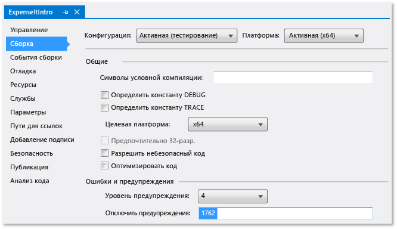
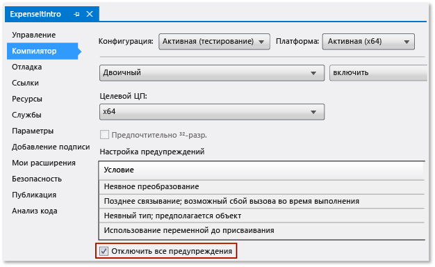

# Пошаговое руководство. Построение приложения
Выполнив это пошаговое руководство, вы ознакомитесь с несколькими параметрами, которые можно настроить при создании приложений с помощью Visual Studio. Вы создадите настраиваемую конфигурацию сборки, скроете определенные предупреждения и расширите выходные данные сборки для примера приложения.  
  
 В этом разделе содержатся следующие подразделы.  
  
 [Установка примера приложения](../ide/walkthrough-building-an-application.md#BKMK_installapp)  
  
 [Создание настраиваемой конфигурации сборки](../ide/walkthrough-building-an-application.md#BKMK_CreateBuildConfig)  
  
 [Сборка приложения](../ide/walkthrough-building-an-application.md#BKMK_building)  
  
 [Скрытие предупреждений компилятора](../ide/walkthrough-building-an-application.md#BKMK_hidewarning)  
  
 [Отображение дополнительных сведений о сборке в окне вывода](../ide/walkthrough-building-an-application.md#BKMK_outputdetails)  
  
 [Создание сборки выпуска](../ide/walkthrough-building-an-application.md#BKMK_releasebuild)  
  
##   Установка примера приложения  
Скачайте пример [Общие сведения о сборке приложений WPF](https://code.msdn.microsoft.com/Introduction-to-Building-b8d16419). Выберите язык C# или Visual Basic. После того как ZIP-файл скачается, извлеките его содержимое и откройте файл **ExpenseItIntro.sln** с помощью Visual Studio.  
  
##   Создание настраиваемой конфигурации сборки  
 При создании решения конфигурации отладочной сборки и сборки выпуска и их целевые платформы по умолчанию определяются для решения автоматически. Затем вы можете настроить эти конфигурации или создать собственные. Конфигурации указывают тип сборки. Целевые платформы указывают операционную систему, на которое ориентировано приложение для этой конфигурации. Дополнительные сведения см. в разделах [Общие сведения о конфигурациях сборки](../ide/understanding-build-configurations.md), [Общие сведения о платформах сборки](../ide/understanding-build-platforms.md) и [Конфигурации отладки и выпуска проекта](http://msdn.microsoft.com/en-us/0440b300-0614-4511-901a-105b771b236e).  
  
 Конфигурации и параметры платформы можно изменять или создавать с помощью диалогового окна **Диспетчер конфигураций**. В этой процедуре вы создадите конфигурацию сборки для тестирования.  
  
#### Создание конфигурации сборки  
  
1.  Откройте диалоговое окно **Диспетчер конфигураций**.  
  
       
  
2.  В списке **Активная конфигурация решения** выберите **\<Создать...\>**.  
  
3.  В диалоговом окне **Создание конфигурации решения** введите для новой конфигурации имя `Test`, скопируйте параметры из существующей конфигурации отладки и нажмите кнопку **ОК**.  
  
       
  
4.  В списке **Активная платформа решения** выберите **\<Создать...\>**.  
  
5.  В диалоговом окне **Создание платформы решения** выберите **x64** и не копируйте параметры из платформы x86.  
  
       
  
6.  Нажмите кнопку **ОК** .  
  
 Активная конфигурация решения была изменена на "Тест", а для активной платформы решения задано значение x64.  
  
   
  
7. Нажмите кнопку **Закрыть**.  

Активную конфигурацию решения можно быстро проверить или изменить с помощью списка **Конфигурации решения** на панели инструментов **Стандартная**.  
  
  
  
##   Сборка приложения  
 Далее вам предстоит создать решение с помощью настраиваемой конфигурации сборки.  
  
#### Построение решения  
  
-   В строке меню последовательно выберите **Сборка**и **Собрать решение**.  
  
    Окно **Вывод** отображает результат сборки. Сборка успешно завершена.  
  
##   Скрытие предупреждений компилятора  
Далее мы добавим код, который приводит к созданию предупреждения компилятором.  

1. В проекте C# откройте файл **ExpenseReportPage.xaml.cs**. В методе **ExpenseReportPage** добавьте следующий код: `int i;`.  

    OR

    В проекте Visual Basic откройте файл **ExpenseReportPage.xaml.vb**. В пользовательском конструкторе **Public Sub New...** добавьте следующий код: `Dim i`.  

2. Постройте решение.  

Окно **Вывод** отображает результат сборки. Сборка была выполнена успешно, но были созданы предупреждения:  

 Рис. 1. Предупреждения Visual Basic  
  
   
  
 Рис 2. Предупреждения Visual C#  
  
   
  
Вы можете временно скрыть некоторые предупреждения во время сборки, чтобы они не засоряли выходные данные сборки.  

#### Скрытие определенного предупреждения Visual C#  
  
1.  В **обозревателе решений** выберите узел проекта верхнего уровня.  
  
2.  В строке меню выберите **Вид**, **Страницы свойств**.  
  
     Открывается **Конструктор проектов**.  
  
3.  Выберите страницу **Сборка** и затем в поле **Отключить предупреждения** укажите номер предупреждения **0168**.  
  
       
  
     Дополнительные сведения см. в разделе [Страница "Сборка" в конструкторе проектов (C#)](../ide/reference/build-page-project-designer-csharp.md).  
  
4.  Постройте решение.  
  
     Окно **Вывод** отображает только сводные данные о сборке.  
  
       
  
#### Отключение всех предупреждений сборки в Visual Basic  
  
1.  В **обозревателе решений** выберите узел проекта верхнего уровня.  
  
2.  В строке меню выберите **Вид**, **Страницы свойств**.  
  
     Открывается **Конструктор проектов**.  
  
3.  На странице **Компиляция** установите флажок **Выключить все предупреждения**.  
  
       
  
     Дополнительные сведения см. в статье [Настройка предупреждений в Visual Basic](../ide/configuring-warnings-in-visual-basic.md).  
  
4.  Постройте решение.  
  
 Окно **Вывод** отображает только сводные данные о сборке.  
  
   
  
 Дополнительные сведения см. в разделе [Практическое руководство. Отключение предупреждений компилятора](../ide/how-to-suppress-compiler-warnings.md).  
  
##   Отображение дополнительных сведений о сборке в окне вывода  
 Вы можете изменить объем информации, отображаемый о процессе сборки в окне **Вывод**. В общем случае задан минимальный уровень детализации сборки, при котором в окне **Вывод** отображается только сводка по процессу сборки вместе с высокоприоритетными предупреждениями или ошибками. Чтобы отобразить дополнительные сведения о сборке, см. раздел [Диалоговое окно "Параметры", "Проекты и решения", "Сборка и запуск"](../ide/reference/options-dialog-box-projects-and-solutions-build-and-run.md).  
  
> [!IMPORTANT]
>  При отображении дополнительных сведений сборка будет занимать больше времени.  
  
#### Изменение объема сведений в окне вывода  
  
1.  Откройте диалоговое окно **Параметры**.  
  
       
  
2.  Выберите категорию **Проекты и решения** и затем страницу **Сборка и запуск**.  
  
3.  В списке **Степень подробности сообщений при сборке проекта MSBuild** выберите значение **Обычная** и нажмите кнопку **ОК**.  
  
4.  В строке меню выберите **Сборка** и **Очистить решение**.  
  
5.  Выполните сборку решения и просмотрите сведения в окне **Вывод**.  
  
     Сведения о сборке включают в себя время запуска сборки (находится в начале) и порядок обработки файлов. Они также включают фактический синтаксис компилятора, запускаемый Visual Studio при сборке.  
  
     Например, параметр [/nowarn](/dotnet/visual-basic/reference/command-line-compiler/nowarn) в сборке Visual C# выводит указанный вами ранее код предупреждения 1762, а также три других предупреждения.  
  
     В сборке Visual Basic параметр [/nowarn](/dotnet/visual-basic/reference/command-line-compiler/nowarn) не включает в себя определенные исключаемые предупреждения, поэтому предупреждения не отображаются.  
  
    > [!TIP]
    >  В окне **Вывод** можно искать содержимое, отобразив диалоговое окно **Найти** нажатием клавиш CTRL+F.  
  
Дополнительные сведения см. в статье [Практическое руководство. Просмотр, сохранение и настройка файлов журнала сборки](../ide/how-to-view-save-and-configure-build-log-files.md).  
  
##   Создание сборки выпуска  
 Вы можете создать версию примера приложения, оптимизированную для поставки. Для сборки выпуска вы указываете, что исполняемый файл копируется в общую сетевую папку перед запуском сборки.  
  
 Дополнительные сведения см. в разделах [Практическое руководство. Изменение выходного каталога сборки](../ide/how-to-change-the-build-output-directory.md) и [Сборка и очистка проектов и решений в Visual Studio](../ide/building-and-cleaning-projects-and-solutions-in-visual-studio.md).  
  
#### Указание сборки выпуска для Visual Basic  
  
1.  Открывается **Конструктор проектов**.  
  
       
  
2.  Откройте вкладку **Компиляция**.  
  
3.  В списке **Конфигурация** выберите **Выпуск**.  
  
4.  В списке **Платформа** выберите **x86**.  
  
5.  В поле **Выходной путь сборки** укажите сетевой путь.  
  
     Например, можно указать \\\myserver\builds.  
  
    > [!IMPORTANT]
    >  Может появиться окно с предупреждением о том, что указанная вами сетевая общая папка может быть ненадежна. Если вы доверяете указанному расположению, нажмите кнопку **ОК** в окне сообщения.  
  
6.  Постройте приложение.  
  
       
  
#### Указание сборки выпуска для Visual C# #
  
1.  Открывается **Конструктор проектов**.  
  
       
  
2.  Перейдите на страницу **Сборка**.  
  
3.  В списке **Конфигурация** выберите **Выпуск**.  
  
4.  В списке **Платформа** выберите **x86**.  
  
5.  В поле **Путь для создаваемых файлов** укажите сетевой путь.  
  
     Например, можно указать \\\myserver\builds.  
  
    > [!IMPORTANT]
    >  Может появиться окно с предупреждением о том, что указанная вами сетевая общая папка может быть ненадежна. Если вы доверяете указанному расположению, нажмите кнопку **ОК** в окне сообщения.  
  
6.  На **стандартной панели инструментов** выберите в качестве конфигураций решения **Выпуск**, а в качестве платформ решения — **x86**.  

7.  Постройте приложение.  
  
       
  
 Исполняемый файл копируется в указанный сетевой путь. Для него используется путь \\\myserver\builds\\*имя_файла*.exe.  
  
Поздравляем! Вы успешно выполнили это пошаговое руководство.  
  
## См. также  
 [Пошаговое руководство. Сборка проекта (C++)](/cpp/ide/walkthrough-building-a-project-cpp)   
 [Общие сведения о предварительной компиляции проектов веб-приложений ASP.NET](http://msdn.microsoft.com/en-us/b940abbd-178d-4570-b441-52914fa7b887)   
 [Пошаговое руководство. Использование MSBuild](../msbuild/walkthrough-using-msbuild.md)
