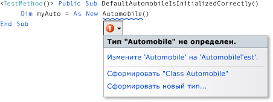
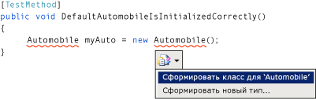
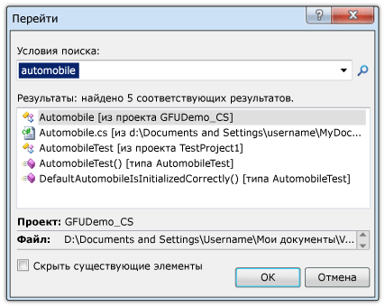

# Пошаговое руководство. Основанная на тестировании поддержка с помощью функции &quot;Создание в результате использования&quot;
[!INCLUDE[vs2017banner](../code-quality/includes/vs2017banner.md)]

В этом разделе демонстрируется использование функции [Создание в результате использования](/visual-cpp/misc/generate-from-usage), которая поддерживает разработку на основе тестирования.  
  
 *Разработка на основе тестирования* является подходом к созданию программного обеспечения, в рамках которого на основе спецификаций продукта создаются модульные тесты, а затем создается исходный код, который приводит к успешному выполнению тестов.[!INCLUDE[vsprvs](../code-quality/includes/vsprvs_md.md)] поддерживает разработку на основе тестирования путем создания новых типов и членов в исходном коде при их первом упоминании в тестовых случаях до их определения.  
  
 [!INCLUDE[vsprvs](../code-quality/includes/vsprvs_md.md)] создает новые типы и члены, практически не изменяя рабочий процесс. Разработчик может создавать заглушки для типов, методов, свойств, полей или конструкторов прямо из текущего места в коде. После закрытия диалогового окна создания типа фокус сразу же возвращается в файл, открытый в настоящий момент.  
  
 Функция "Создание в результате использования" может использоваться вместе с платформами тестирования, интегрированными с [!INCLUDE[vsprvs](../code-quality/includes/vsprvs_md.md)]. В этом разделе показана платформа модульного тестирования корпорации Майкрософт.  
  
 [!INCLUDE[note_settings_general](../data-tools/includes/note_settings_general_md.md)]  
  
### Создание проекта библиотеки классов Windows и проекта тестирования  
  
1.  Создайте проект библиотеки классов Windows в [!INCLUDE[csprcs](../data-tools/includes/csprcs_md.md)] или [!INCLUDE[vbprvb](../code-quality/includes/vbprvb_md.md)]. Назовите его `GFUDemo_VB` или `GFUDemo_CS` в зависимости от используемого языка.  
  
2.  В **обозревателе решений** щелкните правой кнопкой мыши значок решения в верхней части окна, выберите команду **Добавить**, а затем — **Новый проект**. В диалоговом окне **Создание проекта** в левой области **Типы проектов** выберите элемент **Тестирование**.  
  
3.  В области **Шаблоны** выберите элемент **Проект модульного теста** и примите имя по умолчанию UnitTestProject1. На рисунке ниже показано диалоговое окно, отображаемое в [!INCLUDE[csprcs](../data-tools/includes/csprcs_md.md)]. Диалоговое окно в [!INCLUDE[vbprvb](../code-quality/includes/vbprvb_md.md)] выглядит похоже.  
  
       
Диалоговое окно “Новый проект”  
  
4.  Нажмите кнопку **ОК**, чтобы закрыть диалоговое окно **Создание проекта**. Теперь все готово для создания тестов.  
  
### Создание класса на основе модульного теста  
  
1.  Тестовый проект содержит файл с именем UnitTest1. Дважды щелкните этот файл в **обозревателе решений**, чтобы открыть его в редакторе кода. Будет создан тестовый класс и метод теста.  
  
2.  Найдите объявление класса `UnitTest1` и переименуйте его в `AutomobileTest`. Если в C\# есть конструктор `UnitTest1()`, переименуйте его в `AutomobileTest()`.  
  
    > [!NOTE]
    >  Теперь функция IntelliSense поддерживает два режима завершения инструкций: *режим завершения* и *режим предложений*. Режим предложений следует применять в тех случаях, когда классы и члены используются до их определения. Когда открыто окно IntelliSense, для переключения между режимом завершения и режимом предложений можно нажать клавиши CTRL\+ALT\+ПРОБЕЛ. Дополнительные сведения см. в разделе [Использование технологии IntelliSense](../ide/using-intellisense.md). Режим предложений поможет вам при вводе `Automobile` в следующем шаге.  
  
3.  Найдите метод `TestMethod1()` и переименуйте его в `DefaultAutomobileIsInitializedCorrectly()`. Внутри этого метода создайте экземпляр класса с именем `Automobile`, как показано в приведенных ниже примерах. Отобразится волнистая линия подчеркивания, свидетельствующая об ошибке компиляции, а под именем типа отобразится смарт\-тег. Расположение смарт\-тега зависит от того, используется ли [!INCLUDE[vbprvb](../code-quality/includes/vbprvb_md.md)] или [!INCLUDE[csprcs](../data-tools/includes/csprcs_md.md)].  
  
       
Visual Basic  
  
       
Visual C\#  
  
4.  Наведите указатель мыши на смарт\-тег, чтобы просмотреть сообщение об ошибке, в котором сообщается о том, что тип `Automobile` еще не определен. Щелкните смарт\-тег или нажмите клавиши CTRL\+. \(CTRL\+точка\), чтобы открыть контекстное меню "Создание в результате использования", как показано на рисунке ниже.  
  
       
Visual Basic  
  
       
Visual C\#  
  
5.  Теперь возможны два варианта. Вы можете щелкнуть команду **Создать класс для Automobile**, чтобы создать файл в тестовом проекте и заполнить его пустым классом с именем `Automobile`. Это быстрый способ создания класса в новом файле текущего проекта с модификаторами доступа по умолчанию. Вы также можете выбрать команду **Сформировать новый тип**, чтобы открыть диалоговое окно **Формирование нового типа**. Это обеспечивает размещение класса в существующем файле или добавление файла в другой проект.  
  
     Выберите команду **Сформировать новый тип**, чтобы открыть диалоговое окно **Формирование нового типа**, которое показано на рисунке ниже. В списке **Проект** выберите элемент **GFUDemo\_VB** или элемент **GFUDemo\_CS**, чтобы среда [!INCLUDE[vsprvs](../code-quality/includes/vsprvs_md.md)] добавила файл в проект исходного кода, а не в тестовый проект.  
  
       
Диалоговое окно "Сформировать новый тип"  
  
6.  Нажмите кнопку **ОК**, чтобы закрыть диалоговое окно и создать файл.  
  
7.  В **обозревателе решений** обратитесь к узлам проекта GFUDemo\_VB или GFUDemo\_CS, чтобы убедиться в том, что новый файл Automobile.vb или Automobile.cs содержится в проекте. В редакторе кода фокус остается на элементе `AutomobileTest.DefaultAutomobileIsInitializedCorrectly`. Написание теста можно свободно продолжить.  
  
### Создание заглушки свойства  
  
1.  Предположим, что в спецификации продукта класс `Automobile` имеет два открытых свойства с именами `Model` и `TopSpeed`. Эти свойства необходимо инициализировать значениями по умолчанию `"Not specified"` и `-1` с помощью конструктора по умолчанию. Следующий модульный тест позволит убедиться в том, что конструктор по умолчанию устанавливает свойства в соответствующие значения.  
  
     Добавьте приведенную ниже строку кода в элемент `DefaultAutomobileIsInitializedCorrectly`.  
  
     [!CODE [VbTDDWalkthrough#1](../CodeSnippet/VS_Snippets_VBCSharp/vbtddwalkthrough#1)]  
  
     Так как код ссылается на два неопределенных свойства `Automobile`, отображается смарт\-тег. Щелкните смарт\-тег для `Model`, а затем выберите пункт **Создание прототипа свойства**. Создайте заглушку свойства и для свойства `TopSpeed`.  
  
     В классе `Automobile` типы новых свойств корректным образом выводятся из контекста.  
  
     На рисунке ниже показано контекстное меню смарт\-тега.  
  
       
Visual Basic  
  
       
Visual C\#  
  
### Поиск исходного кода  
  
1.  Используйте функцию **Перейти** для перехода к файлу исходного кода Automobile.cs или Automobile.vb, чтобы убедиться в том, что были созданы новые свойства.  
  
     Функция **Перейти** позволяет быстро ввести текстовую строку \(например, имя типа или часть имени\) и перейти в необходимое место, щелкнув элемент в списке результатов.  
  
     Откройте диалоговое окно **Перейти**, щелкнув в окне редактора кода и нажав клавиши CTRL\+, \(CTRL\+запятая\). В текстовом поле введите `automobile`. Выберите в списке класс **Automobile** и нажмите кнопку **ОК**.  
  
     Окно **Перейти** показано на рисунке ниже.  
  
       
Окно "Перейти"  
  
### Создание заглушки для нового конструктора  
  
1.  В этом тестовом методе будет создана заглушка конструктора, которая инициализирует свойства `Model` и `TopSpeed` указанными значениями. После этого будет добавлен код, завершающий тест. Добавьте приведенный ниже дополнительный тестовый метод в класс `AutomobileTest`.  
  
     [!CODE [VbTDDWalkthrough#2](../CodeSnippet/VS_Snippets_VBCSharp/vbtddwalkthrough#2)]  
  
2.  Щелкните смарт\-тег в новом конструкторе класса и выберите команду **Сформировать заглушку конструктора**. В файле класса `Automobile` обратите внимание на то, что новый конструктор проверил имена локальных переменных, используемых в вызове конструктора, обнаружил свойства с одинаковыми именами в классе `Automobile` и создал в теле конструктора код для хранения значений аргументов в свойствах `Model` и `TopSpeed`. \(В [!INCLUDE[vbprvb](../code-quality/includes/vbprvb_md.md)] поля `_model` и `_topSpeed` нового конструктора являются неявно определенными резервными полями свойств `Model` и `TopSpeed`.\)  
  
3.  После создания нового конструктора под вызовом конструктора по умолчанию в `DefaultAutomobileIsInitializedCorrectly` отображается волнистая линия. Сообщение об ошибке указывает на то, что класс `Automobile` не имеет конструктора, который не принимает ни одного аргумента. Чтобы создать явный конструктор по умолчанию без параметров, щелкните смарт\-тег и выберите команду **Сформировать заглушку конструктора**.  
  
### Создание заглушки метода  
  
1.  Предположим, что согласно спецификации новый объект `Automobile` может быть переведен в состояние Running, если его свойства `Model` и `TopSpeed` содержат значения, отличные от значений по умолчанию. Добавьте приведенные ниже строки в метод `AutomobileWithModelNameCanStart`.  
  
     [!CODE [VbTDDWalkthrough#3](../CodeSnippet/VS_Snippets_VBCSharp/vbtddwalkthrough#3)]  
  
2.  Щелкните смарт\-тег для вызова метода `myAuto.Start`, а затем выберите команду **Сформировать заглушку метода**.  
  
3.  Щелкните смарт\-тег для свойства `IsRunning`, а затем выберите команду **Создание прототипа свойства**. Класс `Automobile` теперь содержит следующий код:  
  
     [!CODE [VbTDDWalkthrough#4](../CodeSnippet/VS_Snippets_VBCSharp/vbtddwalkthrough#4)]  
  
### Запуск тестов  
  
1.  В меню **Модульный тест** наведите указатель на пункт **Выполнить модульные тесты** и выберите пункт **Все тесты**. Эта команда выполняет все тесты всех платформ тестирования, которые созданы для текущего решения.  
  
     В этом случае существует два теста, которые ожидаемым образом завершаются с ошибкой. Тест `DefaultAutomobileIsInitializedCorrectly` завершается с ошибкой, так как условие `Assert.IsTrue` возвращает значение `False`. Тест `AutomobileWithModelNameCanStart` завершается с ошибкой, так как метод `Start` в классе `Automobile` создает исключение.  
  
     Окно **Результаты теста** показано на рисунке ниже.  
  
       
Результаты теста \- окно  
  
2.  В окне **Результаты теста** дважды щелкните каждую строку результата теста для перехода к месту сбоя в ходе каждого тестирования.  
  
### Реализация исходного кода  
  
1.  Добавьте приведенный ниже код в конструктор по умолчанию, чтобы свойства `Model`, `TopSpeed` и `IsRunning` были инициализированы правильными значениями по умолчанию `"Not specified"`, `-1` и `True` \(`true`\).  
  
     [!CODE [VbTDDWalkthrough#5](../CodeSnippet/VS_Snippets_VBCSharp/vbtddwalkthrough#5)]  
  
2.  При вызове метода `Start` он должен устанавливать флажок `IsRunning` в значение true только в том случае, если свойство `Model` или `TopSpeed` имеет значение, отличное от значения по умолчанию. Удалите `NotImplementedException` из тела метода и добавьте приведенный ниже код.  
  
     [!CODE [VbTDDWalkthrough#6](../CodeSnippet/VS_Snippets_VBCSharp/vbtddwalkthrough#6)]  
  
### Повторный запуск тестов  
  
1.  В меню **Тест** наведите указатель на пункт **Выполнить**, а затем выберите пункт **Все тесты в решении**. Результат на этот раз положительный. Окно **Результаты теста** показано на рисунке ниже.  
  
       
Результаты теста \- окно  
  
## См. также  
 [Создание в результате использования](/visual-cpp/misc/generate-from-usage)   
 [Создание кода](../ide/writing-code-in-the-code-and-text-editor.md)   
 [Использование технологии IntelliSense](../ide/using-intellisense.md)   
 [Модульное тестирование кода](../test/unit-test-your-code.md)