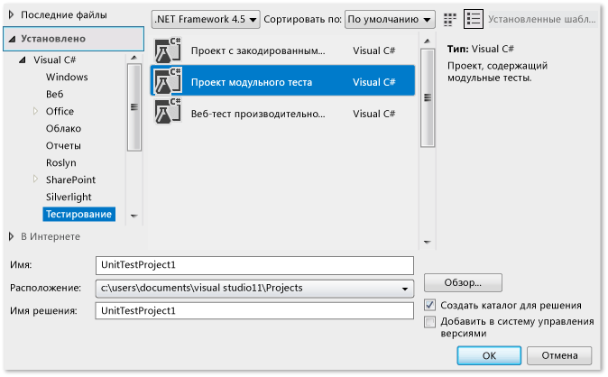
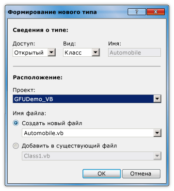
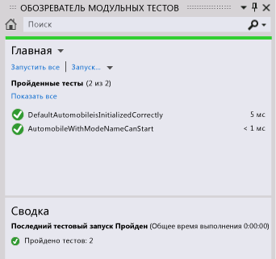

# Пошаговое руководство. Основанная на тестировании разработка с помощью возможности "Создание в результате использования"

В этом разделе демонстрируется использование функции [Generate From Usage](../ide/visual-csharp-intellisense.md#generate-from-usage) , которая поддерживает разработку на основе тестирования.

 *Разработка на основе тестирования* является подходом к созданию программного обеспечения, в рамках которого на основе спецификаций продукта создаются модульные тесты, а затем создается исходный код, который приводит к успешному выполнению тестов. Visual Studio поддерживает разработку на основе тестирования путем создания новых типов и членов в исходном коде при их первом упоминании в тестовых случаях до их определения.

Visual Studio создает типы и члены, практически не изменяя рабочий процесс. Разработчик может создавать заглушки для типов, методов, свойств, полей или конструкторов прямо из текущего места в коде. После закрытия диалогового окна создания типа фокус сразу же возвращается в файл, открытый в настоящий момент.

Функция **Создание в результате использования** может использоваться с платформами тестирования, интегрированными с Visual Studio. В этом разделе показана платформа модульного тестирования корпорации Майкрософт.

[!INCLUDE[note_settings_general](../data-tools/includes/note_settings_general_md.md)]

### Создание проекта библиотеки классов Windows и проекта тестирования

1. Создайте проект **Библиотека классов Windows** в C# или Visual Basic. Назовите его `GFUDemo_VB` или `GFUDemo_CS`в зависимости от используемого языка.

2. В **обозревателе решений** щелкните правой кнопкой мыши значок решения в верхней части окна и выберите команду **Добавить** > **Новый проект**.

3. Создайте проект **Проект модульного теста (.NET Framework)** .

   ::: moniker range="vs-2017"

   На рисунке ниже показано диалоговое окно **Создание проекта** для шаблонов C#.

   

   ::: moniker-end

### Добавление ссылки на проект библиотеки классов

1. В **обозревателе решений** в проекта модульного теста щелкните правой кнопкой мыши узел **Ссылки** и выберите команду **Добавить ссылку**.

2. В диалоговом окне **Диспетчер ссылок** выберите **Проекты**, а затем выберите проект библиотеки классов.

3. Нажмите кнопку **ОК**, чтобы закрыть диалоговое окно **Диспетчер ссылок**.

4. Сохраните решение. Теперь все готово для создания тестов.

### Создание класса на основе модульного теста

1. Тестовый проект содержит файл с именем *UnitTest1*. Дважды щелкните этот файл в **обозревателе решений**, чтобы открыть его в редакторе кода. Будет создан тестовый класс и метод теста.

2. Найдите объявление класса `UnitTest1` и переименуйте его в `AutomobileTest`.

   > [!NOTE]
   > Теперь функция IntelliSense поддерживает два режима завершения инструкций: *режим завершения* и *режим предложений*. Режим предложений следует применять в тех случаях, когда классы и члены используются до их определения. Когда открыто окно **IntelliSense**, для переключения между режимом завершения и режимом предложений можно нажать сочетание клавиш **CTRL**+**ALT**+**ПРОБЕЛ**. Дополнительные сведения см. в статье [Использование IntelliSense](../ide/using-intellisense.md). Режим предложений поможет вам при вводе `Automobile` в следующем шаге.

3. Найдите метод `TestMethod1()` и переименуйте его в `DefaultAutomobileIsInitializedCorrectly()`. Внутри этого метода создайте экземпляр класса с именем `Automobile`, как показано на приведенных ниже снимках экрана. Отобразится волнистая линия, которая указывает на ошибку во время компиляции, и появится лампочка с ошибкой в [Быстрых действиях](../ide/quick-actions.md) на левом поле или прямо под волнистой линией при наведении на нее.

    

    

4. Щелкните значок **быстрых действий**. Появится сообщение об ошибке, в котором указывается, что тип `Automobile` не определен. Также будет предложено несколько решений.

5. Щелкните **Сформировать новый тип**, чтобы открыть диалоговое окно **Сформировать тип**. В этом диалоговом окне доступен ряд параметров. В том числе можно создать тип в другом проекте.

6. В списке **Проект** выберите элемент **GFUDemo\_VB** или **GFUDemo_CS**, чтобы среда Visual Studio добавила файл в проект библиотеки классов, а не в тестовый проект. Выберите параметр **Создать новый файл**, если он еще не выбран, и присвойте файлу имя *Automobile.cs* или *Automobile.vb*.

     

7. Нажмите кнопку **ОК** , чтобы закрыть диалоговое окно и создать файл.

8. В **обозревателе решений** обратитесь к узлам проекта **GFUDemo_VB** или **GFUDemo_CS**, чтобы убедиться в том, что новый файл *Automobile.vb* или *Automobile.cs* содержится в проекте. В редакторе кода фокус по-прежнему находится в `AutomobileTest.DefaultAutomobileIsInitializedCorrectly`, что позволяет продолжить написание теста максимально быстро.

### Создание заглушки свойства
Предположим, что в спецификации продукта класс `Automobile` имеет два открытых свойства с именами `Model` и `TopSpeed`. Эти свойства необходимо инициализировать значениями по умолчанию `"Not specified"` и `-1` с помощью конструктора по умолчанию. Следующий модульный тест позволит убедиться в том, что конструктор по умолчанию устанавливает свойства в соответствующие значения.

1. Добавьте в метод теста `DefaultAutomobileIsInitializedCorrectly` приведенную ниже строку кода.

     [!code-csharp[VbTDDWalkthrough#1](../ide/codesnippet/CSharp/walkthrough-test-first-support-with-the-generate-from-usage-feature_1.cs)]
     [!code-vb[VbTDDWalkthrough#1](../ide/codesnippet/VisualBasic/walkthrough-test-first-support-with-the-generate-from-usage-feature_1.vb)]

2. Так как код ссылается на два неопределенных свойства `Automobile`, под `Model` и `TopSpeed` появляется волнистая линия подчеркивания. Наведите указатель мыши на `Model` и выберите значок **Быстрые действия** в виде лампочки с ошибкой, а затем выберите **Создайте свойство "Automobile.Model"** .

3. Аналогичным образом создайте заглушку для свойства `TopSpeed`.

     В классе `Automobile` типы новых свойств корректным образом выводятся из контекста.

### Создание заглушки для нового конструктора
Теперь мы создадим метод теста, который будет создавать заглушку конструктора для инициализации свойств `Model` и `TopSpeed`. После этого будет добавлен код, завершающий тест.

1. Добавьте приведенный ниже дополнительный тестовый метод в класс `AutomobileTest` .

     [!code-csharp[VbTDDWalkthrough#2](../ide/codesnippet/CSharp/walkthrough-test-first-support-with-the-generate-from-usage-feature_2.cs)]
     [!code-vb[VbTDDWalkthrough#2](../ide/codesnippet/VisualBasic/walkthrough-test-first-support-with-the-generate-from-usage-feature_2.vb)]

2. Под красной волнистой линией щелкните значок **Быстрые действия** в виде лампочки с ошибкой и выберите пункт **Создать конструктор в "Automobile"** .

     В файле класса `Automobile` обратите внимание на то, что новый конструктор проверил имена локальных переменных, используемых в вызове конструктора, обнаружил свойства с одинаковыми именами в классе `Automobile` и создал в теле конструктора код для хранения значений аргументов в свойствах `Model` и `TopSpeed` .

3. После создания нового конструктора под вызовом конструктора по умолчанию в `DefaultAutomobileIsInitializedCorrectly`отображается волнистая линия. Сообщение об ошибке указывает на то, что класс `Automobile` не имеет конструктора, который не принимает ни одного аргумента. Чтобы создать явный конструктор по умолчанию без параметров, щелкните значок **Быстрые действия** в виде лампочки с ошибкой и выберите пункт **Создать конструктор в "Automobile"** .

### Создание заглушки метода
Предположим, что согласно спецификации новый объект `Automobile` может быть переведен в состояние `IsRunning`, если его свойства `Model` и `TopSpeed` содержат значения, отличные от значений по умолчанию.

1. Добавьте приведенные ниже строки в метод `AutomobileWithModelNameCanStart` .

     [!code-csharp[VbTDDWalkthrough#3](../ide/codesnippet/CSharp/walkthrough-test-first-support-with-the-generate-from-usage-feature_3.cs)]
     [!code-vb[VbTDDWalkthrough#3](../ide/codesnippet/VisualBasic/walkthrough-test-first-support-with-the-generate-from-usage-feature_3.vb)]

2. Щелкните значок **Быстрые действия** в виде лампочки с ошибкой для вызова метода `myAuto.Start`, а затем выберите пункт **Создать метод "Automobile.Start"** .

3. Щелкните значок **Быстрые действия** в виде лампочки для свойства `IsRunning`, а затем выберите пункт **Создайте свойство "Automobile.IsRunning"** .

     Класс `Automobile` теперь содержит метод с именем `Start()` и свойство с именем `IsRunning`.

### Запуск тестов

1. В меню **Тест** выберите **Запуск** > **Все тесты**.

     Команда **Запуск** > **Все тесты** выполняет все тесты всех платформ тестирования, которые созданы для текущего решения. В этом случае существует два теста, которые ожидаемым образом завершаются с ошибкой. Тест `DefaultAutomobileIsInitializedCorrectly` завершается с ошибкой, так как условие `Assert.IsTrue` возвращает значение `False`. Тест `AutomobileWithModelNameCanStart` завершается с ошибкой, так как метод `Start` в классе `Automobile` создает исключение.

     Окно **Результаты теста** показано на рисунке ниже.

     

2. В окне **Результаты теста** дважды щелкните каждую строку результата теста для перехода к месту тестирования.

### Реализация исходного кода

1. Добавьте приведенный ниже код в конструктор по умолчанию, чтобы свойства `Model`, `TopSpeed` и `IsRunning` были инициализированы правильными значениями по умолчанию `"Not specified"`, `-1`и `False` (`false` для C#).

     [!code-csharp[VbTDDWalkthrough#5](../ide/codesnippet/CSharp/walkthrough-test-first-support-with-the-generate-from-usage-feature_5.cs)]
     [!code-vb[VbTDDWalkthrough#5](../ide/codesnippet/VisualBasic/walkthrough-test-first-support-with-the-generate-from-usage-feature_5.vb)]

2. При вызове метода `Start` он должен устанавливать флажок `IsRunning` в значение true только в том случае, если свойство `Model` или `TopSpeed` имеет значение, отличное от значения по умолчанию. Удалите `NotImplementedException` из тела метода и добавьте приведенный ниже код.

     [!code-csharp[VbTDDWalkthrough#6](../ide/codesnippet/CSharp/walkthrough-test-first-support-with-the-generate-from-usage-feature_6.cs)]
     [!code-vb[VbTDDWalkthrough#6](../ide/codesnippet/VisualBasic/walkthrough-test-first-support-with-the-generate-from-usage-feature_6.vb)]

### Повторный запуск тестов

- В меню **Тест** наведите указатель на пункт **Выполнить**, а затем выберите пункт **Все тесты**.

     Результат на этот раз положительный. Окно **Результаты теста** показано на рисунке ниже.

     

## См. также раздел

- [Создание в результате использования](../ide/visual-csharp-intellisense.md#generate-from-usage)
- [Возможности редактора кода](../ide/writing-code-in-the-code-and-text-editor.md)
- [Использование IntelliSense](../ide/using-intellisense.md)
- [Модульное тестирование кода](../test/unit-test-your-code.md)
- [Быстрые действия](../ide/quick-actions.md)
