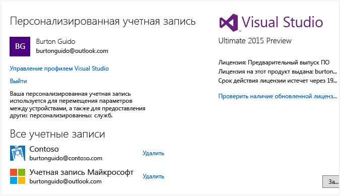

# Work with multiple user accounts
Если у вас несколько учетных записей Майкрософт и рабочих учетных записей, их все можно добавить в Visual Studio, чтобы ресурсы всех учетных записей были доступны из любой учетной записи, с помощью которой выполнен вход. Сейчас службы Azure, Application Insights, Team Foundation Server и Office 365 поддерживают упрощенную процедуру входа в систему. С течением времени будут доступны дополнительные службы.

 Учетные записи, добавленные на одном компьютере, будут перемещаться вместе с вами, если вход в Visual Studio выполняется с другого компьютера. Обратите внимание, что, несмотря на перемещение имен учетных записей, учетные данные не перемещаются. Таким образом, при первом использовании ресурсов на новом компьютере вам будет предложено ввести учетные данные для этих учетных записей.  

 В этом пошаговом руководстве показано, как добавить несколько учетных записей в Visual Studio и как увидеть доступные ресурсы из этих учетных записей в таких расположениях, как диалоговое окно **Добавление подключенной службы** , **Обозреватель сервера**и **Team Explorer**.  

## Выполните вход в Visual Studio  

- Выполните вход в Visual Studio с помощью учетной записи Майкрософт или учетной записи организации. В правом верхнем углу окна должно отображаться ваше имя приблизительно так:  

       

### Доступ к учетной записи Azure в обозревателе сервера  
 Нажмите клавиши **CTRL + ALT + S** , чтобы открыть **Обозреватель сервера**. Щелкните значок Azure. В открывшемся окне должны появиться доступные ресурсы в учетной записи Azure, связанной с идентификатором, который использовался для входа в Visual Studio. Окно должно иметь примерно следующий вид (за исключением того, что вы увидите собственные ресурсы).

   

 При первом использовании Visual Studio на любом конкретном устройстве в диалоговом окне будут отображаться только подписки, зарегистрированные под идентификатором, с помощью которого выполнен вход в среду IDE. Доступ к ресурсам для всех других учетных записей осуществляется непосредственно из **обозревателя серверов** путем щелчка узла Azure правой кнопкой мыши, выбора **Управление подписками и их фильтрация** и добавления учетных записей из средства выбора учетной записи. Затем при необходимости можно выбрать другую учетную запись, щелкнув стрелку вниз и выбрав ее в списке учетных записей. После выбора учетной записи можно указать, какие подписки под этой учетной записью будут отображаться в обозревателе серверов.  

   

 Ресурсы для этой подписки (или подписок) отображаются при следующем открытии обозревателя серверов.  

### Доступ к учетной записи Azure в диалоговом окне "Добавление подключенной службы"  

1.  Создайте проект универсального приложения на C#.  

2.  Щелкните правой кнопкой мыши узел проекта в обозревателе решений и выберите **Добавить > Подключенная служба**. Откроется мастер **добавления подключенной службы** со списком служб в учетной записи Azure, связанной с идентификатором входа Visual Studio. Обратите внимание, что вам не нужно выполнять отдельный вход в Azure. Однако необходимо войти в другие учетные записи при первой попытке доступа к их ресурсам с данного компьютера.  

    > [!WARNING]
    >  При первом создании приложения для Магазина в Visual Studio на конкретном компьютере будет предложено включить устройство для работы в режиме разработки путем последовательного выбора **Параметры | Обновления и безопасность | Для разработчиков** на вашем компьютере. Дополнительные сведения см. в разделе [Включение устройства для разработки](https://msdn.microsoft.com/en-us/library/windows/apps/dn706236.aspx).  

###   Доступ к Azure Active Directory в веб-проекте  
 Azure AD обеспечивает поддержку единого входа в веб-приложениях ASP.NET MVC или проверки подлинности AD в службах веб-интерфейса API. Проверка подлинности домена отличается от проверки подлинности учетной записи пользователя. Для подключения к веб-приложениям пользователи, имеющие доступ к домену Active Directory, могут использовать свои существующие учетные записи Azure AD. Приложения Office 365 также могут использовать проверку подлинности домена. Чтобы увидеть это в действии, создайте веб-приложение (**Файл > Создать проект > C# > Облачное приложение > Веб-приложение ASP.NET**). В диалоговом окне «Новый проект ASP.NET» выберите **Изменить проверку подлинности**. Откроется мастер проверки подлинности для выбора типа проверки подлинности, который будет использоваться в приложении.  

   

 Дополнительные сведения о различных типах проверки подлинности в ASP.NET см. в разделе [Создание веб-проектов ASP.NET в Visual Studio 2013](http://www.asp.net/visual-studio/overview/2013/creating-web-projects-in-visual-studio#orgauth) (сведения о проверке подлинности все еще актуальны для текущих версий Visual Studio).  

### Доступ к учетной записи Visual Studio Team Services  
 В главном меню выберите пункт **Команда > Подключиться к Team Foundation Server**, чтобы открыть окно **Team Explorer**. Щелкните пункт **Выберите командные проекты**, а затем в списке **Выберите Team Foundation Server**появится URL-адрес для учетной записи Visual Studio Team Services. При выборе URL-адреса будет выполнен вход в систему без необходимости повторного ввода учетных данных.  

## Добавление учетной записи второго пользователя в Visual Studio  
 Щелкните стрелку вниз рядом с именем пользователя в верхнем углу Visual Studio. Затем щелкните пункт меню **Параметры учетной записи**. Появится диалоговое окно **Диспетчер учетных записей** , в котором отобразится учетная запись, с помощью которой выполнен вход. Щелкните ссылку **Добавить учетную запись** в нижнем углу диалогового окна, чтобы добавить новую учетную запись Майкрософт или новую рабочую учетную запись.  

   

 Выполните запросы, чтобы ввести учетные данные новой учетной записи. На следующем изображении показан диспетчер учетных записей после добавления пользователей рабочей учетной записи Contoso.com.  

   

## Повторное использование мастера добавления подключенных служб и обозревателя сервера  
 Теперь снова перейдите в **обозреватель серверов** , щелкните правой кнопкой мыши узел Azure и выберите **Управление подписками и их фильтрация**. Выберите новую учетную запись, щелкнув стрелку раскрывающегося списка рядом с текущей учетной записью, а затем выберите подписки, которые нужно отобразить в обозревателе серверов. Будет выведены все службы, связанные с указанной подпиской. Несмотря на то что в данный момент вы не вошли в IDE Visual Studio со второй учетной записью, вы выполнили вход в службы и ресурсы этой учетной записи. То же самое верно при выборе **Проект > Добавить подключенную службу** и **Команда > Подключиться к Team Foundation Server**.

