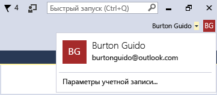

# Work with multiple user accounts

Если у вас несколько учетных записей Майкрософт и рабочих учетных записей, их все можно добавить в Visual Studio, чтобы ресурсы всех учетных записей были доступны из любой учетной записи, с помощью которой выполнен вход. Службы Azure, Application Insights, Azure DevOps и Microsoft 365 поддерживают упрощенную процедуру входа в систему.

Учетные записи, добавленные на одном компьютере, перемещаются вместе с вами, когда вход в Visual Studio выполняется с другого компьютера.

> [!NOTE]
> Но учетные данные не перемещаются вместе с именами учетных записей. При первом использовании ресурсов на новом компьютере вам будет предложено ввести учетные данные для этих учетных записей.

В этой статье показано, как добавить в Visual Studio несколько учетных записей. Также вы узнаете, как просмотреть ресурсы, доступные из этих учетных записей в таких расположениях, как диалоговое окно **Добавить подключенную службу**, **Обозреватель сервера** и **Team Explorer**.

## Вход в Visual Studio

Выполните вход в Visual Studio с помощью учетной записи Майкрософт или учетной записи организации. В правом верхнем углу окна должно отображаться ваше имя приблизительно так:

### Доступ к учетной записи Azure в обозревателе сервера

Чтобы открыть обозреватель сервера, выберите **Вид** > **Обозреватель сервера** (или, если вы используете [параметры среды](../ide/environment-settings.md) "Общие", нажмите комбинацию клавиш **CTRL**+**ALT**+**S**). Разверните узел **Azure** и убедитесь, что он содержит все ресурсы, доступные в учетной записи Azure, связанной с учетной записью, которая использовалась для входа в Visual Studio. Это выглядит примерно так:

При первом использовании Visual Studio на каком-либо конкретном устройстве в диалоговом окне будут отображаться только подписки, зарегистрированные под учетной записью, с которой выполнен вход. Доступ к ресурсам всех других учетных записей осуществляется непосредственно из **обозревателя серверов**, где вы можете щелкнуть узел **Azure** правой кнопкой мыши, выбрать **Управление подписками и их фильтрация** и добавить нужные учетные записи из средства выбора учетной записи. Затем при необходимости можно выбрать другую учетную запись, щелкнув стрелку вниз и выбрав ее в списке учетных записей. После выбора учетной записи можно настроить, какие подписки под этой учетной записью будут отображаться в **обозревателе серверов**.

Ресурсы этой подписки отобразятся при следующем открытии **обозревателя серверов**.

### Доступ к учетной записи Azure в диалоговом окне "Добавление подключенной службы"

1. Откройте существующий проект или создайте новый проект.

1. Щелкните правой кнопкой мыши узел проекта в **обозревателе решений** и выберите **Добавить** > **Подключенная служба**.

   Откроется мастер **добавления подключенной службы** со списком служб в учетной записи Azure, связанной с персонализированной учетной записью Visual Studio. Вам не нужно выполнять отдельный вход в Azure. Но необходимо войти в другие учетные записи при первой попытке доступа к их ресурсам с определенного компьютера.

### Доступ к Azure Active Directory в веб-проекте

Azure Active Directory (AAD) поддерживает единый вход в веб-приложения ASP.NET MVC или аутентификацию AD в службах веб-API. Аутентификация домена отличается от аутентификации отдельной учетной записи пользователя. Пользователи, имеющие доступ к домену Active Directory, могут подключаться к веб-приложениям с помощью существующих учетных записей AAD. Приложения Microsoft 365 также могут использовать проверку подлинности домена.

::: moniker range="vs-2017"

Чтобы увидеть это в действии, создайте проект **Веб-приложение ASP.NET**. В диалоговом окне **Создать веб-приложение ASP.NET Core** выберите шаблон проекта **Веб-приложение** и **Изменить проверку подлинности**.

::: moniker-end

::: moniker range=">=vs-2019"

Чтобы увидеть это в действии, создайте проект **Веб-приложение ASP.NET**. На странице **Создать веб-приложение ASP.NET Core** выберите шаблон **Веб-приложение** и выберите **Изменить** для параметра **Проверка подлинности**.

::: moniker-end

Откроется диалоговое окно **Изменить проверку подлинности**, где можно выбрать тип проверки подлинности, который будет использоваться в приложении.

Дополнительные сведения о разных видах аутентификации в ASP.NET вы найдете в статье [Создание веб-проектов ASP.NET в Visual Studio 2013](/aspnet/visual-studio/overview/2013/creating-web-projects-in-visual-studio#authentication-methods).

### Доступ к организации Azure DevOps

В главном меню выберите **Команда** > **Управление соединениями**, чтобы открыть окно **Team Explorer — подключение**. Выберите **Управление подключениями** > **Подключение к проекту**. В диалоговом окне **Подключение к проекту** выберите из списка нужный проект (или выберите команду **Добавить сервер TFS** и введите URL-адрес сервера). Если вы введете URL-адрес, вход в систему будет выполнен без повторного ввода учетных данных.

Дополнительные сведения см. в статье [Подключение к проектам в Team Explorer](connect-team-project.md).

## Добавление учетной записи в Visual Studio

Чтобы добавить учетную запись в Visual Studio, сделайте следующее:

1. Выберите **Файл** > **Параметры учетной записи**.

1. В разделе **Все учетные записи** выберите **Добавить учетную запись**.

1. На странице **Вход в учетную запись** выберите нужную учетную запись или щелкните **Использовать другую учетную запись**. Выполните запросы, чтобы ввести учетные данные новой учетной записи.

(Необязательно) Теперь вы можете открыть **обозреватель серверов** и просмотреть службы Azure, связанные с добавленной учетной записью. В окне **обозревателя серверов** щелкните правой кнопкой мыши узел **Azure** и выберите **Управление подписками и их фильтрация**. Выберите новую учетную запись, щелкнув стрелку раскрывающегося списка рядом с текущей учетной записью, а затем выберите подписки, которые нужно отобразить в **обозревателе серверов**. Будут выведены все службы, связанные с указанной подпиской. Даже не выполняя вход в Visual Studio со второй учетной записью, вы будете подключены ко всем службам и ресурсам этой учетной записи. То же самое верно при выборе **Проект** > **Добавить подключенную службу** и **Команда** > **Подключиться к Team Foundation Server**.

### Добавление учетной записи с использованием потока кода устройства

В некоторых случаях вход или добавление учетной записи нельзя выполнить обычным образом. Такое может случиться, если Internet Explorer по любой причине заблокирован или сеть находится за брандмауэром. Чтобы обойти эту проблему, вы можете включить *поток кода устройства* и добавить учетную запись или повторно выполнить аутентификацию учетной записи. Поток кода устройства позволяет входить из другого браузера или с другого устройства (физического компьютера или виртуальной машины).

Чтобы выполнить вход с помощью потока кода устройства, сделайте следующее:

1. Откройте страницу [**Учетные записи**](reference/accounts-environment-options-dialog-box.md), выбрав **Средства** > **Параметры** > **Среда**, и щелкните **Включить поток кода устройства при добавлении учетной записи или повторной проверке подлинности учетной записи**. Нажмите кнопку **ОК**, чтобы закрыть страницы свойств.

1. Выберите **Файл** > **Параметры учетной записи**, чтобы открыть страницу управления учетной записью.

1. Выберите **Добавить учетную запись** в разделе **Все учетные записи**.

   В диалоговом окне отобразится URL-адрес и код, который следует вставить в веб-браузер.

   

1. Нажмите клавиш **CTRL**+**C**, чтобы скопировать текст диалогового окна, а затем закройте его кнопкой **ОК**. Вставьте скопированный текст в текстовый редактор, например в Блокнот. Так будет проще скопировать этот код на следующем шаге.

1. Откройте URL-адрес входа на том компьютере или в том браузере, который вы намерены использовать для входа в Visual Studio, и вставьте или введите скопированный ранее код в поле с текстом **Код**.

   Ниже на той же странице появится имя приложения **Visual Studio**.

1. В разделе **Visual Studio** выберите **Продолжить**.

   

1. Следуйте инструкциям, чтобы ввести учетные данные учетной записи.

   Появится страница с сообщением о том, что вы вошли в Visual Studio на этом устройстве. Теперь можно закрыть окно браузера.

   

1. Вернитесь на страницу управления учетной записью в Visual Studio. Здесь вы увидите только что добавленную учетную запись в списке **Все учетные записи**. Нажмите кнопку **Закрыть**.

::: moniker range=">=vs-2019"

### Добавление учетной записи GitHub в Visual Studio

Начиная с версии 16.8 вы сможете добавлять в цепочку ключей как учетные записи GitHub, так и учетные записи GitHub Enterprise. Вы сможете добавлять и использовать их так же, как и учетные записи Майкрософт. Это позволит упростить доступ к ресурсам GitHub в Visual Studio.

Подробные инструкции см. в разделе [Работа с учетными записями GitHub в Visual Studio](work-with-github-accounts.md).
::: moniker-end

## См. также

- [Вход в Visual Studio](signing-in-to-visual-studio.md)
- [Вход в Visual Studio для Mac](/visualstudio/mac/signing-in)
