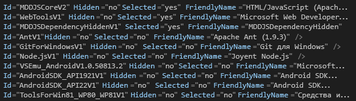

# Практическое руководство. Создание и выполнение автоматической установки Visual Studio
[!INCLUDE[vs2017banner](../code-quality/includes/vs2017banner.md)]

Приложение установки [!INCLUDE[vsprvs](../code-quality/includes/vsprvs_md.md)] можно запустить в режиме автоматической установки \(т. е. настроенной тихой установки\) через интрасеть вместо выполнения установки с носителя, например DVD\-диска. В этом разделе описана процедура подготовки [!INCLUDE[vsprvs](../code-quality/includes/vsprvs_md.md)] для этого типа установки из общей сетевой папки.  
  
## Создание сетевого образа  
 Создайте сетевой образ носителя [!INCLUDE[vsprvs](../code-quality/includes/vsprvs_md.md)].  
  
#### Создание сетевого образа  
  
1.  Создайте на сервере папку \(например, *диск*:\\IDEinstall\\\).  
  
2.  Выполните одно из следующих действий.  
  
    -   Загрузите начальный веб\-загрузчик и выполните команду *Продукт*.exe \/Layout *диск*:\\IDEinstall\\.  
  
         ИЛИ  
  
    -   Скопируйте содержимое носителя для Visual Studio в папку IDEinstall. После копирования содержимого вам нужно будет скачать программное обеспечение сторонних разработчиков, которое вы хотите установить.  
  
3.  Предоставьте общий доступ к папке IDEinstall и установите необходимые параметры безопасности.  
  
     Сетевой путь приложения установки для [!INCLUDE[vsprvs](../code-quality/includes/vsprvs_md.md)] имеет следующий вид: \\\\*ИмяСервера*\\IDEinstall\\*Продукт*.exe.  
  
    > [!NOTE]
    >  Установка может завершиться сбоем, если сочетание имени файла и пути превышает максимально допустимое число знаков \(260\). Максимальная длина пути в [!INCLUDE[vsprvs](../code-quality/includes/vsprvs_md.md)] — 221 символ.  Максимальная длина локального пути — 70 символов; сетевого пути — 39 символов.  
  
     Установка может также завершиться сбоем, если имена папок в пути включают пробелы \(например, \\\\*ИмяСервера*\\IDE install или \\\\*ИмяСервера*\\Visual Studio\\\).  
  
## Развертывание Visual Studio в автоматическом режиме  
 Для развертывания [!INCLUDE[vsprvs](../code-quality/includes/vsprvs_md.md)] в автоматическом режиме необходимо изменить файл AdminDeployment.xml. Для этого необходимо сначала создать файл AdminDeployment.xml с помощью параметра командной строки `/CreateAdminFile <расположение файла>`. Затем этот файл можно использовать для переноса развертывания Visual Studio в сеть либо для ввода в среду установки в случае его размещения в каталоге *диск*:\\IDEinstall\\packages. Файл AdminDeployment.xml не является уникальным для операционной системы, архитектуры, выпуска Visual Studio или языка операционной системы.  
  
> [!CAUTION]
>  Иногда элементы, перечисленные как выбранные в файле AdminDeployment.xml, не устанавливаются. Чтобы решить эту проблему, поместите элементы с пометкой "Selected\="yes"" в **конец** файла AdminDeployment.xml.  
>   
>  Если вы не хотите устанавливать необязательные зависимости элемента, сначала нужно выбрать родительский элемент, а затем отменить выбор необязательных зависимостей после него, как показано на снимке экрана ниже.  
>   
>    
>   
>  Еще один способ — просто пропустить необязательный дочерний элемент. Иными словами, не включайте элементы с пометкой "Selected\="no"". Однако все элементы с пометкой "Selected\="yes"" необходимо по\-прежнему поместить в конце файла AdminDeployment.xml.  
  
> [!IMPORTANT]
>  Во время установки компьютер может автоматически перезагружаться один или несколько раз. После перезапуска необходимо снова войти в систему с той же учетной записью пользователя, с которой вы входили для выполнения установки до перезагрузки компьютера. Автоматических перезагрузок можно избежать, если предварительно установить необходимые компоненты до запуска автоматической установки. Более подробную информацию см. в подразделе под названием "Установка без перезапуска" в разделе [Руководство администратора Visual Studio](../install/visual-studio-administrator-guide.md).  
  
 Схема файла AdminDeployment содержит следующие элементы:  
  
|Элемент|Атрибут|Значения|Описание|  
|-------------|-------------|--------------|--------------|  
|BundleCustomizations|TargetDir|*Путь*|Поведение аналогично переопределению пути в интерфейсе пользователя приложения установки. Этот элемент пропускается, если Visual Studio уже установлена.|  
|BundleCustomizations|NoWeb|yes&#124;default|Если значение этого элемента — yes \(да\), приложение установки не будет пытаться выйти в Интернет во время установки.|  
|SelectableItemCustomization|Hidden|Yes&#124;No|Если значение этого элемента — yes \(да\), элемент Selectable в дереве настройки скрывается.|  
|SelectableItemCustomization|Выбранные|Yes&#124;No|Выбирает или отменяет выделение выделяемого элемента в дереве пользовательской настройки.|  
|BundleCustomizations|Feed|Путь|Расположение веб\-канала, который хочет применять пользователь.  Этот веб\-канал используется для последующих операций изменения на компьютере \(по умолчанию Default\).|  
|BundleCustomizations|SuppressRefreshPrompt|yes&#124;default|Пользователю не выводится запрос на обновление установки, если доступна более новая версия.|  
|BundleCustomizations|NoRefresh|yes&#124;default|При наличии более новой версии установка не обновляется.|  
|BundleCustomizations|NoCacheOnlyMode|yes&#124;default|Предотвращает предварительное заполнение кэша пакета.|  
  
> [!WARNING]
>  Приложение установки будет следовать указанному состоянию SelectableItem, даже если он скрыт. Например, если необходимо всегда устанавливать выбираемый элемент, можно пометить его как скрытый и выбранный.  
  
#### Создание автоматической установки Visual Studio  
  
1.  В файле *диск*:\\IDEinstall\\AdminDeployment.xml измените значение атрибута NoWeb элемента BundleCustomizations с "default" на "yes", как показано в следующем примере:  
  
     Измените `<BundleCustomizations TargetDir="default" NoWeb="default"/>` на `<BundleCustomizations TargetDir="default" NoWeb="yes"/>`  
  
2.  Измените требуемым образом атрибут SelectableItemCustomization для дополнительных компонентов, а затем сохраните файл.  
  
## Выполнение автоматической установки  
 Автоматическую установку можно запустить, автоматически запустив приложение установки Visual Studio на клиентских компьютерах или разрешив пользователям запустить это приложение самостоятельно, используя заданные вами параметры.  
  
#### Автоматическая установка на клиентском компьютере  
  
-   В меню **Пуск** выберите **Выполнить**, а затем введите `\\ServerName\IDEinstall\vs_Product.exe /adminfile PathOfTheAdmindeployment.xmlFile`*ДополнительныеПараметрыПоМереНеобходимости*.  
  
     Например, можно указать следующую командную строку: `\\server1\IDEinstall\vs_ultimate.exe /adminfile \\server1\ IDEinstall\AdminDeployment.xml /quiet /norestart`  
  
#### Разрешение клиентам вручную устанавливать Visual Studio с предопределенными параметрами  
  
1.  Скопируйте настроенный файл AdminDeployment.xml в сетевую общую папку, доступную только для чтения \(например, \\\\*ИмяСервера*\\IDEinstall\\packages\\AdminDeployment.xml\).  
  
2.  Разрешите пользователям выполнять установку из этой общей папки.  
  
## Обслуживание установки  
 Если открыть **Панель управления** и снова запустить приложение установки, можно изменить компоненты Visual Studio, удалить языки программирования, а также восстановить или удалить Visual Studio.  
  
> [!NOTE]
>  Для запуска программы установки в режиме обслуживания пользователь должен обладать полномочиями администратора на локальном компьютере.  
  
#### Обслуживание установки на клиентском компьютере  
  
-   Откройте **Панель управления** и выберите **Программы и компоненты**.  
  
-   Выберите [!INCLUDE[vsprvs](../code-quality/includes/vsprvs_md.md)], затем выберите **Изменить**.  
  
#### Изменение параметров AdminDeployment на клиентском компьютере после установки Visual Studio  
  
1.  Обновите файл AdminDeployment.xml по мере необходимости.  
  
2.  Нажмите кнопку **Пуск** и выберите **Выполнить**.  
  
3.  Введите следующий текст:  
  
     `\\ServerName\IDEinstall\vs_Product.exe /AdminFile PathToAdmindeployment.xmlFile` ДополнительныеПараметрыПоМереНеобходимости  
  
     Например, можно указать следующую командную строку: `\\server1\IDEinstall\vs_ultimate.exe /adminfile \\server1\IDEinstall\AdminDeployment.xml /quiet /norestart`  
  
 Восстановление является параметром по умолчанию после установки Visual Studio. При восстановлении Visual Studio с использованием обновленного \/AdminFile текущие параметры развертывания администратора будут переопределены теми, которые будут вызваны обновленным AdminDeployment.xml.  
  
## Зарегистрируйте продукт  
 После завершения установки вы можете зарегистрировать свою копию [!INCLUDE[vsprvs](../code-quality/includes/vsprvs_md.md)] прямо из [!INCLUDE[vsprvs](../code-quality/includes/vsprvs_md.md)].  
  
#### Регистрация  
  
1.  В меню **Справка** выберите **Зарегистрировать продукт**.  
  
2.  Введите ключ продукта.  
  
## См. также  
 [Установка Visual Studio](../Topic/Installing%20Visual%20Studio%202015.md)