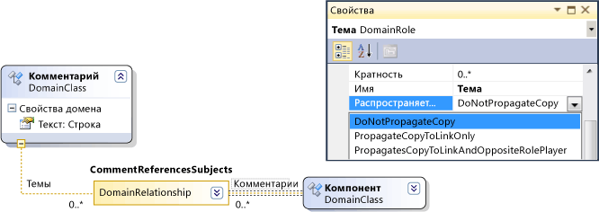
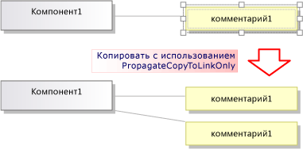
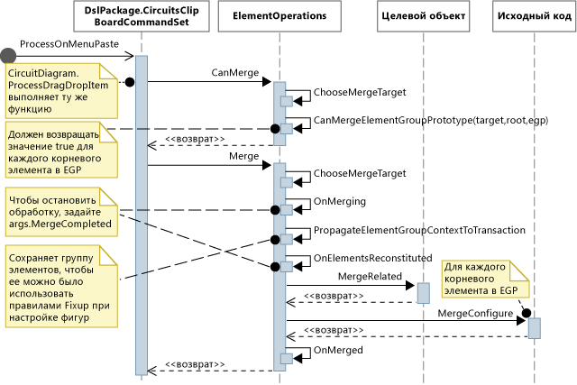

# <a name="customizing-copy-behavior"></a>Настройка функции копирования
В доменном языке (DSL), созданном с помощью пакета SDK визуализации и моделирования Visual Studio, можно изменить то, что происходит, когда пользователь копирует и вставит элементы.

## <a name="standard-copy-and-paste-behavior"></a>Стандартное поведение копирования и вставки
 Чтобы включить копирование, задайте свойство **включить копирование вставки** в узле **Редактор** в обозревателе DSL.

 По умолчанию, когда пользователь копирует элементы в буфер обмена, также копируются следующие элементы.

- Внедренные элементы-потомки выбранных элементов (т. е. элементы, которые являются целевыми объектами отношений внедрения для копируемых элементов).

- Связи отношений между скопированными элементами.

  Это правило применяется к скопированным элементам и связям рекурсивно.

  

  Скопированные элементы и связи сериализуются и сохраняются в <xref:Microsoft.VisualStudio.Modeling.ElementGroupPrototype> (EGP), который размещается в буфере обмена.

  Изображение скопированных элементов также помещается в буфер обмена. Это позволяет пользователю вставлять их в другие приложения, например в Word.

  Пользователь может вставить скопированные элементы в целевой объект, который может принять их в соответствии с определением DSL. Например, в DSL, созданном из шаблона решения компонентов, пользователь может вставить порты в компоненты, но не в схему, а также вставить компоненты в схему, но не в другие компоненты.

## <a name="customizing-copy-and-paste-behavior"></a>Настройка поведения копирования и вставки
 Дополнительные сведения о настройке модели с помощью программного кода см. [в разделе Навигация и обновление модели в программном коде](../modeling/navigating-and-updating-a-model-in-program-code.md).

 **Включение и отключение копирования, вырезания и вставки**
В обозревателе DSL установите свойство **включить копирование вставки** в узле **Редактор** .

 **Скопируйте связи в тот же целевой объект,** например, чтобы скопировать поле для комментариев, связанное с тем же элементом темы.
Задайте для свойства **распространение копии** роли значение **распространить копию только для ссылки**. Дополнительные сведения см. в разделе [Настройка поведения копирования ссылок](#customizeLinks).

 Скопируйте связанные элементы. Например, при копировании нового элемента также делаются копии всех связанных полей комментариев.
Установите свойство **распространяет копию** роли, чтобы **распространить копию на ссылку и противоположный исполнитель роли**. Дополнительные сведения см. в разделе [Настройка поведения копирования ссылок](#customizeLinks).

 **Быстро дублировать элементы путем копирования и вставления.** Обычно элемент, который только что был скопирован, остается выбран, и в него нельзя вставить такой же тип элемента.
Добавьте директиву слияния элементов в класс домена и настройте его на передачу слияний в родительский класс. Это будет также влиять на операции перетаскивания. Дополнительные сведения см. в разделе [Настройка создания и перемещения элементов](../modeling/customizing-element-creation-and-movement.md).

 \- или -

 Выберите схему перед вставкой элементов, переопределив `ClipboardCommandSet.ProcessOnPasteCommand()`. Добавьте этот код в пользовательский файл в проекте DslPackage:

```csharp
namespace Company.MyDsl {
using System.Linq;
using Microsoft.VisualStudio.Modeling.Diagrams;
using Microsoft.VisualStudio.Modeling.Shell;
partial class MyDslClipboardCommandSet
{
  protected override void ProcessOnMenuPasteCommand()
  {
 // Deselect the current selection after copying:
 Diagram diagram = (this.CurrentModelingDocView as SingleDiagramDocView).Diagram;
    this.CurrentModelingDocView
     .SelectObjects(1, new object[] { diagram }, 0);
  }
} }
```

 **Создайте дополнительные связи, когда пользователь вставляет данные в выбранный целевой объект.** Например, когда поле для комментариев вставляется в элемент, между ними создается связь.
Добавьте директиву слияния элементов в целевой класс домена и настройте его на обработку слияния добавлением связей. Это будет также влиять на операции перетаскивания. Дополнительные сведения см. в разделе [Настройка создания и перемещения элементов](../modeling/customizing-element-creation-and-movement.md).

 \- или -

 Переопределите `ClipboardCommandSet.ProcessOnPasteCommand()` для создания дополнительных связей после вызова базового метода.

 **Настройте форматы, в которых элементы могут быть скопированы** во внешние приложения, например, чтобы добавить границу в форму точечного рисунка.
Переопределите *мидсл* `ClipboardCommandSet.ProcessOnMenuCopyCommand()` в проекте DslPackage.

 **Настройте способы копирования элементов в буфер обмена командой копирования, но не в операции перетаскивания.**
Переопределите *мидсл* `ClipboardCommandSet.CopyModelElementsIntoElementGroupPrototype()` в проекте DslPackage.

 **Сохраните макет фигуры через копирование и вставку.**
Если пользователь копирует несколько фигур, можно сделать так, чтобы при вставке их положение относительно друг друга сохранялось. Эта методика показана в примере в [VMSDK: пример схем цепи](https://code.msdn.microsoft.com/Visualization-Modeling-SDK-763778e8).

 Чтобы достигнуть такого эффекта, добавьте фигуры и соединители в скопированный ElementGroupPrototype. Самый удобный метод переопределения — это ElementOperations.CreateElementGroupPrototype(). Для этого добавьте в проект Dsl следующий код:

```csharp

public class MyElementOperations : DesignSurfaceElementOperations
{
  // Create an EGP to add to the clipboard.
  // Called when the elements to be copied have been
  // collected into an ElementGroup.
 protected override ElementGroupPrototype CreateElementGroupPrototype(ElementGroup elementGroup, ICollection<ModelElement> elements, ClosureType closureType)
  {
 // Add the shapes and connectors:
 // Get the elements already in the group:
    ModelElement[] mels = elementGroup.ModelElements
        .Concat(elementGroup.ElementLinks) // Omit if the paste target is not the diagram.
        .ToArray();
 // Get their shapes:
    IEnumerable<PresentationElement> shapes =
       mels.SelectMany(mel =>
            PresentationViewsSubject.GetPresentation(mel));
    elementGroup.AddRange(shapes);

 return base.CreateElementGroupPrototype
           (elementGroup, elements, closureType);
  }

 public MyElementOperations(IServiceProvider serviceProvider, ElementOps1Diagram diagram)
      : base(serviceProvider, diagram)
  { }
}

// Replace the standard ElementOperations
// singleton with your own:
partial class MyDslDiagram // EDIT NAME
{
 /// <summary>
 /// Singleton ElementOperations attached to this diagram.
 /// </summary>
 public override DesignSurfaceElementOperations ElementOperations
  {
 get
    {
 if (singleton == null)
      {
        singleton = new MyElementOperations(this.Store as IServiceProvider, this);
      }
 return singleton;
    }
  }
 private MyElementOperations singleton = null;
}
```

 **Вставьте фигуры в выбранное место, например в текущее положение указателя.**
Если пользователь копирует несколько фигур, можно сделать так, чтобы при вставке их положение относительно друг друга сохранялось. Эта методика показана в примере в [VMSDK: пример схем цепи](https://code.msdn.microsoft.com/Visualization-Modeling-SDK-763778e8).

 Для достижения такого эффекта переопределите `ClipboardCommandSet.ProcessOnMenuPasteCommand()`, чтобы использовать версию `ElementOperations.Merge()`, зависящую от местоположения. Для этого добавьте в проект DslPackage следующий код:

```csharp

partial class MyDslClipboardCommandSet // EDIT NAME
{
   /// <summary>
    /// This method assumes we only want to paste things onto the diagram
    /// - not onto anything contained in the diagram.
    /// The base method pastes in a free space on the diagram.
    /// But if the menu was used to invoke paste, we want to paste in the cursor position.
    /// </summary>
    protected override void ProcessOnMenuPasteCommand()
    {

  NestedShapesSampleDocView docView = this.CurrentModelingDocView as NestedShapesSampleDocView;

      // Retrieve data from clipboard:
      System.Windows.Forms.IDataObject data = System.Windows.Forms.Clipboard.GetDataObject();

      Diagram diagram = docView.CurrentDiagram;
      if (diagram == null) return;

      if (!docView.IsContextMenuShowing)
      {
        // User hit CTRL+V - just use base method.

        // Deselect anything that's selected, otherwise
        // pasted item will be incompatible:
        if (!this.IsDiagramSelected())
        {
          docView.SelectObjects(1, new object[] { diagram }, 0);
        }

        // Paste into a convenient spare space on diagram:
    base.ProcessOnMenuPasteCommand();
      }
      else
      {
        // User right-clicked - paste at mouse position.

        // Utility class:
        DesignSurfaceElementOperations op = diagram.ElementOperations;

        ShapeElement pasteTarget = diagram;

        // Check whether what's in the paste buffer is acceptable on the target.
        if (pasteTarget != null && op.CanMerge(pasteTarget, data))
        {

        // Although op.Merge would be a no-op if CanMerge failed, we check CanMerge first
          // so that we don't create an empty transaction (after which Undo would be no-op).
          using (Transaction t = diagram.Store.TransactionManager.BeginTransaction("paste"))
          {
            PointD place = docView.ContextMenuMousePosition;
            op.Merge(pasteTarget, data, PointD.ToPointF(place));
            t.Commit();
          }
        }
      }
    }
  }
```

 **Позволяют пользователю перетаскивать элементы.**
См. раздел [как добавить обработчик перетаскивания](../modeling/how-to-add-a-drag-and-drop-handler.md).

## <a name="customizing-link-copy-behavior"></a><a name="customizeLinks"></a> Настройка поведения копирования ссылок
 Когда пользователь копирует элемент, стандартное поведение заключается в том, что также копируются все внедренные элементы. Стандартное поведение копирования можно изменить. В определении DSL выберите роль с одной стороны связи и в окно свойств установите значение свойства **распространяет копирование** .

 

 Поддерживается три значения:

- Не распространять копирование.

- Распространить копирование только на связь: когда вставляется группа, новая копия этой связи ссылается на существующий элемент на другом конце связи.

- Распространить копирование на исполнителя противоположной роли: скопированная группа включает копию элемента на другом конце связи.

  

  Сделанные изменения повлияют на элементы и скопированное изображение.

## <a name="programming-copy-and-paste-behavior"></a>Программирование поведения копирования и вставки
 Многие аспекты поведения DSL в отношении копирования, вставки, создания и удаления объектов управляются экземпляром, связанным <xref:Microsoft.VisualStudio.Modeling.ElementOperations> с диаграммой. Поведение DSL можно изменить, создав собственный класс <xref:Microsoft.VisualStudio.Modeling.ElementOperations> и переопределив <xref:Microsoft.VisualStudio.Modeling.Diagrams.Diagram.ElementOperations%2A> свойство класса схемы.

> [!TIP]
> Дополнительные сведения о настройке модели с помощью программного кода см. [в разделе Навигация и обновление модели в программном коде](../modeling/navigating-and-updating-a-model-in-program-code.md).

 

 

#### <a name="to-define-your-own-elementoperations"></a>Определение собственного ElementOperations

1. В новом файле проекта доменного языка создайте класс, производный от класса <xref:Microsoft.VisualStudio.Modeling.Diagrams.DesignSurfaceElementOperations>.

2. Добавьте определение разделяемого класса для класса схемы. Имя этого класса можно найти в **дсл\женератедкоде\диаграмс.КС**.

    В классе диаграммы переопределите свойство <xref:Microsoft.VisualStudio.Modeling.Diagrams.Diagram.ElementOperations%2A>, чтобы получить экземпляр подкласса ElementOperations. Необходимо вернуть тот же самый экземпляр в каждом классе.

   Добавьте этот код в пользовательский файл кода в проекте DslPackage:

```csharp

using Microsoft.VisualStudio.Modeling;
using Microsoft.VisualStudio.Modeling.Diagrams;
using Microsoft.VisualStudio.Modeling.Diagrams.ExtensionEnablement;

  public partial class MyDslDiagram
  {
    public override DesignSurfaceElementOperations ElementOperations
    {
      get
      {
        if (this.elementOperations == null)
        {
          this.elementOperations = new MyElementOperations(this.Store as IServiceProvider, this);
        }
        return this.elementOperations;
      }
    }
    private MyElementOperations elementOperations = null;
  }

  public class MyElementOperations : DesignSurfaceElementOperations
  {
    public MyElementOperations(IServiceProvider serviceProvider, MyDslDiagram diagram)
      : base(serviceProvider, diagram)
    { }
    // Overridden methods follow
  }
```

## <a name="receiving-items-dragged-from-other-models"></a>Получение элементов, перетаскиваемых из других моделей
 ElementOperations можно также использовать для определения поведения копирования, перемещения, удаления и перетаскивания. Для демонстрации использования ElementOperations в приведенном ниже примере определяется пользовательское поведение перетаскивания. Однако для этой цели можно рассмотреть альтернативный подход, описанный в разделе [как добавить обработчик перетаскивания](../modeling/how-to-add-a-drag-and-drop-handler.md), который является более расширяемым.

 Определите два метода в классе ElementOperations:

- `CanMerge(ModelElement targetElement, System.Windows.Forms.IDataObject data)` Определяет, можно ли перетащить элемент источника на целевую фигуру, соединитель или схему.

- `MergeElementGroupPrototype(ModelElement targetElement, ElementGroupPrototype sourcePrototype)` который объединяет исходный элемент в целевой объект.

### <a name="canmerge"></a>CanMerge()
 `CanMerge()` метод вызывается для определения отзывов, которые должны быть предоставлены пользователю при перемещении мыши по схеме. Для метода используются следующие параметры: элемент, на который наводится указатель мыши, и данные об источнике, из которого была выполнена операция перетаскивания. Пользователь может перетащить элемент из любого места экрана, поэтому исходный объект может быть разных типов и сериализован в разных форматах. Если источник является доменным языком или моделью UML, параметр данных является сериализацией <xref:Microsoft.VisualStudio.Modeling.ElementGroupPrototype>. Операции перетаскивания, копирования и панели инструментов используют ElementGroupPrototypes для представления фрагментов моделей.

 Прототип группы элементов может содержать любое количество элементов и связей. Типы элементов можно идентифицировать по их GUID. GUID принадлежит перетащенной фигуре, а не базовому элементу модели. В следующем примере `CanMerge()` возвращает значение true, если фигура класса из диаграммы UML перетаскивается в эту схему.

```csharp
public override bool CanMerge(ModelElement targetShape, System.Windows.Forms.IDataObject data)
 {
  // Extract the element prototype from the data.
  ElementGroupPrototype prototype = ElementOperations.GetElementGroupPrototype(this.ServiceProvider, data);
  if (targetShape is MyTargetShape && prototype != null &&
        prototype.RootProtoElements.Any(rootElement =>
          rootElement.DomainClassId.ToString()
          ==  "3866d10c-cc4e-438b-b46f-bb24380e1678")) // Guid of UML Class shapes
          // or SourceClass.DomainClassId
        return true;
   return base.CanMerge(targetShape, data);
 }
```

## <a name="mergeelementgroupprototype"></a>MergeElementGroupPrototype()
 Этот метод вызывается, если пользователь вставляет элемент в схему, фигуру или соединитель. Он должен произвести слияние перетаскиваемого содержимого с целевым объектом. В этом примере код определяет, распознается ли комбинация типов цели и прототипа. Если да, то метод преобразует перетаскиваемые элементы в прототип элементов, которые должны быть добавлены к модели. Базовый метод вызывается для выполнения слияния преобразованных или не преобразованных элементов.

```csharp
public override void MergeElementGroupPrototype(ModelElement targetShape, ElementGroupPrototype sourcePrototype)
{
  ElementGroupPrototype prototypeToMerge = sourcePrototype;
  MyTargetShape pel = targetShape as MyTargetShape;
  if (pel != null)
  {
    prototypeToMerge = ConvertDraggedTypeToLocal(pel, sourcePrototype);
  }
  if (prototypeToMerge != null)
    base.MergeElementGroupPrototype(targetShape, prototypeToMerge);
}
```

 В этом примере обрабатываются элементы класса UML, перетаскиваемого из схемы класса UML. DSL не предусматривает прямое сохранение классов UML. Вместо этого создается элемент DSL для каждого перетаскиваемого класса UML. Это пригодится, если, например, доменный язык является схемой экземпляра. Пользователь может перетаскивать классы на схему, чтобы создать экземпляры этих классов.

```csharp

private ElementGroupPrototype ConvertDraggedTypeToLocal (MyTargetShape snapshot, ElementGroupPrototype prototype)
{
  // Find the UML project:
  EnvDTE.DTE dte = snapshot.Store.GetService(typeof(EnvDTE.DTE)) as EnvDTE.DTE;
  foreach (EnvDTE.Project project in dte.Solution.Projects)
  {
    IModelingProject modelingProject = project as IModelingProject;
    if (modelingProject == null) continue; // not a modeling project
    IModelStore store = modelingProject.Store;
    if (store == null) continue;
    // Look for the shape that was dragged:
    foreach (IDiagram umlDiagram in store.Diagrams())
    {
      // Get modeling diagram that implements UML diagram:
      Diagram diagram = umlDiagram.GetObject<Diagram>();
      Guid elementId = prototype.SourceRootElementIds.FirstOrDefault();
      ShapeElement shape = diagram.Partition.ElementDirectory.FindElement(elementId) as ShapeElement;
      if (shape == null) continue;
      IClass classElement = shape.ModelElement as IClass;
      if (classElement == null) continue;

      // Create a prototype of elements in my DSL, based on the UML element:
      Instance instance = new Instance(snapshot.Store);
      instance.Type = classElement.Name;
      // Pack them into a prototype:
      ElementGroup group = new ElementGroup(instance);
      return group.CreatePrototype();
    }
  }
  return null;
}
```

## <a name="standard-copy-behavior"></a>Стандартное поведение копирования
 Код в этом разделе включает методы, которые можно переопределить для изменения поведения копирования. Чтобы показать вам, как можно настроить код в соответствии с индивидуальными требованиями, в этом разделе представлен код, которые переопределяет методы, задействованные в копировании, но не изменяет стандартное поведение.

 Когда пользователь нажимает сочетание клавиш CTRL + C или применяет команду меню "Копировать", вызывается метод <xref:Microsoft.VisualStudio.Modeling.Shell.ClipboardCommandSet.ProcessOnMenuCopyCommand%2A>. Вы можете увидеть, как это настроить в **Дслпаккаже\женератед коде\коммандсет.КС**. Дополнительные сведения о настройке команд см. в разделе [инструкции. Добавление команды в контекстное меню](../modeling/how-to-add-a-command-to-the-shortcut-menu.md).

 Можно переопределить Процессонменукопикомманд, добавив определение разделяемого класса *мидсл* `ClipboardCommandSet` в проект DslPackage.

```csharp
using System.Collections.Generic;
using System.Drawing;
using System.Windows.Forms;
using Microsoft.VisualStudio.Modeling;
using Microsoft.VisualStudio.Modeling.Diagrams;

partial class MyDslClipboardCommandSet
{
  /// <summary>
  /// Override ProcessOnMenuCopyCommand() to copy elements to the
  /// clipboard in different formats, or to perform additional tasks
  /// before or after copying - for example deselect the copied elements.
  /// </summary>
  protected override void ProcessOnMenuCopyCommand()
  {
    IList<ModelElement> selectedModelElements = this.SelectedElements;
    if (selectedModelElements.Count == 0) return;

    // System container for clipboard data.
    // The IDataObject can contain data in several formats.
    IDataObject dataObject = new DataObject();

    Bitmap bitmap = null; // For export to other programs.
    try
    {
      #region Create EGP for copying to a DSL.
      this.CopyModelElementsIntoElementGroupPrototype
                     (dataObject, selectedModelElements);
      #endregion

      #region Create bitmap for copying to another application.
      // Find all the shapes associated with this selection:
      List<ShapeElement> shapes = new List<ShapeElement>(
        this.ResolveExportedShapesForClipboardImages
              (dataObject, selectedModelElements));

      bitmap = this.CreateBitmapForClipboard(shapes);
      if (bitmap != null)
      {
        dataObject.SetData(DataFormats.Bitmap, bitmap);
      }
      #endregion

      // Add the data to the clipboard:
      Clipboard.SetDataObject(dataObject, true, 5, 100);
    }
    finally
    {
      // Dispose bitmap after SetDataObject:
      if (bitmap != null) bitmap.Dispose();
    }
  }
/// <summary>
/// Override this to customize the element group that is copied to the clipboard.
/// </summary>
protected override void CopyModelElementsIntoElementGroupPrototype(IDataObject dataObject, IList<ModelElement> selectedModelElements)
{
  return this.ElementOperations.Copy(dataObject, selectedModelElements);
}
}
```

 Каждая схема имеет единственный экземпляр ElementOperations. Можно указать свою собственную производную. Этот файл, который можно поместить в проект доменного языка, будет вести себя так же, как и код, который он переопределяет:

```csharp
using System;
using System.Collections.Generic;
using System.Linq;
using Microsoft.VisualStudio.Modeling;
using Microsoft.VisualStudio.Modeling.Diagrams;

namespace Company.MyDsl
{
  partial class MyDslDiagram
  {
    /// <summary>
    /// Singleton ElementOperations attached to this diagram.
    /// </summary>
    public override DesignSurfaceElementOperations ElementOperations
    {
      get
      {
        if (this.elementOperations == null)
        {
          this.elementOperations = new MyElementOperations(this.Store as IServiceProvider, this);
        }
        return this.elementOperations;
      }
    }
    private MyElementOperations elementOperations = null;
  }

  // Our own version of ElementOperations so that we can override:
  public class MyElementOperations : DesignSurfaceElementOperations
  {
    public MyElementOperations(IServiceProvider serviceProvider, ElementOps1Diagram diagram)
      : base(serviceProvider, diagram)
    { }

    /// <summary>
    /// Copy elements to the clipboard data.
    /// Provides a hook for adding custom data.
    /// </summary>
    public override void Copy(System.Windows.Forms.IDataObject data,
      ICollection<ModelElement> elements,
      ClosureType closureType,
      System.Drawing.PointF sourcePosition)
    {
      if (CanAddElementGroupFormat(elements, closureType))
      {
        AddElementGroupFormat(data, elements, closureType);
      }

      // Override these to store additional data:
      if (CanAddCustomFormat(elements, closureType))
      {
        AddCustomFormat(data, elements, closureType, sourcePosition);
      }
    }

    protected override void AddElementGroupFormat(System.Windows.Forms.IDataObject data, ICollection<ModelElement> elements, ClosureType closureType)
    {
      // Add the selected elements and those implied by the propagate copy rules:
      ElementGroup elementGroup = this.CreateElementGroup(elements, closureType);

      // Mark all the elements that are not embedded under other elements:
      this.MarkRootElements(elementGroup, elements, closureType);

      // Store in the clipboard data:
      ElementGroupPrototype elementGroupPrototype = this.CreateElementGroupPrototype(elementGroup, elements, closureType);
      data.SetData(ElementGroupPrototype.DefaultDataFormatName, elementGroupPrototype);
    }

    /// <summary>
    /// Override this to store additional elements in the element group:
    /// </summary>
    protected override ElementGroupPrototype CreateElementGroupPrototype(ElementGroup elementGroup, ICollection<ModelElement> elements, ClosureType closureType)
    {
      ElementGroupPrototype prototype = new ElementGroupPrototype(this.Partition, elementGroup.RootElements, elementGroup);
      return prototype;
    }

    /// <summary>
    /// Create an element group from the given starting elements, using the
    /// copy propagation rules specified in the DSL Definition.
    /// By default, this includes all the embedded descendants of the starting elements,
    /// and also includes reference links where both ends are already included.
    /// </summary>
    /// <param name="startElements">model elements to copy</param>
    /// <param name="closureType"></param>
    /// <returns></returns>
    protected override ElementGroup CreateElementGroup(ICollection<ModelElement> startElements, ClosureType closureType)
    {
      // ElementClosureWalker finds all the connected elements,
      // according to the propagate copy rules specified in the DSL Definition:
      ElementClosureWalker walker = new ElementClosureWalker(this.Partition,
        closureType, // Normally ClosureType.CopyClosure
        startElements,
        true, // Do not load other models.
        null, // Optional list of domain roles not to traverse.
        true); // Include relationship links where both ends are already included.

      walker.Traverse(startElements);
      IList<ModelElement> closureList = walker.ClosureList;
      Dictionary<object, object> closureContext = walker.Context;

      // create a group for this closure
      ElementGroup group = new ElementGroup(this.Partition);
      group.AddRange(closureList, false);

      // create the element group prototype for the group
      foreach (object key in closureContext.Keys)
      {
        group.SourceContext.ContextInfo[key] = closureContext[key];
      }

      return group;
    }
  }
}
```

## <a name="see-also"></a>См. также раздел

- [Настройка создания и перемещения элементов](../modeling/customizing-element-creation-and-movement.md)
- [Практическое руководство. Добавление обработчика перетаскивания](../modeling/how-to-add-a-drag-and-drop-handler.md)
- [Пример: пример схем канала VMSDK](https://code.msdn.microsoft.com/Visualization-Modeling-SDK-763778e8)

[!INCLUDE[modeling_sdk_info](includes/modeling_sdk_info.md)]
