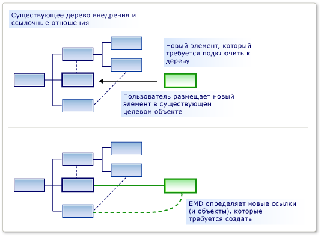

# <a name="customizing-element-creation-and-movement"></a>Настройка создания и перемещения элементов

Можно разрешить перетаскивание элемента на другой элемент из панели элементов или операции вставки или перемещения. Можно иметь перемещенные элементы, связанные с целевыми элементами, используя указанные связи.

Директива слияния элементов (ЕМД) указывает, что происходит при *объединении* одного элемента модели в другой элемент модели. Это происходит в следующих случаях:

- Пользователь перетаскивает с панели элементов на схему или фигуру.

- Пользователь создает элемент с помощью меню Добавить в проводнике или фигуре секции.

- Пользователь перемещает элемент из одной дорожки в другую.

- Пользователь вставил элемент.

- Код программы вызывает директиву слияния элементов.

Хотя операции создания могут отличаться от операций копирования, они фактически работают так же. При добавлении элемента, например из панели элементов, выполняется репликация его прототипа. Прототип объединяется в модель так же, как и элементы, скопированные из другой части модели.

Обязанностью ЕМД является выбор способа слияния объекта или группы объектов в определенное место в модели. В частности, он решает, какие связи должны быть созданы, чтобы связать Объединенную группу с моделью. Кроме того, его можно настроить для установки свойств и создания дополнительных объектов.



ЕМД создается автоматически при определении отношения внедрения. Этот ЕМД по умолчанию создает экземпляр связи, когда пользователи добавляют в родительский экземпляр новые дочерние экземпляры. Эти Емдс по умолчанию можно изменить, например, добавив пользовательский код.

Можно также добавить собственный Емдс в определение DSL, чтобы пользователи могли перетаскивать или вставлять разные сочетания Объединенных и принимающих классов.

## <a name="defining-an-element-merge-directive"></a>Определение директивы слияния элементов

Директивы слияния элементов можно добавлять в доменные классы, доменные отношения, фигуры, соединители и схемы. Их можно добавить или найти в обозревателе DSL в классе принимающего домена. Принимающий класс — это доменный класс элемента, который уже находится в модели и на который будет объединен новый или скопированный элемент.


**Класс индексирования** — это доменный класс элементов, которые можно объединить в члены принимающего класса. Экземпляры подклассов класса индексирования также будут объединены этим ЕМД, если только **для подклассов** не задано значение false.

Существует два вида директивы Merge:

- Директива **процесса Merge** задает связи, с помощью которых новый элемент должен быть связан с деревом.

- Директива **прямого слияния** перенаправляет новый элемент к другому принимающему элементу, как правило, к родителю.

Вы можете добавить пользовательский код для директив слияния:

- Set **использует пользовательское принятие** , чтобы добавить собственный код, чтобы определить, следует ли объединить определенный экземпляр элемента индексирования с целевым элементом. Когда пользователь перетаскивает элементы из панели элементов, указатель "Недопустимый" показывает, запрещается ли в коде слияние.

   Например, слияние можно разрешить только в том случае, если принимающий элемент находится в определенном состоянии.

- Параметр Set **использует пользовательское слияние** для добавления. Укажите собственный код для определения изменений, внесенных в модель при выполнении слияния.

   Например, можно задать свойства в объединенном элементе, используя данные из их нового расположения в модели.

> [!NOTE]
> При написании пользовательского кода слияния он влияет только на операции слияния, выполняемые с помощью этого ЕМД. Если существуют другие Емдс, объединяющие один и тот же тип объекта, или если имеется другой пользовательский код, создающий эти объекты без использования ЕМД, то они не будут затронуты пользовательским кодом слияния.
>
> Если вы хотите убедиться, что новый элемент или новая связь всегда обрабатываются вашим пользовательским кодом, рассмотрите возможность определения `AddRule` в отношении внедрения и в `DeleteRule` доменном классе элемента. Дополнительные сведения см. [в разделе правила распространяют изменения в модели](../modeling/rules-propagate-changes-within-the-model.md).

## <a name="example-defining-an-emd-without-custom-code"></a>Пример. Определение ЕМД без пользовательского кода

Следующий пример позволяет пользователям одновременно создавать элемент и соединитель путем перетаскивания из области элементов на существующую фигуру. В примере добавляется ЕМД в определение DSL. Перед этим изменением пользователи могут перетаскивать инструменты на схему, но не на существующие фигуры.

Пользователи также могут вставлять элементы на другие элементы.

### <a name="to-let-users-create-an-element-and-a-connector-at-the-same-time"></a>Чтобы позволить пользователям одновременно создавать элемент и соединитель

1. Создайте новый домен DSL с помощью шаблона **минимального языкового** решения.

    При запуске этого DSL он позволяет создавать фигуры и соединители между фигурами. Невозможно перетащить новую фигуру **ексамплилемент** с панели элементов на существующую фигуру.

2. Чтобы позволить пользователям объединять элементы на `ExampleElement` фигуры, создайте новый емд в `ExampleElement` доменном классе:

   1. В **обозревателе DSL** разверните узел **классы доменов**. Щелкните правой кнопкой мыши `ExampleElement` и выберите команду **Добавить новую директиву слияния элементов**.

   2. Убедитесь, что открыто окно " **сведения о DSL** ", и вы можете просмотреть сведения о новом емд. (Меню: **вид**, **другие окна**, **сведения о DSL**.)

3. Задайте **класс индексирования** в окне сведения о DSL, чтобы определить, какой класс элементов можно объединить с `ExampleElement` объектами.

    В этом примере выберите `ExampleElements` , чтобы пользователь мог перетаскивать новые элементы на существующие элементы.

    Обратите внимание, что класс индексирования преобразуется в имя ЕМД в обозревателе DSL.

4. В разделе **процесс слияния путем создания ссылок** добавьте два пути:

   - Один из путей связывает новый элемент с родительской моделью. Выражение пути, которое необходимо ввести при переходе от существующего элемента к родительской модели по отношению к внедрению. Наконец, он указывает роль в новой ссылке, которой будет назначен новый элемент. Путь выглядит следующим образом:

      `ExampleModelHasElements.ExampleModel/!ExampleModel/.Elements`

   - Другой путь связывает новый элемент с существующим элементом. Выражение пути указывает ссылочную связь и роль, которой будет назначен новый элемент. Этот путь выглядит следующим образом:

      `ExampleElementReferencesTargets.Sources`

      Для создания каждого пути можно использовать средство перемещения по пути.

      1. В разделе **процесс слияния путем создания ссылок по путям** щелкните **\<add path>** .

      2. Щелкните стрелку раскрывающегося списка справа от элемента. Появится представление в виде дерева.

      3. Разверните узлы в дереве, чтобы сформировать путь, который необходимо указать.

5. Протестируйте DSL:

   1. Нажмите клавишу **F5** , чтобы перестроить и запустить решение.

        Перестроение займет больше времени, чем обычно, поскольку созданный код будет обновлен из текстовых шаблонов в соответствии с новым определением DSL.

   2. После запуска экспериментального экземпляра Visual Studio откройте файл модели DSL. Создайте несколько примеров элементов.

   3. Перетащите элемент из инструмента " **Пример элемента** " на существующую фигуру.

        Появится новая фигура, которая связана с существующей фигурой с помощью соединителя.

   4. Копирование существующей фигуры. Выберите другую фигуру и вставьте.

        Создается копия первой фигуры.  Он имеет новое имя и связан с второй фигурой с помощью соединителя.

Обратите внимание на следующие моменты в этой процедуре:

- Создавая директивы слияния элементов, можно разрешить любому классу элемента принимать любые другие. ЕМД создается в принимающем классе домена, а допустимый доменный класс указывается в поле **класс индекса** .

- Определяя пути, можно указать, какие ссылки следует использовать для подключения нового элемента к существующей модели.

     Указываемые ссылки должны включать одну связь внедрения.

- ЕМД влияет на создание из панели элементов, а также на операции вставки.

     При написании пользовательского кода, создающего новые элементы, можно явно вызвать ЕМД с помощью `ElementOperations.Merge` метода. Это гарантирует, что код связывает новые элементы с моделью так же, как и другие операции. Дополнительные сведения см. в разделе [Настройка поведения копирования](../modeling/customizing-copy-behavior.md).

## <a name="example-adding-custom-accept-code-to-an-emd"></a>Пример. Добавление пользовательского кода Accept в ЕМД

Добавив пользовательский код в ЕМД, можно определить более сложное поведение слияния. Этот простой пример не позволяет пользователю добавлять в схему больше, чем фиксированное число элементов. В этом примере изменяется ЕМД по умолчанию, сопровождающая отношение внедрения.

### <a name="to-write-custom-accept-code-to-restrict-what-the-user-can-add"></a>Написание пользовательского кода Accept для ограничения возможностей, которые может добавить пользователь

1. Создайте DSL с помощью шаблона **минимального языкового** решения. Откройте схему определения DSL.

2. В обозревателе DSL разверните узел **классы доменов**, `ExampleModel` **директивы слияния элементов**. Выберите директиву слияния элементов с именем `ExampleElement` .

     Этот ЕМД управляет тем, как пользователь может создавать новые `ExampleElement` объекты в модели, например, перетаскивая элементы из области элементов.

3. В окне **сведения о DSL** выберите **использовать пользовательское согласие**.

4. Выполните повторную сборку решения. Это займет больше времени, чем обычно, поскольку созданный код будет обновлен из модели.

     Появится сообщение об ошибке сборки, аналогичное: "Company. Елементмержесампле. Ексамплилемент не содержит определения для Канмержеексамплилемент..."

     Необходимо реализовать метод `CanMergeExampleElement` .

5. Создайте новый файл кода в проекте **DSL** . Замените его содержимое следующим кодом и замените пространство имен на пространство имен проекта.

    ```csharp
    using Microsoft.VisualStudio.Modeling;

    namespace Company.ElementMergeSample // EDIT.
    {
      partial class ExampleModel
      {
        /// <summary>
        /// Called whenever an ExampleElement is to be merged into this ExampleModel.
        /// This happens when the user pastes an ExampleElement
        /// or drags from the toolbox.
        /// Determines whether the merge is allowed.
        /// </summary>
        /// <param name="rootElement">The root element in the merging EGP.</param>
        /// <param name="elementGroupPrototype">The EGP that the user wants to merge.</param>
        /// <returns>True if the merge is allowed</returns>
        private bool CanMergeExampleElement(ProtoElementBase rootElement, ElementGroupPrototype elementGroupPrototype)
        {
          // Allow no more than 4 elements to be added:
          return this.Elements.Count < 4;
        }
      }
    }
    ```

    Этот простой пример позволяет ограничивать количество элементов, которые можно объединить в родительскую модель. Для более интересных условий метод может проверить любые свойства и ссылки принимающего объекта. Он также может проверять свойства элементов слияния, которые переносятся в <xref:Microsoft.VisualStudio.Modeling.ElementGroupPrototype> . Дополнительные сведения о см `ElementGroupPrototypes` . в разделе [Настройка поведения копирования](../modeling/customizing-copy-behavior.md). Дополнительные сведения о написании кода, считывающего модель, см. [в разделе Навигация и обновление модели в программном коде](../modeling/navigating-and-updating-a-model-in-program-code.md).

6. Протестируйте DSL:

    1. Нажмите клавишу **F5** , чтобы перестроить решение. Когда откроется экспериментальный экземпляр Visual Studio, откройте экземпляр DSL.

    2. Создавайте новые элементы несколькими способами:

        - Перетащите из инструмента " **Пример элемента** " на схему.

        - В **обозревателе примеров моделей** щелкните правой кнопкой мыши корневой узел и выберите команду **Добавить новый элемент example**.

        - Скопируйте и вставьте элемент на диаграмме.

    3. Убедитесь, что вы не можете использовать любой из этих способов для добавления в модель более четырех элементов. Это обусловлено тем, что все они используют директиву слияния элементов.

## <a name="example-adding-custom-merge-code-to-an-emd"></a>Пример. Добавление пользовательского кода слияния в ЕМД

В пользовательском коде слияния можно определить, что происходит, когда пользователь перетаскивает инструмент или вставил на элемент. Существует два способа определения пользовательского слияния:

1. Set **использует пользовательское слияние** и предоставляет необходимый код. Код заменяет созданный код слияния. Используйте этот параметр, если необходимо полностью переопределить действие слияния.

2. Переопределите `MergeRelate` метод и, при необходимости, `MergeDisconnect` метод. Чтобы сделать это, необходимо установить свойство класса Domain с типом данных **Generated Double производно** . Код может вызывать созданный код слияния в базовом классе. Используйте этот параметр, если требуется выполнить дополнительные операции после выполнения слияния.

   Эти подходы влияют только на операции слияния, выполняемые с помощью этого ЕМД. Если вы хотите повлиять на все способы создания объединенного элемента, в качестве альтернативы можно определить объект `AddRule` в отношении внедрения и `DeleteRule` для Объединенного доменного класса. Дополнительные сведения см. [в разделе правила распространяют изменения в модели](../modeling/rules-propagate-changes-within-the-model.md).

### <a name="to-override-mergerelate"></a>Переопределение Мержерелате

1. В определении DSL убедитесь, что вы определили ЕМД, к которому нужно добавить код. При необходимости можно добавить пути и определить пользовательский код принятия, как описано в предыдущих разделах.

2. На схеме DslDefinition выберите принимающий класс для слияния. Обычно он является классом в конце отношения внедрения.

     Например, в DSL, созданном на основе минимального языкового решения, выберите `ExampleModel` .

3. В окне **Свойства** установите для параметра **Generated Double Derived** значение **true**.

4. Выполните повторную сборку решения.

5. Проверьте содержимое **Дсл\женератед филес\домаинклассес.КС**. Поиск методов с именем `MergeRelate` и изучение их содержимого. Это позволит вам создавать собственные версии.

6. В новом файле кода напишите разделяемый класс для принимающего класса и переопределите `MergeRelate` метод. Не забудьте вызвать базовый метод. Пример:

    ```csharp
    partial class ExampleModel
    {
      /// <summary>
      /// Called when the user drags or pastes an ExampleElement onto the diagram.
      /// Sets the time of day as the name.
      /// </summary>
      /// <param name="sourceElement">Element to be added</param>
      /// <param name="elementGroup">Elements to be merged</param>
      protected override void MergeRelate(ModelElement sourceElement, ElementGroup elementGroup)
      {
        // Connect the element according to the EMD:
        base.MergeRelate(sourceElement, elementGroup);

        // Custom actions:
        ExampleElement mergingElement = sourceElement as ExampleElement;
        if (mergingElement != null)
        {
          mergingElement.Name = DateTime.Now.ToLongTimeString();
        }
      }
    }
    ```

### <a name="to-write-custom-merge-code"></a>Написание пользовательского кода слияния

1. В **Дсл\женератед коде\домаинклассес.КС** Проверьте методы с именем `MergeRelate` . Эти методы создают связи между новым элементом и существующей моделью.

    Кроме того, проверьте методы с именем `MergeDisconnect` . Эти методы отменяют связь элемента из модели, когда он должен быть удален.

2. В **обозревателе DSL** выберите или создайте директиву слияния элементов, которую необходимо настроить. В окне **сведения о DSL** установите параметр **использовать пользовательское слияние**.

    При установке этого параметра параметры **процесса слияния** и **пересылки** не учитываются. Вместо этого используется код.

3. Выполните повторную сборку решения. Это займет больше времени, чем обычно, поскольку созданные файлы кода будут обновлены из модели.

    Отобразятся сообщения об ошибках. Дважды щелкните сообщения об ошибках, чтобы просмотреть инструкции в созданном коде. Эти инструкции попросят предоставить два метода: `MergeRelate` *йоурдомаинкласс* и `MergeDisconnect` *йоурдомаинкласс* .

4. Запишите методы в определении разделяемого класса в отдельном файле кода. В примерах, которые вы проверили ранее, должно быть предложено, что вам нужно.

   Пользовательский код слияния не влияет на код, который создает объекты и связи напрямую и не влияет на другие Емдс. Чтобы обеспечить реализацию дополнительных изменений независимо от способа создания элемента, рассмотрите возможность записи `AddRule` и `DeleteRule` вместо этого. Дополнительные сведения см. [в разделе правила распространяют изменения в модели](../modeling/rules-propagate-changes-within-the-model.md).

## <a name="redirecting-a-merge-operation"></a>Перенаправление операции слияния

Директива прямого слияния перенаправляет целевой объект операции слияния. Как правило, новый целевой объект является родительским для первоначального целевого объекта.

Например, в DSL, созданном с помощью шаблона схемы компонентов, порты внедряются в компоненты. Порты отображаются как небольшие фигуры на границе фигуры компонента. Пользователь создает порты, перетаскивая инструмент "порт" на фигуру компонента. Но иногда пользователь по ошибке перетаскивает инструмент «порт» на существующий порт, а не на компонент, и операция завершается ошибкой. Это простая ошибка при наличии нескольких существующих портов. Чтобы помочь пользователю избежать этого неудобством, можно разрешить перетаскивание портов на существующий порт, но действие будет перенаправлено на родительский компонент. Операция работает так, как если бы целевой элемент был компонентом.

В решении модели компонентов можно создать директиву прямого слияния. При компиляции и запуске исходного решения вы увидите, что пользователи могут перетаскивать любое количество элементов **входного порта** или **выходного порта** из **панели элементов** в элемент **компонента** . Однако они не могут перетаскивать порт в существующий порт. Недоступный указатель предупреждает о том, что это перемещение не включено. Однако можно создать директиву прямого слияния, чтобы порт, который непреднамеренно удаляется из существующего **порта ввода** , перенаправлялся в элемент **Component** .

### <a name="to-create-a-forward-merge-directive"></a>Создание директивы прямого слияния

1. Создайте [!INCLUDE[dsl](../modeling/includes/dsl_md.md)] решение с помощью шаблона модели компонентов.

2. Откройте **Обозреватель DSL** , открыв DslDefinition. DSL.

3. В **обозревателе DSL** разверните узел **классы доменов**.

4. Абстрактный доменный класс **компонентпорт** является базовым классом как для **порта** , так и для **порта**. Щелкните правой кнопкой мыши **компонентпорт** и выберите команду **Добавить новую директиву слияния элементов**.

    Новый узел **директивы слияния элементов** отображается в узле **директивы слияния элементов** .

5. Выберите узел **директива слияния элементов** и откройте окно **сведения о DSL** .

6. В списке Класс индексирования выберите **компонентпорт**.

7. Выберите **Переслать слияние в другой доменный класс**.

8. В списке Выбор пути разверните узел **компонентпорт**, разверните узел **ComponentHasPorts**, а затем выберите **компонент**.

    Новый путь должен выглядеть следующим образом:

    **Компонент ComponentHasPorts. Component/!**

9. Сохраните решение, а затем преобразуйте шаблоны, нажав правую кнопку на панели инструментов **Обозреватель решений** .

10. Выполните сборку и запуск решения. Появится новый экземпляр Visual Studio.

11. В **Обозреватель решений** Откройте пример. мидсл. Отобразятся схема и **панель элементов компонентлангуаже** .

12. Перетащите **входной порт** из **панели элементов** в другой **порт ввода.** Затем перетащите **аутпутпорт** в **инпутпорт** , а затем в другой **аутпутпорт**.

     Не отображается указатель недоступен, и вы можете удалить новый **входной порт** для существующего. Выберите новый **порт ввода** и перетащите его в другую точку **компонента**.

## <a name="see-also"></a>См. также раздел

- [Перемещение по модели и обновление модели в коде программы](../modeling/navigating-and-updating-a-model-in-program-code.md)
- [Настройка элементов и панели элементов](../modeling/customizing-tools-and-the-toolbox.md)
- [Примеры схем канала DSL](https://code.msdn.microsoft.com/Visualization-Modeling-SDK-763778e8)
