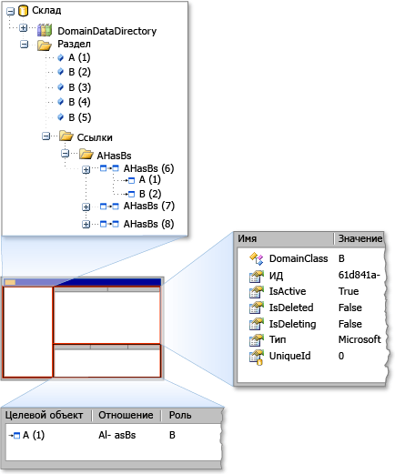

# Отладка с использованием средства просмотра хранилища
[!INCLUDE[vs2017banner](../code-quality/includes/vs2017banner.md)]

С помощью средства просмотра хранилища, можно проверить состояние a хранилище используется определяемая [!INCLUDE[dsl](../modeling/includes/dsl_md.md)].  Средство просмотра хранилища показывает все элементы модели домена, в конкретном хранилище, наряду с свойствами элементов и связями между элементами.  
  
## Открыть средство просмотра хранилища  
 В [!INCLUDE[vsprvs](../code-quality/includes/vsprvs_md.md)] экспериментальном построения останавливается код на точке останова, когда экземпляр хранилища содержит сведения о модели. Затем откройте средство просмотра хранилища, введя следующую команду в  **Интерпретация** окно:  
  
```  
Microsoft.VisualStudio.Modeling.Diagnostics.StoreViewer.Show(mystore);  
```  
  
> [!NOTE]
>  Необходимо заменить `mystore` именем экземпляра.  Кроме того, при добавлении пространства имен к коду, то можно вводить команды для отображения в средстве просмотра хранилища без полного пространства имен:  
>   
>  `using Microsoft.VisualStudio.Modeling.Diagnostics;`  
>   
>  `…`  
>   
>  `StoreViewer.Show(mystore);`  
  
 Метод `Show` имеет несколько перегрузок.  Можно указать экземпляр хранилища или раздела в качестве параметра.  
  
 В качестве альтернативы можно поместить строку кода, которая показывает средство просмотра хранилища в любом месте кода, где параметр, передаваемая методу `Show` метод в области.  Это действие выводит средства просмотра хранилища, когда строка кода выполняется как моментальный снимок содержимого хранилища.  
  
### С помощью средства просмотра хранилища  
 При открытии средства просмотра хранилища, окно modeless Windows Forms, как показано на следующей иллюстрации.  
  
   
Храните средство просмотра  
  
 Средство просмотра магазина имеется 3 панели: левая панель, верхняя правая панель и дн\-правая панель.  Левая панель представление в виде дерева выражений `DomainDataDirectory` элемент хранилища.  Если развернуть узел раздела и щелкнуть элемент свойства элемента отображаются в верхней правой области.  Если элемент связан с другими элементами, то дополнительные элементы отображаются в дн\-правую панель.  Если дважды щелкнуть элемент в дн\-правой панели, то элемент выделен в левой панели.  
  
## См. также  
 [Перемещение по модели и обновление модели в коде программы](../modeling/navigating-and-updating-a-model-in-program-code.md)